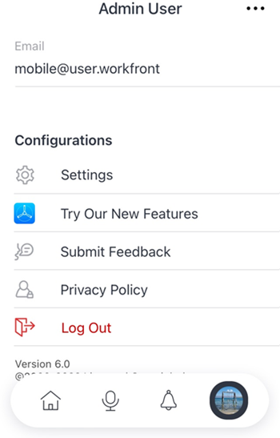

# [!DNL Adobe Workfront] 用于 [!DNL iOS]

此 [!DNL Adobe Workfront] 应用程序允许您访问您对任意 [!DNL iOS] 设备。 您可以安装并使用 [!DNL Workfront] 运行iOS 10或更高版本的手机和平板电脑上的移动设备应用程序。 专门的 [!DNL Workfront] 移动设备应用程序同时适用于 [!DNL iPhone] 和 [!DNL iPad].

有关登录到移动设备应用程序的信息，请参阅部分 [登录到 [!UICONTROL Workfront] 移动应用程序](../../../workfront-basics/manage-your-account-and-profile/managing-your-workfront-account/log-in-to-workfront.md#log) 在文章中 [登录 [!DNL Adobe Workfront]](../../../workfront-basics/manage-your-account-and-profile/managing-your-workfront-account/log-in-to-workfront.md).

## [!UICONTROL 主页]

此 [!UICONTROL 主页] 区域允许您直接处理分配给您的任务、问题和批准。 从 [!UICONTROL 主页] 区域内，您可以：

<table style="table-layout:auto"> 
 <col> 
 <col> 
 <tbody> 
  <tr> 
   <td> 
    <ul> 
     <li>开始处理任务和问题</li> 
     <li>将任务和问题标记为[！UICONTROL完成]</li> 
     <li>重新分配任务和问题</li> 
     <li>更改[！UICONTROL提交日期]</li> 
    </ul> </td> 
   <td> 
    <ul> 
     <li>更新任务和问题状态</li> 
     <li>在更新区域发布</li> 
     <li>查看文档</li> 
     <li>附加照片</li> 
     <li> 
创建请求或快速任务
 
注：在主页中创建的快速任务属于个人任务，除非您选择分配项目。
 </li> 
    </ul> </td> 
  </tr> 
 </tbody> 
</table>

有关更多信息，请参阅 [[!UICONTROL 主页] 区域小组件](../../../workfront-basics/mobile-apps/using-the-workfront-mobile-app/home-area-widgets-mobile.md) 和 [[!UICONTROL 我的工作] 部分（在移动设备应用程序中）](../../../workfront-basics/mobile-apps/using-the-workfront-mobile-app/my-work-section-mobile.md).

## [!UICONTROL 展示板]

此 [!UICONTROL 讨论区] 区域，您可以访问 [!DNL Workfront] 展示板。

有关更多信息，请参阅 [[!DNL Adobe Workfront] [!UICONTROL Boards] 适用于移动设备](/help/quicksilver/workfront-basics/mobile-apps/using-the-workfront-mobile-app/mobile-boards.md).

## [!UICONTROL 项目]

此 [!UICONTROL 项目] 区域允许您与进行交互和管理 [!UICONTROL 项目] 您拥有的项目和您参与的项目。 在应用程序的项目区域中，您可以：

<table style="table-layout:auto"> 
 <col> 
 <col> 
 <tbody> 
  <tr> 
   <td> 
    <ul> 
     <li>更新项目状态</li> 
     <li>查看重要项目详细信息</li> 
     <li>在[！UICONTROL更新]区域发布</li> 
     <li>将任务、问题和请求转换为项目</li> 
    </ul> </td> 
   <td> 
    <ul> 
     <li>与项目任务和问题交互</li> 
     <li>查看文档</li> 
     <li>附加照片</li> 
     <li> 
创建快速任务
 
注意：在项目中创建的任务会自动分配给您所在的项目。 
 </li> 
    </ul> </td> 
  </tr> 
 </tbody> 
</table>

## 审批

此 [!UICONTROL 审批] 区域允许您查看和批准 [!UICONTROL 审批] 已分配给您或已委派给您。 从批准区域，您可以批准：

<table style="table-layout:auto">
 <col>
 <col>
 <tbody>
  <tr>
   <td>
    <ul>
     <li>工作（任务和问题）</li>
     <li>文档</li>
     <li>校样 </li>
    </ul> </td>
   <td>
    <ul>
     <li>时间表</li>
     <li>访问请求</li>
    </ul> </td>
  </tr>
 </tbody>
</table>

有关批准的详细信息，请参阅 [中的审批 [!DNL Adobe Workfront] 移动应用程序](../../../workfront-basics/mobile-apps/using-the-workfront-mobile-app/approvals-in-mobile-app.md).

有关审阅和批准验证的信息，请参阅 [在中查看校样并做出决策 [!DNL Adobe Workfront] 移动应用程序](../../../workfront-basics/mobile-apps/using-the-workfront-mobile-app/work-with-proofs-in-mobile-app.md).

## [!UICONTROL 通知]

此 [!UICONTROL 通知] 区域可查看和响应工作的应用程序内通知。

>[!NOTE]
>除非注释的整个内容都是没有显示文本的超链接，否则超链接在更新通知中不可用。

## [!UICONTROL 请求]

此 [!UICONTROL 请求] 区域可查看有关请求的详细信息。 从 [!UICONTROL 请求] 区域内，您可以：

<table style="table-layout:auto">
 <col>
 <col>
 <tbody>
  <tr>
   <td>
    <ul>
     <li>重新分配请求</li>
     <li>更新状态</li>
     <li>调整优先级</li>
    </ul> </td>
   <td>
    <ul>
     <li>在[！UICONTROL更新]区域发布</li>
     <li>查看文档</li>
     <li>附加照片</li>
     <li>将请求另存为草稿</li>
    </ul> </td>
  </tr>
 </tbody>
</table>

## 时间表

此 [!UICONTROL 时间表] 区域可查看有关您的时间表的详细信息。 在 [!UICONTROL 时间表] 区域内，您可以：

* 在中发布 [!UICONTROL 更新] 区域
* 调整小时类型
* 更改您登录的时间
* 在时间表上输入备注
* 关闭您的工时表

## [!UICONTROL 收藏夹]

您可以从“收藏夹”菜单访问现有项目，并将新项目添加到 [!UICONTROL 收藏夹] 菜单。

## [!UICONTROL 联系人]

此 [!UICONTROL 联系人] 区域可查看公司中所有用户的联系信息。

## [!UICONTROL 配置]

此 [!UICONTROL 配置] 区域允许您：

* 管理您的设置
* 查看分配的团队
* 设置安全首选项
* 提交反馈
* 访问帮助内容
* 注销

## 虚拟助手

虚拟助理允许您通过语音命令执行以下任务：

* [!UICONTROL 向我显示]
* [!UICONTROL 删除]
* [!UICONTROL 搜索]
* [!UICONTROL 帮助我执行命令]

有关虚拟助理的详细信息，请参阅 [[!DNL Adobe Workfront] 移动应用程序虚拟助手](../../../workfront-basics/mobile-apps/using-the-workfront-mobile-app/wf-mobile-virtual-assistant.md).

## [!UICONTROL 固定]

此 [!UICONTROL 固定] 区域允许您从Web浏览器访问已保存的virtual assistant命令和pin。

有关虚拟助理的详细信息，请参阅 [Adobe Workfront移动应用程序虚拟助手](../../../workfront-basics/mobile-apps/using-the-workfront-mobile-app/wf-mobile-virtual-assistant.md).
