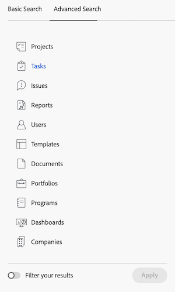

# 搜索 [!DNL Adobe Workfront]

<!-- Audited: 5/2025 -->

当您不记得项目的确切位置时，可通过搜索项目来轻松找到[!DNL Adobe Workfront]中的项目。

您可以在[!UICONTROL 内的任何页面的右上角看到]搜索[!DNL Workfront]框。

导航栏中的

您必须具有查看对象的权限，才能在搜索中找到该对象。 因此，搜索结果因用户而异。

## 访问要求

+++ 展开此部分可查看执行本文中的步骤所需的访问权限。

<table style="table-layout:auto"> 
 <col> 
 <col> 
 <tbody> 
  <tr> 
   <td role="rowheader">Adobe Workfront包</td> 
   <td> 
任何
 </td> 
  </tr> 
  <tr> 
   <td role="rowheader">Adobe Workfront许可证</td> 
   <td> 
参与者或更高版本

   
请求或更高版本 

   </td> 
  </tr> 
  <tr> 
   <td role="rowheader">访问级别配置</td> 
   <td> 
[！UICONTROL View]对对象类型的访问权限 
 
注意：如果您仍然没有访问权限，请询问您的[!DNL Workfront]管理员是否对您的访问级别设置了其他限制。 有关[!DNL Workfront]管理员如何修改访问级别的信息，请参阅<a href="../../../administration-and-setup/add-users/configure-and-grant-access/create-modify-access-levels.md" class="MCXref xref">创建或修改自定义访问级别</a>。
</td> 
  </tr> 
  <tr> 
   <td role="rowheader">对象权限</td> 
   <td> 
您必须具有查看对象的权限，才能在搜索中找到该对象。
 
有关请求其他访问权限的信息，请参阅<a href="../../../workfront-basics/grant-and-request-access-to-objects/request-access.md" class="MCXref xref">请求访问对象</a>。
 </td> 
  </tr> 
 </tbody> 
</table>

有关此表中信息的更多详细信息，请参阅Workfront文档中的[访问要求](/help/quicksilver/administration-and-setup/add-users/access-levels-and-object-permissions/access-level-requirements-in-documentation.md)。

+++

## 了解搜索

### 可供搜索的对象

您可以在Workfront中搜索以下对象：

* 项目
* 任务
* 问题
* 报告
* 用户
* 模板
* 文档
* 项目组合
* 项目群
* 仪表板
* 公司
* 注释

### 可供搜索的字段

可用于搜索的字段基于搜索类型：“基本”或[!UICONTROL 高级搜索]。

* **基本搜索**：在基本搜索中搜索对象时，[!DNL Workfront]在以下字段中查找可能包含关键字的文本：

   * 对象名称
   * 描述
   * 自定义数据字段
   * 更新
   * 文档名称（在特定文档搜索和基本搜索中）

  有关[!DNL Workfront]中基本搜索的详细信息，请参阅本文中的以下部分：[基本搜索](#basic-search)。

* **[!UICONTROL 高级搜索]**：在[!UICONTROL 高级搜索]中，您可以设置筛选条件以搜索基本搜索中不可用的字段。 因此，[!UICONTROL 高级搜索]允许您搜索对象中的任何字段。

  有关[!UICONTROL 高级搜索]的详细信息，请参阅本文中的以下部分：[高级搜索](#advanced-search)。

>[!NOTE]
>
>要执行[!UICONTROL 高级搜索]，在开始搜索时必须选择[!UICONTROL 高级搜索]选项。 您不能将基本搜索细化为[!UICONTROL 高级搜索]。

## 了解[!DNL Workfront]搜索的限制

在[!UICONTROL 中使用]搜索[!DNL Workfront]时，请考虑以下限制：

* 搜索不区分大小写。
* [!DNL Workfront]不正确或不理解拼写错误。
* 在[!DNL Workfront]中搜索不支持通配符。
* 在[!DNL Workfront]中搜索支持部分单词搜索，但不支持子字符串搜索。\
   例如，搜索关键词“stand”将返回包括单词“standard”的结果，但不会返回包括单词“understand”的结果。

## 搜索多个单词

当在搜索中包含多个单词，并且只想查找与“搜索”框中的所有单词匹配的对象时，可以按任意顺序键入单词。

例如，搜索“Marketing Demo”（不带引号）会查找具有以下名称的对象：

* 营销演示
* 演示营销
* 1月市场分析演示

它还查找名称中可能包含“Marketing”的对象，以及描述中的“Demo”对象。

但是，您可以在[!UICONTROL 搜索]框中执行以下操作，以调整显示的搜索结果：

<table style="table-layout:auto"> 
 <col> 
 <col> 
 <tbody> 
  <tr> 
   <td>包括引号</td> 
   <td> 
在双引号内以正确顺序输入单词允许您仅查找完全匹配的对象。 例如，搜索“Marketing Demo”（带引号）将查找具有以下名称的对象：
 
    <ul> 
     <li> 营销演示</li> 
     <li> 1月营销演示</li> 
     <li>营销演示计划</li> 
    </ul> 
但是，此搜索不会找到名为“演示营销”的对象。
 </td> 
  </tr> 
  <tr> 
   <td>包括或</td> 
   <td> 
通过“OR”连接单词（不带引号）可让您仅查找与[！UICONTROL搜索]框中至少一个单词匹配的对象。 这些词可以按任意顺序输入。 例如，搜索“Marketing OR Demo”（不带引号）将查找具有以下名称的对象：
 
    <ul> 
     <li> 市场分析演示</li> 
     <li>1月市场分析演示</li> 
     <li>演示</li> 
     <li>市场分析</li> 
    </ul> 
注意：“OR”必须全部大写。 否则，它将解释为您要搜索的短语中的另一个单词。
 </td> 
  </tr> 
  <tr> 
   <td>包含和</td> 
   <td> 
通过“AND”连接单词（不带引号）可让您仅查找与[！UICONTROL搜索]框中的所有单词匹配的对象。 这些词可以按任意顺序输入。 例如，搜索“Marketing AND Demo”（不带引号）将查找具有以下名称的对象：
 
    <ul> 
     <li>营销演示</li> 
     <li>演示营销</li> 
     <li>1月市场分析演示</li> 
    </ul> 
注意：“AND”必须全部大写。 否则，它将解释为您要搜索的短语中的另一个单词。 同样，包括“&amp;”（不带引号）将只搜索包含&amp;字符的对象。
 </td> 
  </tr> 
 </tbody> 
</table>

## 在[!DNL Workfront]中使用搜索

[!DNL Workfront]具有两种类型的搜索：“基本”和“高级”。 如果要在常用对象字段（如名称或说明）中查找关键字，请使用基本搜索。 如果要使用筛选器搜索其他对象字段，请使用[!UICONTROL 高级搜索]。

* [基本搜索](#basic-search)
* [高级搜索](#advanced-search)

### 基本搜索

基本搜索允许您搜索系统中所有对象的关键字，或一次只搜索一个对象（如项目）。 [!DNL Workfront]然后在几个特定字段中搜索这些关键字。 然后，您可以根据[!DNL Workfront]选择的其他对象特定字段来优化搜索结果。

有关在基本搜索中搜索的特定字段的列表，请参阅本文中的以下部分：[可供搜索的字段](#fields-available-for-search)。

>[!NOTE]
>
>要执行[!UICONTROL 高级搜索]，在开始搜索时必须选择[!UICONTROL 高级搜索]选项。 您不能将基本搜索细化为[!UICONTROL 高级搜索]。

* [执行基本搜索](#perform-a-basic-search)
* [优化基本搜索](#refine-a-basic-search)

#### 执行基本搜索

您可以通过以下任一方式执行基本搜索：

* 跨系统中的所有对象（常规搜索）。
* 一次只在一个对象上（对象特定的搜索）。

执行基本搜索：

1. 单击页面右上角的放大镜。

1. （可选）要搜索特定对象，请单击&#x200B;**[!UICONTROL 全部]**&#x200B;下拉菜单，然后选择要搜索的对象。

   

1. 在&#x200B;**[!UICONTROL 搜索]**框中，开始键入要搜索的信息。
有关[!DNL Workfront]中搜索哪些字段的信息，请参阅本文中的以下部分：[了解搜索](#understand-search)。
   

   当您开始在搜索栏中输入内容时，[!DNL Workfront]会根据您的查看历史记录提供推荐，并以蓝色突出显示您正在搜索的关键字。

1. 如果您要查找的项目显示在[!UICONTROL 预输入]菜单中，请单击该项目。

   或

   按键盘上的Return (Mac)或[!UICONTROL Enter] (Windows)以执行全面搜索。 此搜索查询整个数据库而不是您最近查看的项目，并打开&#x200B;**搜索**&#x200B;页面。

   如果执行常规搜索，[!DNL Workfront]将返回与搜索的任何字段中的搜索词匹配的任何对象的结果，如[了解搜索](#understand-search)中所述。 与搜索匹配的对象将显示在列表中。

   >[!NOTE]
   >
   >有时候，一个字的变体会显示在找到的项目列表中。\
   >例如，搜索“marketing”将显示名称中包含“marketing”或“market”的对象。

1. （可选）如果搜索结果太多，请按照[优化基本搜索](#refine-a-basic-search)中的说明优化搜索。

#### 优化基本搜索

执行“基本搜索”后，可以优化搜索。

使用搜索结果左侧的工具栏缩小要查找的信息范围。

要优化搜索，请执行以下操作：

1. （视情况而定）如果执行常规搜索，请在结果左上角的对象列表中选择要搜索的对象。
1. 在结果左侧的工具栏中，找到可用于搜索中显示的对象的字段。 每个字段的值按计数排序，每个字段最多显示10个值。
1. 单击任何可用字段以缩短结果列表。 您所做的选择以蓝色突出显示，并且您未选择的字段值会隐藏。
选择每个新值后，右侧的结果将动态更新。

   

1. （可选）单击选定的值以取消选择它们，并再次显示每个字段的所有值。

### [!UICONTROL 高级搜索]

[!UICONTROL 高级搜索]允许您使用对基本搜索不可用的字段和过滤器进行搜索。 例如，您可以搜索具有特定优先级或文档所有者名称的项目。

>[!NOTE]
>
>要执行[!UICONTROL 高级搜索]，在开始搜索时必须选择[!UICONTROL 高级搜索]选项。 您不能将基本搜索细化为[!UICONTROL 高级搜索]。

* [使用[!UICONTROL 高级搜索]](#use-advanced-search)

#### 使用[!UICONTROL 高级搜索]

您可以使用[!UICONTROL 高级搜索]根据特定条件筛选搜索。\
当您无法记住与某个对象关联的关键字，但知道该对象的一些特定信息（例如：项目优先级、文档所有者名称等）时，此类搜索很有帮助。

要执行高级搜索，请执行以下操作：

1. 在[!DNL Workfront]中任何页面的右上角，单击&#x200B;**[!UICONTROL 搜索]**&#x200B;图标。 显示&#x200B;**搜索**&#x200B;菜单。

1. 在&#x200B;**搜索**&#x200B;菜单的底部，单击&#x200B;**[!UICONTROL 高级搜索]**。 将打开&#x200B;**搜索**&#x200B;页面，默认选中&#x200B;**高级搜索**选项卡。
   

1. 选择您要搜索的对象类型。 默认情况下已选择&#x200B;**[!UICONTROL 任务]**。

   

1. （可选）在列表顶部的字段中键入关键字。
1. （可选）将&#x200B;**[!UICONTROL 筛选您的结果]**&#x200B;切换为&#x200B;**On**&#x200B;以生成筛选条件来优化您的搜索。 完成后单击&#x200B;**应用**。

1. 单击&#x200B;**[!UICONTROL 搜索]**。 与您的搜索匹配的项列表显示在&#x200B;**[!UICONTROL 高级搜索]**&#x200B;工具栏的右侧。
