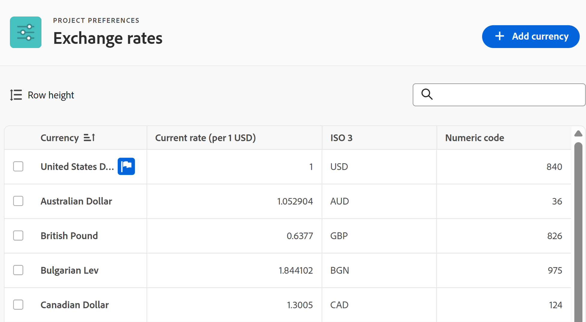
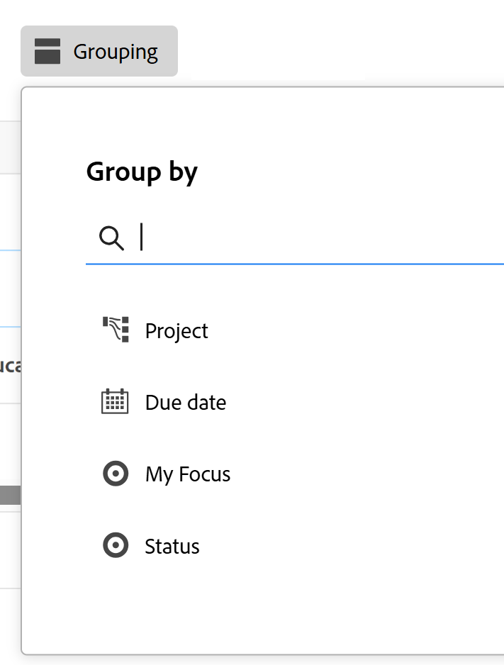
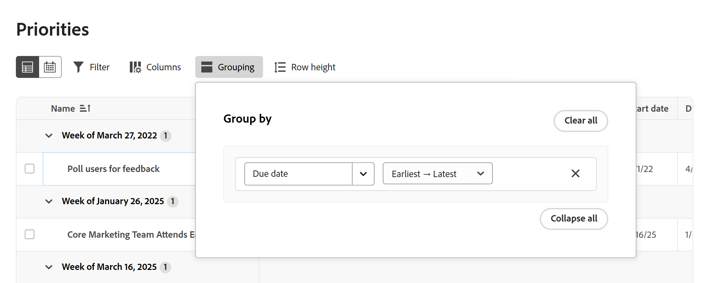
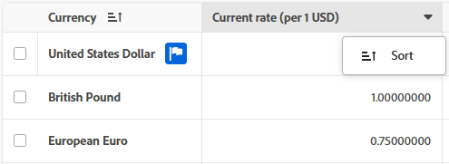
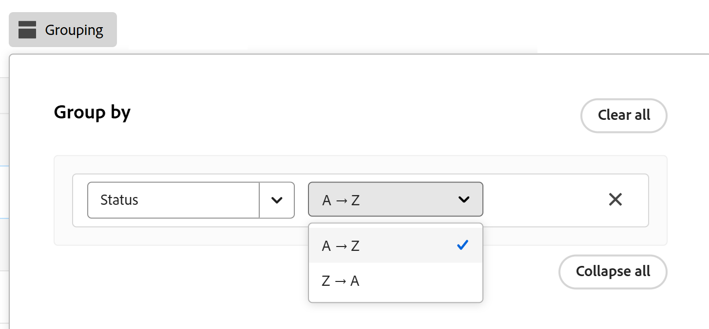

# 使用增强列表

Adobe Workfront的某些区域提供了增强列表。 这些列表使用表格格式来显示列表项，并且它们具有与标准列表不同的外观。 视图的管理也得到了增强，包括筛选、分组、管理列和搜索。

有关标准列表的信息，请参阅[Adobe Workfront中的列表入门](/help/quicksilver/workfront-basics/navigate-workfront/use-lists/view-items-in-a-list.md)。

>[!NOTE]
>
>每个增强型列表的配置方式可能有所不同，以帮助您显示所需的数据。 每个列表都不会使用本文中介绍的每个功能，并且某些列表可能具有仅应用于该列表的专用功能。

## 访问要求

+++ 展开以查看本文中各项功能的访问要求。

<table style="table-layout:auto">
 <col> 
 <col>
 <tbody> 
  <tr> 
   <td>Adobe Workfront包</td> 
   <td>
任何
</td> 
  </tr> 
  <tr> 
   <td>Adobe Workfront许可证</td> 
   <td>
   
参与者或更高版本

   
请求或更高版本
</td>
  </tr>
 </tbody> 
</table>

有关信息，请参阅Workfront文档中的[访问要求](/help/quicksilver/administration-and-setup/add-users/access-levels-and-object-permissions/access-level-requirements-in-documentation.md)。

+++

## 使用增强列表的对象

以下是一些类型的Workfront对象列表，这些列表使用增强列表格式，以及在您有权查看对象时默认显示的一些区域。

>[!NOTE]
>
>此列表并不完整。 其中每个对象列表也可出现在报表或功能板上。 例如，包含项目报告的项目报告或功能板也会显示项目列表。

| Workfront列表 | 对象列表的位置 |
|--- |--- |
| 优先次序 | <ul><li>主页>选择左侧菜单中的“优先级”图标</li><li>主菜单>优先级</li></ul> |
| 请求列表 | <ul><li>请求（仅限新体验）</li><li>主页上的我的请求小组件</li></ul> |
| “设置”中的状态、优先级、严重程度和汇率列表 | <ul><li>设置>项目首选项>状态</li><li>设置>项目首选项>优先级</li><li>设置>项目首选项>严重程度</li><li>设置>项目首选项>汇率</li></ul> |

## 在增强列表中添加和编辑项目

根据增强列表的配置，可能有两种方法可以将项目添加到列表：

* 单击列表上方的按钮。 此选项会打开一个对话框，您可以在其中输入并保存信息。
* 单击列表底部的&#x200B;**新行**。 此选项会将新行添加到表中，并在每个单元格中输入信息。

  增强列表支持以下字段类型：

   * 文本
   * 数值
   * 货币
   * 日期
   * 日期和时间
   * 单/多选下拉菜单
   * 键盘缓冲
   * 段落
   * 被分派人（一个或多个）
   * 拾色器

  编辑单元格时，每个字段类型都有自己的编辑选项。

要编辑列表中的项目，请在要编辑的单元格中双击并键入信息。 某些单元格可以是只读的。

## 使用增强列表中的操作栏和更多菜单

选中增强列表中项目旁边的复选框后，操作栏会出现在屏幕底部，并显示您可以对项目执行的操作。 某些操作可能特定于此列表，不会出现在任何其他列表中。

>[!NOTE]
>
>不同的增强列表可能允许选择单个项目、批量编辑（选择多个项目）或不选择任何项目。

单击操作栏上的按钮可执行该操作，例如查看列表项、删除项或编辑项。

如果所选项目没有可用的操作，则操作栏会显示“没有可用的操作”。

**更多**&#x200B;菜单是三点菜单，当您将鼠标悬停在列表项上的主字段旁边时，该菜单会显示。 （主字段是表中最左侧的列。）

单击菜单可查看针对该项的其他操作。 某些操作可能特定于此列表，不会出现在任何其他列表中。

## 自定义增强列表中的列

某些增强列表允许您隐藏和显示列，以及对列重新排序。

1. 单击列表上方的&#x200B;**列**。

   

1. 使用切换可显示或隐藏列表中的列。
1. 要重新排序列，请单击&#x200B;**拖动**&#x200B;图标并将列移动到所需的位置。 移动列会自动更改列表。

   >[!NOTE]
   >
   >主字段是表中最左侧的列。 它固定在第一个位置，不能更改其列。 如果列数很大，则主字段会冻结在左侧，当您水平滚动时，将始终看到主字段。
   >
   >字段名称旁边的图标显示字段类型，如文本或日期字段。

   隐藏列时，**列**&#x200B;按钮上会显示一个指示符。 重新排序列时，不显示该指示符。

   隐藏列的

## 将视图应用于增强列表

视图是可以应用于列表的列安排和筛选器的个性化集。 您可以创建新视图和编辑现有视图。

要应用视图，请单击&#x200B;**视图**&#x200B;下拉列表，然后选择要应用于列表的视图。

要创建新视图，请执行以下操作：

1. 单击&#x200B;**视图**&#x200B;下拉菜单并选择&#x200B;**新视图**。
1. 输入视图的名称，然后单击&#x200B;**创建**。
1. （可选）隐藏、显示或重新排列列。 有关详细信息，请参阅[自定义增强列表](#customize-columns-in-an-enhanced-list)中的列。
1. （可选）筛选和分组列表项。 有关详细信息，请参阅[增强列表](#filter-and-group-items-in-an-enhanced-list)中的筛选器和组项。

   对视图的更改会自动保存，并且使用该视图的任何人都可以看到这些更改。

   下次应用此视图时，列和筛选器设置将保持其设置方式。

## 在增强列表中筛选和分组项目

过滤器可帮助您减少在列表中显示的信息量。 分组根据特定条件将列表中的对象划分为不同的区域。

### 使用过滤器

1. 单击列表上方的&#x200B;**筛选器**。
1. 在“筛选器”框中，单击&#x200B;**添加条件**。
1. 选择要作为筛选依据的字段。
1. 选择过滤器修饰符，例如“具有任意”、“不具有任何”、“早于”或“晚于”。 根据过滤依据的字段类型，修改量选项会有所不同。
1. 选择一个或多个字段值。 根据筛选依据的字段类型，系统可能会提示您从列表中选择项目、搜索该项目或使用日历选择日期范围。

   

   该过滤器将自动应用于列表。

1. 单击&#x200B;**添加条件**&#x200B;以将另一个条件作为OR语句添加到筛选器。
1. 应用筛选器后，您可以再次打开&#x200B;**筛选器**&#x200B;选项以更改筛选器选项或清除所有筛选器。

   将筛选器应用于列表时，**筛选器**&#x200B;按钮上将显示一个指示器。

   

### 使用分组

1. 单击列表上方的&#x200B;**组**。
1. 选择分组以组织列表。

   

1. 应用分组后，您可以再次打开分组选项以一次折叠或展开所有分组，将分组更改为按其他字段分组，或清除所有分组。

   

   将分组应用于列表时，**组**&#x200B;按钮上将显示一个指示符。

   

## 在增强列表中进行排序和搜索

要对各个列进行排序，请转到该列并单击向下箭头。 列名旁边的图标表示该列表按该列中的值和排序方向排序。

>[!NOTE]
>
>某些列可能无法排序。

若要对分组内的工作进行排序，请打开&#x200B;**组**，然后选择是否要按升序或降序排序。

要搜索，请在列表上方的搜索字段中键入您的搜索词。 当您键入时，结果会在列表中加亮。

