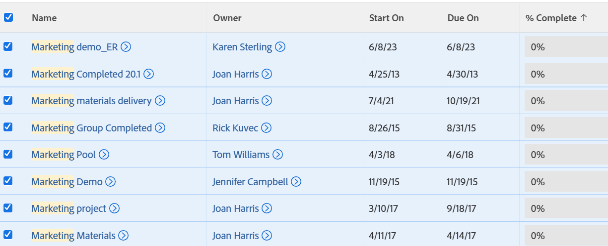

# 导出列表

您可以从[!DNL Adobe Workfront]导出对象列表。 当[!DNL Workfront]中的对象列表包含2000个以上的项目时，导出列表是查看一个页面上列表中的所有项目的唯一方法。

有关导出格式和限制的信息，请参阅[导出数据](../../../reports-and-dashboards/reports/creating-and-managing-reports/export-data.md)。

## 访问要求

您必须具有以下权限才能执行本文中的步骤：

<table style="table-layout:auto"> 
 <col> 
 <col> 
 <tbody> 
  <tr> 
   <td role="rowheader"><strong>[!DNL Adobe Workfront] 计划*</strong></td> 
   <td> 
任何
 </td> 
  </tr> 
  <tr> 
   <td role="rowheader"><strong>[!DNL Adobe Workfront] 许可证*</strong></td> 
   <td> 
[！UICONTROL Request]或更高版本
 </td> 
  </tr> 
  <tr> 
   <td role="rowheader"><strong>访问级别配置*</strong></td> 
   <td> 
[！UICONTROL视图]对列表所在区域的访问权限
 
例如，要导出项目的任务列表，您需要[！UICONTROL View]对项目的访问权限。
 
注意：如果您仍然没有访问权限，请询问您的[!DNL Workfront]管理员是否对您的访问级别设置了其他限制。 有关[!DNL Workfront]管理员如何更改访问级别的信息，请参阅<a href="../../../administration-and-setup/add-users/configure-and-grant-access/create-modify-access-levels.md" class="MCXref xref">创建或修改自定义访问级别</a>。
 </td> 
  </tr> 
  <tr> 
   <td role="rowheader"><strong>对象权限</strong></td> 
   <td> 
[！UICONTROL视图]
 
有关请求其他访问权限的信息，请参阅<a href="../../../workfront-basics/grant-and-request-access-to-objects/request-access.md" class="MCXref xref">请求访问对象</a>。
 </td> 
  </tr> 
 </tbody> 
</table>

&#42;要了解您拥有什么计划、许可证类型或访问权限，请与[!DNL Workfront]管理员联系。

## 导出列表

1. 转到对象列表。
1. （可选）在导出之前，选择要应用于列表的任何筛选器、视图和分组。\
   有关筛选器、视图和分组的信息，请参阅[报告元素：筛选器、视图和分组](../../../reports-and-dashboards/reports/reporting-elements/reporting-elements-filters-views-groupings.md)。

1. （可选）要仅导出列表中的特定项目，请选择列表中要包含在导出文件中的所有项目。

   >[!TIP]
   >
   >要查找所有要包括的项目，您可以：
   >
   >   
   >   
   >   * **选择显示列表中的所有项目或2000个项目**：有关详细信息，请参阅[修改列表的显示方式](../../../workfront-basics/navigate-workfront/use-lists/modify-list-display.md)。
   >   
   >   * **使用快速筛选器**：有关详细信息，请参阅[将快速筛选器应用到列表](../../../workfront-basics/navigate-workfront/use-lists/apply-quick-filter-list.md)。\
   >     快速筛选器仅适用于列表的当前页面。

   

1. 单击&#x200B;**[!UICONTROL 导出]**。

1. 从以下格式中选择：

   * PDF
   * [!DNL Excel]
   * [!DNL Excel] (xlsx)
   * 制表符分隔

     这会将列表副本导出为上述格式之一，并将其保存在计算机上。

1. （可选）使用相应的应用程序打开导出的列表。\
   列表中的所有项目都会显示在导出的文件中，无论它们是否显示在Web应用程序的屏幕上。
