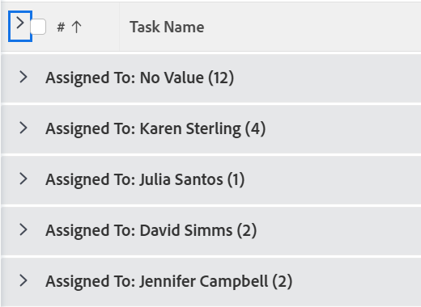
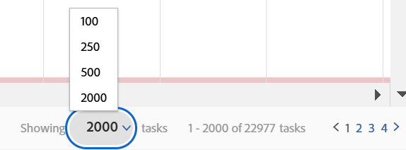

# 修改列表的显示方式

<!--Audited: 11/2024-->

在[!DNL Adobe Workfront]中，您可以自定义列表如何为您显示。 查看该列表的其他用户看不到您的更改。

您可以进行以下自定义：

* 显示的项目数
* 列宽或顺序
* 分组是展开还是折叠

>[!NOTE]
>
>当您注销[!DNL Workfront]或关闭浏览器时，您所做的上述显示更改将会被还原。 这些更改也可能在8小时后恢复。

除了上述临时自定义之外，您还可以调整列表排序依据，即[!DNL Workfront]在您注销或关闭浏览器后仍保留哪些列。 但是，如果有人在列表视图中编辑了排序选项，则不会保留以前的排序选项。

有关修改列表中显示的信息的信息，请参阅[报告元素：筛选器、视图和分组](../../../reports-and-dashboards/reports/reporting-elements/reporting-elements-filters-views-groupings.md)。

## 访问权限要求

+++ 展开可查看本文所述功能的访问权限要求。 

<table style="table-layout:auto"> 
 <col> 
 <col> 
 <tbody> 
  <tr> 
   <td role="rowheader">Adobe Workfront 包</td> 
   <td> 
“任一”
 </td> 
  </tr> 
  <tr> 
   <td role="rowheader">Adobe Workfront许可证</td> 
   <td> 
   
参与者或更高 

   
请求或更高版本

   </td> 
  </tr> 
  <tr> 
   <td role="rowheader">访问级别配置</td> 
   <td> 
[!UICONTROL视图]可访问列表所在的区域
 
例如，要修改项目上的视图，您需要对项目的[！UICONTROL View]访问权限。
</td> 
  </tr> 
  <tr> 
   <td role="rowheader">对象权限</td> 
   <td> 
对应用于列表的视图的[！UICONTROL View]或更高权限
  </td> 
  </tr> 
 </tbody> 
</table>

有关信息，请参阅Workfront文档中的[访问要求](/help/quicksilver/administration-and-setup/add-users/access-levels-and-object-permissions/access-level-requirements-in-documentation.md)。

+++

## 修改列表

1. 转到[!DNL Workfront]中要修改的列表。

   <!--
   
 
   <MadCap:conditionalText data-mc-conditions="QuicksilverOrClassic.Draft mode">
   By default, groupings are collapsed.
   </MadCap:conditionalText>
     

   -->

1. （可选且有条件）如果列表中的分组已折叠并且您想要查看更多信息，请单击所需的分组以展开列表并显示其中列出的信息。

   或

   要展开所有分组，请单击列标题中复选框右侧的箭头。

   

1. （可选且有条件）如果要显示屏幕上特定数量的项目，请单击屏幕右下角的&#x200B;**[!UICONTROL 显示]**&#x200B;下拉菜单，然后选择以显示&#x200B;**100**、**250**、**500**、**[!UICONTROL 全部]**&#x200B;或&#x200B;**2000**&#x200B;个项目。

   页上的列表编号

   >[!TIP]
   >
   >默认情况下，更新后的列表显示2,000个项目，旧版列表显示100个项目。 如果列表包含的项目超过2,000个，则无法在一页上显示所有项目。
   >
   >
   >为了在对象包含格式文本字段的大型列表中实现最佳性能，建议将此数字限制为250。
   >
   >
   >有关2种列表类型的详细信息，请参阅[开始使用](../../../workfront-basics/navigate-workfront/use-lists/view-items-in-a-list.md#updated)中的列表一文[更新后的列表与旧版列表之间的区别 [!DNL Adobe Workfront]](../../../workfront-basics/navigate-workfront/use-lists/view-items-in-a-list.md)一节。

   对列表结果进行分页，以显示每页选定的项目数。 通过单击反向和正向箭头或选择特定页面，可以访问其他页面上的结果。

1. 要调整列的宽度，请将鼠标悬停在分隔两列的线条上，然后单击以将其拖动到所需的宽度。

   列会调整大小，直到您在浏览器中清除缓存或重新手动调整其大小。

1. 要对列表中的列重新排序，请将鼠标悬停在列标题上以显示抓手工具，然后单击将列拖动到您希望其显示的位置。

   在刷新页面之前，将保存列的位置。

   有关自定义列表中列的宽度和顺序的更多信息，请参阅文章[修改列宽和顺序](../../../reports-and-dashboards/reports/reporting-elements/modify-column-width-order.md)。

1. 要调整列表的排序顺序，请单击列标题以将其选中，然后按住CMD键（在[!DNL Mac]上）或键盘上的CTRL键（在[!DNL Windows]上），并选择最多2个其他列标题以按它们排序。

   该列表按您选择的顺序按每个选定列排序。

   您对列表所做的所有修改都会立即保存。

   >[!NOTE]
   >
   >如果对[!UICONTROL 设置]中[!UICONTROL 组]区域中的组进行排序，则当您更改列表的排序方式时，组及其子组的层次结构视图不会断开，子组将与其父组保持同步。 该列表首先按顶层组排序。 然后，在每个父组下，位于同一级别的子组列表将一起排序。
