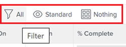
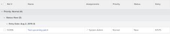

# 开始使用[!DNL Adobe Workfront]中的列表

<!--
{{highlighted-preview}}
-->

您可以查看[!DNL Adobe Workfront]中的对象列表以获取有关这些对象的信息，例如它们的开始日期和到期日期、分配给它们的用户以及与它们关联的其他对象。

以下是[!DNL Workfront]中列表的一些特征：

* 列表每5分钟自动刷新一次，以更新系统中其他用户在其他位置更新的信息。
* [!DNL Workfront]中的某些区域预配置了默认对象列表。

  您可以自定义这些预配置列表中的大多数列表。

* [!DNL Workfront]管理员可以创建自定义列表以应用于[!DNL Workfront]的各个区域。

  有关创建系统级列表的详细信息，请参阅文章[创建、编辑和共享默认筛选器、视图和分组](../../../administration-and-setup/set-up-workfront/configure-system-defaults/create-and-share-default-fvgs.md)。

## 访问要求

您必须具有以下权限才能执行本文中的步骤：

<table style="table-layout:auto"> 
 <col> 
 <col> 
 <tbody> 
  <tr> 
   <td role="rowheader"><strong>[!DNL Adobe Workfront] 计划*</strong></td> 
   <td> 
任何
 </td> 
  </tr> 
  <tr> 
   <td role="rowheader"><strong>[!DNL Adobe Workfront] 许可证*</strong></td> 
   <td> 
[！UICONTROL Request]或更高版本
 </td> 
  </tr> 
  <tr> 
   <td role="rowheader"><strong>访问级别配置*</strong></td> 
   <td> 
[！UICONTROL View]或更高权限访问筛选器、视图、分组
 
对于[！UICONTROL设置]区域中的项目，您需要具有该项目或[！UICONTROL系统管理员]访问级别的管理访问权限。
 
注意：如果您仍然没有访问权限，请询问您的[!DNL Workfront]管理员是否对您的访问级别设置了其他限制。 有关[!DNL Workfront]管理员如何更改访问级别的信息，请参阅<a href="../../../administration-and-setup/add-users/configure-and-grant-access/create-modify-access-levels.md" class="MCXref xref">创建或修改自定义访问级别</a>。
 </td> 
  </tr> 
  <tr> 
   <td role="rowheader"><strong>对象权限</strong></td> 
   <td> 
[！UICONTROL视图]或更高权限可访问“共享”
 
有关请求其他访问权限的信息，请参阅<a href="../../../workfront-basics/grant-and-request-access-to-objects/request-access.md" class="MCXref xref">请求访问对象</a>。
 </td>
  </tr> 
 </tbody> 
</table>

要了解您拥有什么计划、许可证类型或访问权限，请与[!DNL Workfront]管理员联系。

## 对象列表

以下是您可以在[!DNL Workfront]中找到的一些类型的对象列表，以及当您有权查看对象时默认显示这些列表的一些区域。

>[!NOTE]
>
>* 此列表并不完整。 其中每个对象列表也可出现在报表或功能板上。 例如，包含项目报告的项目报告或功能板也会显示项目列表。
>* 在此列表中，“选择”表示您需要单击项目的名称，而不是名称左侧的复选框。

<table style="table-layout:auto"> 
 <col> 
 <col> 
 <thead> 
  <tr> 
   <th><strong>[!DNL Workfront] 列表</strong></th> 
   <th><strong>对象列表的位置</strong></th> 
  </tr> 
 </thead> 
 <tbody> 
  <tr> 
   <td>项目组合列表</td> 
   <td> 
    <ul> 
     <li> 
[！UICONTROLPortfolio]
 </li> 
    </ul> </td> 
  </tr> 
  <tr> 
   <td>项目列表</td> 
   <td> 
    <ul> 
     <li> 
[！UICONTROLPortfolio] &gt;[！UICONTROL选择项目组合] &gt;[！UICONTROL项目]
 </li> 
     <li data-mc-conditions="QuicksilverOrClassic.Quicksilver"> 
[！UICONTROL程序]
 </li> 
    </ul> </td> 
  </tr> 
  <tr> 
   <td>项目列表</td> 
   <td> 
    <ul> 
     <li> 
[！UICONTROL项目]
 </li> 
     <li> 
[！UICONTROLPortfolio] &gt;[！UICONTROL选择一个项目组合] &gt;[！UICONTROL项目]
 </li> 
     <li> 
[！UICONTROLPortfolio] &gt;[！UICONTROL选择项目组合] &gt;[！UICONTROL项目] &gt;[！UICONTROL选择项目] &gt;[！UICONTROL项目]
 </li> 
    </ul> </td> 
  </tr> 
  <tr> 
   <td>任务列表</td> 
   <td> 
    <ul> 
     <li> 
[！UICONTROL项目] &gt;[！UICONTROL选择一个项目] &gt; [！UICONTROL任务]
 </li> 
     <li> 
[！UICONTROL项目] &gt;[！UICONTROL选择项目] &gt;[！UICONTROL任务] &gt;[！UICONTROL选择任务] &gt;[！UICONTROL子任务]
 </li> 
     <li> 
[！UICONTROL项目] &gt;[！UICONTROL选择项目] &gt;[！UICONTROL任务] &gt;[！UICONTROL选择任务] &gt; [！UICONTROL前置任务*]
 </li> 
    </ul> </td> 
  </tr> 
  <tr> 
   <td>问题列表</td> 
   <td> 
    <ul> 
     <li> 
[！UICONTROL项目] &gt; [！UICONTROL选择一个项目&gt;[！UICONTROL问题]
 </li> 
     <li> 
[！UICONTROL项目] &gt;[！UICONTROL选择项目] &gt;[！UICONTROL任务] &gt;[！UICONTROL选择任务] &gt; [！UICONTROL问题]
 </li> 
     <li> 
[！UICONTROL项目] &gt;[！UICONTROL选择项目] &gt;[！UICONTROL任务] &gt;[！UICONTROL选择任务] &gt;[！UICONTROL子任务] &gt;[！UICONTROL选择任务] &gt; [！UICONTROL问题]
 </li> 
    </ul> </td> 
  </tr> 
  <tr> 
   <td>报告列表</td> 
   <td> 
    <ul> 
     <li> 
  [！UICONTROL报表]  
 </li> 
    </ul> </td> 
  </tr> 
  <tr> 
   <td>功能板列表</td> 
   <td> 
    <ul> 
     <li> 
[！UICONTROL功能板]
 </li> 
    </ul> </td> 
  </tr> 
  <tr> 
   <td>迭代列表</td> 
   <td> 
    <ul> 
     <li> 
[！UICONTROL团队] &gt; [！UICONTROL迭代]
 </li> 
    </ul> </td> 
  </tr> 
  <tr> 
   <td>用户列表</td> 
   <td> 
    <ul> 
     <li> 
[！UICONTROL用户]
 </li> 
    </ul> </td> 
  </tr> 
  <tr> 
   <td>文档列表</td> 
   <td> 
    <ul> 
     <li> 
[！UICONTROL文档]
 </li> 
     <li> 
[！UICONTROLPortfolio] &gt;[！UICONTROL选择作品集] &gt; [！UICONTROL文档]
 </li> 
     <li> 
[！UICONTROLPortfolio] &gt; [！UICONTROL选择项目组合] &gt;[！UICONTROL项目] &gt;[！UICONTROL选择项目] &gt;[！UICONTROL文档]
 </li> 
     <li> 
[！UICONTROL项目] &gt;[！UICONTROL选择一个项目] &gt;[！UICONTROL文档]
 </li> 
     <li> 
[！UICONTROL项目] &gt;[！UICONTROL选择项目] &gt;[！UICONTROL任务] &gt;[！UICONTROL选择任务] &gt; [！UICONTROL文档]
 </li> 
     <li> 
[！UICONTROL项目] &gt; [！UICONTROL选择项目&gt; [！UICONTROL问题] &gt;[！UICONTROL选择问题] &gt; [！UICONTROL文档]
 </li> 
    </ul> </td> 
  </tr> 
  <tr> 
   <td>时间表列表</td> 
   <td> 
    <ul> 
     <li> 
[！UICONTROL时间表] &gt; [！UICONTROL所有时间表]*
 </li> 
    </ul> </td> 
  </tr> 
  <tr> 
   <td>记帐费率列表</td> 
   <td> 
    <ul> 
     <li> 
[！UICONTROL项目] &gt;[！UICONTROL选择一个项目] &gt;[！UICONTROL记帐费率*]
 </li> 
    </ul> </td> 
  </tr> 
  <tr> 
   <td>开票记录列表</td> 
   <td> 
    <ul> 
     <li> 
[！UICONTROL项目] &gt; [！UICONTROL选择一个项目] &gt; [！UICONTROL账单记录]
 </li> 
    </ul> </td> 
  </tr> 
  <tr> 
   <td>风险列表</td> 
   <td> 
    <ul> 
     <li> 
[！UICONTROL项目] &gt;[！UICONTROL选择一个项目] &gt;[！UICONTROL风险]
 </li> 
    </ul> </td> 
  </tr> 
  <tr> 
   <td>费用列表</td> 
   <td> 
    <ul> 
     <li> 
[！UICONTROL项目] &gt;[！UICONTROL选择一个项目&gt;[！UICONTROL费用]
 </li> 
     <li> 
[！UICONTROL项目] &gt; [！UICONTROL选择一个项目] &gt;[！UICONTROL任务] &gt;[！UICONTROL选择一个任务] &gt;[！UICONTROL费用]
 </li> 
    </ul> </td> 
  </tr> 
  <tr> 
   <td>小时条目列表</td> 
   <td> 
    <ul> 
     <li> 
[！UICONTROL项目] &gt;[！UICONTROL选择一个项目
 </li> 
     <li> 
[！UICONTROL项目] &gt;[！UICONTROL选择项目] &gt;[！UICONTROL任务] &gt;[！UICONTROL选择任务] &gt;[！UICONTROL小时数]
 </li> 
     <li> 
[！UICONTROL项目] &gt;[！UICONTROL选择]项目&gt;[！UICONTROL问题] &gt;[！UICONTROL选择]问题&gt;[！UICONTROL小时数]
 </li>
    </ul> </td> 
  </tr>
  <tr> 
   <td class="preview">自定义表单列表</td> 
   <td> 
    <ul> 
     <li class="preview"> 
[！UICONTROL设置] &gt;[！UICONTROL自定义Forms]

     <!--Remove the following note box when this goes to Production. Or do this when the Preview highlighting becomes available.-->
     
<b>注意</b>：当前仅在“预览”环境中可用
 </li> 
    </ul> </td> 
  </tr> 
  <tr> 
    <td>组或子组列表</td> 
   <td> 
    <ul> 
     <li> 
[！UICONTROL设置] &gt;[！UICONTROL组]
 </li>
     <li> 
[！UICONTROL设置] &gt;[！UICONTROL组] &gt;[！UICONTROL选择父组] &gt;[！UICONTROL子组] </li> 
    </ul> </td> 
  </tr> 
  <tr> 
   <td>团队列表</td> 
   <td> 
    <ul> 
     <li> 
[！UICONTROL设置] &gt;[！UICONTROL团队]
 </li> 
    </ul> </td> 
  </tr>
  <tr> 
   <td>公司列表</td> 
   <td> 
    <ul> 
     <li> 
[！UICONTROL设置] &gt;[！UICONTROL公司]
 </li> 
    </ul> </td> 
  </tr>
  <tr> 
   <td>时间表列表</td> 
   <td> 
    <ul> 
     <li> 
[！UICONTROL设置] &gt;[！UICONTROL计划]
 </li> 
    </ul> </td> 
  </tr>
  <tr> 
   <td>布局模板列表</td> 
   <td> 
    <ul> 
     <li> 
[！UICONTROL设置] &gt;[！UICONTROL布局模板]
 </li> 
    </ul> </td> 
  </tr>
 </tbody> 
</table>

不能自定义指定区域上的列表。 [!DNL Workfront]管理员可以在系统级别构建自定义列表，或者，如果访问级别允许您编辑报告，则可以为此对象构建报告。

## 列出元素

列表包含特定元素，这些元素定义了其格式以及显示的信息。 您可以找到多个默认可用的系统列表元素。 您还可以创建自定义元素以满足您的需求。

>[!NOTE]
>
>当您从列表中选择新的筛选器、视图或分组时，即使您注销[!DNL Workfront]或关闭浏览器，该选择仍会保留。

以下是列表的元素：

<table style="table-layout:auto"> 
 <col> 
 <col> 
 <thead> 
  <tr> 
   <th><strong>元素</strong></th> 
   <th><strong>说明</strong></th> 
  </tr> 
 </thead> 
 <tbody> 
  <tr> 
   <td><strong>[！UICONTROL筛选器]</strong></td> 
   <td> 
根据您指定的条件，过滤器可将不必要的信息排除在列表之外。 
 
有关详细信息，请参阅<a href="../../../reports-and-dashboards/reports/reporting-elements/filters-overview.md" class="MCXref xref">筛选器概述</a>。
 </td> 
  </tr> 
  <tr> 
   <td><strong>[！UICONTROL视图]</strong></td> 
   <td> 
视图定义要在屏幕上显示的字段（列）。
 
有关详细信息，请参阅[!DNL Adobe Workfront]</a>中的<a href="../../../reports-and-dashboards/reports/reporting-elements/views-overview.md" class="MCXref xref">视图概述。
 </td> 
  </tr> 
  <tr> 
   <td><strong>[！UICONTROL分组]</strong></td> 
   <td> 
分组根据您指定的条件将列表中的对象划分为不同的区域。
 
例如，列表中的问题可以按状态或优先级显示在部分中。
 
在标准分组中最多可以有三层分组，如果是在文本模式下配置分组，则可以添加第四层。
 
有关分组的详细信息，请参阅[!DNL Adobe Workfront]</a>中的<a href="../../../reports-and-dashboards/reports/reporting-elements/groupings-overview.md" class="MCXref xref">分组概述。
 
有关文本模式的详细信息，请参阅<a href="../../../reports-and-dashboards/reports/text-mode/understand-text-mode.md" class="MCXref xref">文本模式概述</a>。
 </td> 
  </tr> 
 </tbody> 
</table>

默认情况下，这些元素显示在每个列表的顶部。 它们是粘性的，滚动列表时不会移动。 将鼠标悬停在每个元素的图标上以标识它们。

您可以自定义以下区域中的列表元素并将其与其他用户共享：

* 在[开始使用 [!DNL Adobe Workfront]](#default-workfront-lists)中的列表部分找到的任何系统默认列表
* 与您共享的任何报告

列表的构建元素与报表的构建元素相同。

有关创建和自定义列表和报告生成元素的更多信息，请参阅[报告元素：筛选器、视图和分组](../../../reports-and-dashboards/reports/reporting-elements/reporting-elements-filters-views-groupings.md)。

## 列出操作

您可以在列表中完成以下操作：

<table style="table-layout:auto"> 
 <col> 
 <col> 
 <thead> 
  <tr> 
   <th><strong>操作</strong></th> 
   <th><strong>信息</strong></th> 
  </tr> 
 </thead> 
 <tbody> 
  <tr> 
   <td><strong>内联编辑</strong> </td> 
   <td> 
直接在列表中编辑对象及其信息。
 
有关详细信息，请参阅[!DNL Adobe Workfront]</a>中的列表中的<a href="../../../workfront-basics/navigate-workfront/use-lists/inline-edit-objects.md" class="MCXref xref">内联编辑项。
 </td> 
  </tr> 
  <tr data-mc-conditions="QuicksilverOrClassic.Quicksilver"> 
   <td><strong>更新为[！UICONTROL摘要]</strong> </td> 
   <td> 
使用[！UICONTROL摘要]面板更新项目级别的任务和问题。
 
提示：“摘要”并不适用于所有对象，也不能在“任务”或“问题”报表中使用。
 
有关详细信息，请参阅<a href="../../../workfront-basics/the-new-workfront-experience/summary-overview.md" class="MCXref xref">摘要概述</a>。
 </td> 
  </tr> 
  <tr> 
   <td><strong>自定义列表显示</strong> </td> 
   <td> 
自定义列表的外观、列排列、项目的排序顺序或显示的项目数。
 
注意：当您注销[!DNL Workfront]或关闭浏览器时，将撤消您对要在页面上显示的项目数所做的更改。 更改也可能会在8小时后还原。
 
有关详细信息，请参阅<a href="../../../workfront-basics/navigate-workfront/use-lists/modify-list-display.md" class="MCXref xref">修改列表的显示方式</a>。
 </td> 
  </tr> 
  <tr> 
   <td><strong>快速筛选器</strong> </td> 
   <td> 
应用快速筛选器以仅查找对您很重要的项目，以便您可以快速查看、更新或与他人共享这些项目。
 
重要信息：您可以使用快速过滤器查找包含搜索词的项目，无论该项目在您的屏幕上是否可见，或者在您滚动到页面底部之后是否将显示。 使用浏览器的搜索功能时，您只能查找屏幕上已显示的项目。 如果您的列表有多个页面，则快速筛选器只会查找当前页面上的项目。
 
有关详细信息，请参阅<a href="../../../workfront-basics/navigate-workfront/use-lists/apply-quick-filter-list.md" class="MCXref xref">将快速筛选器应用到列表</a>。
 </td> 
  </tr> 
  <tr> 
   <td><strong>导出</strong> </td> 
   <td> 
从[!DNL Workfront]导出对象列表。 当列表包含2000多个项目时，导出列表是查看一个页面上所有项目的唯一方法。
 
有关导出列表的详细信息，请参阅<a href="../../../workfront-basics/navigate-workfront/use-lists/export-lists.md" class="MCXref xref">导出列表</a>。 有关导出格式和限制的更多信息，请参阅<a href="../../../reports-and-dashboards/reports/creating-and-managing-reports/export-data.md" class="MCXref xref">导出数据</a>。
 </td> 
  </tr> 
 </tbody> 
</table>

### 列表工具栏

下表列出了工具栏中可用的许多图标，并说明了单击这些图标时发生的情况：

<table style="table-layout:auto"> 
 <col> 
 <col> 
 <col> 
 <tbody> 
  <tr> 
   <td><strong>图标</strong></td> 
   <td><strong>描述</strong></td> 
   <td><strong>单击</strong></td> 
  </tr> 
  <tr> 
   <td>  </td> 
   <td>[！UICONTROL Add item or user]</td> 
   <td>打开更多选项，包括添加新项目或用户。</td> 
  </tr> 
  <tr> 
   <td>  </td> 
   <td>[！UICONTROL插入上述任务]</td> 
   <td> 
在选定任务上方插入任务。
 
这仅适用于任务。 
 </td> 
  </tr> 
  <tr> 
   <td>  </td> 
   <td>[！UICONTROL在下方插入任务]</td> 
   <td> 
在选定任务下插入任务。
 
这仅适用于任务。 
 </td> 
  </tr> 
  <tr> 
   <td>  </td> 
   <td>[！UICONTROL编辑]</td> 
   <td>编辑所选项目。</td> 
  </tr> 
  <tr> 
   <td>  </td> 
   <td>[！UICONTROL副本]</td> 
   <td>复制所选项目。</td> 
  </tr> 
  <tr> 
   <td>  </td> 
   <td>[！UICONTROL Delete]</td> 
   <td>删除所选项目。</td> 
  </tr> 
  <tr> 
   <td>  </td> 
   <td>[！UICONTROL添加到]</td> 
   <td> 
打开对话框以将所选问题添加到迭代。
 
这仅适用于问题。
 </td> 
  </tr> 
  <tr> 
   <td>  </td> 
   <td>[！UICONTROL共享]</td> 
   <td>共享选定项目。</td> 
  </tr> 
  <tr> 
   <td>  </td> 
   <td>[！UICONTROL缩进和凸排任务] </td> 
   <td> 
缩进或缩进选定任务。 
 
这仅适用于任务。 
 </td> 
  </tr> 
  <tr> 
   <td></a> </td> 
   <td>[！UICONTROL更多]</td> 
   <td>为选定项目打开其他选项。</td> 
  </tr> 
  <tr> 
   <td> 
  
 </td> 
   <td> 
[！UICONTROL快速过滤器] 
 </td> 
   <td> 
打开快速筛选器搜索框，以查找所显示列表中的项目。
 </td> 
  </tr> 
  <tr> 
   <td>  </td> 
   <td>[！UICONTROL Export]</td> 
   <td>将列表导出到PDF、Excel或制表符分隔的文件。</td> 
  </tr> 
  <tr> 
   <td>  </td> 
   <td>[！UICONTROL Agile视图]</td> 
   <td>在Agile视图中显示列表。 这仅适用于任务。</td> 
  </tr> 
  <tr> 
   <td>  </td> 
   <td>[！UICONTROL甘特图]</td> 
   <td> 
在[！UICONTROL甘特图]视图中显示列表。
 
这仅适用于项目和任务。
 </td> 
  </tr> 
  <tr data-mc-conditions=""> 
   <td>  
  
 </td> 
   <td>[！UICONTROL筛选器]下拉菜单</td> 
   <td> 
显示筛选器列表以及管理筛选器的其他选项，包括创建一个。 
 
在小屏幕上，过滤器名称会被过滤器图标替换。 应用“[！UICONTROL All]”以外的任何其他过滤器时，“过滤器”图标上会显示一个蓝色圆点。
 </td> 
  </tr> 
  <tr data-mc-conditions=""> 
   <td>  
  
 </td> 
   <td>[！UICONTROL视图]下拉菜单</td> 
   <td> 
显示视图列表以及管理视图的其他选项，包括创建视图。 
 
在小屏幕上，视图名称将被[！UICONTROL视图]图标替换。 应用“[！UICONTROL标准]”以外的任何视图时，[！UICONTROL视图]图标上会显示一个蓝色圆点。
 </td> 
  </tr> 
  <tr data-mc-conditions=""> 
   <td>  
  
 </td> 
   <td>[！UICONTROL Grouping]下拉菜单</td> 
   <td> 
显示分组列表以及管理分组的其他选项，包括创建分组。 
 
在小屏幕上，分组名称被[！UICONTROL分组]图标替换。 当您应用“[！UICONTROL Nothing]”以外的任何分组时，[！UICONTROL分组]图标上会显示一个蓝色圆点。
 </td> 
  </tr> 
  <tr data-mc-conditions=""> 
   <td>  </td> 
   <td> 
[！UICONTROL计划模式]
 </td> 
   <td> 
选择要自动还是手动保存您在任务列表中所做的更改。 
 
有关编辑列表中的任务的信息，请参阅<a href="/help/quicksilver/manage-work/tasks/manage-tasks/edit-tasks-in-a-list.md" class="MCXref xref">编辑列表中的任务</a>。 
 
这仅适用于任务。
 </td> 
  </tr> 
  <tr> 
   <td>  </td> 
   <td>[！UICONTROL摘要]</td> 
   <td> 
显示或隐藏选定项目的[！UICONTROL摘要]框。
 
这仅适用于任务和问题。
 
有关新[!DNL Adobe Workfront]体验中[！UICONTROL摘要]面板的信息，请参阅<a href="/help/quicksilver/workfront-basics/the-new-workfront-experience/summary-overview.md" class="MCXref xref">摘要概述</a>。
 </td> 
  </tr> 
  <tr> 
   <td>  </td> 
   <td>[！UICONTROL删除]</td> 
   <td>从列表中删除某些内容。 例如，作为管理组或子组成员资格的组管理员，请按照<a href="/help/quicksilver/administration-and-setup/manage-groups/create-and-manage-groups/view-and-manage-a-groups-memberships.md" class="MCXref xref">查看和管理组成员资格</a>中的说明删除组成员。</td> 
  </tr> 
  <tr> 
   <td>  </td> 
   <td>[！UICONTROL Comment] /[！UICONTROL Update]</td> 
   <td> 
键入注释或更新。
 </td> 
  </tr> 
 </tbody> 
</table>

## 列表和报告之间的区别

列表和报表都是包含对象类型信息的网格。

下表概述了列表和报告之间的异同：

<table style="table-layout:auto"> 
 <col> 
 <col> 
 <col> 
 <thead> 
  <tr> 
   <th><strong>功能</strong> </th> 
   <th><strong>列表</strong> </th> 
   <th><strong>报告</strong> </th> 
  </tr> 
 </thead> 
 <tbody> 
  <tr> 
   <td> 
任何人都可以创建它们
 </td> 
   <td>✓ * </td> 
   <td> </td> 
  </tr> 
  <tr> 
   <td> 
只有[!DNL Workfront]管理员和具有[！UICONTROL计划]许可证的用户才能创建它们
 </td> 
   <td> </td> 
   <td>✓ **</td> 
  </tr> 
  <tr> 
   <td> 
默认设置可从以下位置获得： [!DNL Workfront]
 </td> 
   <td>✓ {\f13 }</td> 
   <td>✓ {\f13 }</td> 
  </tr> 
  <tr> 
   <td> 
可在标准模式下自定义
 </td> 
   <td>✓ {\f13 }</td> 
   <td>✓ {\f13 }</td> 
  </tr> 
  <tr> 
   <td> 
可在文本模式下自定义
 </td> 
   <td>✓ {\f13 }</td> 
   <td>✓ {\f13 }</td> 
  </tr> 
  <tr> 
   <td> 
您可以与其他用户共享它们
 </td> 
   <td>✓ {\f13 }</td> 
   <td>✓ {\f13 }</td> 
  </tr> 
  <tr> 
   <td> 
您可以在系统范围内共享它们
 </td> 
   <td>✓ {\f13 }</td> 
   <td> ✓ {\f13 } </td> 
  </tr> 
  <tr> 
   <td> 
您可以在系统外部共享它们
 </td> 
   <td> </td> 
   <td>✓ {\f13 } </td> 
  </tr> 
  <tr> 
   <td> 
您可以导出为.pdf、[!DNL Excel]和Tab分隔格式
 </td> 
   <td>✓ {\f13 }</td> 
   <td> ✓ {\f13 } </td> 
  </tr> 
  <tr> 
   <td> 
您可以计划通过电子邮件发送这些电子邮件
 </td> 
   <td> </td> 
   <td>✓ {\f13 } </td> 
  </tr> 
  <tr> 
   <td> 
您可以添加到布局模板
 </td> 
   <td>✓ {\f13 }</td> 
   <td> </td> 
  </tr> 
  <tr> 
   <td> 
您可以将其添加到自定义分区 
 </td> 
   <td> </td> 
   <td>✓ {\f13 }</td> 
  </tr> 
  <tr> 
   <td> 
您可以将它们添加到功能板
 </td> 
   <td> ✓ *** </td> 
   <td>✓ {\f13 }</td> 
  </tr> 
  <tr> 
   <td> 
您可以使用提示来自定义它们显示的内容
 </td> 
   <td> </td> 
   <td>✓ {\f13 }</td> 
  </tr> 
  <tr> 
   <td> 
您可以在图表中显示它们
 </td> 
   <td> </td> 
   <td>✓ {\f13 }</td> 
  </tr> 
  <tr> 
   <td> 
您可以内联编辑其中的对象
 </td> 
   <td>✓ {\f13 }</td> 
   <td>✓ {\f13 }</td> 
  </tr> 
 </tbody> 
</table>

您必须有权访问筛选器、视图和分组，才能创建它们。 有关详细信息，请参阅[授予对筛选器、视图和分组的访问权限](../../../administration-and-setup/add-users/configure-and-grant-access/grant-access-fvg.md)。

您必须有权访问筛选器、视图和分组以及报告、仪表板和日历，才能创建它们。 有关详细信息，请参阅[授予对报告、功能板和日历的访问权限](../../../administration-and-setup/add-users/configure-and-grant-access/grant-access-reports-dashboards-calendars.md)。

仅当报表创建者将列表元素配置为在仪表板上可见时，才能自定义放置在仪表板上的报表的列表。

>[!NOTE]
>
>如果不创建报告并将其首先添加到仪表板，则无法将列表添加到仪表板。

有关生成报告的详细信息，请参阅[创建自定义报告](../../../reports-and-dashboards/reports/creating-and-managing-reports/create-custom-report.md)。 有关创建自定义分区的信息，请参阅[创建自定义选项卡或分区](../../../workfront-basics/manage-your-account-and-profile/configuring-your-user-profile/create-custom-tabs.md)。

## 已更新列表与旧列表之间的区别

[!DNL Workfront]中有两种类型的列表：

* 旧版列表

  

* 更新的列表

  

这两种类型的列表都显示在[!DNL Adobe Workfront]中。

[!DNL Adobe Workfront]中的所有列表和报告都已更新，以下列表除外：

* [!UICONTROL 设置]区域中的列表
* [!UICONTROL 报告]区域中的列表

下表显示了[!DNL Workfront]中旧版列表与更新列表之间的一些差异：

<!--
 [Legacy does not equal Classic. Legacy lists appear in NWE and Classic. Updated lists appear in NWE and Classic.]
-->

<table style="table-layout:auto"> 
 <col> 
 <col> 
 <tbody> 
  <tr> 
   <td><b>旧版列表</b></td> 
   <td><b>更新的列表</b></td> 
  </tr> 
  <tr> 
   <td> 
旧版字体、列标题、蓝色分组颜色方案
 </td> 
   <td> 
更新了字体、列标题、灰色分组颜色方案
 </td> 
  </tr> 
  <tr> 
   <td> 
较慢的内联编辑
 </td> 
   <td> 
更快的内联编辑
 </td> 
  </tr> 
  <tr> 
   <td> 
默认显示<strong>100</strong>项
 </td> 
   <td> 
默认显示<strong>所有</strong>或最多<strong>2000</strong>个项目
 </td> 
  </tr> 
  <tr> 
   <td> 
使用CTRL+F在列表中查找项目
 </td> 
   <td> 
使用快速筛选器快速查找大列表中的信息
 
有关在列表中使用快速筛选器的信息，请参阅<a href="../../../workfront-basics/navigate-workfront/use-lists/apply-quick-filter-list.md" class="MCXref xref">将快速筛选器应用到列表</a>。
 </td> 
  </tr> 
  <tr> 
   <td>无法使用富文本格式内联编辑自定义字段。</td> 
   <td> 
可以将带有格式的自定义字段中的文本配置为允许使用粗体、斜体、下划线、项目符号、编号、超链接和块引号。
 
有关详细信息，请参阅<a href="../../../administration-and-setup/customize-workfront/create-manage-custom-forms/create-or-edit-a-custom-form.md" class="MCXref xref">创建或编辑自定义表单</a>。
 </td> 
  </tr> 
  <tr> 
   <td>条件格式可以更改列表中链接的文本颜色</td> 
   <td>无法将文本颜色更改应用于列表中的链接</td> 
  </tr> 
 </tbody> 
</table>
