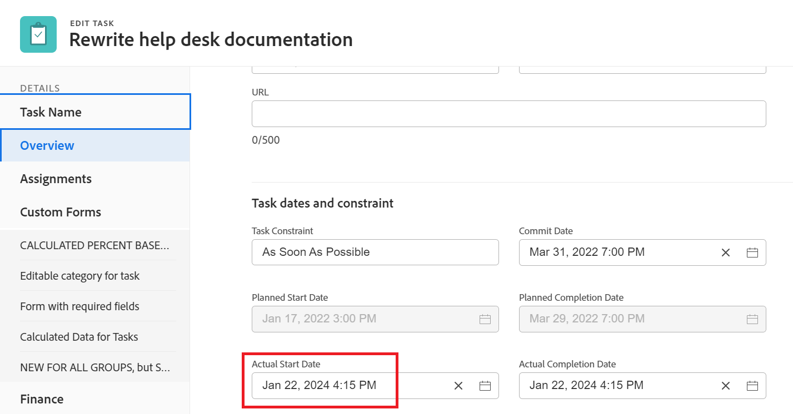
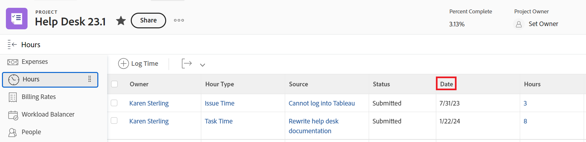

# 中的项目、任务和问题日期概述 [!DNL Adobe Workfront]

<!--

(NOTE: consider expanding on this article with ALL dates for PTIs - Hand off dates, Approval Dates, etc) 

-->

本文为与 [!DNL Adobe Workfront]. 此处包含的图像是日期在Workfront中显示的示例，其内容并不详尽。 还有其他区域显示日期。 所有日期也会在项目、任务和问题报表和列表中可见。

有关报表和列表的信息，请参阅以下文章：

* [开始使用 [!DNL Adobe Workfront]](../../../workfront-basics/navigate-workfront/use-lists/view-items-in-a-list.md)
* [开始使用 [!DNL Adobe Workfront]](../../../reports-and-dashboards/reports/reporting/get-started-reports-workfront.md)

有关项目、任务和问题字段的详细信息，请参阅 [术语表 [!DNL Adobe Workfront] 术语](../../../workfront-basics/navigate-workfront/workfront-navigation/workfront-terminology-glossary.md).

## [!UICONTROL 计划开始日期]

的 [!UICONTROL 计划开始日期] 是计划开始项目、任务或问题的日期。

根据 [!UICONTROL 任务约束]，则可能无法编辑 [!UICONTROL 计划开始日期] 任务的一部分。 根据 [!UICONTROL 计划模式] ，则可能无法编辑 [!UICONTROL 计划开始日期] 项目。

有关更多信息，请参阅 [项目概述 [!UICONTROL 计划开始日期]](../../../manage-work/projects/planning-a-project/project-planned-start-date.md).

## [!UICONTROL 计划完成日期]

的 [!UICONTROL 计划完成日期] 或 [!UICONTROL 到期日] 日期是计划完成项目、任务或问题的日期。

根据 [!UICONTROL 任务约束]，则可能无法编辑 [!UICONTROL 计划完成日期] 任务的一部分。 根据 [!UICONTROL 计划模式] ，则可能无法编辑 [!UICONTROL 计划完成日期] 项目。

的 [!UICONTROL 计划完成日期] 在 [!DNL Workfront].

有关更多信息，请参阅以下文章：

* [任务概述 [!UICONTROL 计划完成日期]](../../../manage-work/tasks/task-information/task-planned-completion-date.md)
* [设置项目 [!UICONTROL 计划完成日期]](../../../manage-work/projects/planning-a-project/project-planned-completion-date.md)
* [问题概述 [!UICONTROL 计划完成日期]](../../../manage-work/issues/issue-information/issue-planned-completion-date.md)

## [!UICONTROL 输入日期]

的 [!UICONTROL 登录日期] 是在Workfront中创建项目、任务或问题的日期。

的 [!UICONTROL 登录日期] 不会影响项目、任务或问题的时间轴，但对于跟踪和报告目的而言，它很重要。 [!DNL Workfront] 自动生成 [!UICONTROL 登录日期] 创建对象后，您无法手动编辑该对象。

## [!UICONTROL 实际开始日期]

的 [!UICONTROL 实际开始日期] 是用户实际开始处理项目、任务或问题的日期。 的 [!UICONTROL 实际开始日期] 在创建项目、任务或问题时为空。

您可以手动指示何时开始处理任务或问题，或者 [!UICONTROL 实际开始日期] 当任务或问题状态从 [!UICONTROL 新建] to [!UICONTROL 正在进行] 或 [!UICONTROL 完成]. 的 [!UICONTROL 实际开始日期] 项目的日期与项目上第一个任务开始的日期一致。

>[!TIP]
>
>的 [!UICONTROL 实际开始日期] 不匹配 [!UICONTROL 计划开始日期] 项目、任务或问题，因为用户可能在计划日期之前或之后开始工作。

有关更多信息，请参阅 [项目概述 [!UICONTROL 实际开始日期]](../../../manage-work/projects/planning-a-project/project-actual-start-date.md).

>[!NOTE]
>
>的 [!UICONTROL 必须开始] 任务或固定日期约束会影响 [!UICONTROL 计划开始日期] 任务，而不是任务 [!UICONTROL 实际开始日期]. 这会更新 [!UICONTROL 计划开始日期] 到您指定的日期。 的 [!UICONTROL 实际开始日期] 会独立于 [!UICONTROL 计划开始日期]，如上所述。

## [!UICONTROL 实际完成日期]

的 [!UICONTROL 实际完成日期] 是用户实际完成项目、任务或问题的日期。 的 [!UICONTROL 实际完成日期] 在创建项目、任务或问题时为空。

您可以手动指示任务或问题的工作何时完成，或者 [!UICONTROL 实际完成日期] 出现以下任何情况时，会自动填充以下内容：

* 项目、任务或发出状态更改为 [!UICONTROL 完成], [!UICONTROL 已关闭]或 [!UICONTROL 已解决].
* 任务或项目完成百分比为100%。

的 [!UICONTROL 实际完成日期] 项目的时间与项目上第一个任务完成的日期一致。

>[!TIP]
>
>的 [!UICONTROL 实际完成日期] 不匹配 [!UICONTROL 计划完成日期].

有关更多信息，请参阅 [项目概述 [!UICONTROL 实际完成日期]](../../../manage-work/projects/planning-a-project/project-actual-completion-date.md).

## [!UICONTROL 提交日期]

的 [!UICONTROL 提交日期] 是指定给任务或问题的用户提交完成任务或问题的日期。 这与 [!UICONTROL 计划完成日期]，因为这是仅由负责工作的用户提供的更实际的完成日期估计。 有关更多信息，请参阅 [[!UICONTROL 提交日期] 概述](../../../manage-work/projects/updating-work-in-a-project/overview-of-commit-dates.md).

>[!NOTE]
>
>更改 [!UICONTROL 提交日期] 影响 [!UICONTROL 预计完成日期] 但不是 [!UICONTROL 计划完成日期] 任务或问题。 项目经理可以使用代理人对 [!UICONTROL 提交日期] 更新 [!UICONTROL 计划完成日期] 任务或问题。

## [!UICONTROL 预计开始日期]

的 [!UICONTROL 预计开始日期] 是项目、任务或问题的实时日期，并考虑所有延迟。 这比 [!UICONTROL 计划开始日期]. 的 [!UICONTROL 计划开始日期] 不考虑延迟或过去日期。

首次计划项目时， [!UICONTROL 计划开始日期] 和 [!UICONTROL 预计开始日期] 任务和项目的相同。 由于可能会出现延迟或任务可能会提前完成， [!UICONTROL 预计开始日期] 会变得与 [!UICONTROL 计划开始日期].

对于任务， [!UICONTROL 预计开始日期] 可能与 [!UICONTROL 计划开始日期] 当其前任之一在日程安排之后运行时。

>[!TIP]
>
>您可以查看 [!UICONTROL 预计开始日期] 的问题。

有关更多信息，请参阅 [项目概述 [!UICONTROL 预计开始日期]](../../../manage-work/projects/planning-a-project/project-projected-start-date.md).

## P[!UICONTROL 预计完成日期]

的 [!UICONTROL 预计完成日期] 是一个实时的计算指标，用于指示项目、任务或问题何时完成。 将项目、任务或问题标记为已完成时， [!UICONTROL 预计完成日期] 对 [!UICONTROL 实际完成日期].

如果一切顺利，按计划进行 [!UICONTROL 预计完成日期] 应与 [!UICONTROL 计划完成日期]. 否则，由于前置任务的延迟， [!UICONTROL 预计完成日期] 可能会与 [!UICONTROL 计划完成日期].

有关更多信息，请参阅 [概述 [!UICONTROL 预计完成日期] （项目、任务和问题）](../../../manage-work/projects/planning-a-project/project-projected-completion-date.md).

## [!UICONTROL 小时录入日期]

当您记录项目、任务和问题的时间以指示您在处理项目、任务或问题上实际花费的时间（以小时为单位）时，您记录的时间将变为 [!UICONTROL 实际小时数] 项目、任务或问题。

记录时间的日期是 [!UICONTROL 小时录入日期] 字段。

>[!TIP]
>
>的 [!UICONTROL 小时录入日期] 与 [!UICONTROL 登录日期] 因为它不是创建小时日志的日期，而是您希望与小时关联的日期。

您可以在 [!UICONTROL 项目], [!UICONTROL 任务]或 [!UICONTROL 问题更新] 或 [!UICONTROL 小时] 部分。 在 [!UICONTROL 小时] 部分中，您可以手动指定小时输入日期和小时所属的用户。

有关更多信息，请参阅 [日志时间](../../../timesheets/create-and-manage-timesheets/log-time.md).

>[!TIP]
>
>我们建议对工作任务和问题进行日志记录时间，而不是对父任务或项目进行记录。 在工作任务上记录的时间累计到父任务，项目则累计为 [!UICONTROL 实际小时数] （对于父任务和项目）。 问题的记录时间会累计到项目，如 [!UICONTROL 实际小时数] 的值。

您可以查看 [!UICONTROL 小时录入日期] （以小时为单位）报表和列表。

