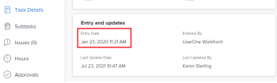

# 中的项目、任务和问题日期概述 [!DNL Adobe Workfront]

<!--

(NOTE: consider expanding on this article with ALL dates for PTIs - Hand off dates, Approval Dates, etc) 

-->

本文提供了与中的项目、任务和问题相关的最常见日期的定义。 [!DNL Adobe Workfront]. 此处包含的图像是日期在Workfront中显示的示例，并非详尽无遗。 还有其他区域显示日期。 所有日期还可在项目、任务和问题报告和列表中可见。

有关报告和列表的信息，请参阅以下文章：

* [中的列表入门 [!DNL Adobe Workfront]](../../../workfront-basics/navigate-workfront/use-lists/view-items-in-a-list.md)
* [报告入门](../../../reports-and-dashboards/reports/reporting/get-started-reports-workfront.md)

有关项目、任务和问题字段的更多信息，请参阅 [术语表 [!DNL Adobe Workfront] 术语](../../../workfront-basics/navigate-workfront/workfront-navigation/workfront-terminology-glossary.md).

## [!UICONTROL 计划开始日期]

此 [!UICONTROL 计划开始日期] 是计划开始项目、任务或问题的日期。

根据 [!UICONTROL 任务限制]，您可能无法编辑 [!UICONTROL 计划开始日期] 任务的URL。 根据 [!UICONTROL 时间表模式] 中，您可能无法编辑 [!UICONTROL 计划开始日期] 项目的URL。

有关更多信息，请参阅 [项目概述 [!UICONTROL 计划开始日期]](../../../manage-work/projects/planning-a-project/project-planned-start-date.md).

## [!UICONTROL 计划完成日期]

此 [!UICONTROL 计划完成日期] 或 [!UICONTROL 到期日期] 日期是计划完成项目、任务或问题的日期。

根据 [!UICONTROL 任务限制]，您可能无法编辑 [!UICONTROL 计划完成日期] 任务的URL。 根据 [!UICONTROL 时间表模式] 中，您可能无法编辑 [!UICONTROL 计划完成日期] 项目的URL。

此 [!UICONTROL 计划完成日期] 在某些区域显示为到期日期 [!DNL Workfront].

有关更多信息，请参阅以下文章：

* [任务概述 [!UICONTROL 计划完成日期]](../../../manage-work/tasks/task-information/task-planned-completion-date.md)
* [设置项目 [!UICONTROL 计划完成日期]](../../../manage-work/projects/planning-a-project/project-planned-completion-date.md)
* [问题概述 [!UICONTROL 计划完成日期]](../../../manage-work/issues/issue-information/issue-planned-completion-date.md)

## [!UICONTROL 输入日期]

此 [!UICONTROL 输入日期] 是在Workfront中创建项目、任务或问题的日期。

此 [!UICONTROL 输入日期] 不影响项目、任务或问题的时间线，但它对于跟踪和报告很重要。 [!DNL Workfront] 自动生成 [!UICONTROL 输入日期] 创建对象后，您无法手动编辑该对象。

## [!UICONTROL 实际开始日期]

此 [!UICONTROL 实际开始日期] 是用户实际开始处理项目、任务或问题的日期。 此 [!UICONTROL 实际开始日期] 创建项目、任务或问题时为空。

您可以手动指示任务或问题的工作何时开始，或者 [!UICONTROL 实际开始日期] 当任务或问题状态更改时自动填充 [!UICONTROL 新建] 到 [!UICONTROL 进行中] 或 [!UICONTROL 完成]. 此 [!UICONTROL 实际开始日期] 的日期与项目上第一个任务的开始日期重合。

>[!TIP]
>
>此 [!UICONTROL 实际开始日期] 可能不匹配 [!UICONTROL 计划开始日期] 项目、任务或问题，因为用户可能在其计划日期之前或之后开始工作。

有关更多信息，请参阅 [项目概述 [!UICONTROL 实际开始日期]](../../../manage-work/projects/planning-a-project/project-actual-start-date.md).

>[!NOTE]
>
>此 [!UICONTROL 必须开始时间] 任务或固定日期限制会影响 [!UICONTROL 计划开始日期] 而不是任务的 [!UICONTROL 实际开始日期]. 这将更新 [!UICONTROL 计划开始日期] 到您指定的日期。 此 [!UICONTROL 实际开始日期] 独立于 [!UICONTROL 计划开始日期]，如上所述。

## [!UICONTROL 实际完成日期]

此 [!UICONTROL 实际完成日期] 是用户实际完成项目、任务或问题的日期。 此 [!UICONTROL 实际完成日期] 创建项目、任务或问题时为空。

您可以手动指示任务或问题的工作何时完成，或者 [!UICONTROL 实际完成日期] 出现以下任何情况时自动填充：

* 项目、任务或问题状态更改为 [!UICONTROL 完成]， [!UICONTROL 已关闭]，或 [!UICONTROL 已解决].
* 任务或项目完成百分比为100%。

此 [!UICONTROL 实际完成日期] 的日期与您在项目上完成最后一个任务的日期一致。

>[!TIP]
>
>此 [!UICONTROL 实际完成日期] 可能与 [!UICONTROL 计划完成日期].

有关更多信息，请参阅 [项目概述 [!UICONTROL 实际完成日期]](../../../manage-work/projects/planning-a-project/project-actual-completion-date.md).

## [!UICONTROL 提交日期]

此 [!UICONTROL 提交日期] 是指分配给任务或问题的用户承诺完成任务或问题的日期。 这与 [!UICONTROL 计划完成日期]，因为它是仅由负责工作的用户提供的对完成日期的更实际的估计。 有关更多信息，请参阅 [[!UICONTROL 提交日期] 概述](../../../manage-work/projects/updating-work-in-a-project/overview-of-commit-dates.md).

>[!NOTE]
>
>更改 [!UICONTROL 提交日期] 影响 [!UICONTROL 预计完成日期] 但不是 [!UICONTROL 计划完成日期] 任务或问题的一部分。 项目经理可以使用被分派人在以下项目中所做的更改： [!UICONTROL 提交日期] 更新 [!UICONTROL 计划完成日期] 任务或问题的一部分。

## [!UICONTROL 预计开始日期]

此 [!UICONTROL 预计开始日期] 是项目、任务或问题的实时日期，并考虑到所有延迟。 这是项目、任务或问题的开始日期比 [!UICONTROL 计划开始日期]. 此 [!UICONTROL 计划开始日期] 不考虑延迟或过去的日期。

当您首次计划项目时， [!UICONTROL 计划开始日期] 和 [!UICONTROL 预计开始日期] 中的任务和项目中的任务相同。 由于可能会出现延迟或任务可能提前完成， [!UICONTROL 预计开始日期] 可能会变得不同于 [!UICONTROL 计划开始日期].

对于任务， [!UICONTROL 预计开始日期] 也可能与其不同 [!UICONTROL 计划开始日期] 当它的一个前置任务落后于计划时。

>[!TIP]
>
>您可以查看 [!UICONTROL 预计开始日期] 仅对列表或报表中的问题执行相同的操作。

有关更多信息，请参阅 [项目概述 [!UICONTROL 预计开始日期]](../../../manage-work/projects/planning-a-project/project-projected-start-date.md).

## [!UICONTROL 预计完成日期]

此 [!UICONTROL 预计完成日期] 是一个实时计算指示器，指示项目、任务或问题的完成时间。 当项目、任务或问题标记为“已完成”时， [!UICONTROL 预计完成日期] 对日期所做的更改 [!UICONTROL 实际完成日期].

如果一切顺利，按计划进行 [!UICONTROL 预计完成日期] 应匹配 [!UICONTROL 计划完成日期]. 否则，由于前置任务延迟， [!UICONTROL 预计完成日期] 可能会变得与 [!UICONTROL 计划完成日期].

有关更多信息，请参阅 [概述 [!UICONTROL 预计完成日期] 项目、任务和问题](../../../manage-work/projects/planning-a-project/project-projected-completion-date.md).

## [!UICONTROL 小时输入日期]

当您记录项目、任务和问题的时间以指示您在项目、任务或问题上花费的实际时间（以小时为单位）时，记录的时间将变为 [!UICONTROL 实际小时数] 项目、任务或问题的。

记录时间的日期为 [!UICONTROL 小时输入日期] 小时条目上的字段。 某些小时列表和报告将小时输入日期显示为日期。

>[!TIP]
>
>此 [!UICONTROL 小时输入日期] 不同于 [!UICONTROL 输入日期] 这是因为该日期不是创建小时日志的日期，而是您希望与小时关联的日期。

您可以在Workfront的以下区域中记录和查看时间：

* 在中记录和查看时间 [!UICONTROL 项目]， [!UICONTROL 任务]，或 [!UICONTROL 问题更新] 部分或中的 [!UICONTROL 小时] 部分。 在中记录时间时 [!UICONTROL 小时] 部分，您可以手动指定小时输入日期和小时所属的用户。

  

  有关更多信息，请参阅 [记录时间](../../../timesheets/create-and-manage-timesheets/log-time.md).

  >[!TIP]
  >
  >我们建议将登录时间用于工作任务和问题，而不是父级任务或项目。 工作任务的登录时间将累计至父任务和项目，如下所示 [!UICONTROL 实际小时数] 父任务和项目。 登录问题的时间累计到项目为 [!UICONTROL 实际小时数] 用于项目。

* 在任务或问题的更新流中记录时间。

  

* 查看 [!UICONTROL 小时输入日期] 在小时报表和列表中。

  
