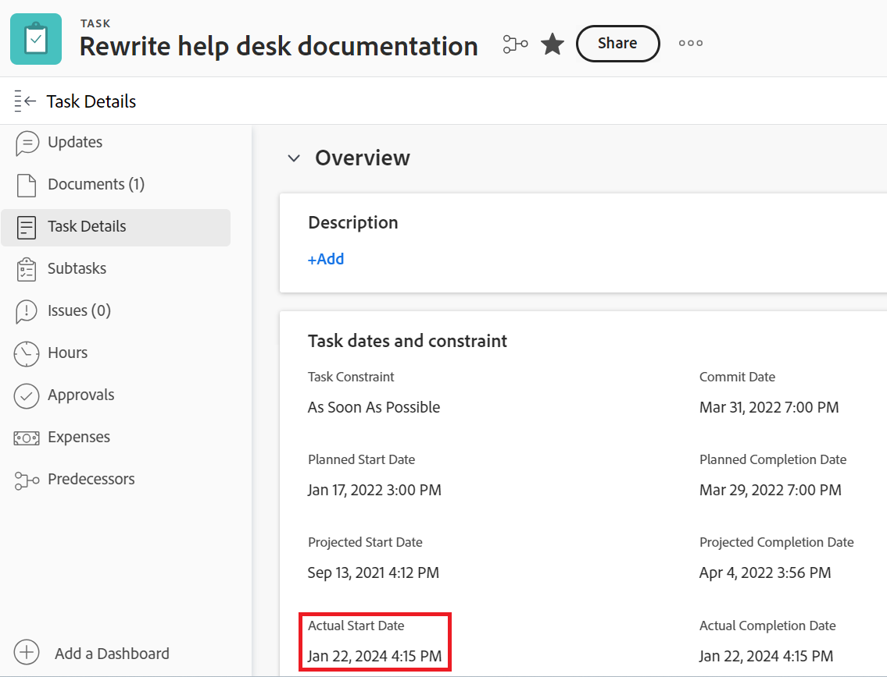

# [!DNL Workfront]中的项目、任务和问题日期概述

<!-- Audited: 05/2024 -->

<!--

(NOTE: consider expanding on this article with ALL dates for PTIs - Hand off dates, Approval Dates, etc) 

-->

本文提供了与[!DNL Adobe Workfront]中的项目、任务和问题相关的最常见日期的定义。 此处包含的图像是日期在Workfront中显示的示例，并非详尽无遗。 还有其他区域显示日期。 所有日期还可在项目、任务和问题报告和列表中可见。

有关报告和列表的信息，请参阅以下文章：

* [开始使用 [!DNL Adobe Workfront]中的列表](../../../workfront-basics/navigate-workfront/use-lists/view-items-in-a-list.md)
* [报告入门](../../../reports-and-dashboards/reports/reporting/get-started-reports-workfront.md)

有关项目、任务和问题字段的详细信息，请参阅[术语表 [!DNL Adobe Workfront] ](../../../workfront-basics/navigate-workfront/workfront-navigation/workfront-terminology-glossary.md)。

## [!UICONTROL 计划开始日期]

[!UICONTROL 计划开始日期]是项目、任务或问题的计划开始日期。

根据[!UICONTROL 任务限制]，您可能无法编辑任务的[!UICONTROL 计划开始日期]。 根据项目的[!UICONTROL 计划模式]，您可能无法编辑项目的[!UICONTROL 计划开始日期]。

有关详细信息，请参阅项目[!UICONTROL 计划开始日期]](../../../manage-work/projects/planning-a-project/project-planned-start-date.md)的[概述。

## [!UICONTROL 计划完成日期]

[!UICONTROL 计划完成日期]或[!UICONTROL 到期日期]是计划完成项目、任务或问题的日期。

根据[!UICONTROL 任务限制]，您可能无法编辑任务的[!UICONTROL 规划完成日期]。 根据项目的[!UICONTROL 计划模式]，您可能无法编辑项目的[!UICONTROL 计划完成日期]。

[!UICONTROL 计划完成日期]在[!DNL Workfront]的某些区域显示为到期日期。

有关更多信息，请参阅以下文章：

* [任务[!UICONTROL 计划完成日期]的概述](../../../manage-work/tasks/task-information/task-planned-completion-date.md)
* [设置项目[!UICONTROL 计划完成日期]](../../../manage-work/projects/planning-a-project/project-planned-completion-date.md)
* [问题[!UICONTROL 计划完成日期]的概述](../../../manage-work/issues/issue-information/issue-planned-completion-date.md)

## [!UICONTROL 输入日期]

[!UICONTROL 进入日期]是在Workfront中创建项目、任务或问题的日期。

[!UICONTROL 进入日期]不会影响项目、任务或问题的时间线，但它对于跟踪和报告很重要。 创建对象时，[!DNL Workfront]会自动生成[!UICONTROL 输入日期]，您无法手动编辑它。

## [!UICONTROL 实际开始日期]

[!UICONTROL 实际开始日期]是用户实际开始处理项目、任务或问题的日期。 创建项目、任务或问题时，[!UICONTROL 实际开始日期]为空。

您可以手动指示任务或问题的工作何时开始，或者在任务或问题状态从[!UICONTROL 新建]更改为[!UICONTROL 进行中]或[!UICONTROL 完成]时，自动填充[!UICONTROL 实际开始日期]。 项目的[!UICONTROL 实际开始日期]与项目上第一个任务的开始日期一致。

>[!TIP]
>
>[!UICONTROL 实际开始日期]可能与项目、任务或问题的[!UICONTROL 计划开始日期]不匹配，因为用户可能在其计划日期之前或之后开始工作。

有关详细信息，请参阅项目[!UICONTROL 实际开始日期]](../../../manage-work/projects/planning-a-project/project-actual-start-date.md)的[概述。

>[!NOTE]
>
>[!UICONTROL 必须在]任务开始，或者固定日期约束会影响任务的[!UICONTROL 计划开始日期]，而不是[!UICONTROL 实际开始日期]。 这会将[!UICONTROL 计划开始日期]更新为您指定的日期。 [!UICONTROL 实际开始日期]的更新与[!UICONTROL 计划开始日期]无关，如上所述。

## [!UICONTROL 实际完成日期]

[!UICONTROL 实际完成日期]是用户实际完成项目、任务或问题的日期。 创建项目、任务或问题时，[!UICONTROL 实际完成日期]为空。

您可以手动指示任务或问题的工作何时完成，或者在出现以下任何情况时自动填充[!UICONTROL 实际完成日期]：

* 项目、任务或问题状态更改为[!UICONTROL 完成]、[!UICONTROL 已关闭]或[!UICONTROL 已解决]。
* 任务或项目完成百分比为100%。

项目的[!UICONTROL 实际完成日期]与您在项目上完成最后一个任务的日期重合。

>[!TIP]
>
>[!UICONTROL 实际完成日期]可能与[!UICONTROL 计划完成日期]不匹配。

有关详细信息，请参阅项目[!UICONTROL 实际完成日期]](../../../manage-work/projects/planning-a-project/project-actual-completion-date.md)的[概述。

## [!UICONTROL 提交日期]

[!UICONTROL 提交日期]是分配给任务或问题的用户提交完成任务或问题的日期。 这与[!UICONTROL 规划完成日期]不同，因为它是仅由负责工作的用户提供的对完成日期的更现实的估计。 有关详细信息，请参阅[[!UICONTROL 提交日期]概述](../../../manage-work/projects/updating-work-in-a-project/overview-of-commit-dates.md)。

>[!NOTE]
>
>更改[!UICONTROL 提交日期]将影响[!UICONTROL 预计完成日期]，但不影响任务或问题的[!UICONTROL 计划完成日期]。 项目经理可以使用被分派人在[!UICONTROL 提交日期]所做的更改来更新任务或问题的[!UICONTROL 规划完成日期]。

## [!UICONTROL 预计开始日期]

[!UICONTROL 预计开始日期]是项目、任务或问题开始的实时日期，该日期会考虑所有延迟。 此项目、任务或问题的开始日期比[!UICONTROL 计划开始日期]更准确。 [!UICONTROL 计划开始日期]不考虑延迟或过去的日期。

当您首次计划项目时，任务和项目的[!UICONTROL 计划开始日期]和[!UICONTROL 预计开始日期]相同。 由于可能会出现延迟或任务可能提前完成，[!UICONTROL 预计开始日期]可能与[!UICONTROL 计划开始日期]不同。

对于任务，当其前置任务之一在计划之后运行时，[!UICONTROL 预计开始日期]可能也不同于其[!UICONTROL 计划开始日期]。

>[!TIP]
>
>您只能在列表或报告中查看问题的[!UICONTROL 预计开始日期]。

有关详细信息，请参阅[项目概述[!UICONTROL 预计开始日期]](../../../manage-work/projects/planning-a-project/project-projected-start-date.md)。

## [!UICONTROL 预计完成日期]

[!UICONTROL 预计完成日期]是一个实时计算的指示器，指示项目、任务或问题的完成时间。 将项目、任务或问题标记为完成时，[!UICONTROL 预计完成日期]将更改为[!UICONTROL 实际完成日期]的日期。

如果一切顺利，并按计划进行，[!UICONTROL 预计完成日期]应与[!UICONTROL 计划完成日期]匹配。 否则，由于前置任务延迟，[!UICONTROL 预计完成日期]可能与[!UICONTROL 计划完成日期]不同。

有关详细信息，请参阅项目、任务和问题的[预计完成日期[!UICONTROL 的概述]](../../../manage-work/projects/planning-a-project/project-projected-completion-date.md)。

## [!UICONTROL 小时输入日期]

当您为项目、任务和问题记录时间以指示您在项目、任务或问题上花费的实际时间（以小时为单位）时，记录的时间将成为项目、任务或问题的[!UICONTROL 实际小时数]。

您记录时间的日期是小时条目上的[!UICONTROL 小时条目日期]字段。 某些小时列表和报告将小时输入日期显示为日期。

>[!TIP]
>
>[!UICONTROL 小时输入日期]与[!UICONTROL 输入日期]不同，因为它不是创建小时日志的日期，而是您希望小时关联的日期。

您可以在Workfront的以下区域中记录和查看时间：

* 在[!UICONTROL 项目]、[!UICONTROL 任务]、[!UICONTROL 问题更新]节或[!UICONTROL 小时]节中记录并查看时间。 在[!UICONTROL 小时]部分中记录时间时，您可以手动指定小时输入日期和小时所属用户。

  

  有关详细信息，请参阅[记录时间](../../../timesheets/create-and-manage-timesheets/log-time.md)。

  >[!TIP]
  >
  >我们建议将登录时间用于工作任务和问题，而不是父级任务或项目。 工作任务记录的时间将累计到父任务和项目，作为父任务和项目的[!UICONTROL 实际小时数]。 已登录问题的时间将作为[!UICONTROL 项目实际小时数]汇总到项目中。

* 在任务或问题的更新流中记录时间。

  

* 在小时报告和列表中查看[!UICONTROL 小时输入日期]。

  
