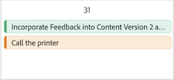

# 在“优先级”日历中管理您的工作

使用清晰直观的日程表轻松跟踪您的工作。 使用优先级日历，您可以

* 使用筛选器查找您的工作
* 应用状态和焦点级别等自定义字段以标识高优先级工作
* 为快速组织应用颜色

>[!IMPORTANT]
>
>项目必须处于当前状态或等于当前状态的状态，才能显示项目及其子任务和问题。

## 访问要求

+++ 展开以查看本文中各项功能的访问要求。

您必须具有以下权限才能执行本文中的步骤：

<table style="table-layout:auto"> 
 <col> 
 </col> 
 <col> 
 </col> 
 <tbody> 
  <tr> 
   <td role="rowheader"><strong>Adobe Workfront计划</strong></td> 
   <td> 
任何
 </td> 
  </tr> 
  <tr> 
   <td role="rowheader"><strong>Adobe Workfront许可证*</strong></td> 
   <td> 
   
当前：查看者或更高版本

   
新增：浅色或更高
 
   </td> 
  </tr> 
  <tr> 
   <td role="rowheader"><strong>访问级别配置</strong></td> 
   <td> 
查看或编辑更新所在对象的访问权限
</td> 
  </tr> 
  <tr> 
   <td role="rowheader"><strong>对象权限</strong></td> 
   <td> 
查看对对象的访问权限
</td> 
  </tr> 
 </tbody> 
</table>

*有关详细信息，请参阅Workfront文档中的[访问要求](/help/quicksilver/administration-and-setup/add-users/access-levels-and-object-permissions/access-level-requirements-in-documentation.md)。

+++

## 在日历中查看您的工作

优先级显示分配给您的工作项。 您无法在优先级日历中看到分配给您团队的工作项。

{{step1-to-priorities}}

1. 单击工作列表顶部的日历图标。
   
1. 选择一个或多个筛选器以缩小工作项的范围。

   +++展开以查看有关可用筛选器的详细信息
   <table>
    <tbody>
    <tr>
    <th>筛选条件</th>
    <th>描述</th>
    </tr>
        <tr>
        <td>正在努力</td>
        <td>显示您当前处理的项目</td>
        </tr>
        <tr>
        <td>准备开始</td>
        <td>显示项目和 
        <ul>
        <li>没有未完成的前置任务或任务限制</li>
        
和

        <li>计划开始日期是过去的日期，或者最多在未来的两周内</li>
        </ul>
        </td>
        </tr>
        <tr>
        <td>未就绪</td>
        <td>显示具有
        <ul>
        <li>未完成的前置任务或阻止处理项目的任务限制</li>
        
或

        <li>超过两周后的计划开始日期</li>
        </ul>
        </td>
        </tr>
        <tr>
        <td>已请求</td>
        <td>显示您尚未开始处理的问题</td>
        </tr>
        <td>完成</td>
        <td>显示过去两周内完成的工作。 此筛选器选项不包括审批。</td>
        </tr>
        <tr>
        <td>项目</td>
        <td>显示包含您已被分派的任务或问题的项目</td>
        </tr>
        <tr>
        <td>到期日期</td>
        <td>按计划完成日期显示工作</td>
        </tr>
        <tr>
        <td>状态</td>
        <td>显示处于新、进行中和完成状态的任务或问题</td>
        </tr>
        <tr>
        <td>我的焦点</td>
        <td>显示中已分配焦点级别的任务或问题。 焦点级别由个人用户分配和管理。</td>
        </tr>
    </tbody>
    </table>

+++

1. 单击日历中的工作项栏以打开侧摘要。 利用侧边摘要可以

* 查看和编辑项目和工作项详细信息
* 发表和查看评论
* 查看和上传文档
* 创建验证
* 导航到Workfront中的项目页面
* 在优先级中导航到工作项详细信息页面
* 记录时间
* 添加快速链接

1. （可选）单击&#x200B;**新建**&#x200B;以将新工作项添加到日历。 有关详细信息，请参阅[在优先级](/help/quicksilver/workfront-basics/priorities/create-task-issue-priorities.md)中创建新任务或问题。

## 配置日历

{{step1-to-priorities}}

1. 单击工作列表顶部的日历图标。
   
1. 单击日历右角的&#x200B;**设置**&#x200B;图标。

1. 在&#x200B;**栏样式**选项卡上，选择最多5个显示在日历工作项栏中的字段。
   

1. 在&#x200B;**颜色**选项卡上，选择您希望工作项显示的方式。 例如，如果选择“项目”，则您的工作项将根据分配给工作列表上的项目的颜色显示。
   
