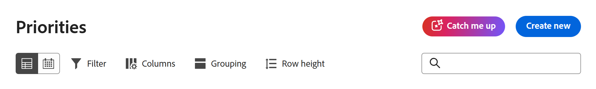

# 在优先级中赶超工作

抓住我 — 由Workfront的AI助手提供支持 — 概述以下时间范围内有关您项目的更新、上传的文档以及其他显着更改：24小时、3天、7天。 这有助于缩短查找活动项目信息的时间。

>[!NOTE]
>
>此功能仅适用于使用AI Assistant的Unified Adobe Experience客户。 有关AI助手的详细信息，请参阅[AI助手概述](/help/quicksilver/workfront-basics/ai-assistant/ai-assistant-overview.md)。

## 访问要求

+++您必须具有以下权限才能执行本文中的步骤： 

<table style="table-layout:auto"> 
 <col> 
 <col> 
 <tbody> 
  <tr> 
   <td role="rowheader">Adobe Workfront计划</td> 
   <td>
新建：任何

       
或

       
当前：不可用
</td>
  </tr> 
  <tr> 
   <td role="rowheader">Adobe Workfront许可证</td> 
   <td>
新增：标准

       
或

       
当前：不可用
</td>
  </tr> 
 </tbody> 
</table>

有关此表中信息的更多详细信息，请参阅Workfront文档中的[访问要求](/help/quicksilver/administration-and-setup/add-users/access-levels-and-object-permissions/access-level-requirements-in-documentation.md)。

+++

## 访问可赶上进度

{{step1-to-priorities}}

1. 在页面顶部，单击&#x200B;**追上我**。
   
1. 选择所需的时间范围：
   * **总结过去24小时**
   * **总结过去3天**
   * **总结过去7天**

   >[!NOTE]
   >
   > 如果您无法与此面板交互，则贵组织没有已签署的Adobe Gen AI文件协议。

