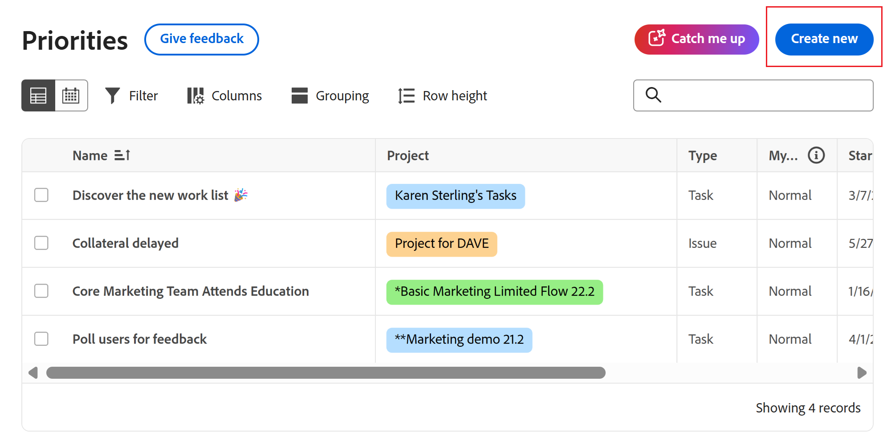

# 在优先级中创建新任务或问题

您可以直接从“优先级”创建新任务和问题：

## 访问要求

+++ 展开以查看本文中各项功能的访问要求。

您必须具有以下权限才能执行本文中的步骤：

<table style="table-layout:auto"> 
 <col> 
 </col> 
 <col> 
 </col> 
 <tbody> 
  <tr> 
   <td role="rowheader"><strong>Adobe Workfront计划</strong></td> 
   <td> 
任何
 </td> 
  </tr> 
  <tr> 
   <td role="rowheader"><strong>Adobe Workfront许可证*</strong></td> 
   <td> 
   
当前：请求或更高请求；问题审查或更高请求；任务的工作或更高请求

   
新：请求的参与者或更高；问题和文档的轻度或更高：标准或更高任务
 
   </td> 
  </tr> 
  <tr> 
   <td role="rowheader"><strong>访问级别配置</strong></td> 
   <td> 
查看或编辑更新所在对象的访问权限
</td> 
  </tr> 
  <tr> 
   <td role="rowheader"><strong>对象权限</strong></td> 
   <td> 
查看对对象的访问权限
</td> 
  </tr> 
 </tbody> 
</table>

*有关详细信息，请参阅Workfront文档中的[访问要求](/help/quicksilver/administration-and-setup/add-users/access-levels-and-object-permissions/access-level-requirements-in-documentation.md)。

+++

## 在优先级中创建任务或问题

您可以在项目中创建任务或问题。 优先级显示分配给您的工作项。 您无法在优先级工作列表中看到分配给您团队的工作项。

>[!NOTE]
>
>如果您拥有请求或参与者许可证，则可以直接在优先级中创建请求。

要在项目中创建任务或问题，请执行以下操作：

{{step1-to-priorities}}

1. 单击右上角的&#x200B;**新建**。
   
1. 指定以下信息：

   | 字段 | 说明 |
   |---------------|-------------|
   | 工作项类型（可选） | 选择是要创建&#x200B;**任务**&#x200B;还是&#x200B;**问题**。 |
   | 名称 | 输入名称。 |
   | 描述（非必要） | 输入说明。 |
   | 项目 | 开始键入项目名称，然后从下拉列表中选择该名称。 |
   | 被分派人（可选） | 将人员分配给工作项。 |
   | 截止日期（可选） | 选择截止日期。 |

1. 单击&#x200B;**创建**。
