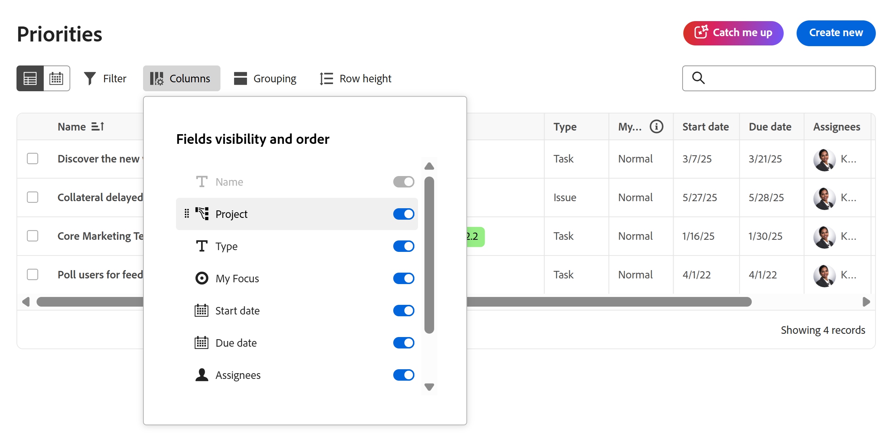
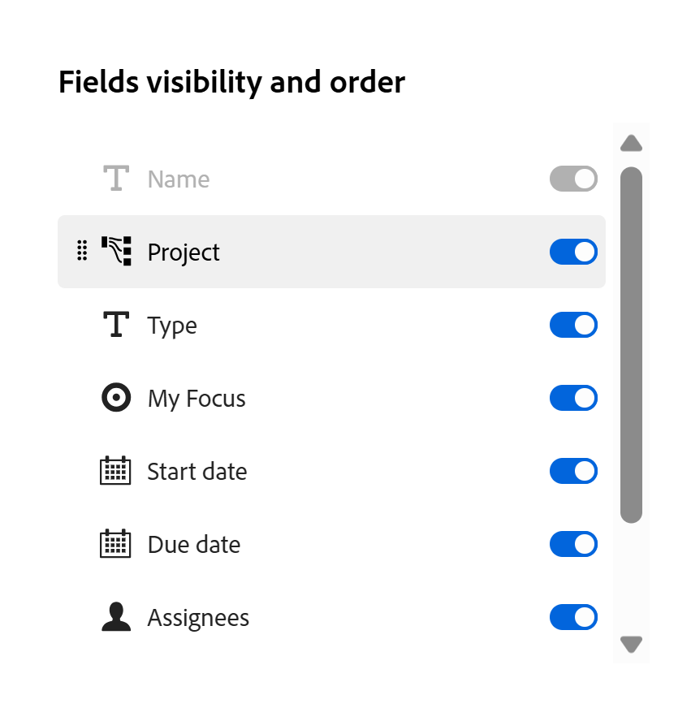

# 自定义优先级工作列表列

您可以在优先级中自定义工作列表上的列，以支持您的工作方式。

优先级显示分配给您的工作项。 您看不到分配给您团队的工作项。

>[!NOTE]
>
>此时无法将自定义数据添加到列。

## 访问要求

+++ 展开以查看本文中各项功能的访问要求。

<table style="table-layout:auto"> 
 <col> 
 </col> 
 <col> 
 </col> 
 <tbody> 
  <tr> 
   <td role="rowheader"><strong>Adobe Workfront计划</strong></td> 
   <td> 
任何
 </td> 
  </tr> 
  <tr> 
   <td role="rowheader"><strong>Adobe Workfront许可证*</strong></td> 
   <td> 
   
当前：查看者或更高版本

   
新增：浅色或更高
 
   </td> 
  </tr> 
  <tr> 
   <td role="rowheader"><strong>访问级别配置</strong></td> 
   <td> 
查看或编辑更新所在对象的访问权限
</td> 
  </tr> 
  <tr> 
   <td role="rowheader"><strong>对象权限</strong></td> 
   <td> 
查看对对象的访问权限
</td> 
  </tr> 
 </tbody> 
</table>

有关此表中信息的更多详细信息，请参阅Workfront文档中的[访问要求](/help/quicksilver/administration-and-setup/add-users/access-levels-and-object-permissions/access-level-requirements-in-documentation.md)。

+++

## 自定义优先级工作列表列

### 启用或禁用列

{{step1-to-priorities}}

1. 单击屏幕左侧的&#x200B;**列**。
   
1. 使用切换启用或禁用工作列表中的列。

### 对列重新排序

{{step1-to-priorities}}

1. 单击屏幕左侧的&#x200B;**列**。
1. 单击&#x200B;**拖动**&#x200B;图标并将列移动到所需的位置。 自动移动列会更新工作列表。
   

>[!NOTE]
>
>“名称”列是固定的，无法移动。
