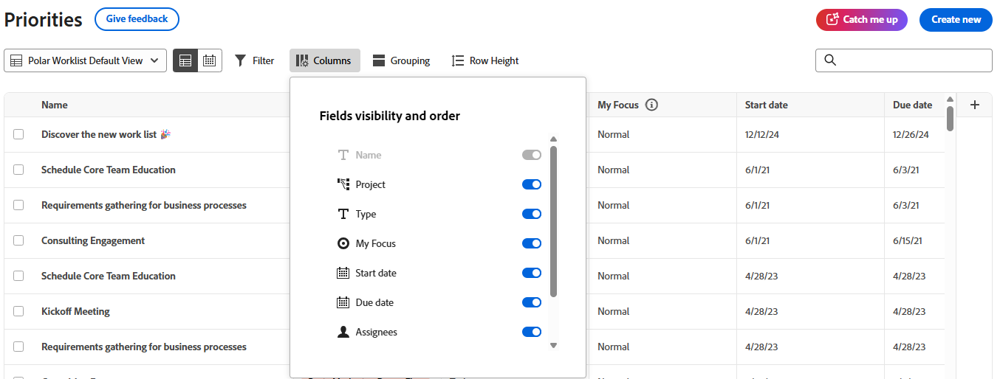

# 自定义优先级工作列表列

<!--I think this article can point to the Enhanced lists article for managing the view-->

<!--
The information highlighted on this page refers to functionality not yet generally available. It is available only in the Preview environment for all customers. After the release to Preview, the same features are also available monthly in the Production environment for customers who enabled fast releases.    

For information about fast releases, see [Enable or disable fast releases for your organization](/help/quicksilver/administration-and-setup/set-up-workfront/configure-system-defaults/enable-fast-release-process.md). 
-->

您可以在优先级中自定义工作列表上的列，以支持您的工作方式。

优先级显示分配给您的工作项。 您看不到分配给您团队的工作项。

<!--
>[!NOTE]
>
>You cannot add custom data to columns at this time.
-->

## 访问权限要求

+++ 展开可查看本文所述功能的访问权限要求。

<table style="table-layout:auto"> 
 <col> 
 </col> 
 <col> 
 </col> 
 <tbody> 
  <tr> 
   <td role="rowheader"><strong>Adobe Workfront 包</strong></td> 
   <td> 
“任一”
 </td> 
  </tr> 
  <tr> 
   <td role="rowheader"><strong>Adobe Workfront许可证</strong></td> 
   <td> 
   
审阅者或更高版本

   
浅色或更高
 
   </td> 
  </tr> 
  <tr> 
   <td role="rowheader"><strong>访问级别配置</strong></td> 
   <td> 
查看或编辑更新所在对象的访问权限
</td> 
  </tr> 
  <tr> 
   <td role="rowheader"><strong>对象权限</strong></td> 
   <td> 
查看对对象的访问权限
</td> 
  </tr> 
 </tbody> 
</table>

有关此表中信息的更多详细信息，请参阅Workfront文档中的[访问要求](/help/quicksilver/administration-and-setup/add-users/access-levels-and-object-permissions/access-level-requirements-in-documentation.md)。

+++

## 自定义优先级工作列表列

### 启用或禁用列

{{step1-to-priorities}}

1. 单击屏幕左侧的&#x200B;**列**。

   

1. 使用切换显示或隐藏工作列表中的列。

### 对列重新排序

{{step1-to-priorities}}

1. 单击屏幕左侧的&#x200B;**列**。
1. 单击&#x200B;**拖动**&#x200B;图标并将列移动到所需的位置。 自动移动列会更新工作列表。
   

>[!NOTE]
>
>“名称”列是固定的，无法移动。

### 使用列管理器添加和删除列

{{step1-to-priorities}}

1. 单击列表右上角的+图标以打开&#x200B;**列管理器**&#x200B;框。
1. 添加或删除列，然后单击&#x200B;**保存**。

   >[!NOTE]
   >
   >您只能将现有字段添加到列表视图。 任务和问题的本机字段和自定义字段均可作为列添加。

有关列管理器的详细信息，请参阅文章[使用增强列表](/help/quicksilver/workfront-basics/navigate-workfront/use-lists/enhanced-lists.md)中的[使用列管理器添加和删除列](/help/quicksilver/workfront-basics/navigate-workfront/use-lists/enhanced-lists.md#add-and-remove-columns-with-the-column-manager)部分。

### 更改优先级列表中的行高

{{step1-to-priorities}}

1. 单击&#x200B;**行高**&#x200B;图标。

   这会更新行的垂直长度。 从以下选项中进行选择：

   * 短
   * 标准。 这是默认选项。
   * 媒介
   * 高

   列表会立即更新。

## 管理优先级列表的视图

视图使用预设设置定义列表中的列、筛选器和分组。

默认视图将分配给优先级列表。 您还可以创建和共享自己的视图。

{{step1-to-priorities}}

1. 展开列表左上角的下拉视图菜单以选择其他视图，或单击&#x200B;**新建视图**&#x200B;以创建其他视图。
1. 更新要包含在视图中的列、筛选器和分组。

   对视图的更改会自动保存。 下次应用此视图时，列和筛选器设置将保持其设置方式。

有关视图的详细信息，请参阅文章[使用增强列表](/help/quicksilver/workfront-basics/navigate-workfront/use-lists/enhanced-lists.md)中的[更新增强列表元素](/help/quicksilver/workfront-basics/navigate-workfront/use-lists/enhanced-lists.md#update-enhanced-list-elements)部分。
