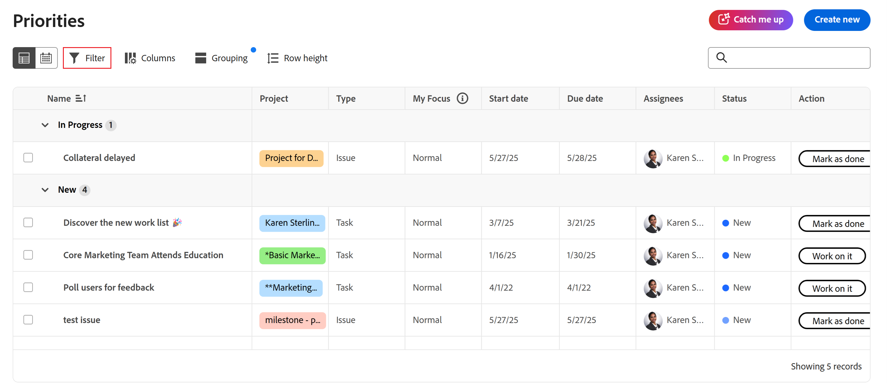
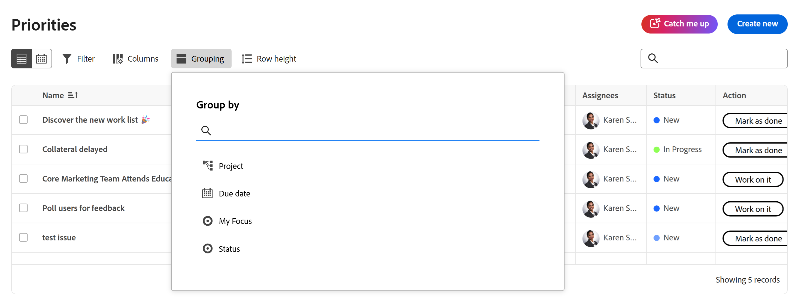
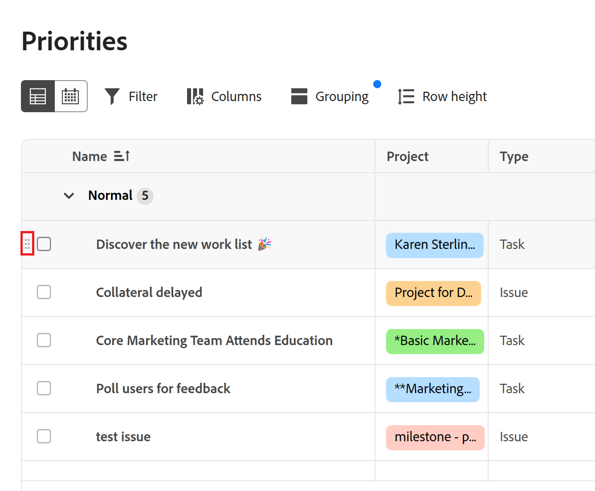
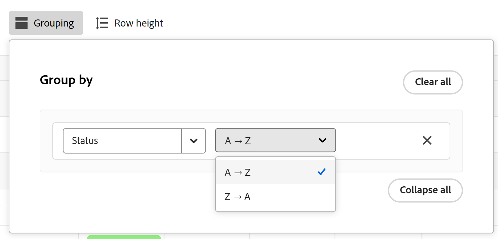
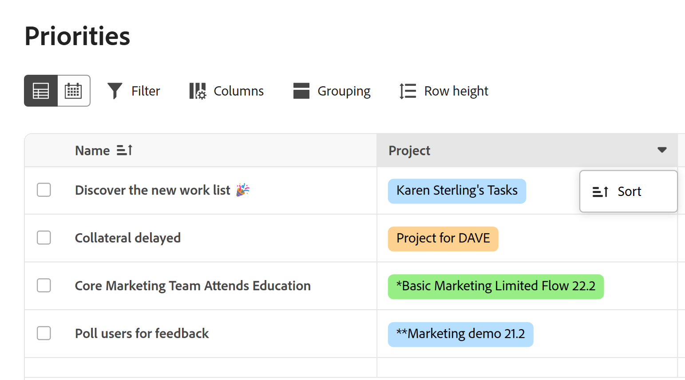
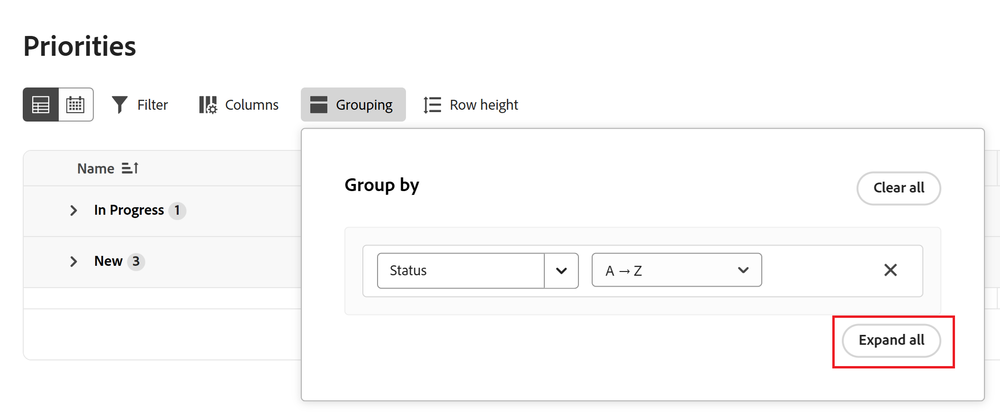

# 使用优先级筛选和分组您的工作

您可以使用筛选器查找要查找的工作，然后应用分组以使其保持井井有条。

优先级显示分配给您的工作项。 您无法在优先级工作列表中看到分配给您团队的工作项。

## 访问要求

+++ 展开以查看本文中各项功能的访问要求。

您必须具有以下权限才能执行本文中的步骤：

<table style="table-layout:auto"> 
 <col> 
 </col> 
 <col> 
 </col> 
 <tbody> 
  <tr> 
   <td role="rowheader"><strong>Adobe Workfront计划</strong></td> 
   <td> 
任何
 </td> 
  </tr> 
  <tr> 
   <td role="rowheader"><strong>Adobe Workfront许可证*</strong></td> 
   <td> 
   
当前：请求或更高版本

   
新文档：参与者或更高版本
 
   </td> 
  </tr> 
  <tr> 
   <td role="rowheader"><strong>访问级别配置</strong></td> 
   <td> 
查看或编辑更新所在对象的访问权限
</td> 
  </tr> 
  <tr> 
   <td role="rowheader"><strong>对象权限</strong></td> 
   <td> 
查看对对象的访问权限
</td> 
  </tr> 
 </tbody> 
</table>

*有关详细信息，请参阅Workfront文档中的[访问要求](/help/quicksilver/administration-and-setup/add-users/access-levels-and-object-permissions/access-level-requirements-in-documentation.md)。

+++

## 使用标准筛选器筛选您的工作

您可以筛选分配给您的任务和问题。

{{step1-to-priorities}}

1. 单击工作列表左上角的&#x200B;**筛选器**。
1. 单击&#x200B;**标准筛选器**。
1. 选择一个或多个筛选器以缩小工作项的范围。
   

+++展开以查看有关可用筛选器的详细信息
<table>
  <tbody>
   <tr>
   <th>筛选条件</th>
   <th>描述</th>
   </tr>
    <tr>
      <td>正在努力</td>
      <td>显示您当前处理的项目</td>
    </tr>
    <tr>
      <td>准备开始</td>
      <td>显示项目和 
      <ul>
      <li>没有未完成的前置任务或任务限制</li>
      
和

      <li>计划开始日期是过去的日期，或者最多在未来的两周内</li>
      </ul>
      </td>
    </tr>
    <tr>
      <td>未就绪</td>
      <td>显示具有
       <ul>
      <li>未完成的前置任务或阻止处理项目的任务限制</li>
      
或

      <li>超过两周后的计划开始日期</li>
      </ul>
       </td>
    </tr>
    <tr>
      <td>已请求</td>
      <td>显示您尚未开始处理的问题</td>
    </tr>
      <td>完成</td>
      <td>显示过去两周内完成的工作。 此筛选器选项不包括审批。</td>
    </tr>
    <tr>
    <td>项目</td>
    <td>显示包含您已被分派的任务或问题的项目</td>
    </tr>
    <tr>
    <td>到期日期</td>
    <td>按计划完成日期显示工作</td>
    </tr>
    <tr>
    <td>状态</td>
    <td>显示处于新、进行中和完成状态的任务或问题</td>
    </tr>
    <tr>
    <td>我的焦点</td>
    <td>显示中已分配焦点级别的任务或问题。 焦点级别由个人用户分配和管理。</td>
    </tr>
  </tbody>
</table>

+++

1. （可选）单击&#x200B;**返回默认值**&#x200B;以重置您的选择。

## 使用智能筛选器筛选您的工作

使用自然语言快速筛选筛选工作。 您的Workfront实例必须位于新的Workfront计划上，并在Adobe Unified Experience中启用。 有关详细信息，请参阅[适用于Workfront的Adobe Unified Experience](/help/quicksilver/workfront-basics/navigate-workfront/workfront-navigation/adobe-unified-experience.md)。

{{step1-to-priorities}}

1. 单击工作列表左上角的&#x200B;**筛选器**。
1. 单击&#x200B;**智能滤镜**。
1. 键入您希望如何筛选您的工作。

   您可以键入以下内容

   * 显示迟到任务
   * 显示我的首要任务
   * 显示今天到期的工作

## 将您的工作分组

{{step1-to-priorities}}

1. 单击工作列表左上角的&#x200B;**组**。
1. 选择一个组以组织您的工作列表
   

+++展开以查看有关可用组的详细信息

| 组 | 描述 |
|-----------|-------------|
| 项目 | 这将按项目对项分组。 |
| 我的焦点 | 这将根据您分配的焦点级别对项目进行分组。 |
| 到期周数 | 这将按项目到期的周对项目进行分组。 到期日期由计划完成日期确定。 |
| 状态 | 此操作按以下状态对项目进行分组：新建、进行中、完成。  注意：目前无法在“优先级”中使用自定义状态。 |

+++

### 按“我的优先级”或“状态”分组时拖放工作项

按“我的优先级”或“状态”分组时，您可以在类别之间拖放单个工作项。

1. 按&#x200B;**状态**&#x200B;或&#x200B;**我的优先级**&#x200B;对您的工作分组。
2. 将鼠标悬停在工作项上以查找移动图标，并将其拖动到所需的类别。
   

## 对您的工作排序

### 按组排序

若要对群内的工作进行排序，请打开&#x200B;**群**&#x200B;并单击&#x200B;**升序排序**&#x200B;或&#x200B;**降序排序**。

### 对列排序

要对各个列进行排序，请转到该列并单击向下箭头。

中的向下箭头

### 展开或折叠所有组节

若要展开或折叠所有组节，请打开&#x200B;**组**，然后单击&#x200B;**全部展开**&#x200B;或&#x200B;**全部折叠**。

