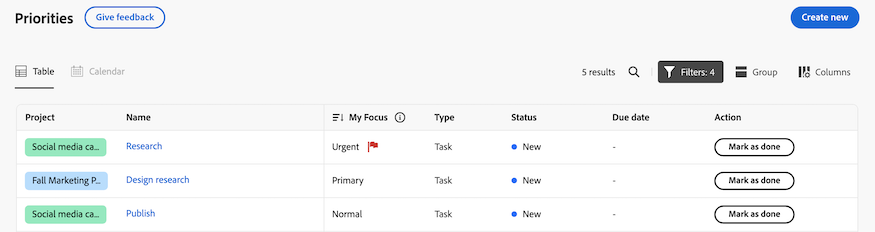

# 开始使用 [!DNL Priorities]

优先级是为任务所有者定制的简化、直观的体验。 优先事项将从工作清单开始分阶段推出。

有了“优先次序”，您可以

* 管理和优先处理日常任务：通过整合的导航功能组织您的日常或一周的工作，提高清晰度
* 更高的工作效率：访问项目上下文并更快速地执行任务，只需较少的点击次数
* 个性化功能：从专为任务所有者设计的功能中获益

## 查找并组织您的工作

在“优先级”中，您可以对工作进行筛选和分组，以帮助您管理截止日期并优先考虑对您来说最重要的事情。 您还可以通过“我的焦点”列快速确定紧急工作。

### 查找使用过滤器的工作

使用筛选器查找最重要的工作。 <!--You can use a natural language to find work with the Smart filter, or -->
您可以使用标准筛选器查找分配给您的任务和问题：

<table>
  <tbody>
   <tr>
   <th>筛选条件</th>
   <th>描述</th>
   </tr>
    <tr>
      <td>正在处理</td>
      <td>显示您当前处理的项目</td>
    </tr>
    <tr>
      <td>准备开始</td>
      <td>显示项目和 
      <ul>
      <li>没有未完成的前置任务或任务限制</li>
      
和

      <li>计划开始日期是过去的日期，或者最多在未来的两周内</li>
      </ul>
      </td>
    </tr>
    <tr>
      <td>未就绪</td>
      <td>显示具有
       <ul>
      <li>未完成的前置任务或阻止处理项目的任务限制</li>
      
或

      <li>超过两周后的计划开始日期</li>
      </ul>
       </td>
    </tr>
    <tr>
      <td>已请求</td>
      <td>显示您尚未开始处理的问题</td>
    </tr>
      <td>完成</td>
      <td>显示过去两周内完成的工作。 此筛选器选项不包括审批。</td>
    </tr>
    <tr>
    <td>项目</td>
    <td>显示包含您已被分派的任务或问题的项目</td>
    </tr>
    <tr>
    <td>到期日期</td>
    <td>按计划完成日期显示工作</td>
    </tr>
    <tr>
    <td>状态</td>
    <td>显示处于新、进行中和完成状态的任务或问题</td>
    </tr>
     <tr>
    <td>我的焦点</td>
    <td>显示中已分配焦点级别的任务或问题。 焦点级别由个人用户分配和管理。</td>
    </tr>
  </tbody>
</table>

### 使用组组织您的工作

在筛选完您的工作后，您可以根据以下条件对项目进行分组

* 我的焦点
* 到期周数
* 状态
* 项目

有关详细信息，请参阅[在优先级](/help/quicksilver/workfront-basics/priorities/filter-group-work-priorities.md)中筛选您的工作并将其分组。

### 使用“我的焦点”安排重要工作项的优先级

“我的焦点”是工作列表中的一栏，可帮助您排定工作的优先级。 “我的焦点”值是个人的，不会影响项目、任务或问题数据。 您可以使用以下焦点级别：

* 紧急
* 高
* 正常（默认）
* 低

将焦点级别分配给工作项目后，您可以对列进行排序，以在工作列表顶部显示紧急项目。

有关详细信息，请参阅[优先处理重要工作项](/help/quicksilver/workfront-basics/priorities/prioritize-work-items.md)。

<!-- new screen for prod  -->

### 使用预览中可用的日历视图[!BADGE ]{type=Informative}

日历视图将提供任务和问题的可视化表示形式。 您将能够在一天、一周或一个月视图之间进行选择。 您也可以使用与工作列表类似的方式筛选项目。

## 处理任务和问题

在“优先级”中，您可以更新工作项以使工作项详细信息保持最新，记录时间以准确跟踪您的工作时间，无需导航到项目即可上传资产，以及添加快速链接以轻松访问常用资源。

>[!NOTE]
>
>轻量级、查看、投稿人和请求者许可证对优先级的访问有限。 有关这些许可证类型如何与任务和问题交互的更多信息，请参阅
>
>* [新许可证对对象和区域的访问权限](/help/quicksilver/administration-and-setup/add-users/how-access-levels-work/access-to-objects-areas-license-types.md)
>* [可用于新访问级别的每个对象类型的功能](/help/quicksilver/administration-and-setup/add-users/how-access-levels-work/functionality-available-for-objects.md)
>* [按许可证类型访问对象和区域](/help/quicksilver/administration-and-setup/add-users/access-levels-and-object-permissions/access-to-objects-and-areas-by-license-type.md)
>* [可用于每种对象类型的功能](/help/quicksilver/administration-and-setup/add-users/access-levels-and-object-permissions/functionality-available-for-each-object-type.md)

### 添加和查看更新

添加任务或问题的更新以将您的进度传达给其他人。

更新部分显示系统更新，以及用户在过去90天内进行的最近200次更新。

有关详细信息，请参阅[在优先级](/help/quicksilver/workfront-basics/priorities/add-view-updates-priorities.md)中添加和查看注释。

<!--new screen for prod -->

### 记录时间

您可以记录工作项的时间，以指示您在这些工作项上花费的小时数。 您还可以记录与工作无关的时间，如假期、病假或会议时间。 您的登录时间显示在您的时间表中。

有关详细信息，请参阅[在优先级中记录时间](/help/quicksilver/workfront-basics/priorities/log-time-priorities.md)。

<!--new screen for prod -->

### 上载文件

将文件直接上传到任务或问题的文档区域，而无需导航到项目。 从“优先级”上传文件时，您可以

* 选择现有文件夹
* 上载包含更新流注释的文件
* 添加其他文件
* 从连接的文档集成导入文件

有关详细信息，请参阅[上载优先级中的文件](/help/quicksilver/workfront-basics/priorities/upload-files-in-priorities.md)。

<!--new screen for prod -->

### 添加快速链接

您可以将常用链接嵌入到工作项的详细信息页面中。 利用快速链接，可快速访问或复制链接。

有关详细信息，请参阅[在优先级](/help/quicksilver/workfront-basics/priorities/quick-links-priorities.md)中添加和管理快速链接。

### 查看文档[!BADGE 在预览中可用]{type=Informative}

“文档”选项卡允许您查看与工作项相关的所有文件。 您将能够按名称、文件类型或人员筛选文档，并按名称和上传日期排序。

您还可以打开文档或验证。

### 审阅并批准可在预览]中使用的资源[!BADGE {type=Informative}

从任务或问题的文档选项卡中，您可以

* 创建简单或高级验证
* 启动验证查看者，以发表评论并做出决策

## 使用[!DNL Catch me up]查看您错过了什么[!BADGE 预览中可用]{type=Informative}

使用[!DNL Catch me up]功能查看您错过了哪些内容。 “赶上我们”将在以下时间范围内概述有关您项目的更新、上传的文档、批准和其他显着更改：24小时、3天、7天。

有关详细信息，请参阅[在优先级中更新工作](/help/quicksilver/workfront-basics/priorities/catch-me-up.md)。

<!--need new screen for prod-->

## 在详细信息页面[!BADGE 上查看预览]中可用的实时更新{type=Informative}

您可以在任务或问题的详细信息页面上查看实时更新。 您还可以通过实时在线状态指示器查看其他人是否与您同时查看页面。

## 注意事项

* 目前，Workfront管理员无法通过布局模板自定义优先级。
* 访问“优先级”中的任务是在多个选项卡中进行的。 我们计划在未来添加其他选项卡，如文档、子任务、批准等。 使用&#x200B;**提供反馈**&#x200B;按钮提交反馈时，告知我们需要这些项目。
