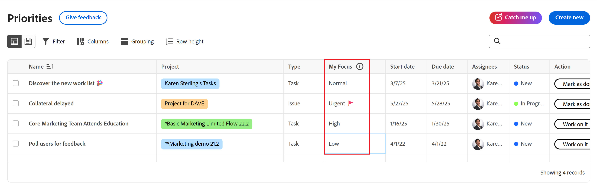

# 优先处理重要工作项目

您可以使用“我的焦点”列来确定您的工作的优先级。 “我的焦点”列是个人价值，不影响为任务或问题设置的优先级。

优先级显示分配给您的工作项。 您看不到分配给您团队的工作项。

## 访问要求

+++ 展开以查看本文中各项功能的访问要求。

<table style="table-layout:auto"> 
 <col> 
 </col> 
 <col> 
 </col> 
 <tbody> 
  <tr> 
   <td role="rowheader"><strong>Adobe Workfront包</strong></td> 
   <td> 
任何
 </td> 
  </tr> 
  <tr> 
   <td role="rowheader"><strong>Adobe Workfront许可证</strong></td> 
   <td> 
   
审阅者或更高版本

   
浅色或更高
 
   </td> 
  </tr> 
  <tr> 
   <td role="rowheader"><strong>访问级别配置</strong></td> 
   <td> 
查看或编辑更新所在对象的访问权限
</td> 
  </tr> 
  <tr> 
   <td role="rowheader"><strong>对象权限</strong></td> 
   <td> 
查看对对象的访问权限
</td> 
  </tr> 
 </tbody> 
</table>

有关此表中信息的更多详细信息，请参阅Workfront文档中的[访问要求](/help/quicksilver/administration-and-setup/add-users/access-levels-and-object-permissions/access-level-requirements-in-documentation.md)。

+++

## 使用“我的焦点”列排定您的工作的优先级

{{step1-to-priorities}}

1. 找到要重点处理的工作项。
1. 在&#x200B;**我的焦点**&#x200B;列中，选择以下焦点级别之一：

   | Focus | 描述 |
   |-----------|-------------|
   | **紧急** | “紧急”表示需要立即关注的工作项目。 紧急工作项目应优先于所有其他项目，并尽快处理。 |
   | **高** | 高表示您计划在紧急工作完成后处理的重要工作项目。 |
   | **正常** | “正常”表示在“紧急”和“高”优先级项目完成后，您将处理的日常工作项目。 这是任务和问题的默认设置。 |
   | **低** | 低表示不需要立即关注的工作项目，可以延迟到所有优先级较高的工作项目完成之后。 |

   

   >[!TIP]
   >
   >您可以按焦点级别筛选和分组您的工作。
