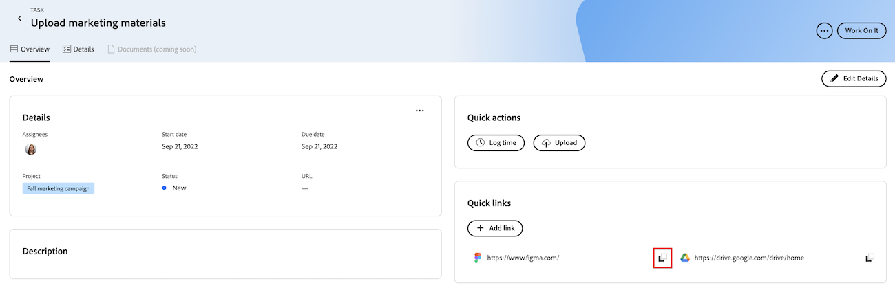

# 在优先级中添加和管理快速链接

您可以保存经常在任务或问题中访问的链接，并从“优先级”中的“概述”选项卡访问。

优先级显示分配给您的工作项。 您看不到分配给您团队的工作项。

## 访问要求

+++ 展开以查看本文中各项功能的访问要求。

<table style="table-layout:auto"> 
 <col> 
 </col> 
 <col> 
 </col> 
 <tbody> 
  <tr> 
   <td role="rowheader"><strong>Adobe Workfront包</strong></td> 
   <td> 
任何
 </td> 
  </tr> 
  <tr> 
   <td role="rowheader"><strong>Adobe Workfront许可证</strong></td> 
   <td> 
   
有问题的请求或更高职位；有任务的工作或更高职位

   
参与者或更高或更高级别的问题；轻量级或更高级别的任务
 
   </td> 
  </tr> 
  <tr> 
   <td role="rowheader"><strong>访问级别配置</strong></td> 
   <td> 
查看或编辑更新所在对象的访问权限
</td> 
  </tr> 
  <tr> 
   <td role="rowheader"><strong>对象权限</strong></td> 
   <td> 
查看对对象的访问权限
</td> 
  </tr> 
 </tbody> 
</table>

有关详细信息，请参阅Workfront文档中的[访问要求](/help/quicksilver/administration-and-setup/add-users/access-levels-and-object-permissions/access-level-requirements-in-documentation.md)。

+++

## 在优先级中添加快速链接

{{step1-to-priorities}}

1. 单击工作项名称以打开&#x200B;**概述**&#x200B;页面。
1. 在&#x200B;**快速链接**&#x200B;部分中，单击&#x200B;**添加链接**。
1. 将URL粘贴到&#x200B;**添加链接**&#x200B;框中。
1. 单击&#x200B;**保存**。
   

## 将快速链接复制到剪贴板

{{step1-to-priorities}}

1. 单击工作项名称以打开&#x200B;**概述**&#x200B;页面。
1. 在&#x200B;**快速链接**&#x200B;部分中，找到要复制的链接。
1. 单击&#x200B;**复制**图标。
   

## 打开快速链接

{{step1-to-priorities}}

1. 单击工作项名称以打开&#x200B;**概述**&#x200B;页面。
1. 在&#x200B;**快速链接**&#x200B;部分中，找到要打开的链接。
1. 单击链接。 该链接将在新选项卡中打开。
   

## 删除快速链接

{{step1-to-priorities}}

1. 单击工作项名称以打开&#x200B;**概述**&#x200B;页面。
1. 单击屏幕右上角的&#x200B;**编辑详细信息**。
   
1. 查找要删除的链接，然后单击&#x200B;**删除** 图标。
