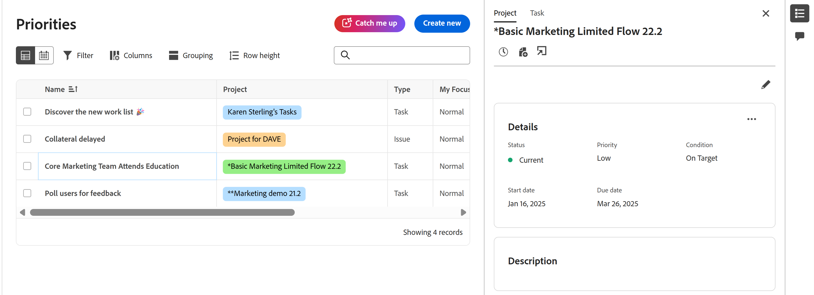
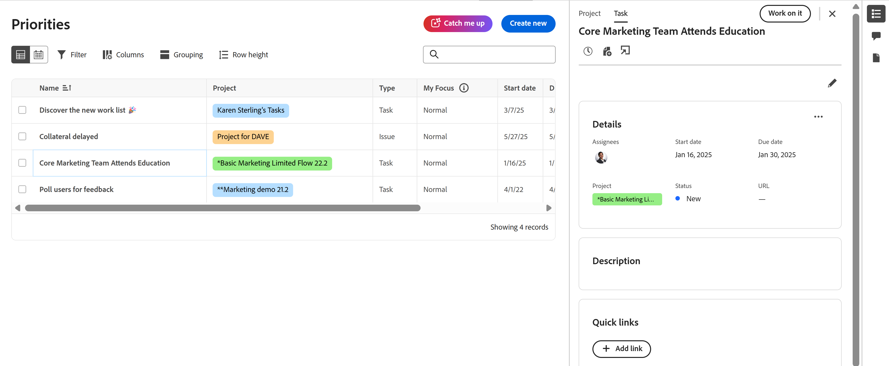
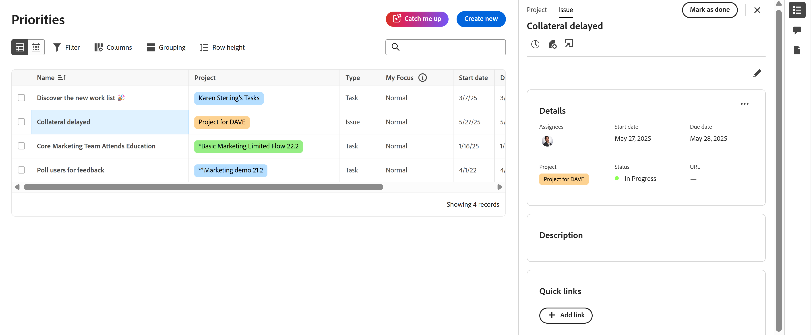

# 在优先级中查看项目和工作项详细信息

您可以在优先级工作列表中查看项目、任务和问题的详细信息。

优先级显示分配给您的工作项。 您看不到分配给您团队的工作项。

>[!IMPORTANT]
>
>项目必须处于当前状态或等于当前状态的状态，才能显示项目及其子任务和问题。

## 访问要求

+++ 展开以查看本文中各项功能的访问要求。

您必须具有以下权限才能执行本文中的步骤：

<table style="table-layout:auto"> 
 <col> 
 </col> 
 <col> 
 </col> 
 <tbody> 
  <tr> 
   <td role="rowheader"><strong>Adobe Workfront计划</strong></td> 
   <td> 
任何
 </td> 
  </tr> 
  <tr> 
   <td role="rowheader"><strong>Adobe Workfront许可证*</strong></td> 
   <td> 
   
当前：查看者或更高版本

   
新增：浅色或更高
 
   </td> 
  </tr> 
  <tr> 
   <td role="rowheader"><strong>访问级别配置</strong></td> 
   <td> 
查看或编辑更新所在对象的访问权限
</td> 
  </tr> 
  <tr> 
   <td role="rowheader"><strong>对象权限</strong></td> 
   <td> 
查看对对象的访问权限
</td> 
  </tr> 
 </tbody> 
</table>

*有关详细信息，请参阅Workfront文档中的[访问要求](/help/quicksilver/administration-and-setup/add-users/access-levels-and-object-permissions/access-level-requirements-in-documentation.md)。

+++

## 在工作列表侧面板中查看详细信息

### 查看项目详细信息

{{step1-to-priorities}}

1. 在工作列表中，将鼠标悬停在工作项名称上，然后单击&#x200B;**摘要**&#x200B;图标。
1. 单击摘要面板顶部的&#x200B;**项目**。 在这里，您可以
   * 查看和编辑项目详细信息和描述
   * 查看和添加项目评论
   * 记录时间
   * 添加文件
   * 直接转到项目

   

### 查看任务详细信息

{{step1-to-priorities}}

1. 在工作列表中，将鼠标悬停在工作名称上，然后单击&#x200B;**摘要**&#x200B;图标。
1. 默认情况下选择任务。 在这里，您可以
   * 查看并编辑项目和任务的详细信息和描述
   * 查看和添加项目评论
   * 查看和添加文档
   * 创建验证
   * 记录时间
   * 添加文件
   * 添加快速链接

   

### 查看问题详细信息

{{step1-to-priorities}}

1. 在工作列表中，将鼠标悬停在工作名称上，然后单击&#x200B;**摘要**&#x200B;图标。

1. 默认情况下，问题处于选中状态。 在这里，您可以
   * 查看并编辑项目和问题的详细信息和描述
   * 查看和添加项目评论
   * 查看和添加文档
   * 创建验证
      * 记录时间
      * 添加文件
      * 添加快速链接

   

## 在“详细信息”页面上查看详细信息

您可以在任务或问题的详细信息页面上查看实时更新。 您还可以通过实时在线状态指示器查看其他人是否与您同时查看页面。

## 查看工作项详细信息

{{step1-to-priorities}}

1. 在工作列表中，单击工作项名称。 在“详细信息”页面上，您可以

* 查看和编辑项目详细信息和描述
* 查看和添加项目评论
* 查看和添加文档
* 创建验证
* 记录时间
* 添加文件
* 添加快速链接

<!-- screenshot for prod-->