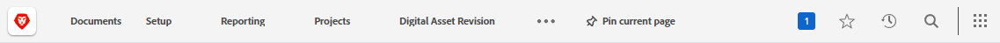

# 顶部导航栏概述

顶部导航栏 — 显示在屏幕顶部的 [!DNL Adobe Workfront] 可让您轻松查找并导航到该平台的其他区域。

## [!UICONTROL 主页] 图标

此 **[!UICONTROL 主页]** 图标  将您转到 [!UICONTROL 主页] 页面，默认登录页面。 要了解有关主页的更多信息，请参阅 [使用 [!UICONTROL 主页] 区域](../../workfront-basics/using-home/using-the-home-area/use-the-home-area.md).

## 固定页面

您可以固定经常访问的页面，以便它们显示在顶部导航栏中。 要了解有关固定页面的更多信息，请参阅 [固定页面以自定义工作区](../../workfront-basics/the-new-workfront-experience/pin-pages.md).

## [!UICONTROL 帮助] 菜单

此 **[!UICONTROL 帮助]** 菜单允许您搜索特定任务的帮助，查找有关使用的更多信息 [!DNL Workfront]，查看与您当前所在页面相关的内容，或提交关于您体验的反馈。

要了解有关“帮助”菜单的更多信息，请参阅 [访问 [!DNL Adobe Workfront] 帮助](../../workfront-basics/navigate-workfront/workfront-navigation/access-workfront-help.md).

## [!UICONTROL 通知] 菜单

蓝色编号框  屏幕右上角会打开一个通知列表。

要了解有关通知的更多信息，请参阅 [查看和管理应用程序内通知](../../workfront-basics/using-notifications/view-and-manage-in-app-notifications.md).

## [!UICONTROL 收藏夹] 菜单

此 **[!UICONTROL 收藏夹]** 图标  在系统中打开已收藏页面的列表。 通过此菜单，您可以添加当前所在的页面。

要了解有关收藏夹的更多信息，请参阅 [查看和管理收藏夹](../../workfront-basics/navigate-workfront/recent-and-favorites/view-and-manage-favorites.md).

## [!UICONTROL 最近项目] 菜单

此 **[!UICONTROL 最近项目]** 图标 ![[!UICONTROL 最近项目]](assets/recents-icon-40x43.png) 打开您最近访问的页面的列表。

要了解有关最近使用的详细信息，请参阅 [查看最近项目](../../workfront-basics/navigate-workfront/recent-and-favorites/view-recent-items.md).

## [!UICONTROL Search] 菜单

此 **[!UICONTROL Search]** 图标  在的右上角 [!DNL Workfront] 允许您执行基本搜索、将搜索限制到特定对象或使用 [!UICONTROL 高级搜索] 搜索特定对象的关键字，并使用筛选器将搜索限制到特定字段。

要了解有关搜索的详细信息，请参阅 [Search [!DNL Adobe Workfront]](../../workfront-basics/navigate-workfront/search/search-workfront.md).

## [!UICONTROL 主菜单]

>[!IMPORTANT]
>
>本页中介绍的主菜单仅适用于尚未加入的组织 [!DNL Adobe Experience Cloud].
>
> 如果您的组织已载入 [!DNL Adobe Experience Cloud]，请参见 [[!DNL Adobe Unified Experience] 对象 [!DNL Workfront]](/help/quicksilver/workfront-basics/navigate-workfront/workfront-navigation/adobe-unified-experience.md).

此 **[!UICONTROL 主菜单]** 图标  打开 [!UICONTROL 主菜单]，可导航到Workfront的其他区域。

中可用的选项 [!UICONTROL 主菜单] 取决于：

* **布局模板配置**：了解如何 [!DNL Workfront] 管理员可以修改 [!UICONTROL 主菜单] 从布局模板中，请参阅 [自定义 [!UICONTROL 主菜单] 使用布局模板](../../administration-and-setup/customize-workfront/use-layout-templates/customize-main-menu.md).

* **许可证类型**：要了解不同许可证类型的默认配置，请参阅 [了解审阅许可证用户的导航](../../workfront-basics/navigate-workfront/workfront-navigation/reviewer-global-navigation-bar.md) 或 [了解 [!UICONTROL 工作]-license用户](../../workfront-basics/navigate-workfront/workfront-navigation/worker-global-navigation-bar.md).

每个图标都会将您转到新的 [!DNL Adobe Workfront] 体验。 要了解有关每个区域的更多信息，请参阅：

<!--

(NOTE: Update screenshot and add icons for new products/features.)

-->

<table style="table-layout:auto"> 
 <col> 
 <col> 
 <tbody> 
  <tr> 
   <td> 
    <ul> 
     <li>[！UICONTROL主页]： <a href="../../workfront-basics/using-home/using-the-home-area/use-the-home-area.md" class="MCXref xref">使用[！UICONTROL Home]区域</a></li> 
     <li>[！UICONTROLPortfolio]： <a href="../../manage-work/portfolios/portfolio-management-overview.md" class="MCXref xref">Portfolio管理</a></li> 
     <li>[！UICONTROL程序]： <a href="../../manage-work/portfolios/create-and-manage-programs/create-and-manage-programs.md" class="MCXref xref">创建和管理程序 </a></li> 
     <li>[！UICONTROL项目]： <a href="../../manage-work/projects/projects-overview.md" class="MCXref xref">项目：文章索引</a></li> 
     <li>[！UICONTROL报表]： <a href="../../reports-and-dashboards/reports/reports-overview.md" class="MCXref xref">报表</a></li> 
     <li>[！UICONTROL功能板]： <a href="../../reports-and-dashboards/dashboards/dashboards-overview.md" class="MCXref xref">仪表板</a></li> 
     <li>[！UICONTROL日历]： <a href="../../reports-and-dashboards/reports/calendars/calendars.md" class="MCXref xref">日历</a></li> 
     <li>[！UICONTROL资源]： <a href="../../resource-mgmt/resource-mgmt-overview/resource-management-overview.md" class="MCXref xref">资源管理 </a></li> 
     <li>[！UICONTROL团队]： <a href="../../people-teams-and-groups/create-and-manage-teams/create-and-mange-teams.md" class="MCXref xref">创建和管理团队</a></li> 
     <li>[！UICONTROL用户]： <a href="../../administration-and-setup/add-users/create-and-manage-users/create-and-manage-users.md" class="MCXref xref">创建和管理用户</a></li> 
    </ul> </td> 
   <td> 
    <ul> 
     <li>[！UICONTROL请求]： <a href="../../manage-work/requests/create-requests/create-requests.md" class="MCXref xref">创建请求</a></li> 
     <li>[！UICONTROL时间表]： <a href="../../timesheets/timesheets-all.md" class="MCXref xref">时间表：文章索引</a></li> 
     <li>[！UICONTROL文档]： <a href="../../documents/documents-overview.md" class="MCXref xref">文档</a></li> 
     <li>[！UICONTROL模板]： <a href="../../manage-work/projects/create-and-manage-templates/create-manage-templates.md" class="MCXref xref">创建和管理项目模板：文章索引</a></li> 
     <li>[！UICONTROL Analytics]： <a href="../../enhanced-analytics/enhanced-analytics-overview.md" class="MCXref xref">增强的分析概述</a></li> 
     <li>[！UICONTROL目标]： <a href="../../workfront-goals/goal-management/wf-goals-overview.md" class="MCXref xref">[!DNL Adobe Workfront Goals] 概述</a></li> 
     <li>[！UICONTROL场景]： <a href="../../scenario-planner/scenario-planner-overview.md" class="MCXref xref">Scenario Planner概述</a></li> 
     <li>[！UICONTROL Proofing]： <a href="../../workfront-proof/workfront-proof.md" class="MCXref xref">[!DNL Workfront] 验证：文章索引</a></li> 
    </ul> </td> 
  </tr> 
 </tbody> 
</table>

在以下位置提供的这些选项： [!UICONTROL 主菜单]，您可以访问：

<table style="table-layout:auto"> 
 <col> 
 <col> 
 <tbody> 
  <tr> 
   <td> 
[！UICONTROL设置]
 </td> 
   <td> 
点击 <b>[！UICONTROL设置]</b> 将您转到[！UICONTROL设置]区域，您可以在其中配置 [!DNL Workfront] 帐户。 根据您的访问设置，您可以配置的内容可能会受到限制。
 
有关[！UICONTROL Setup]区域的详细信息，请参阅 <a href="../../administration-and-setup/administration-and-setup.md" class="MCXref xref">管理和设置：文章索引</a>.
 </td> 
  </tr> 
  <tr> 
   <td> 
[！UICONTROL帮助]
 </td> 
   <td> 
点击 <b>[！UICONTROL帮助]</b> 将您转到 [!DNL Adobe Experience League] 在这里，您可以访问帮助文章、查找培训、提交客户支持工单等。
 
有关的详细信息 [!DNL Experience League] 或其他获取帮助的方法，请参阅 <a href="../../workfront-basics/tips-tricks-and-troubleshooting/guide-for-help-in-workfront.md" class="MCXref xref">在Adobe Workfront中查找帮助的快速指南</a>.
 </td> 
  </tr>

<tr> 
   <td> 
[！UICONTROL注销]
 </td> 
   <td>点击 <b>[！UICONTROL注销]</b> 将您注销 [!DNL Workfront].</td> 
  </tr> 
 </tbody> 
</table>
