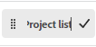

# 固定页面以自定义工作区

您可以将最重要的工作固定在 [!DNL Adobe Workfront] 实现更高的可见性、更好的组织和更快的访问。 固定页面始终可从Workfront中任何页面的顶部访问。

您可能会被分配到已固定页面的布局模板（如中所述） [使用布局模板自定义固定页面](../../administration-and-setup/customize-workfront/use-layout-templates/customize-pinned-pages.md))。 无法重命名或移除这些预定义的大头针。 任何页面都会显示在预定义图钉的右侧。

## 访问要求

您必须具有以下权限才能执行本文中的步骤：

<table style="table-layout:auto"> 
 <col> 
 </col> 
 <col> 
 </col> 
 <tbody> 
  <tr> 
   <td role="rowheader"><strong>[!DNL Adobe Workfront] 计划*</strong></td> 
   <td> 
任何
 </td> 
  </tr> 
  <tr> 
   <td role="rowheader"><strong>[!DNL Adobe Workfront] 许可证*</strong></td> 
   <td> 
[！UICONTROL Request]或更高版本
 </td> 
  </tr> 
 </tbody> 
</table>

&#42;要了解您的计划或许可证类型，请联系贵机构的 [!DNL Workfront] 管理员。

## 用 pin 钉住某一页

1. 转到要固定的页面。

   这可以是任何工作项，如项目、任务、请求队列等。

1. 单击 **[!UICONTROL 用pin钉住当前页]** 页面顶部的。

   现在，可以从中任何页面的顶部访问固定页面 [!DNL Workfront].

## 访问固定页面

1. 在任意页面的顶部，单击要查看的固定页面。

   >[!TIP]
   >
   >将鼠标悬停在固定页面上可查看全名和描述。

   或

   如果您已固定多个页面，则可能需要单击 **[!UICONTROL 更多] 菜单**  以查看其他固定页面。

   此时将显示固定页面。

## 重命名固定页面

您可以更改固定页面的名称，使其对您更有意义。

1. 将鼠标悬停在顶部导航中的固定页面上，或者 **[!UICONTROL 更多菜单]**.
1. 单击大头针名称旁边的箭头并选择 **[!UICONTROL 重命名图钉]**.

   

1. 键入新的pin名称，然后单击复选标记图标或按Enter键。

   

   单击复选标记或按Enter键后，会出现一个小弹出窗口，持续几秒钟，允许您在保存大头针名称之前撤消更改。

## 重新排列固定页面

您可以重新排列固定页面的显示顺序。

1. 将鼠标悬停在顶部导航中的固定页面上，或者 **[!UICONTROL 更多菜单]**. 当看到手形光标时，单击并将固定拖动到所需的顺序。

   您的更改会自动保存，并在您下次访问Workfront时记住这些更改。

## 删除固定页面

1. 单击要取消固定的固定页面。
1. 单击 **[!UICONTROL 取消置顶当前页面]** 在屏幕顶部。

   或

   单击大头针名称旁边的箭头并选择 **[!UICONTROL 移除图钉]**.

   

   无法再从中任何页面的顶部访问该页面 [!DNL Workfront].
