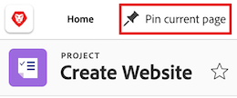

# 固定页面以自定义工作区

<!-- Audited: 4/2025 -->

您可以将最重要的工作固定在[!DNL Adobe Workfront]中，以提高可见性、改善组织并加快访问速度。 固定页面始终可从Workfront中任何页面的顶部访问。

您可能会被分配到已固定页面的布局模板（如[使用布局模板自定义固定页面](../../administration-and-setup/customize-workfront/use-layout-templates/customize-pinned-pages.md)中所述）。 无法重命名或移除这些预定义的大头针。 任何页面都会显示在预定义图钉的右侧。

## 访问要求

+++ 展开以查看本文中各项功能的访问要求。

您必须具有以下权限才能执行本文中的步骤：

<table style="table-layout:auto"> 
 <col> 
 </col> 
 <col> 
 </col> 
 <tbody> 
  <tr> 
   <td role="rowheader"><strong>[!DNL Adobe Workfront] 计划</strong></td> 
   <td> 
任何
 </td> 
  </tr> 
  <tr> 
   <td role="rowheader"><strong>[!DNL Adobe Workfront] 许可证</strong></td> 
   <td> 
新：参与者
 
   
或

     
当前：请求

   </td> 
  </tr> 
 </tbody> 
</table>

有关此表中信息的更多详细信息，请参阅Workfront文档中的[访问要求](/help/quicksilver/administration-and-setup/add-users/access-levels-and-object-permissions/access-level-requirements-in-documentation.md)。

+++

## 用 pin 钉住某一页

1. 导航到要固定的页面。 这可以是任何工作项，如项目、任务、请求队列等。

1. 在页面的左上角，单击&#x200B;**[!UICONTROL 固定当前页面]**。 现在可从[!DNL Workfront]中任何页面的顶部访问固定页面。

   

## 访问固定页面

1. 在任意页面的顶部，单击要查看的固定页面。

   >[!TIP]
   >
   >将鼠标悬停在固定页面上可查看全名和描述。

   或

   如果固定了多个页面，请单击&#x200B;**[!UICONTROL 更多]**&#x200B;图标以查看其他固定页面。

   

   此时将显示固定页面。

## 重命名固定页面

1. 在顶部导航中，将鼠标悬停在固定页面上。
1. 单击pin名称旁边显示的&#x200B;**更多**&#x200B;图标，然后选择&#x200B;**[!UICONTROL 重命名pin]**。

   

1. 键入新的pin名称，然后单击&#x200B;**保存**。

   

## 重新排列固定页面

您可以重新排列固定页面的显示顺序。

1. 将鼠标悬停在要移动的固定页面上，然后单击&#x200B;**更多**&#x200B;图标。
1. 选择&#x200B;**向左移动**&#x200B;或&#x200B;**向右移动**&#x200B;以移动您的pin。
1. （可选）选择&#x200B;**移到前面**&#x200B;将大头针移到大头针栏的最左位置。

   

   您的更改会自动保存，并在您下次访问Workfront时记住这些更改。

## 删除固定页面

1. 单击要删除的pin旁边的&#x200B;**更多**&#x200B;图标。
1. 单击&#x200B;**删除pin**。 无法再从[!DNL Workfront]中任何页面的顶部访问该页面。

   

