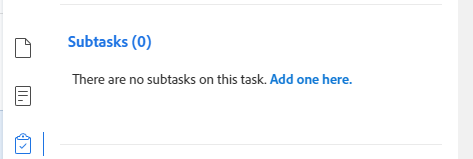

# [!UICONTROL 摘要]概述

<!--The highlighted information on this page refers to functionality not yet generally available. It is available only in the Preview environment for all customers or in Production for customers who enabled fast releases. 

For information about fast releases, see [Enable or disable fast releases for your organization](/help/quicksilver/administration-and-setup/set-up-workfront/configure-system-defaults/enable-fast-release-process.md).

For information about the current release schedule, see [Second Quarter 2024 release overview](/help/quicksilver/product-announcements/product-releases/24-q2-release-activity/24-q2-release-overview.md). -->

您可以使用[!UICONTROL 摘要]面板直接从任务、问题、文档的列表或显示任务和问题的[!DNL Adobe Workfront]的其他区域查看和更新工作项信息。

您的Workfront或组管理员可以修改“摘要”面板中显示的区域和字段。 他们最多可以向“摘要”面板添加16个字段。

>[!IMPORTANT]
>
>我们建议您将必须经常更新的字段添加到“摘要”面板，这样您便可以轻松访问和更新它们，而无需访问对象的主页。
>
>例如，您可以将以下经常更新的字段添加到任务和问题“摘要”面板：
>
>* 状态
>* 完成百分比
>* 承诺日期
>* 规划完成日期
>* 条件

下表显示您可以查找和使用[!UICONTROL 摘要]面板的区域：

<table style="table-layout:auto"> 
 <col data-mc-conditions=""> 
 <tbody> 
  <tr> 
   <td><b>任务</b></td> 
  </tr> 
  <tr> 
   <td> 
中的任务列表
 
    <ul> 
     <li>项目</li> 
     <li>子任务</li> 
    </ul> </td> 
  </tr> 
  <tr> 
   <td>[！UICONTROL工作负载均衡器]的[！UICONTROL未分配]和[！UICONTROL已分配]工作区域中的任务</td> 
  </tr> 
   <tr> 
   <td>[！UICONTROL时间表]中的任务</td> 
  </tr> 
  <tr data-mc-conditions=""> 
   <td><b>问题</b></td> 
  </tr> 
  <tr data-mc-conditions=""> 
   <td> 
中的问题列表
 
    <ul> 
     <li>项目</li> 
     <li>任务</li> 
     <li>子任务</li> 
    </ul> </td> 
  </tr> 
  <tr data-mc-conditions=""> 
   <td>[！UICONTROL工作负载均衡器]的[！UICONTROL已分配工作]区域出现问题</td> 
  </tr> 
  <tr data-mc-conditions=""> 
   <td>[！UICONTROL请求]区域的[！UICONTROL已提交]部分中的问题</td> 
  </tr> 
</tr> 
   <tr> 
   <td>[！UICONTROL时间表]中的问题</td> 
  </tr>

<tr data-mc-conditions=""> 
   <td><b>文档</b></td> 
  </tr> 
  <tr data-mc-conditions=""> 
   <td>[！UICONTROL文档]区域</td> 
  </tr> 
  <tr data-mc-conditions=""> 
   <td>任何对象（项目、任务、问题、项目、项目组合、模板、模板任务、用户）的[！UICONTROL文档]部分</td> 
  </tr> 
 </tbody> 
</table>

<!--

Workfront administrators can customize the Summary in the Layout Template. For more information, see <a href="../../administration-and-setup/customize-workfront/use-layout-templates/create-and-manage-layout-templates.md" class="MCXref xref">Create and manage layout templates</a>.

-->

本文介绍如何访问和使用[!UICONTROL 摘要]面板处理列表中的任务和问题。

有关访问[!UICONTROL 工作负载均衡器]中的[!UICONTROL 摘要]的信息，请参阅[使用[!UICONTROL 摘要]更新[!UICONTROL 工作负载均衡器]](../../resource-mgmt/workload-balancer/update-items-in-summary-panel-in-workload-balancer.md)中的工作项。

有关访问文档[!UICONTROL 摘要]的信息，请参阅文档概述[[!UICONTROL 的]摘要](../../documents/managing-documents/summary-for-documents.md)。

## 在任务或问题列表中查看[!UICONTROL 摘要]面板

1. 转到任务或问题，然后在列表中选择一个项目。
1. 单击&#x200B;**[!UICONTROL 摘要]**&#x200B;图标

   或

   单击&#x200B;**[!UICONTROL 请求]**&#x200B;区域的已提交[!UICONTROL 部分中的]打开摘要[!UICONTROL 图标]。

   打开“摘要”后，在单击或选择其他任务或问题时，它保持打开状态，直到手动关闭它为止。

   >[!TIP]
   >
   >一次只能选择一个任务或一个问题，以便在[!UICONTROL 摘要]面板中查看其详细信息。

   

1. （可选）要关闭[!UICONTROL 摘要]面板，请执行下列操作之一：

   * 在任务或问题列表中，单击&#x200B;**[!UICONTROL 打开摘要]**&#x200B;图标

     或

     单击&#x200B;**摘要**&#x200B;面板右上角的[!UICONTROL X]图标。

   * 在[!UICONTROL 请求]区域的[!UICONTROL 已提交]部分中，单击&#x200B;**[!UICONTROL 关闭摘要]**&#x200B;图标

     或

     单击摘要面板右上角的&#x200B;**X**&#x200B;图标。

## 已完成[!UICONTROL 百分比]

使用[!UICONTROL 摘要]顶部的进度蓝色气泡更新您选择的任务或问题的完成百分比。 输入一个数字或将气泡拖到正确的百分比上。

在“摘要”面板中拖放气泡时，“完成百分比”会以一点为单位进行更新。 不能输入十进制数。

摘要面板中的完成百分比

## [!UICONTROL 更新]

使用[!UICONTROL 摘要]的[!UICONTROL 更新]部分查看最近的更新并对您选择的任务或问题进行更新。 单击&#x200B;**[!UICONTROL 查看全部]**&#x200B;直接转到任务的[!UICONTROL 更新]选项卡。

摘要面板中的

## [!UICONTROL 文档]

使用[!UICONTROL 摘要]的[!UICONTROL 文档]部分查看附加到所选任务或问题的文档。 单击缩略图以打开文档预览。 要直接转到任务或问题上的[!UICONTROL 文档]选项卡，请单击&#x200B;**[!UICONTROL 文档]**&#x200B;标题。

摘要面板中的

## [!UICONTROL 详细信息]

使用[!UICONTROL 摘要]的[!UICONTROL 详细信息]部分查看高级别工作项详细信息、进行分配或添加开始日期。 单击&#x200B;**[!UICONTROL 查看全部]**&#x200B;直接转到任务或问题上的[!UICONTROL 详细信息]选项卡。

摘要面板中的

## [!UICONTROL 子任务]

此部分仅适用于任务。 使用[!UICONTROL 摘要]的[!UICONTROL 子任务]部分查看所选任务的[!UICONTROL 新]、[!UICONTROL 进行中]和[!UICONTROL 已关闭的]子任务。 单击&#x200B;**[!UICONTROL 状态]**&#x200B;下拉菜单可在状态之间切换。 要直接转到任务的[!UICONTROL 子任务]选项卡，请单击&#x200B;**[!UICONTROL 子任务]**&#x200B;标&#x200B;题。

如果尚未向任务添加任何子任务，请单击&#x200B;**[!UICONTROL 在此处添加一个]**&#x200B;直接转到任务的[!UICONTROL 子任务]选项卡。

摘要面板中的

## [!UICONTROL 小时]

使用[!UICONTROL 摘要]的[!UICONTROL 小时]部分来记录所选任务或问题的小时数。 单击&#x200B;**[!UICONTROL 记录时间]**&#x200B;并输入您的小时数。 要直接转到任务或问题的小时选项卡，请单击&#x200B;**[!UICONTROL 小时]**&#x200B;标题。

[!UICONTROL 摘要]中的小时数显示您记录的小时数。 其他用户在[!UICONTROL 摘要]中的小时总数将有所不同，具体取决于他们登录该任务的时间。

如果任务或问题中没有计划的[!UICONTROL 小时]，并且您已记录时间，则小时栏显示红色。

摘要面板中的

## 审批

使用[!UICONTROL 摘要]的[!UICONTROL 审批]部分查看附加到所选任务或问题的审批。 如果您尚未添加任何审批，请从下拉菜单中选择现有审批，或单击&#x200B;**[!UICONTROL 创建一次性审批流程]**&#x200B;直接转到任务或问题上的[!UICONTROL 审批]选项卡。

要直接转到任务或问题上的[!UICONTROL 审批]选项卡，请单击&#x200B;**[!UICONTROL 审批]**&#x200B;标题。

摘要面板中的
