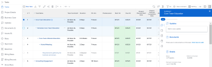

# [!UICONTROL 概要] 概述

您可以使用 [!UICONTROL 概要] 直接从任务问题、文档或其他领域的任务列表中审阅和更新工作项信息的小组 [!DNL Adobe Workfront] 显示任务和问题。

下表显示了可找到和使用 [!UICONTROL 概要] 面板：

<table style="table-layout:auto"> 
 <col data-mc-conditions=""> 
 <tbody> 
  <tr> 
   <td>任务</td> 
  </tr> 
  <tr> 
   <td> 
任务列表
 
    <ul> 
     <li>项目</li> 
     <li>子任务</li> 
    </ul> </td> 
  </tr> 
  <tr> 
   <td>[!UICONTROL未分配]和[!UICONTROL已分配]工作区中的任务 [!DNL Workload Balancer]</td> 
  </tr> 
  <tr data-mc-conditions=""> 
   <td>问题</td> 
  </tr> 
  <tr data-mc-conditions=""> 
   <td> 
中的问题列表
 
    <ul> 
     <li>项目</li> 
     <li>任务</li> 
     <li>子任务</li> 
    </ul> </td> 
  </tr> 
  <tr data-mc-conditions=""> 
   <td>在 [!DNL Workload Balancer]</td> 
  </tr> 
  <tr data-mc-conditions=""> 
   <td>[!UICONTROL请求]区域的[!UICONTROL Submitted]部分中的问题</td> 
  </tr> 
  <tr data-mc-conditions=""> 
   <td>文档</td> 
  </tr> 
  <tr data-mc-conditions=""> 
   <td>[!UICONTROL Documents]区域</td> 
  </tr> 
  <tr data-mc-conditions=""> 
   <td>任何对象（项目、任务、问题、程序、组合、模板、模板任务、用户）的[!UICONTROL Documents]部分</td> 
  </tr> 
 </tbody> 
</table>

<!--

Workfront administrators can customize the Summary in the Layout Template. For more information, see <a href="../../administration-and-setup/customize-workfront/use-layout-templates/create-and-manage-layout-templates.md" class="MCXref xref">Create and manage layout templates</a>.

-->

本文介绍了如何访问和使用 [!UICONTROL 概要] 列表中任务和问题的面板。

有关访问 [!UICONTROL 概要] 在 [!DNL Workload Balancer]，请参阅 [更新 [!DNL Workload Balancer] 使用 [!UICONTROL 概要]](../../resource-mgmt/workload-balancer/update-items-in-summary-panel-in-workload-balancer.md).

有关访问 [!UICONTROL 概要] 有关文档，请参阅 [[!UICONTROL 概要] 文档概述](../../documents/managing-documents/summary-for-documents.md).

## 访问要求

您必须具有以下访问权限才能执行本文中的步骤：

<table style="table-layout:auto"> 
 <col> 
 <col> 
 <tbody> 
  <tr> 
   <td role="rowheader"><strong>[!DNL Adobe Workfront] 计划*</strong></td> 
   <td> 
任意
 </td> 
  </tr> 
  <tr> 
   <td role="rowheader"><strong>[!DNL Adobe Workfront] 许可证*</strong></td> 
   <td> 
[!UICONTROL请求]或更高版本
 </td> 
  </tr> 
  <tr> 
   <td role="rowheader"><strong>访问级别配置*</strong></td> 
   <td> 
[!UICONTROL视图]或更高版本对任务、问题、文档的访问权限
 
[!UICONTROL View]或对要查看其文档的任何对象的更高访问权限[!UICONTROL Summary]
 
注意：如果您仍无权访问，请咨询您的 [!DNL Workfront] 管理员。 有关如何 [!DNL Workfront] 管理员可以修改您的访问级别，请参阅 <a href="../../administration-and-setup/add-users/configure-and-grant-access/create-modify-access-levels.md" class="MCXref xref">创建或修改自定义访问级别</a>.
 </td> 
  </tr> 
  <tr> 
   <td role="rowheader"><strong>对象权限</strong></td> 
   <td> 
[!UICONTROL视图]或对任务、问题或文档的更高权限
 
有关请求其他访问权限的信息，请参阅 <a href="../../workfront-basics/grant-and-request-access-to-objects/request-access.md" class="MCXref xref">请求对对象的访问 </a>.
 </td> 
  </tr> 
 </tbody> 
</table>

&#42;要了解您拥有的计划、许可类型或访问权限，请联系您的 [!DNL Workfront] 管理员。

## 查看 [!UICONTROL 概要] 任务或问题列表中的面板

1. 转到任务或问题，然后在列表中选择项目。
1. 单击 **[!UICONTROL 概要]** 图标 

   或

   单击 **[!UICONTROL 打开摘要]** 图标  在 [!UICONTROL 已提交] 部分 [!UICONTROL 请求] 的上界。

   打开摘要后，当您单击或选择其他任务或问题时，该摘要会保持打开状态，并保持打开状态，直到您手动关闭它为止。

   >[!TIP]
   >
   >您一次只能选择一个任务或一个问题，以在 [!UICONTROL 概要] 的上界。

   

1. （可选）要关闭 [!UICONTROL 概要] 面板中，执行以下操作之一：

   * 在任务或问题列表中，单击 **[!UICONTROL 打开摘要]** 图标 

      或

      单击 **X** 图标 [!UICONTROL 概要] 的上界。

   * 在 [!UICONTROL 已提交] 部分 [!UICONTROL 请求] 区域，单击 **[!UICONTROL 关闭摘要]** 图标 

      或

      单击 **X** 图标。

## [!UICONTROL 完成百分比]

使用 [!UICONTROL 概要] 更新您选择的任务或问题的完成百分比。 输入一个数字或将条形图拖动到正确的百分比。

## [!UICONTROL 更新]

使用 [!UICONTROL 更新] 部分 [!UICONTROL 概要] 查看最近的更新并更新您选择的任务或问题。 单击 **[!UICONTROL 查看全部]** 直接转到 [!UICONTROL 更新] 选项卡。

## [!UICONTROL 文档]

使用 [!UICONTROL 文档] 部分 [!UICONTROL 概要] 查看附加到所选任务或问题的文档。 单击缩略图以打开文档预览。 直接转到 [!UICONTROL 文档] 选项卡，单击 **[!UICONTROL 文档]** 标题。

## [!UICONTROL 详细信息]

使用 [!UICONTROL 详细信息] 部分 [!UICONTROL 概要] 查看高级工作项详细信息、进行分配或添加开始日期。 单击 **[!UICONTROL 查看全部]** 直接转到 [!UICONTROL 详细信息] 选项卡。

>[!NOTE]
>
>此部分中显示的字段与主页右侧面板中显示的字段相同。 您可以自定义这些字段 [自定义 [!UICONTROL 主页] 和 [!UICONTROL 概要] 使用布局模板](../../administration-and-setup/customize-workfront/use-layout-templates/customize-home-summary-layout-template.md).

## [!UICONTROL 子任务]

此部分仅适用于任务。 使用 [!UICONTROL 子任务] 部分 [!UICONTROL 概要] 查看 [!UICONTROL 新建], [!UICONTROL 正在进行]和 [!UICONTROL 已关闭] 所选任务的子任务。 单击 **[!UICONTROL 状态]** 下拉菜单进行切换。 直接转到 [!UICONTROL 子任务] ，单击 **[!UICONTROL 子任务]**&#x200B;标题。

如果尚未向任务添加任何子任务，请单击 **[!UICONTROL 在此处添加一个]** 直接转到 [!UICONTROL 子任务] 选项卡。

## [!UICONTROL 小时]

使用 [!UICONTROL 小时] 部分 [!UICONTROL 概要] 记录所选任务或问题的小时数。 单击 **[!UICONTROL 日志时间]** 然后输入您的小时数。 要直接转到任务或问题的“小时”选项卡，请单击 **[!UICONTROL 小时]** 标题。

中的小时计数 [!UICONTROL 概要] 显示您记录的小时数。 其他用户在 [!UICONTROL 概要] 取决于他们登录任务的时间。

如果没有计划 [!UICONTROL 小时] 在任务或问题上，如果您已记录时间，则“小时”栏将显示红色。

## 审批

使用 [!UICONTROL 批准] 部分 [!UICONTROL 概要] 查看附加到所选任务的批准或发出。 如果尚未添加任何批准，请从下拉菜单中选择现有批准，或单击 **[!UICONTROL 创建一次性审批流程]** 直接转到 [!UICONTROL 批准] 选项卡。

直接转到 [!UICONTROL 批准] 选项卡，单击 **[!UICONTROL 批准]** 标题。

