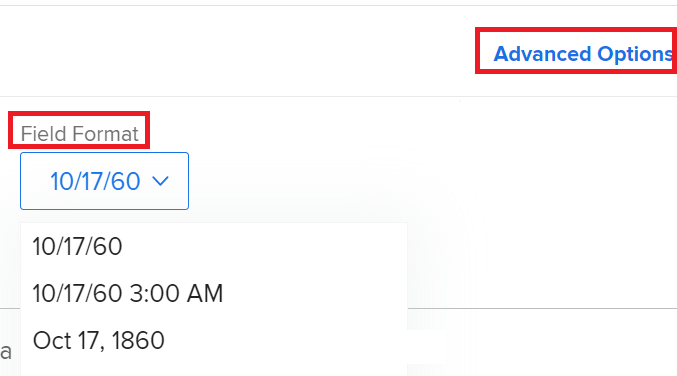

# 在中更改日期格式 [!DNL Adobe Workfront]

<!--this article used to be called "Change the date format in Adobe Workfront when using Chrome". The team decieded to make it more generic and hide the steps. Also see drafted content below-->

您可以在以下位置更改日期的日期格式 [!DNL Adobe Workfront]，例如 [!UICONTROL 计划完成日期]， [!UICONTROL 实际完成日期]，或 [!UICONTROL 预计完成日期].

例如，您可以将日期格式从 _DD/MM/YYYY_ 到 _MM/DD/YYYY_ 反之亦然。
或者，您也可以将日期格式从 _MM/DD/YY_ 到 _YYYY年M月DD_.

您可以在Workfront中通过下列方式更改日期格式，具体取决于要查看的更改以及您希望在何处查看更改。

* 要更改中所有页面的所有日期格式，请执行以下操作： [!DNL Workfront] 根据您的位置和语言，您必须更改浏览器中的语言设置。

  例如，如果将浏览器中的默认语言设置为 *[!UICONTROL 英语（美国）]*&#x200B;时，日期将以下列格式显示：

   * MM/DD/YYYY
   * YYYY年M月DD

  要更改中的语言设置，请执行以下操作 [!DNL Chrome] 或任何其他浏览器，您必须修改该浏览器的设置。 修改浏览器设置的步骤因浏览器而异。 请参阅浏览器的 [!UICONTROL 帮助]， [!UICONTROL 偏好设置]，或 [!UICONTROL 设置] 区域，以了解如何修改其设置。

* 要仅更改报告和视图中的日期格式，您必须更新 [!UICONTROL 字段格式] 在中设置 [!UICONTROL 高级选项] 在构建报表或视图时，显示列的区域。 这不会根据位置或语言修改日期格式。 它修改同一位置或语言上下文中的日期格式。

  

  有关更多信息，请参阅 [创建自定义报表](../../reports-and-dashboards/reports/creating-and-managing-reports/create-custom-report.md).

* 要更改整个组织所有传出电子邮件通知中的日期格式，必须更新 [!UICONTROL 默认电子邮件区域设置] 在中设置 [!UICONTROL 客户信息] 区域位于 [!UICONTROL 设置].

  

  有关更多信息，请参阅 [配置系统的基本信息](../../administration-and-setup/get-started-wf-administration/configure-basic-info.md).

* 要更改单个用户所有传出电子邮件通知中所有日期的格式，您必须更新 [!UICONTROL 电子邮件区域设置] 在中设置 [!UICONTROL 编辑人员] 框，编辑用户的配置文件时。

  

  有关更多信息，请参阅 [编辑用户配置文件](../../administration-and-setup/add-users/create-and-manage-users/edit-a-users-profile.md).

<!--drafted because we should not document steps for a third-party application

To change your language settings in Chrome:

1. Click the 3-dots in the top right corner of your Chrome interface, then click **Settings**.
1. On the left area of the Settings page, expand **Advanced**, then click **Languages**.  
   Or  
   Search for *language*&nbsp;at the top of the Settings page, then click **Languages**.

1. In the **Language** list, locate the language and region that use your preferred date format.

   **Example:** If you speak English and you want the date format to be MM/DD/YYYY, you would select **English (United States)**. If you speak English and you want the date format to be DD/MM/YYY, you would select **English (United Kingdom)**.

1. (Conditional) If the language and region you want to use are not visible in the list, click **Add languages** to add it to the list.
1. Click the 3-dot menu next to the language and region you want to use, then click **Move to the top**.
1. Return to the Workfront interface, then refresh the page.  
   The date format is now updated in projects and other areas of Workfront that use MM/DD/YYYY or DD/MM/YYYY format when displaying dates.

   -->
