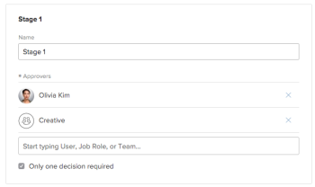

# 重复审批流程显示在[!UICONTROL 主页工作列表]中

## 问题

您在[!UICONTROL 主页工作列表]中看到多个相同的批准。

## 原因

您已被指定为单个用户和团队成员，接受了批准。

## 解决方案

设置审批流程的用户应确保添加到审批流程的任何个人用户不是分配给审批流程的任何团队的成员。

如果您被分配为单个用户和团队成员，并且两次看到批准消息，则您需要仅对其中一个条目做出决定。
