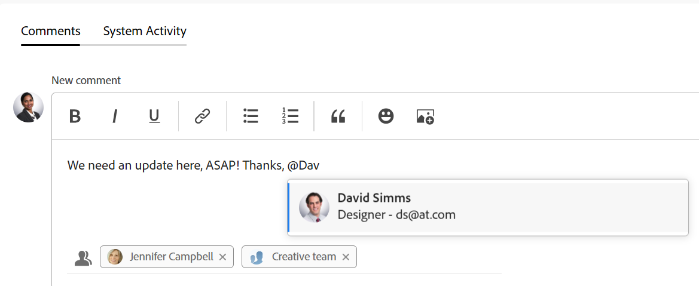

# 为其他人标记更新

<!--take "Beta" references out when we remove the beta-->

此页面上高亮显示的信息是指尚未公开发布的功能。 它仅在“预览”环境中可用。

>[!NOTE]
>
>我们目前正在重新设计Adobe Workfront中的评论体验。
>
>有关新评论体验的更多信息，请参阅 [新的评论体验](../../product-announcements/betas/new-commenting-experience-beta/unified-commenting-experience.md).
>
>您可以访问以下对象的新体验：
> * 问题， 项目、任务和文档.
>
>     当您启用备注测试版体验时，该选项可用。
>
>     此功能仅适用于“更新”部分，不适用于以下区域：
>
>     * 主页
>     * 列表中的摘要面板
>     * 时间表中的“摘要”面板
>
> * 讨论区中的目标、信息卡
>
>   新的评论体验是目标和信息卡的唯一体验。 您必须拥有其他许可证才能访问Workfront目标。 有关更多信息，请参阅 [使用Workfront目标的要求](../../workfront-goals/goal-management/access-needed-for-wf-goals.md).
>
>     在信息卡上启用“注释”和“系统活动”部分时，您可以在“信息卡”区域中添加和查看信息卡的更新。 有关更多信息，请参阅 [向展示板添加临时信息卡](../../agile/get-started-with-boards/add-card-to-board.md).

在更新对象时，如果您希望吸引用户注意他们可能未关注的对象，则可以标记用户。
您可以在更新中标记这些用户，以便与他们共享，而不是通过将这些用户分配给对象或让他们订阅对象来将这些用户包括在对象中。 标记的用户会收到有关您输入的更新的通知。

>[!NOTE]
>
>用户必须在个人资料中启用个人通知，以便接收电子邮件通知。 有关更多信息，请参阅 [激活或停用您自己的事件通知](../../workfront-basics/using-notifications/activate-or-deactivate-your-own-event-notifications.md).
>

有关向Workfront对象添加更新的信息，请参阅 [更新工作](../../workfront-basics/updating-work-items-and-viewing-updates/update-work.md).

>[!NOTE]
>
>当问题转换为项目或任务时，更新将会复制到新项目或任务，但标记的用户不会。 要继续对话，必须再次标记参与者。

## 访问要求

您必须具有以下权限才能执行本文中的步骤：

<table style="table-layout:auto"> 
 <col> 
 </col> 
 <col> 
 </col> 
 <tbody> 
  <tr> 
   <td role="rowheader"><strong>Adobe Workfront计划*</strong></td> 
   <td> 
任意
 </td> 
  </tr> 
  <tr> 
   <td role="rowheader"><strong>Adobe Workfront许可证*</strong></td> 
   <td> 
对于问题和文档，请求或更高版本；对于所有其他对象，审阅或更高版本
 </td> 
  </tr> 
  <tr> 
   <td role="rowheader"><strong>访问级别配置*</strong></td> 
   <td> 
问题和文档的请求者或更高；所有其他对象的查看者或更高
 
   
<b>注释</b>

如果您仍然没有访问权限，请咨询Workfront管理员是否对您的访问级别设置了其他限制。 有关Workfront管理员如何修改您的访问级别的信息，请参阅 <a href="../../administration-and-setup/add-users/configure-and-grant-access/create-modify-access-levels.md" class="MCXref xref">创建或修改自定义访问级别</a>.
 </td>
</tr> 
  <tr> 
   <td role="rowheader"><strong>对象权限</strong></td> 
   <td> 
查看对对象的访问权限
 
有关请求其他访问权限的信息，请参阅 <a href="../../workfront-basics/grant-and-request-access-to-objects/request-access.md" class="MCXref xref">请求访问对象 </a>.
 </td> 
  </tr> 
 </tbody> 
</table>

*要了解您拥有什么计划、许可证类型或访问权限，请与Workfront管理员联系。

## 为其他人标记更新

根据您选择的体验和对象，在更新中为其他人添加标签会有所不同。

### 在当前更新部分中标记其他人的更新

1. 开始更新工作项，如中所述 [更新工作](../../workfront-basics/updating-work-items-and-viewing-updates/update-work.md).
1. 在 **通知** 字段中，开始键入要包含的用户或团队的名称，然后在名称出现在下拉列表中时单击该名称。

   或

   在“ ”中键入@符号 **开始新的更新** 区域，开始键入要包括在更新中的用户或团队的名称，然后在该名称出现在下拉列表中时单击该名称。

   >[!TIP]
   >
   >当存在具有相似或相同名称的用户时，要识别正确的用户，请注意头像、用户的主要角色或其电子邮件地址。 用户必须与至少一个工作角色关联，才能在更新中标记这些用户时查看这些工作角色。

   

1. （可选）要将更新设为私有，请启用 **我的公司私有** 更新框的右下角。 这使更新仅对您公司中的用户可见。 此 **我的公司私有** 选项仅在您的Workfront配置文件中指定了公司时才可用。

   >[!NOTE]
   >
   >公司外部的已标记用户仍可能会收到应用程序内通知或电子邮件，即使他们不会在“更新”选项卡上看到私人评论。 如果不想与外部用户共享信息，我们建议不要在更新时标记这些用户。

1. （可选）要添加多个用户和团队，请重复步骤2。

   >[!NOTE]
   >
   >在“通知”字段中列出的所有用户和团队成员都会收到更新的应用程序内通知，并且可能会收到一封电子邮件，具体取决于其电子邮件通知设置的配置。 在评论或回复中标记自己的用户会收到该评论或回复的通知，并可以在会话剩余时间的Notify字段中看到其名称，但除非他们再次标记自己，否则不会收到其他通知。 有关更多信息，请参阅 [激活或停用您自己的事件通知](../../workfront-basics/using-notifications/activate-or-deactivate-your-own-event-notifications.md) 和 [为系统中的每个人配置事件通知](../../administration-and-setup/manage-workfront/emails/configure-event-notifications-for-everyone-in-the-system.md).

1. 单击 **更新**.\
   更新中包含的用户会被自动授予对象的“查看”权限，并可以查看和响应对象所做的更新。

   您可以在更新线程的顶部查看每个回复中已标记的人员。 这些用户以及订阅了对象的任何用户将在对对象进行更新或回复时收到通知。

   

   有关更新工作项时可用的附加功能的信息，请参阅 [更新工作](../../workfront-basics/updating-work-items-and-viewing-updates/update-work.md).

### 在评论Beta版体验的更新中为其他人添加标签

您可以在评论Beta版体验中为其他人标记更新。 您还可以在编辑评论时删除被错误地标记的用户。

1. 开始更新工作项，如中所述 [更新工作](../../workfront-basics/updating-work-items-and-viewing-updates/update-work.md).
1. 在 **标记人员或团队** 字段中，开始键入要包含的用户或团队的名称，然后在名称出现在下拉列表中时单击该名称。

   或

   在“ ”中键入@符号 **编写评论** 区域，开始键入要包括在更新中的用户或团队的名称，然后在该名称出现在下拉列表中时单击该名称。

   >[!TIP]
   >
   >当存在具有相似或相同名称的用户时，要识别正确的用户，请注意头像、用户的主要角色或其电子邮件地址。 用户必须与至少一个工作角色关联，才能在更新中标记这些用户时查看这些工作角色。

   

1. （可选）要将更新设为私有，请启用 **我的公司私有** 更新框的右下角。 这使更新仅对您公司中的用户可见。 此 **我的公司私有** 选项仅在您的Workfront配置文件中指定了公司时才可用。

   >[!NOTE]
   >
   >* 仅当用户与公司关联时，才会显示此选项。
   >* 公司外部的已标记用户仍可能会收到应用程序内通知或电子邮件，即使他们不会在“更新”选项卡上看到私人评论。 如果不想与外部用户共享信息，我们建议不要在更新时标记这些用户。

1. （可选）要添加多个用户和团队，请重复步骤2。 <!--insure this stays accurate-->

   >[!NOTE]
   >
   >“标记人员或团队”字段中列出的所有用户和团队成员都会收到更新的应用程序内通知，并且可能会收到一封电子邮件，具体取决于其电子邮件通知设置的配置。 在评论或回复中标记自己的用户会收到该评论或回复的通知，并且可以在中看到其名称作为会话剩余部分会话的成员列出，但是除非他们再次标记自己，否则不会收到其他通知。 有关更多信息，请参阅 [激活或停用您自己的事件通知](../../workfront-basics/using-notifications/activate-or-deactivate-your-own-event-notifications.md) 和 [为系统中的每个人配置事件通知](../../administration-and-setup/manage-workfront/emails/configure-event-notifications-for-everyone-in-the-system.md).

1. 单击 **提交**.\
   更新中包含的用户会被自动授予对象的“查看”权限，并可以查看和响应对象所做的更新。

   您可以在成员区域的更新文本下看到每个回复中标记了哪些人。 这些用户以及订阅了对象的任何用户将在对对象进行更新或回复时收到通知。
1. （可选）单击数字 **成员** 包含在更新中，以显示与您输入的更新共享的实体列表。

   

   有关更新工作项时可用的附加功能的信息，请参阅 [更新工作](../../workfront-basics/updating-work-items-and-viewing-updates/update-work.md).

1. （可选）单击 **更多** 菜单  单击“赞”图标右侧，然后单击 **编辑**. 删除任何已标记的用户，然后单击 **提交**. 只有在输入评论后15分钟内才能对其进行编辑。 您只能编辑添加的注释。