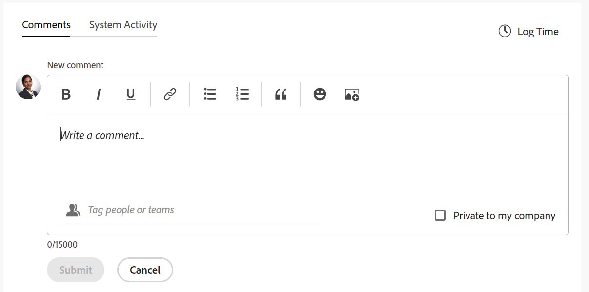

# 更新工作

<!--for the August 10 release: look for these words to see the edits: "August 10"-->

<!--take "Beta" references out when we remove the beta-->

<!--The highlighted information on this page refers to functionality not yet generally available. It is available for all customers only in the Preview environment.-->

>[!NOTE]
>
>我们当前正在重新设计Adobe Workfront中的评论体验。
>
>有关新评论体验的更多信息，请参阅 [新的评论体验](../../product-announcements/betas/new-commenting-experience-beta/unified-commenting-experience.md).
>
>您可以访问以下对象的新体验：
> * 问题、项目、任务和文档。
>
>     当您启用备注测试版体验时，该选项可用。
>
>     此功能仅适用于更新部分，不适用于以下区域：
>
>     * 主页
>     * 列表中的摘要面板
>     * 时间表中的“摘要”面板
>
> * 讨论区中的目标、信息卡
>
>   新的评论体验是目标和信息卡的唯一体验。 您必须具有其他许可证才能访问Workfront目标。 有关更多信息，请参阅 [使用Workfront Goals的要求](../../workfront-goals/goal-management/access-needed-for-wf-goals.md).
>
>     在信息卡上启用“注释”和“系统活动”部分时，您可以在“信息卡”区域中添加和查看信息卡的更新。 有关更多信息，请参阅 [向展示板添加临时信息卡](../../agile/get-started-with-boards/add-card-to-board.md).

## 有关更新工作的注意事项

* 您可以在“更新”部分向Adobe Workfront中的大多数对象添加注释。 有关哪些对象显示“更新”部分的详细信息，请参阅 [更新部分概述](../updating-work-items-and-viewing-updates/updates-tab-overview.md).

* 您可以从与Workfront集成的其他应用程序或Workfront移动设备应用程序向Workfront对象添加注释。

  并非所有与Workfront集成的应用程序都能够向Workfront对象添加注释。

  从应用程序访问Workfront对象时，并非所有在Workfront对象的“更新”部分中可用的功能都可用于其他应用程序。 例如，在将评论从第三方应用程序添加到Workfront对象时，富文本功能或将评论设为某人的公司私密可能不可用。

* 您可以在对Workfront对象（项目、任务或问题）进行注释时传达该对象的进度。 分配或订阅了对象的用户将收到有关您更新的通知。 拥有对象查看权限的任何人都可以查看您的更新。

* 您可以标记用户以引起他们对更新的注意。 标记的用户将收到应用程序内通知以及一封有关您更新的电子邮件。

  >[!TIP]
  >
  >   在新的注释体验中，会自动标记注释所有者。 有关更多信息，请参阅 [为其他人标记更新](../../workfront-basics/updating-work-items-and-viewing-updates/tag-others-on-updates.md).
  <!--take the "in the new commenting experience" out when this is the only experience-->

* 您可以向可查看的对象添加注释，也可以以Workfront或组管理员身份登录并代表其他用户添加注释。 有关更多信息，请参阅 [以其他用户身份登录](../../administration-and-setup/add-users/create-and-manage-users/log-in-as-another-user.md).

* 您可以从Workfront的以下区域向项目、任务和问题添加更新：

   * 从Workfront对象，在更新部分
   * 从“主页”区域（针对任务和问题）
   * 从对象列表中的“摘要”面板或时间表（用于任务和问题）

本页上的信息介绍如何评论Workfront对象以及如何更新项目、任务和问题。

有关对目标进行注释的信息，请参阅 [在Adobe Workfront目标中管理目标注释](../../workfront-goals/goal-management/manage-goal-comments.md). 您必须具有其他许可证才能访问Workfront目标。

有关在“展示板”区域中对信息卡进行批注的信息，请参阅 [向展示板添加临时信息卡](../../agile/get-started-with-boards/add-card-to-board.md).

## 访问要求

<!--
drafted for P&P release:
<table style="table-layout:auto"> 
 <col> 
 </col> 
 <col> 
 </col> 
 <tbody> 
  <tr> 
   <td role="rowheader"><strong>Adobe Workfront plan*</strong></td> 
   <td> 
Any
 </td> 
  </tr> 
  <tr> 
   <td role="rowheader"><strong>Adobe Workfront license*</strong></td> 
   <td> 
Current license: Contributor or higher for issues and documents: Light or higher for all other objects
 
   Or
   
Legacy  license: Request or higher for issues and documents; Review or higher for all other objects

   </td> 
  </tr> 
  <tr> 
   <td role="rowheader"><strong>Access level configurations*</strong></td> 
   <td> 
View or Edit access for the object the update is on
 
<b>NOTE</b>
   
   If you still don't have access, ask your Workfront administrator if they set additional restrictions in your access level. For information on how a Workfront administrator can modify your access level, see <a href="../../administration-and-setup/add-users/configure-and-grant-access/create-modify-access-levels.md" class="MCXref xref">Create or modify custom access levels</a>.
 </td> 
  </tr> 
  <tr> 
   <td role="rowheader"><strong>Object permissions</strong></td> 
   <td> 
View access to the object
 
For information on requesting additional access, see <a href="../../workfront-basics/grant-and-request-access-to-objects/request-access.md" class="MCXref xref">Request access to objects </a>.
 </td> 
  </tr> 
 </tbody> 
</table>
-->
您必须具有以下权限才能执行本文中的步骤：

<table style="table-layout:auto"> 
 <col> 
 </col> 
 <col> 
 </col> 
 <tbody> 
  <tr> 
   <td role="rowheader"><strong>Adobe Workfront计划*</strong></td> 
   <td> 
任何
 </td> 
  </tr> 
  <tr> 
   <td role="rowheader"><strong>Adobe Workfront许可证*</strong></td> 
   <td> 
针对问题和文档的请求或更高请求；针对所有其他对象的查看或更高版本
 </td> 
  </tr> 
  <tr> 
   <td role="rowheader"><strong>访问级别配置*</strong></td> 
   <td> 
查看或编辑更新所在对象的访问权限
 
<b>注释</b>

如果您仍然没有访问权限，请咨询Workfront管理员是否对您的访问级别设置了其他限制。 有关Workfront管理员如何修改您的访问级别的信息，请参阅 <a href="../../administration-and-setup/add-users/configure-and-grant-access/create-modify-access-levels.md" class="MCXref xref">创建或修改自定义访问级别</a>.
 </td>
</tr> 
  <tr> 
   <td role="rowheader"><strong>对象权限</strong></td> 
   <td> 
查看对对象的访问权限
 
有关请求其他访问权限的信息，请参阅 <a href="../../workfront-basics/grant-and-request-access-to-objects/request-access.md" class="MCXref xref">请求访问对象 </a>.
 </td> 
  </tr> 
 </tbody> 
</table>

&#42;要了解您拥有的计划、许可证类型或访问权限，请联系您的Workfront管理员。

## 向工作项添加更新

<!--drafted for the commenting experience - change the NOTE at the top of the following section with every new release to other objects -->

向工作项添加更新会因更新部分的版本以及您选择的对象而异。

### 在当前更新分区中为工作项添加更新

>[!NOTE]
>
>以下功能适用于除目标和卡片之外的所有对象。 您必须具有其他许可证才能访问Workfront目标。 有关对目标进行注释的信息，请参阅 [在Adobe Workfront目标中管理目标注释](../../workfront-goals/goal-management/manage-goal-comments.md).
>
>在信息卡上启用“注释”和“系统活动”部分时，您可以在“信息卡”区域中添加和查看信息卡的更新。 有关更多信息，请参阅 [向展示板添加临时信息卡](../../agile/get-started-with-boards/add-card-to-board.md).

1. 转到要为其提供更新的工作项（如项目、任务或问题）。
1. 单击 **更新** 部分。
1. 单击 **开始新的更新，** 然后键入您的更新。
1. （可选）使用富文本或在更新中添加表情符号、链接或图像来增强内容。 欲了解更多信息，请参见 [在Workfront更新中使用富文本](#use-rich-text-in-a-workfront-update) 部分。
1. （可选）更新有关工作项的以下任何信息：

   <table style="table-layout:auto"> 
    <col> 
    <col> 
    <tbody> 
     <tr> 
      <td role="rowheader"><strong>通知</strong></td> 
      <td>确定必须收到更新通知的用户。 进行更新时，分配给或订阅对象的用户会自动收到通知。 
有关如何将其他人包含在更新中的信息，请参阅 <a href="../../workfront-basics/updating-work-items-and-viewing-updates/tag-others-on-updates.md" class="MCXref xref">为其他人标记更新</a>.
</td> 
     </tr> 
     <tr> 
      <td role="rowheader"><strong>提交日期</strong></td> 
      <td>在日期选取器中，选择您提交以完成工作项的日期。 有关提交日期的信息，请参见 <a href="../../manage-work/projects/updating-work-in-a-project/overview-of-commit-dates.md" class="MCXref xref">提交日期概述</a>.</td> 
     </tr> 
     <tr> 
      <td role="rowheader"><strong>完成情况</strong></td> 
      <td>为任务或问题选择新条件。 有关选择条件的信息，请参阅 <a href="../../manage-work/projects/updating-work-in-a-project/update-condition-for-tasks-and-issues.md" class="MCXref xref">任务和问题的更新条件</a>.</td> 
     </tr> 
     <tr> 
      <td role="rowheader"><strong>状态</strong></td> 
      <td>单击当前状态旁边的箭头，然后从下拉菜单中选择所需的状态。 有关设置状态的信息，请参阅 <a href="../../manage-work/projects/updating-work-in-a-project/update-task-status.md" class="MCXref xref">更新任务状态</a>.
更新工作项的状态不会自动更改项目的状态。 根据项目的设置方式，您可以单独更新项目状态。 有关各种项目更新类型的详细信息，请参阅 <a href="../../manage-work/projects/manage-projects/select-project-update-type.md" class="MCXref xref">选择项目更新类型 </a>.

<b>注释</b>

   当工作项处于未决批准状态时，您无法更改其状态。
</td>
   </tr> 
     <tr> 
      <td role="rowheader"><strong>完成栏</strong></td> 
      <td>（仅在任务中可用）通过将进度条滑动到所需的百分比来指示已完成工作的百分比。 您还可以双击完成栏并输入完成百分比。</td> 
     </tr> 
     <tr> 
      <td role="rowheader"><strong>我的公司私有</strong></td> 
      <td> 
禁用此选项可阻止公司外部的用户查看此更新。
 
      
<b>注释</b>

      
仅当用户与公司关联时，才会显示此选项。

      </td> 
     </tr> 
    </tbody> 
   </table>

1. 单击 **更新** 将更新添加到Workfront对象。

   >[!NOTE]
   >
   >单击后会出现一个小型弹出窗口，持续七秒 **更新**，允许您撤消更新并在发布更新之前返回到编辑窗格。 如果您关闭撤消弹出窗口、等待其消失或导航离开页面，则将发布更新。
   >
   >如果您的Workfront管理员在访问级别选择“不允许用户删除评论”设置，则无法撤消评论。 有关更多信息，请参阅 [创建和修改自定义访问级别](../../administration-and-setup/add-users/configure-and-grant-access/create-modify-access-levels.md).

1. 要回复更新，请参阅 [回复更新](../../workfront-basics/updating-work-items-and-viewing-updates/reply-to-updates.md).

### 使用备注测试版体验向工作项添加更新

有关哪些功能可用于新注释体验以及哪些对象的信息，请参阅 [新的评论体验](../../product-announcements/betas/new-commenting-experience-beta/unified-commenting-experience.md).

1. 找到要更新的对象，然后单击其名称以打开该对象的页面。
1. 单击  **更新** 在左侧面板中。
1. 启用 **评论Beta版** 在“更新”区域的右上角切换，然后单击 **同意** 在Beta协议上。 这会将更新区域切换到备注测试版体验。
此 **评论** 选项卡默认处于选中状态。
1. 开始在 **新建评论** 盒子。

   

   >[!TIP]
   >
   >在完成键入和提交评论之前导航离开更新部分，即使注销并重新登录后，页面上评论仍会以草稿模式保留。 添加到注释的任何图像也会保存在草稿中。 草稿会保存7天，之后将丢弃它们并且无法恢复。 草稿注释仅对输入它们的用户可见。

1. （可选）要撤消或重做更改，请使用以下快捷键：
   * CTRL + Z(Mac为⌘ + z)可撤消更改
   * 按CTRL + Y(对于Mac，按⌘ + y)可重做更改
1. （可选）在 **标记人员或团队** 区域，开始键入要包含在此注释中的用户或团队的名称或电子邮件，然后当其显示在列表中时将其选定。
1. （可选）使用富文本，或添加 <!--hidden for August 10: emojis,--> 链接或图像到您的更新，以增强您的内容。 欲了解更多信息，请参见 [在Workfront更新中使用富文本](#use-rich-text-in-a-workfront-update) 部分。

   >[!TIP]
   >
   >如果另一用户向您正在更新的同一项目提交评论，则会显示一条带有“新”指示器的红线，以告知您较新的评论。
   >
   >指示符仅在提交项目的评论之后显示，而不会在评论仍在撰写时显示。
   >
   >“新”指示符仅在输入新更新的用户以及当前输入更新的用户都使用新注释体验时显示。
   >

1. 单击 **添加附件** 图标  <!--replace this icon with this new one for August 10: --> 以向评论中添加图像。 必须先将映像保存在计算机上，然后才能附加映像。 <!--**************** this might be renamed to "Add image")-->

1. 单击 **提交** 将更新添加到Workfront对象。
1. （可选）要编辑评论，请单击 **更多** 菜单  点按赞”图标右侧，然后单击 **编辑**.
1. 编辑评论中的信息，添加或删除图像或删除任何已标记用户。
提交评论后，您可以在15分钟内对其进行编辑。 “已编辑”指标将添加到更新评论时显示的日期戳的左侧。

   

   >[!TIP]
   >
   >* 仅当提交原始更新时，才会生成电子邮件通知用户您的更新。 编辑更新后不会生成电子邮件。
   >* 评论旁边的日期戳是原始评论的日期，而不是上次编辑的日期。

1. （可选）单击 **回复** 要回复现有评论，请按照上述步骤4 - 8操作。 <!--(**************insure this stays accurate***********)--> 有关回复更新的信息，请参阅 [回复更新](../../workfront-basics/updating-work-items-and-viewing-updates/reply-to-updates.md).
1. （视情况而定，可选）如果其他用户添加了显示在“更新”部分的可见区域之外的注释，请单击 **视图** 蓝色内部 **新评论横幅** 在屏幕底部显示这些注释。

   

   屏幕底部会显示其他注释。

   >[!NOTE]
   >
   >   “新评论”指示器和“查看”按钮仅在输入新更新的用户以及当前查看更新分区的用户都使用新评论体验时显示。

1. （可选）单击 **点赞** 图标. 图标会随喜欢的数量而更新。
1. （有条件，可选）如果在注释中包括了其他人员，请单击更新中包括的成员数，以显示与所输入的注释共享的实体列表。

   
1. （可选）单击 **系统活动** 选项卡以查看系统记录的更新。 更新对象或其任何子级时，Workfront会生成有关该更新的注释，并将其显示在“系统活动”选项卡中。

   有关详细信息，请参阅 [更新部分概述](../updating-work-items-and-viewing-updates/updates-tab-overview.md)

   >[!TIP]
   >
   >您无法向系统更新添加注释。

## 在Workfront更新中使用富文本{#use-rich-text-in-a-workfront-update}

<!--August 10: remove this top note when we get to parity with the current version, OR change the note to mention that some options are ONLY available in the Beta version and not the current one.-->

>[!NOTE]
>
>富文本工具栏中的某些选项可能不适用于注释测试版体验。

您可以使用富文本或向其中添加各种项目（如表情符号、链接或图像）来增强更新。

1. 转到 **更新** Workfront区域，并开始键入注释。
1. （可选）要向更新添加富文本格式，请使用 **富文本** 工具栏中。 <!--on August 10, add a screen shot of the complete Rich Text bar here, before the table-->

   | **属性** | **工具栏按钮** | **Mac快捷键** | **Windows快捷键** |
   |---|---|---|---|
   | 粗体 |  | ⌘+b | Ctrl+B |
   | 斜体 |  | ⌘+i | Ctrl+I |
   | 下划线 |  | ⌘+u | Ctrl+U |
   | 超链接 |  |  要打开“创建链接”或“添加链接”框，请执行以下操作：⌘+K   在备注测试版体验中，将链接粘贴到所选文本上： ⌘+V  |  要打开创建链接或添加链接框：Ctrl+K   在备注测试版体验中，将链接粘贴到所选文本上：Ctrl+V  |
   | 项目符号列表 |  | ⌘+Shift+8 | Ctrl+Shift+8 |
   | 编号列表 |  | ⌘+Shift+7 | Ctrl+Shift+7 |
   | 块引用 |  | ⌘+Shift+9 | Ctrl+Shift+9 |
   | 表情符号 |  | ⌘+. | ⊞+. |

   要停止设置文本格式，请取消选择 **富文本** 工具栏。

   <!-- in the table above: take "Create Links" verbiage from the hyperlink when the old commenting is removed and the commenting beta is the only way to comment-->

   >[!NOTE]
   >
   >* 用户收到的包含您的更新的任何电子邮件通知中也会显示格式。
   >* 在“更新”选项卡中查看更新时，应用于电子邮件中更新的富文本格式不会显示在更新上。
   >* 如果您的组织将Workfront与Internet Explorer一起使用，则粘贴到更新中的任何格式化文本都将丢失其富文本格式，并显示为纯文本。 您可以使用富文本工具栏上的属性重新设置文本格式。
   >* 富文本格式不适用于“时间表”区域中所做的更新，也不适用于在报表中查看的注释和上一个条件对象。

1. （可选）如果要包含来自先前更新或其他来源的文本，并将它们与您自己的更新区分开来，您可以将其标记为“块引用”。 单击 **块引用** 图标  并键入要引述的文本。 带引号的文本以垂直灰色线条标记。 单击 **块引用** 图标，以返回正常格式。

   

1. （可选）向更新中添加表情符号。

   >[!NOTE]
   >
   >* Workfront不会将标点符号表情符号（例如：）替换为表情符号。
   >* 表情符号不适用于在报表中查看的“注释”和“上一个条件”对象。
   >* Workfront中的表情符号功能利用Unicode字符，因此，仅在支持Unicode代码点的浏览器和操作系统上显示。 平台、浏览器或操作系统版本与您的版本不同的用户可能无法访问相同的表情符号。
   >* 不支持的emoji由黑白框表示。
   >* Windows 7仅支持黑白表情符号。
   >* 在更新区域查看时，应用于通过电子邮件进行的更新的表情符号不会显示在更新上。

1. （可选）要添加指向其他信息源的URL链接，请执行以下操作：

   1. 在更新中要插入链接的位置单击。
   1. 在 **富文本** 工具栏，单击 **超链接** 图标 .

   1. 在 **创建链接** 框，位于下 **URL**，键入或粘贴要链接到的源的URL。

   1. 下 **要显示的文本**，键入或粘贴链接文本。
   1. 单击&#x200B;**保存**。

1. （可选）要将图像附加到更新，请根据您使用的环境执行以下操作之一：

   * 单击 **图像** 图标  并使用当前的更新体验浏览到计算机上的图像，或将图像拖到更新区域中

   或

   单击 **添加附件** 图标  使用评论Beta版体验时，和浏览到计算机上的图像。 <!--the name of the icon and the icon for it might change-->

   >[!NOTE]
   >
   >* 您的Workfront管理员必须在Workfront界面区域的更新馈送首选项部分启用添加图像功能，然后才能看到图像或添加附件图标。 有关信息，请参阅 [配置用户更新的首选项](../../administration-and-setup/set-up-workfront/system-tracked-update-feeds/configure-preferences-user-updates.md).
   >* 最大图像文件大小为7 MB。 支持的图像文件类型为.jpg、.gif和.png。
   >* 可以从对象的“更新”部分访问图像，也可以在“文档”区域访问图像。
   >* 您可以发送包含图像但不包含文本的更新。
   >* 删除包含图像的注释时，根据您选择的体验，会出现以下情况：
   >
   >     * 在当前备注体验中，图像仍保留在文档区域中，但在更新部分中不再可见。
   >     * 在新的备注体验中，图像会从更新部分以及文档区域中删除。 编辑注释并删除图像时，也会从“文档”区域中删除图像。
   >* 当有人从“文档”区域删除附加到评论的图像时，该图像也会从评论中删除。

1. 单击 **更新**  或 **提交**，使用评论Beta版体验时。

## 复制更新信息

有几种方法可以复制更新。 复制链接后，您可以与其他人共享该链接，以将他们定向到更新。

根据您使用的注释体验，复制更新会有所不同。

### 复制当前评论体验中的更新

* [复制更新](#copy-the-update)
* [复制跟帖链接](#copy-the-thread-link)
* [复制更新链接](#copy-the-update-link)

#### 复制更新 {#copy-the-update}

此选项将文本从特定更新复制到剪贴板。

1. 转到要复制的更新或回复。
1. 单击 **更多** 菜单，然后单击 **复制正文文本**.

   

#### 复制跟帖链接 {#copy-the-thread-link}

此选项将完整的线程链接复制到剪贴板，以便您可以与其他用户共享线程。

1. 转到要复制的更新跟帖。

1. 单击 **更多** 菜单，然后单击 **复制跟帖链接**.

   

#### 复制更新链接 {#copy-the-update-link}

此选项将特定的更新链接复制到剪贴板。 当您共享更新链接时，跟踪该链接的用户会在更新周围看到边框。

1. 转到要复制的更新或回复。
1. 单击 **更多** 菜单，然后单击 **复制更新链接**.

   

### 在新的评论体验中复制更新

有关哪些功能可用于新注释体验以及哪些对象的信息，请参阅 [新的评论体验](../../product-announcements/betas/new-commenting-experience-beta/unified-commenting-experience.md).

<!--when we remove and deprecate the legacy stream, add screen shots in the sections below-->

* [复制链接](#copy-link)
* [复制正文文本](#copy-body-text)

#### 复制链接

此选项将注释或线程链接复制到剪贴板，以便您与其他用户共享注释或整个线程。

1. 转到要复制其链接的更新。

1. 单击 **更多** 菜单，然后单击 **复制链接**.

#### 复制正文文本

此选项将文本从特定更新复制到剪贴板。

1. 转到要复制的更新或回复。
1. 单击 **更多** 菜单，然后单击 **复制正文文本**.

## 删除更新或回复

根据Workfront管理员授予您的访问权限，您也许能够删除在对象的“更新”选项卡上添加的更新。 有关更多信息，请参阅 [创建或修改自定义访问级别](../../administration-and-setup/add-users/configure-and-grant-access/create-modify-access-levels.md#creating-a-new-access-from-scratch) 在文章中 [创建或修改自定义访问级别](../../administration-and-setup/add-users/configure-and-grant-access/create-modify-access-levels.md).

任何Workfront用户(包括Workfront管理员)都不能删除其他用户所做的更新。 但是，如果用户的访问级别允许他们删除自己的更新，则Workfront管理员可以以该用户的身份登录并删除他们所做的更新。 有关更多信息，请参阅 [创建或修改自定义访问级别](../../administration-and-setup/add-users/configure-and-grant-access/create-modify-access-levels.md#creating-a-new-access-from-scratch) 和 [以其他用户身份登录](../../administration-and-setup/add-users/create-and-manage-users/log-in-as-another-user.md).

1. 转到要删除的更新或回复。
1. 单击 **更多** 要删除的更新或回复旁边的菜单，然后单击 **删除**.

   

1. 在显示的消息中，单击 **确认** 或单击 **删除**，使用评论Beta版体验时。

   >[!NOTE]
   >
   >删除具有附加图像的更新会同时删除注释和图像。 欲了解更多信息，请参见 [在Workfront更新中使用富文本](#use-rich-text-in-a-workfront-update) 部分。

   当您删除的评论具有与其关联的回复时，将显示删除评论的指示以及删除评论的用户的名称。

   

   使用备注测试版体验时，已删除的备注会立即从Workfront中删除。 使用更新分区的用户会看到评论被其他用户实时删除。

   <!--when we remove the beta, take out the first part of the sentence above about only when commenting in beta experience. Leave the rest though-->

<!--this is no longer needed - adding timesheet comments is just like adding comments to any other object now

## Add an update on a Timesheet

1. Go to a Timesheet on which you want to make an update.
1. Click the Timesheet to open it.
1. At the bottom of the Timesheet, click **Include a comment**.
1. In the box that displays at the bottom of the Timesheet, type an update.

   

1. (Conditional) To save your update without submitting the Timesheet for approval, click **Save for Later**.

   Or

   To save your update and submit the Timesheet for approval, click **Submit for Approval**.

   Or

   If your Timesheet is not set up with an approver, click **Save and Close Timesheet** to save your update.

-->

## 启用或禁用系统更新

<!--remove the preview tag with 23.2 production, but keep the note till we remove Beta and it becomed the only exprience: -->

>[!NOTE]
>
>使用新的评论体验时，无法禁用系统更新。
>此部分中的信息仅引用当前更新部分中的可用功能。
>有关Beta版系统更新的更多信息，请参阅 [更新部分概述](../updating-work-items-and-viewing-updates/updates-tab-overview.md).

Workfront对象的“更新”部分显示两种类型的信息：

* **用户更新：** 用户更新是您和系统中的其他用户输入的注释。

  

* **系统更新：** 系统更新记录删除资产、添加或删除版本、附加或删除审批请求，以及对对象上的文档所做的任何编辑或更改。

  

  根据您的Workfront许可证，默认情况下可能会启用系统更新。 Workfront管理员可以确定系统更新中跟踪的内容，如中所述 [系统跟踪更新](../../administration-and-setup/set-up-workfront/system-tracked-update-feeds/system-tracked-update-feeds.md). 您还可以过滤掉系统更新或活动，以便只看到所有对象的用户更新。

  以下对象没有系统生成的更新：

   * 团队
   * 模板
   * 模板任务

要启用或禁用系统更新，请执行以下操作：

1. 单击 **更新** 选项卡上的对象。
1. 单击 **显示系统更新** 向左（禁用）或向右（启用）滑动交换机。

   

   此选项在整个Workfront中的所有对象中持续存在，并且会保留在您选择的位置，即使您从Workfront中注销也是如此。

   >[!TIP]
   >
   >   未记录系统更新的对象在其更新区域中没有显示系统更新的选项。

   <!--when Anna adds the new updates stream to ALL objects, she will remove the System Activity tab from the objects that don't record system updates - add another line to the TIP above to say: The System Activity tab is not available for objects that don't record system-generated updates.*************** OR: maybe make this part of the statement where we list which objects these are, above???  -->

