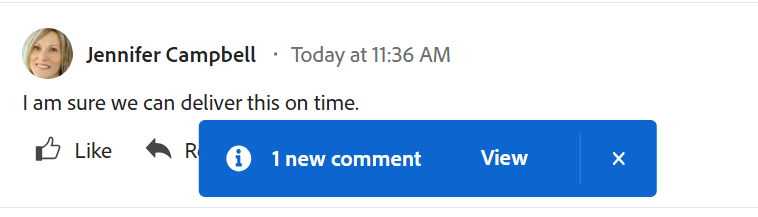

# 更新工作

<!-- Audited: 1/2024 -->

<!--The highlighted information on this page refers to functionality not yet generally available. It is available only in the Preview environment.  (*****for all customers or in Production for customers who enabled fast releases-->

<!--For information about fast releases, see [Enable or disable fast releases for your organization](/help/quicksilver/administration-and-setup/set-up-workfront/configure-system-defaults/enable-fast-release-process.md).

For information about the current release schedule, see [Second Quarter 2024 release overview](/help/quicksilver/product-announcements/product-releases/24-q2-release-activity/24-q2-release-overview.md).
-->

<!--info for April 11: hide the "Important" box below-->

<!--
>[!IMPORTANT]
>
>We are currently redesigning the commenting experience in Adobe Workfront.
>
>Depending on what objects you access the commenting experience for, you might see the following functionality for the Updates section:
>* The new experience
>* The legacy experience
>* The new and the legacy experience
>
>For more information about the new commenting experience and its availability, see [New commenting experience](../../product-announcements/betas/new-commenting-experience-beta/unified-commenting-experience.md). 
>
> The legacy commenting experience has been removed from projects, tasks, issues, and documents in the Preview environment. 
>
>The new commenting experience is available only for the Updates section of Workfront objects, and it is not available when you access updates from the following areas:
>
> * Home
> * Summary panel in lists
> * Summary panel in timesheets 
> * Summary panel in the Workload Balancer
>
>The new commenting experience is available in the Summary panel in lists, timesheets, and the Workload Balancer in the Preview environment and in the Production environment for customers who have opted for the fast release process. 
-->

您可以对Adobe Workfront对象添加更新，以便与他人沟通该对象的进度。 有关可以在Workfront中添加更新的对象的更多信息，请参阅[更新部分概述](/help/quicksilver/workfront-basics/updating-work-items-and-viewing-updates/updates-tab-overview.md)。

本文中的信息介绍了如何注释和更新项目、任务和问题的信息。 分配或订阅了对象的用户可以查看您的更新。 您还可以标记用户，以引起他们对更新的注意。

向其他对象添加注释与更新项目、任务和问题类似。 有关对信息卡和目标进行注释的其他信息，另请参阅以下文章：

* [在Adobe Workfront目标中管理目标注释](../../workfront-goals/goal-management/manage-goal-comments.md)。

  您必须具有其他许可证才能访问Workfront目标。

* [向展示板添加临时信息卡](/help/quicksilver/agile/get-started-with-boards/add-card-to-board.md)

* [在展示板上使用连接的信息卡](/help/quicksilver/agile/get-started-with-boards/connected-cards.md)

<!--Add a bullet for record comments when Planning is in GA: help/quicksilver/planning/records/manage-record-comments.md-->

## 访问要求

+++ 展开以查看本文中各项功能的访问要求。

您必须具有以下权限才能执行本文中的步骤：

<table style="table-layout:auto"> 
 <col> 
 </col> 
 <col> 
 </col> 
 <tbody> 
  <tr> 
   <td role="rowheader"><strong>Adobe Workfront计划</strong></td> 
   <td> 
任何
 </td> 
  </tr> 
  <tr> 
   <td role="rowheader"><strong>Adobe Workfront许可证</strong></td> 
   <td> 
   
当前：对问题和文档的请求或更高版本；对所有其他对象的审阅或更高版本

   
新文档：问题和文档的参与者或更高版本：所有其他对象的轻量级或更高版本
 
   </td> 
  </tr> 
  <tr> 
   <td role="rowheader"><strong>访问级别配置</strong></td> 
   <td> 
查看或编辑更新所在对象的访问权限
</td> 
  </tr> 
  <tr> 
   <td role="rowheader"><strong>对象权限</strong></td> 
   <td> 
查看对对象的访问权限
</td> 
  </tr> 
 </tbody> 
</table>

有关此表中信息的更多详细信息，请参阅Workfront文档中的[访问要求](/help/quicksilver/administration-and-setup/add-users/access-levels-and-object-permissions/access-level-requirements-in-documentation.md)。

+++

## 有关更新工作的注意事项

* 您可以在“更新”部分向Adobe Workfront中的大多数对象添加注释。 有关哪些对象显示“更新”部分的更多信息，请参阅[更新部分概述](../updating-work-items-and-viewing-updates/updates-tab-overview.md)。

* 您可以从与Workfront集成的其他应用程序或Workfront移动设备应用程序向Workfront对象添加注释。

  并非所有与Workfront集成的应用程序都可以向Workfront对象添加注释。

  从应用程序访问Workfront对象时，并非所有在Workfront对象的“更新”部分中可用的功能都可用于其他应用程序。 例如，在将评论从第三方应用程序添加到Workfront对象时，富文本功能或将评论设为某人的公司私密可能不可用。

* 您可以在对Workfront对象（项目、任务或问题）进行注释时传达该对象的进度。 分配或订阅了对象的用户将收到有关您更新的通知。 拥有对象查看权限的任何人都可以查看您的更新。

* 您可以标记用户以引起他们对更新的注意。 标记的用户将收到应用程序内通知以及一封有关您更新的电子邮件。

  >[!TIP]
  >
  >评论所有者将被自动标记。 有关详细信息，请参阅[为其他人标记更新](../../workfront-basics/updating-work-items-and-viewing-updates/tag-others-on-updates.md)。

* 您可以向可查看的对象添加注释，也可以以Workfront或组管理员身份登录并代表其他用户添加注释。 有关详细信息，请参阅[以其他用户身份登录](../../administration-and-setup/add-users/create-and-manage-users/log-in-as-another-user.md)。

* 您可以从Workfront的以下区域向项目、任务和问题添加更新：

   * 从Workfront对象的“更新”部分（适用于项目、任务和问题）
   * 从“主页”区域（针对任务和问题）
   * 从“摘要”面板的以下区域（任务、问题和文档）：

      * 对象列表
      * 时间表
      * 主页
      * 工作负载均衡器

<!--info for April 11: hide the section below: add an update to a work item-->

<!--
## Add an update to a work item

Adding an update to a work item differs depending on what version of the Updates section you use.

You can add updates to the following objects: 

* Projects
* Tasks
* Issues
* Programs
* Portfolios
* Templates
* Template tasks
* Users
* Timesheets
* Teams
* Goals
* Cards in the Boards area
* Iterations
-->

<!--info for April 11: hide the section below completely:-->

<!--
### Add an update to a work item in the legacy Updates section

>[!IMPORTANT]
>
>The information on this page describes how you update projects, tasks, and issues.

1. Go to the work item for which you want to provide an update (such as a project, task, or issue).
1. Click the **Updates** section.
1. (Conditional) If it is enabled, click the **New commenting** option in the upper-right corner of the Updates section to disable it and enable the legacy commenting experience.
1. Click **Start a new update,** then type your update.  
1. (Optional) Use the options in the Rich Text toolbar to format your text, add emojis, links, or images to your update, to enhance your content. For more information, see the [Use Rich Text in a Workfront update](#use-rich-text-in-a-workfront-update) section in this article.
1. (Optional) Update any of the following information about the work item:

   <table style="table-layout:auto"> 
    <col> 
    <col> 
    <tbody> 
     <tr> 
      <td role="rowheader"><strong>Notify</strong></td> 
      <td>Identify users who must be notified of the update. Users assigned or subscribed to the object automatically receive notification when an update is made. 
For information about how to include others on an update, see <a href="../../workfront-basics/updating-work-items-and-viewing-updates/tag-others-on-updates.md" class="MCXref xref">Tag others on updates</a>.
</td> 
     </tr> 
     <tr> 
      <td role="rowheader"><strong>Commit Date</strong></td> 
      <td>In the date picker, select the date that you commit to complete the work item. For information about Commit Date, see <a href="../../manage-work/projects/updating-work-in-a-project/overview-of-commit-dates.md" class="MCXref xref">Commit Date overview</a>.</td> 
     </tr> 
     <tr> 
      <td role="rowheader"><strong>Condition</strong></td> 
      <td>Select a new condition for the task or issue. For information about selecting a condition, see <a href="../../manage-work/projects/updating-work-in-a-project/update-condition-for-tasks-and-issues.md" class="MCXref xref">Update Condition for tasks and issues</a>.</td> 
     </tr> 
     <tr> 
      <td role="rowheader"><strong>Status</strong></td> 
      <td>Click the arrow beside the current status, then select the desired status from the drop-down menu. For information about setting a Status, see <a href="../../manage-work/projects/updating-work-in-a-project/update-task-status.md" class="MCXref xref">Update task status</a>.
Updating the status of a work item does not automatically change the status of a project. Depending on how your project is set up, you might make updates to the project status separately. For more information on the various project update types, see <a href="../../manage-work/projects/manage-projects/select-project-update-type.md" class="MCXref xref">Select the project Update Type </a>.

<b>NOTE</b>
      
      You cannot change the status of a work item while it is in a Pending Approval status.
</td> 
     </tr> 
     <tr> 
      <td role="rowheader"><strong>Completion Bar</strong></td> 
      <td>(Only available on tasks) Indicate the percentage of work completed by sliding the progress bar to the desired percentage. You can also double-click the completion bar and enter the percent complete.</td> 
     </tr> 
     <tr> 
      <td role="rowheader"><strong>Private to my company</strong></td> 
      <td> 
Disable this option to prevent users outside your company from having access to view this update.
 
      
<b>NOTE</b>

      
This option displays only when the user is associated with a Company.

      
This option is not available in all areas where you can add updates from. For example, this is not available in third-party applications where you can add updates from. 

      </td> 
     </tr> 
    </tbody> 
   </table>

1. Click **Update** to add the update to the Workfront object.

   >[!NOTE]
   >
   >A small pop-up window will appear for seven seconds after clicking **Update**, allowing you to undo the update and return to the editing pane before the update is posted. The update is posted if you dismiss the undo pop-up, wait for it to disappear, or navigate away from the page. 
   >
   >If your Workfront administrator selects the "Never allow users to delete comments" setting in your access level, you cannot undo a comment. For more information, see [Create and modify custom access levels](../../administration-and-setup/add-users/configure-and-grant-access/create-modify-access-levels.md).

1. To reply to an update, see [Reply to updates](../../workfront-basics/updating-work-items-and-viewing-updates/reply-to-updates.md).
-->

<!--info for April 11: reword the title of this section to: "Add an update to a work item"; take out the step that says you need to enable the "New commenting" toggle (I think it is step 3??)-->

## 向工作项添加更新

本文介绍了如何更新项目、任务或问题。 更新大多数其他对象的方法也类似。

1. 找到要更新的对象，然后单击其名称以打开该对象的页面。
1. 单击左侧面板中的&#x200B;**更新**。
默认情况下已选中**评论**&#x200B;选项卡。

   <!--
   1. (Conditional) If the **New commenting** option is disabled, click to enable it. 

      This enables the new commenting experience. 

         >[!TIP]
         >
         >The New commenting option has been removed in the Preview environment.
   -->

1. 开始在&#x200B;**新建评论**&#x200B;框中输入评论。

   

   >[!TIP]
   >
   >在完成键入和提交评论之前导航离开更新部分，即使注销并重新登录后，页面上评论仍会以草稿模式保留。 添加到注释的任何图像也会保存在草稿中。 草稿会保存7天，之后将丢弃它们并且无法恢复。 草稿注释仅对输入它们的用户可见。

1. （可选）要撤消或重做更改，请使用以下快捷键：
   * CTRL + Z(Mac为⌘ + z)可撤消更改
   * 按CTRL + Y(对于Mac，按⌘ + y)可重做更改

1. （可选）在&#x200B;**为人员或团队添加标签**&#x200B;区域，开始键入要包含在此评论中的用户或团队的名称或电子邮件，然后当该评论显示在列表中时将其选定。
1. （可选）使用富文本工具栏中的选项设置文本格式，在更新中添加表情符号、链接或图像，以增强内容。 有关详细信息，请参阅本文中的[在Workfront更新中使用富文本](#use-rich-text-in-a-workfront-update)部分。

   >[!TIP]
   >
   >如果另一用户向您正在更新的同一项目提交评论，则会显示一条带“新”指示器的红线，通知您较新的评论。
   >
   >指示符仅在提交项目的评论之后显示，而不会在评论仍在撰写时显示。
   >
   >“新”指示符仅在输入新更新的用户以及当前输入更新的用户都使用新注释体验时显示。
   >

1. 单击&#x200B;**提交**&#x200B;以将更新添加到Workfront对象。
1. （可选）要编辑评论，请单击评论右上角的&#x200B;**更多**&#x200B;菜单，然后单击&#x200B;**编辑**。

   >[!IMPORTANT]
   >
   >您只能在提交评论后15分钟内对其进行编辑。

1. 编辑评论中的信息，添加或删除图像或删除任何已标记用户。 “已编辑”指示符将添加到输入评论时显示的日期戳的左侧。

   >[!TIP]
   >
   >当前年份的注释不会在日期戳中显示年份。 将鼠标悬停在时间戳上会显示完整日期，包括年份。

   

   >[!TIP]
   >
   >* 仅当提交原始更新时，才会生成电子邮件通知用户您的更新。 编辑更新后不会生成电子邮件。
   >* 评论旁边的日期戳是原始评论的日期，而不是上次编辑的日期。
   >* 当您代表其他用户添加评论时(以Workfront或组管理员身份以其他用户身份登录时)，如果您以其他用户身份登录，则无法编辑评论。 只有在以用户身份注销并以您自己身份重新登录之后，才能编辑注释。

1. （可选）单击&#x200B;**回复**&#x200B;或开始在&#x200B;**添加回复……**&#x200B;区域键入评论以回复现有评论，然后执行上述步骤3-7。 <!--(**************insure this stays accurate***********)-->有关回复更新的信息，请参阅[回复更新](../../workfront-basics/updating-work-items-and-viewing-updates/reply-to-updates.md)。

1. （视情况而定，可选）如果您在添加评论时，其他用户在“更新”部分的可见区域之外添加了显示的评论，请单击屏幕底部的蓝色&#x200B;**新评论横幅**&#x200B;中的&#x200B;**查看**&#x200B;以显示这些评论。

   

   屏幕底部会显示其他注释。

1. （可选）单击&#x200B;**类似**&#x200B;图标。 图标会随喜欢的数量而更新。
1. （有条件，可选）如果在注释中包括了其他人员，请单击更新中包括的成员数，以显示与所输入的注释共享的实体列表。

   

   >[!TIP]
   >
   >前两个已标记实体的名称显示在它们的头像旁边。 如果标记了两个以上的实体，则只显示第一个实体的名称，并显示附加实体的数量。

1. （可选）单击评论者的姓名可在信息框中查看其姓名、角色和电子邮件地址。 在信息框中再次单击评论者的姓名以打开其用户配置文件。
1. （可选）单击&#x200B;**系统活动**&#x200B;选项卡以查看系统记录的更新。 更新对象或其任何子级时，Workfront会生成有关该更新的注释，并将其显示在“系统活动”选项卡中。

   有关详细信息，请参阅[更新部分概述](../updating-work-items-and-viewing-updates/updates-tab-overview.md)。

   >[!TIP]
   >
   >您无法向系统更新添加注释。 但是，对旧版注释体验中的系统活动记录所做的任何回复都将以只读形式添加到“系统活动”选项卡中。 已于2024年4月11日从Workfront中删除旧版评论体验。

1. （可选）单击“**全部**”选项卡以在一个位置查看用户注释和系统活动注释。 这是一个仅供查看的选项卡。

   >[!TIP]
   >
   >您无法在“全部”选项卡的现有注释中回复注释或标记其他用户。 若要在“全部”选项卡中回复评论，请单击&#x200B;**在评论中回复**，以在“评论”选项卡中打开评论。

## 在Workfront更新中使用富文本{#use-rich-text-in-a-workfront-update}

您可以使用富文本或向其中添加各种项目（如表情符号、链接或图像）来增强更新。

1. 转到Workfront对象的&#x200B;**更新**&#x200B;区域并开始键入评论。
1. （可选）要向更新添加富文本格式，请在键入时使用&#x200B;**富文本**&#x200B;工具栏上的任何属性。

   

   | **属性** | **工具栏按钮** | **Mac快捷键** | **Windows快捷键** |
   |---|---|---|---|
   | 粗体 |  | ⌘+b | Ctrl+B |
   | 斜体 |  | ⌘+i | Ctrl+I |
   | 下划线 |  | ⌘+u | Ctrl+U |
   | 超链接 |  |  打开“添加链接”框： ⌘+K   要在所选文本上粘贴链接： ⌘+V  |  打开“添加链接”框： Ctrl+K   要在所选文本上粘贴链接： Ctrl+V  |
   | 项目符号列表 |  | ⌘+Shift+8 | Ctrl+Shift+8 |
   | 编号列表 |  | ⌘+Shift+7 | Ctrl+Shift+7 |
   <!--| Block Quote | |⌘+Shift+9 | Ctrl+Shift+9   This is not available in the new commenting experience.   |-->

   <!--remove the last row when we remove legacy from the system-->

   要停止设置文本格式，请在&#x200B;**富文本**&#x200B;工具栏上取消选择该属性。

   <!-- in the table above: take "Create Links" verbiage from the hyperlink when the old commenting is removed and the commenting beta is the only way to comment - with October 2023-->

   >[!NOTE]
   >
   >* 用户收到的包含您的更新的任何电子邮件通知中也会显示格式。
   >* 在“更新”选项卡中查看更新时，应用于电子邮件中更新的富文本格式不会显示在更新上。
   >* 如果您的组织将Workfront与Internet Explorer一起使用，则粘贴到更新中的任何格式化文本都将丢失其富文本格式，并显示为纯文本。 您可以使用富文本工具栏上的属性重新设置文本格式。
   >* 富文本格式不适用于“时间表”区域中所做的更新，也不适用于在报表中查看的注释和上一个条件对象。

   <!--1. (Optional and conditional) If you want to include text from previous updates or from other sources and distinguish it from your own update, you can mark it as a Block Quote. Click the **Block Quote** icon  and type the text you want to quote. The quoted text displays marked with a vertical gray line. Click the **Block Quote** icon again to return to normal formatting. This is not available in the new commenting experience.-->

   <!--remove this picture below and the bullet above when we remove legacy-->

   <!---->

1. （可选）单击&#x200B;**表情符号**&#x200B;图标以将表情符号添加到更新中。

   >[!NOTE]
   >
   >* Workfront不会将标点符号表情符号（例如：）替换为表情符号。
   >* 表情符号不适用于在报表中查看的“注释”和“上一个条件”对象。
   >* Workfront中的表情符号功能利用Unicode字符，因此，仅在支持Unicode代码点的浏览器和操作系统上显示。 平台、浏览器或操作系统版本与您的版本不同的用户可能无法访问相同的表情符号。
   >* 不支持的emoji由黑白框表示。
   >* Windows 7仅支持黑白表情符号。
   >* 在更新区域查看时，应用于通过电子邮件进行的更新的表情符号不会显示在更新上。

1. （可选）要添加指向其他信息源的URL链接，请执行以下操作：

   1. 在更新中要插入链接的位置单击。
   1. 在&#x200B;**富文本**&#x200B;工具栏上，单击&#x200B;**超链接**&#x200B;图标。

   1. 在出现的&#x200B;**创建链接**&#x200B;框中，在&#x200B;**URL**&#x200B;下，键入或粘贴要链接到的源的URL。

   1. 在&#x200B;**要显示的文本**&#x200B;下，键入或粘贴链接文本。
   1. 单击&#x200B;**保存**。

1. （可选）要将图像附加到更新，请执行下列操作之一：

   * 将图像保存在计算机上，然后将其拖放到新注释区域。
   * 从计算机复制屏幕快照，然后将其粘贴到评论中。<!-- This is not available in the legacy commenting experience.-->
   * 单击&#x200B;**添加映像**&#x200B;图标并浏览到计算机上的映像。

   >[!NOTE]
   >
   >**重要信息**
   >
   ><!--You cannot add images to goals or ad-hoc cards on boards. -->
   >
   >* 您的Workfront管理员必须在Workfront界面区域的更新馈送首选项部分启用添加图像功能，然后才能看到图像或添加附件图标。 有关信息，请参阅[配置用户更新的首选项](../../administration-and-setup/set-up-workfront/system-tracked-update-feeds/configure-preferences-user-updates.md)。
   >* 最大图像文件大小为7 MB。 支持的图像文件类型为.jpg、.gif和.png。
   >* 可从对象的“更新”部分访问图像，也可从主菜单下的“文档”区域访问图像。
   >* 您可以右键单击新注释或在键盘上按Ctrl + V(对于Windows，或者按⌘ + V(对于Mac))来粘贴图像。
   >* 您可以发送包含图像但不包含文本的更新。
   >* 删除包含图像的注释时，该图像会从“更新”部分和“文档”区域中删除。 编辑注释并删除图像时，也会从“文档”区域中删除图像。
   >* 当有人从“文档”区域删除附加到评论的图像时，该图像也会从评论中删除。

   <!--remove the statement above about legacy, when we remove the legacy environment.-->

1. （可选）要在现有更新中查看图像，请执行下列操作之一：

   * 单击图像缩略图上的&#x200B;**预览**&#x200B;图标以在新的浏览器选项卡中打开全尺寸图像。
   * 单击图像缩略图上的&#x200B;**下载**&#x200B;图标以下载图像。

1. 单击&#x200B;**提交**&#x200B;以添加您的评论。

## 搜索更新

您可以在对象的“更新”部分中搜索注释或回复。

1. 转到对象的&#x200B;**更新**&#x200B;部分。
1. 在&#x200B;**注释**&#x200B;选项卡右上角的&#x200B;**搜索**&#x200B;框中开始键入关键字<!--or a user's name -->。

   <!--Add this tip or note instead of the note below - when it'll be possible: You can search for users who have been tagged or for comment owners.-->

   >[!NOTE]
   >
   >只能搜索属于评论或回复文本的单词。 您无法搜索在更新中标记的用户或团队的名称。

   

   您搜索的关键字<!--or user-->已突出显示，包含该关键字的注释将显示在“更新”部分的顶部。

   Workfront会搜索对象的整个更新流，而不在屏幕上可见的注释。

1. 单击搜索字段中的&#x200B;**x**&#x200B;图标以清除搜索结果并返回所有注释。

<!-- when we release search to production, check above and make sure you don't have to add that the users tagged/ owners are also searchable-->

## 复制更新

有几种方法可以复制更新。

您可以复制更新的链接，或复制更新的内容以将其用于新更新。

<!--Copying an update differs depending on which commenting experience you use.-->

<!--info for April 11: take the sentence above out and reword the section title below to: Copy an update-->

### 复制更新<!--in the new commenting experience-->

<!--For information about what features are available for the new commenting experience and for what objects, see [New commenting experience](../../product-announcements/betas/new-commenting-experience-beta/unified-commenting-experience.md).-->

通过执行以下操作之一，可以从现有注释中复制信息：

* [复制链接](#copy-link)
* [复制正文文本](#copy-body-text)
* [引用回复](#quote-reply)

#### 复制链接

复制链接选项将注释或线程链接复制到剪贴板，以便您与其他用户共享注释或整个线程。

1. 转到要复制其链接的更新。

1. 单击&#x200B;**更多**&#x200B;菜单，然后单击&#x200B;**复制链接**。

1. 将您在上一步中复制的链接粘贴到电子邮件或其他应用程序中以便与其他人共享。 共享链接会打开您从中共享该链接的评论。

   >[!TIP]
   >
   >当您在更高层对象的子对象上共享对话的链接时，该链接会在更高层对象的“更新”区域中打开线程。
   >
   >例如，如果从项目的“更新”区域复制任务注释的链接，注释将打开项目页面。

#### 复制正文文本

复制正文文本选项可将文本从特定更新复制到剪贴板。

1. 转到要复制的更新或回复。
1. 单击&#x200B;**更多**&#x200B;菜单，然后单击&#x200B;**复制正文文本**。

#### 引用回复

Quote reply选项将原始备注作为块备注复制到新回复中。

1. 转到要复制的更新或回复。
1. 单击&#x200B;**更多**&#x200B;菜单，然后单击&#x200B;**引用回复**。

   将打开一个新注释框，引用回复将包括在新注释中，并标记为块引用。

   

1. 继续添加更新，然后单击&#x200B;**提交**&#x200B;添加评论。

<!--info for April 11: hide the entire section below - notice that there are several sub-sub sections below this main section - hide them all, all the way up to "Delete an update"-->

<!--
### Copy an update in the legacy commenting experience

* [Copy the update](#copy-the-update) 
* [Copy the thread link](#copy-the-thread-link) 
* [Copy the update link](#copy-the-update-link)
* [Quote Reply](#quote-reply)

   >[!TIP]
   >
   >When you copy and share the link of a conversation on a child object from a higher-ranking object, the link opens the thread in the child object's Updates area. 
   >
   >For example, if you copy the link of a task comment from the project's Updates area, the comment opens the task page.

#### Copy the update {#copy-the-update}

This option copies the text from a specific update to the clipboard.

1. Go to the update or reply you want to copy.
1. Click the **More** menu, then click **Copy body text**.

   

#### Copy the thread link {#copy-the-thread-link}

This option copies the full thread link to the clipboard so you can share the thread with other users.

1. Go to the update thread you want to copy.

1. Click the **More** menu, then click **Copy thread link**.

    

1. Paste the link you copied in the previous step in an email or another application to share it with others. The shared link opens the comment you shared the link from. 

#### Copy the update link {#copy-the-update-link}

This option copies a specific update link to the clipboard. When you share the update link, the user who follows it sees a border around the update.

1. Go to the update or reply you want to copy.
1. Click the **More** menu next to the individual update, then click **Copy update link**.

   

1. Paste the link you copied in the previous step in an email or another application to share it with others. The shared link opens the comment you shared the link from. 

#### Quote Reply  

The Quote Reply option copies the original comment to a new reply as a block quote. 

1. Go to the update or reply you want to copy.
1. Click the **More** menu, then click **Quote Reply**.

   A new comment box opens and the quoted reply is included in the new comment and marked as a block quote.

1. Continue adding your update and click **Reply** to add the comment.
-->

## 删除更新或回复

根据Workfront管理员授予您的访问权限，您也许能够删除在对象的“更新”选项卡上添加的更新。 有关详细信息，请参阅文章[创建或修改自定义访问级别](../../administration-and-setup/add-users/configure-and-grant-access/create-modify-access-levels.md)中的[创建或修改自定义访问级别](../../administration-and-setup/add-users/configure-and-grant-access/create-modify-access-levels.md#creating-a-new-access-from-scratch)。

任何Workfront用户(包括Workfront管理员)都不能删除其他用户所做的更新。 但是，如果用户的访问级别允许他们删除自己的更新，则Workfront管理员可以以该用户的身份登录并删除他们所做的更新。 有关详细信息，请参阅[创建或修改自定义访问级别](../../administration-and-setup/add-users/configure-and-grant-access/create-modify-access-levels.md#creating-a-new-access-from-scratch)和[以其他用户身份登录](../../administration-and-setup/add-users/create-and-manage-users/log-in-as-another-user.md)。

1. 转到要删除的更新或回复。
1. 单击要删除的更新或回复旁边的&#x200B;**更多**&#x200B;菜单，然后单击&#x200B;**删除**。

   

1. 在显示的消息中，单击&#x200B;**删除**。

   >[!NOTE]
   >
   >删除具有附加图像的更新会同时删除注释和图像。 有关详细信息，请参阅本文中的[在Workfront更新中使用富文本](#use-rich-text-in-a-workfront-update)部分。

   当您删除的评论具有与其关联的回复时，将显示删除评论的指示以及删除评论的用户的名称。

   

   已删除的评论将立即从Workfront中删除。 使用更新分区的用户会看到评论被其他用户实时删除。

## 查看系统更新

Workfront对象的“更新”部分显示两种类型的信息：

* **用户更新：**&#x200B;用户更新是您和您系统中的其他用户输入的评论。 用户更新将显示在“更新”部分的“注释”和“所有”选项卡中。

  

* **系统更新：**&#x200B;系统更新记录删除任务或问题、添加或删除文档版本、附加或删除审批请求以及对对象所做的任何编辑或更改。 系统更新显示在“System Activity（系统活动）”和“Updates（更新）”部分的“All（所有）”选项卡中。

  

  Workfront管理员可以确定系统更新中跟踪的内容，如[系统跟踪更新](../../administration-and-setup/set-up-workfront/system-tracked-update-feeds/system-tracked-update-feeds.md)中所述。 您还可以过滤掉系统更新或活动，以便只看到所有对象的用户更新。

  以下对象没有系统生成的更新：

   * 团队
   * 模板
   * 模板任务
   * 临时信息卡

有关“更新”部分中的系统更新的详细信息，请参阅[更新部分概述](../updating-work-items-and-viewing-updates/updates-tab-overview.md)。

<!--
After the monthly releases to Production, the same features are also available in the Production environment for customers who enabled fast releases.   
For information about fast releases, see [Enable or disable fast releases for your organization](../../administration-and-setup/set-up-workfront/configure-system-defaults/enable-fast-release-process.md)  
-->

<!-- with October 26 release: add somewhere this, and decide where we need to keep information about the legacy commenting. Should we create an article about iterations comments like we have for goals and cards?!:

>[!NOTE]
>
>Iterations display the legacy commenting experience.-->

<!--old message, before Auhust 17: 

>[!NOTE]
>
>We are currently redesigning the commenting experience in Adobe Workfront.
>
>For more information about the new commenting experience, see [New commenting experience](../../product-announcements/betas/new-commenting-experience-beta/unified-commenting-experience.md). 
>
>You can access the new experience for the following objects:
> * Issues, projects, tasks, and documents.
>
>     This is available when you enable the commenting Beta experience.
>
>     This functionality is available only for the Updates section, and it is not available for the following areas:
>
>     * Home
>     * Summary panel in lists
>     * Summary panel in timesheets
>
> * Goals, cards in the Boards area
>
>   The new commenting experience is the only experience for goals and cards. You must have an additional license to access Workfront Goals. For more information, see [Requirements to use Workfront Goals](../../workfront-goals/goal-management/access-needed-for-wf-goals.md). 
>
>     You can add and view updates to cards in the Boards area when you enable the Comments and System Activity sections on a card. For more information, see [Add an ad hoc card to a board](../../agile/get-started-with-boards/add-card-to-board.md).
-->