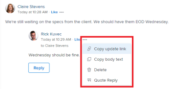

# 更新工作

<!-- Drafted for commenting experience: 

The highlighted information on this page refers to functionality not yet generally available. It is available only in the Preview environment for a limited number of objects. -->

您可以对Adobe Workfront对象（项目、任务或问题）添加更新，以传达对象的进度。 已分配或订阅对象的用户可以查看您的更新。 您还可以标记用户，以引起他们对更新的注意。

您可以从Workfront的以下区域向对象添加更新：

* 从Workfront对象，在更新部分
* 从主页区域（用于任务和问题）
* 从“摘要”面板中的对象列表（用于任务和问题）
* 从时间表（用于任务和问题）

## 访问要求

<!--
drafted for P&P release:
<table style="table-layout:auto"> 
 <col> 
 </col> 
 <col> 
 </col> 
 <tbody> 
  <tr> 
   <td role="rowheader"><strong>Adobe Workfront plan*</strong></td> 
   <td> 
Any
 </td> 
  </tr> 
  <tr> 
   <td role="rowheader"><strong>Adobe Workfront license*</strong></td> 
   <td> 
Current license: Contributor or higher for issues and documents: Light or higher for all other objects
 
   Or
   
Legacy  license: Request or higher for issues and documents; Review or higher for all other objects

   </td> 
  </tr> 
  <tr> 
   <td role="rowheader"><strong>Access level configurations*</strong></td> 
   <td> 
View or Edit access for the object the update is on
 
<b>NOTE</b>
   
   If you still don't have access, ask your Workfront administrator if they set additional restrictions in your access level. For information on how a Workfront administrator can modify your access level, see <a href="../../administration-and-setup/add-users/configure-and-grant-access/create-modify-access-levels.md" class="MCXref xref">Create or modify custom access levels</a>.
 </td> 
  </tr> 
  <tr> 
   <td role="rowheader"><strong>Object permissions</strong></td> 
   <td> 
View access to the object
 
For information on requesting additional access, see <a href="../../workfront-basics/grant-and-request-access-to-objects/request-access.md" class="MCXref xref">Request access to objects </a>.
 </td> 
  </tr> 
 </tbody> 
</table>
-->
您必须具有以下权限才能执行本文中的步骤：

<table style="table-layout:auto"> 
 <col> 
 </col> 
 <col> 
 </col> 
 <tbody> 
  <tr> 
   <td role="rowheader"><strong>Adobe Workfront计划*</strong></td> 
   <td> 
任意
 </td> 
  </tr> 
  <tr> 
   <td role="rowheader"><strong>Adobe Workfront许可证*</strong></td> 
   <td> 
对于问题和文档，请求或更高版本；对于所有其他对象，审阅或更高版本
 </td> 
  </tr> 
  <tr> 
   <td role="rowheader"><strong>访问级别配置*</strong></td> 
   <td> 
查看或编辑更新所在对象的访问权限
 
<b>注释</b>

如果您仍然没有访问权限，请咨询Workfront管理员是否对您的访问级别设置了其他限制。 有关Workfront管理员如何修改您的访问级别的信息，请参阅 <a href="../../administration-and-setup/add-users/configure-and-grant-access/create-modify-access-levels.md" class="MCXref xref">创建或修改自定义访问级别</a>.
 </td>
</tr> 
  <tr> 
   <td role="rowheader"><strong>对象权限</strong></td> 
   <td> 
查看对对象的访问权限
 
有关请求其他访问权限的信息，请参阅 <a href="../../workfront-basics/grant-and-request-access-to-objects/request-access.md" class="MCXref xref">请求访问对象 </a>.
 </td> 
  </tr> 
 </tbody> 
</table>

&#42;要了解您拥有什么计划、许可证类型或访问权限，请联系您的Workfront管理员。

## 向工作项添加更新

<!--drafted for the commenting experience - change the NOTE at the top of this paragraph with every new release to other objects

Adding an update to a work item differs depending on what environment and what object you choose. 

### Add an update to a work item in the Production environment

>[!NOTE]
>
>The following functionality is available for all objects except for goals, in the Production and Preview environements. You must have an additional license to access Workfront Goals. For information about commenting on goals, see [Manage goal comments in Adobe Workfront Goals](../../workfront-goals/goal-management/manage-goal-comments.md)

-->

1. 转到要为其提供更新的工作项（如项目、任务或问题）。
1. 单击 **更新** 部分。
1. 单击 **开始新的更新，** 然后键入您的更新。

1. （可选）要向更新添加富文本格式，请使用 **富文本** 工具栏。

   | **属性** | **工具栏按钮** | **Mac快捷键** | **PC快捷键** |
   |---|---|---|---|
   | 粗体 |  | ⌘+b | Ctrl+B |
   | 斜体 |  | ⌘+i | Ctrl+I |
   | 下划线 |  | ⌘+u | Ctrl+U |
   | 超链接 |  | ⌘+K | Ctrl+K |
   | 项目符号列表 |  | ⌘+Shift+8 | Ctrl+Shift+8 |
   | 编号列表 |  | ⌘+Shift+7 | Ctrl+Shift+7 |
   | 块引用 |  | ⌘+Shift+9 | Ctrl+Shift+9 |

   要停止设置文本格式，请取消选择 **富文本** 工具栏。

   >[!NOTE]
   >
   >* 用户收到的任何包含您更新的电子邮件通知中也会显示格式。
   >* 在“更新”选项卡中查看更新时，应用于电子邮件中更新的富文本格式不会显示在更新上。
   >* 如果您的组织将Workfront与Internet Explorer结合使用，则粘贴到更新中的任何格式化文本都将丢失其富文本格式并显示为纯文本。 您可以使用“富文本”工具栏上的属性来重新设置文本格式。
   >* 富文本格式不适用于在时间表区域中所做的更新，也不适用于在报表中查看的注释和上一个条件对象。

1. （可选）如果要包含来自先前更新或其他来源的文本，并将其与您自己的更新区分开来，您可以将其标记为“块引用”。 单击 **块引用** 图标  并键入要引述的文本。 带引号的文本以垂直灰色线标记显示。 单击 **块引用** 图标，以返回正常格式。

   

1. （可选）将任意表情符号添加到您的更新中。

   >[!NOTE]
   >
   >* Workfront不会将标点符号表情符号（例如：）替换为表情符号。
   >* 表情符号不适用于时间表区域中所做的更新，也不适用于报告中查看的注释和上一个条件对象。
   >* Workfront中的表情符号功能利用Unicode字符，因此，仅在支持Unicode代码点的浏览器和操作系统上显示。 平台、浏览器或操作系统版本与您的版本不同的用户可能无法访问相同的表情符号。
   >* 不支持的emoji由黑白框表示。
   >* Windows 7仅支持黑白表情符号。
   >* 在更新区域查看时，应用到通过电子邮件进行的更新的表情符号不会显示在更新上。

1. （可选）要添加指向其他信息源的URL链接，请执行以下操作：

   1. 单击更新中要插入链接的位置。
   1. 在 **富文本** 工具栏上，单击 **超链接** 图标。 

   1. 在 **创建链接** 框，位于下 **URL**，键入或粘贴要链接到的源的URL。

   1. 下 **要显示的文本**，键入或粘贴链接文本。
   1. 单击&#x200B;**保存**。

1. （可选）要将图像附加到更新，请单击 **图像** 图标  并浏览到计算机上的图像。\
   或\
   将图像拖到更新区域中。

   >[!NOTE]
   >
   >* 您的Workfront管理员必须启用添加图像功能，您才能看到“图像”图标。
   >* 最大图像文件大小为7 MB。 支持的图像文件类型为.jpg、.gif和.png。
   >* 只能从对象的“更新”选项卡访问图像，而在“文档”选项卡上不可用。
   >* 您可以发送包含图像但不包含文本的更新。

1. （可选）指定以下任意项：

   <table style="table-layout:auto"> 
    <col> 
    <col> 
    <tbody> 
     <tr> 
      <td role="rowheader"><strong>通知</strong></td> 
      <td>确定需要接收更新通知的用户。 进行更新时，分配给或订阅对象的用户会自动收到通知。 
有关如何将其他人包含在更新中的信息，请参阅 <a href="../../workfront-basics/updating-work-items-and-viewing-updates/tag-others-on-updates.md" class="MCXref xref">为其他人标记更新</a>.
</td> 
     </tr> 
     <tr> 
      <td role="rowheader"><strong>提交日期</strong></td> 
      <td>在日期选取器中，选择您提交以完成工作项的日期。 有关提交日期的信息，请参见 <a href="../../manage-work/projects/updating-work-in-a-project/overview-of-commit-dates.md" class="MCXref xref">提交日期概述</a>.</td> 
     </tr> 
     <tr> 
      <td role="rowheader"><strong>完成情况</strong></td> 
      <td>为任务或问题选择新条件。 有关选择条件的信息，请参阅 <a href="../../manage-work/projects/updating-work-in-a-project/update-condition-for-tasks-and-issues.md" class="MCXref xref">更新任务和问题的条件</a>.</td> 
     </tr> 
     <tr> 
      <td role="rowheader"><strong>状态</strong></td> 
      <td>单击当前状态旁边的箭头，然后从下拉菜单中选择所需的状态。 有关设置状态的信息，请参阅 <a href="../../manage-work/projects/updating-work-in-a-project/update-task-status.md" class="MCXref xref">更新任务状态</a>.
更新工作项的状态不会自动更改项目的状态。 根据项目的设置方式，您可能需要单独更新项目状态。 有关各种项目更新类型的更多信息，请参阅 <a href="../../manage-work/projects/manage-projects/select-project-update-type.md" class="MCXref xref">选择项目更新类型 </a>.

<b>注释</b>

   当工作项处于未决批准状态时，您无法更改其状态。
</td>
   </tr> 
     <tr> 
      <td role="rowheader"><strong>完成栏</strong></td> 
      <td>（仅在任务中可用）通过将进度条滑动到所需的百分比来指示已完成工作的百分比。 您还可以双击完成栏并输入完成百分比。</td> 
     </tr> 
     <tr> 
      <td role="rowheader"><strong>我的公司私有</strong></td> 
      <td> 
禁用此选项可阻止公司外部的用户查看此更新。
 </td> 
     </tr> 
    </tbody> 
   </table>

1. 单击 **更新** 将更新添加到Workfront对象。

   >[!NOTE]
   >
   >单击后会显示一个小型弹出窗口，持续七秒 **更新**，允许您在发布更新之前撤消更新并返回编辑窗格。 如果您关闭撤消弹出窗口、等待其消失或导航离开页面，则会发布更新。
   >
   >如果您的Workfront管理员在访问级别选择“从不允许用户删除评论”设置，则无法撤消评论。 有关更多信息，请参阅 [创建和修改自定义访问级别](../../administration-and-setup/add-users/configure-and-grant-access/create-modify-access-levels.md).

1. 要回复更新，请参阅 [回复更新](../../workfront-basics/updating-work-items-and-viewing-updates/reply-to-updates.md).

<!--
### Add an update to a work item in the Preview environment

>[!NOTE]
>
> In the Preview environment, the following functionality is available only for issues, after opting in the Beta program for the new commenting experience.
> 
> In the Production environment, the following functionality is available for goals. You must have an additional license to access Workfront Goals. For information about commenting on goals, see [Manage goal comments in Adobe Workfront Goals](../../workfront-goals/goal-management/manage-goal-comments.md). 

1. Locate the object you want to add comments to, then click its name to open the object's page.
1. Click  **Updates** in the left panel. 
1. Activate the **Beta** toggle in the upper-right corner of the Updates area. This switches the Updates area to the new commenting experience. 
1. Click the **Comments** tab in the upper-left corner of the Updates area.
1. Start entering a comment in the **New comment** box. 
   
   

   >[!TIP]
   >
   >Navigating away from the Updates section before you finish typing and submitting a comment keeps the comment on the page in draft mode even after you log off and log back on. Drafted comments are only visible to the user entering them.

1. (Optional) In the **Tag people or teams** area, start typing the name or the email of a user, or a team that you would like to include in this comment, then select it when it displays in the list. 
1. (Optional) To add rich text formatting to your update, use any attributes on the **Rich Text** toolbar as you type.

   | **Attribute** |**Toolbar Button** |**Mac Shortcut Keys** |**PC Shortcut Keys** |
   |---|---|---|---|
   | Bold | |⌘+b |Ctrl+B |
   | Italics | |⌘+i |Ctrl+I |
   | Underline | |⌘+u |Ctrl+U |
   | Hyperlink | |⌘+K |Ctrl+K |
   | Bulleted List | |⌘+Shift+8 |Ctrl+Shift+8 |
   | Numbered List | |⌘+Shift+7 |Ctrl+Shift+7 |
   | Block Quote | |⌘+Shift+9 |Ctrl+Shift+9 |

    To stop formatting text, deselect the attribute on the **Rich Text** toolbar.

   >[!NOTE]
   >
   >* Formatting also displays in any email notification users receive containing your update.
   >* Rich Text formatting applied to an update in an email does not display on the update when viewed in the Updates tab.  
   >* If your organization uses Workfront with Internet Explorer, any formatted text pasted into an update loses its Rich Text formatting and displays as plain text. You can reformat the text using the attributes on the Rich Text toolbar.
   >* Rich Text formatting is not available for updates made in the Timesheets area or for Note and Last Condition objects viewed in a report.

   ************ HIDE THIS ********* 1. (Optional) If you want to include text from previous updates or from other sources and distinguish it from your own update, you can mark it as a Block Quote. Click the **Block Quote** icon  and type the text you want to quote. The quoted text displays marked with a vertical gray line. Click the **Block Quote** icon again to return to normal formatting.

   ********  HIDE THIS ******** 1. (Optional) Add any emojis to your update.

   >[!NOTE]
   >
   >* Workfront does not replace punctuation emoticons such as :) with emojis.
   >* Emojis are not available for updates made in the Timesheets area or for Note and Last Condition objects viewed in a report.
   >* The emoji feature in Workfront utilizes Unicode characters and, as such, displays only on browsers and operating systems that support Unicode code points. Users on a platform, browser, or operating system version different than yours might not have access to the same emojis.
   >* An unsupported emoji is represented by a black or white box.
   >* Windows 7 supports only black and white emojis.  
   >* Emojis that are applied to an update made via email do not display on the update when viewed in the Updates area.

1. (Optional) To add a URL link to additional information sources:

   1. Click in your update where you want to insert a link.
   1. On the **Rich Text** toolbar, click the **Hyperlink** icon.   

   1. In the **Create Link** box that appears, under **URL**, type or paste the URL of the source to which you want to link.
   
   1. Under **Text to display**, type or paste the link text.
   1. Click **Save**.   
1. Click **Submit**. 
1. (Optional) Click **Reply** to reply to an existing comment, then follow the steps 5-7 above. (**************insure this stays accurate***********)
1. (Optional) Click the **Like** icon to like a comment that someone else added. The icon updates with the number of likes.

1. (Optional) Click the **System Activity** tab to view updates logged by the system. When a goal is updated, Workfront generates a note about that update that and displays it in the System Activity tab. Workfront also records a system update when a result, activity, or project is added to the goal or when it is updated. 

1. (Conditional and Optional) If you included additional people in your comment, click on the number of members included in the update to display a list of entities that the comment you entered is shared with. 

   

-->

## 复制更新信息

有几种方法可以复制更新。 复制链接后，您可以与其他人共享该链接，以将他们定向到更新。

* [复制更新](#copy-the-update)
* [复制跟帖链接](#copy-the-thread-link)
* [复制更新链接](#copy-the-update-link)

### 复制更新 {#copy-the-update}

此选项将文本从特定更新复制到剪贴板。

1. 转到要复制的更新或回复。
1. 单击 **更多** 菜单，然后单击 **复制正文文本**.

   

### 复制跟帖链接 {#copy-the-thread-link}

此选项将完整的线程链接复制到剪贴板，以便您可以与其他用户共享线程。

1. 转到要复制的更新线程。
1. 单击 **更多** 菜单，然后单击 **复制跟帖链接**.

   

### 复制更新链接 {#copy-the-update-link}

此选项将特定的更新链接复制到剪贴板。 当您共享更新链接时，关注该链接的用户会看到更新周围的边框。

1. 转到要复制的更新或回复。
1. 单击 **更多** 单个更新旁边的菜单，然后单击 **复制更新链接**.

   

## 删除更新或回复

根据Workfront管理员赋予您的访问权限，您也许能够删除在对象的“更新”选项卡上添加的更新。 有关更多信息，请参阅 [创建或修改自定义访问级别](../../administration-and-setup/add-users/configure-and-grant-access/create-modify-access-levels.md#creating-a-new-access-from-scratch) 在文章中 [创建或修改自定义访问级别](../../administration-and-setup/add-users/configure-and-grant-access/create-modify-access-levels.md).

任何Workfront用户(包括Workfront管理员)都无法删除其他用户所做的更新。 但是，如果用户的访问级别允许他们删除自己的更新，Workfront管理员可以以该用户身份登录并删除他们所做的更新。 有关更多信息，请参阅 [创建或修改自定义访问级别](../../administration-and-setup/add-users/configure-and-grant-access/create-modify-access-levels.md#creating-a-new-access-from-scratch) 和 [以其他用户身份登录](../../administration-and-setup/add-users/create-and-manage-users/log-in-as-another-user.md).

1. 转到要删除的更新或回复。
1. 单击 **更多** 菜单，然后单击要删除的更新或回复旁边的 **删除**.

   

1. 在显示的消息中，单击 **确认**.

>[!NOTE]
>
>删除具有附加图像的更新会同时删除注释和图像。

## 在时间表上添加更新

1. 转到要更新的“时间表”。
1. 单击时间表以将其打开。
1. 在时间表底部，单击 **包括评论**.
1. 在时间表底部显示的框中，键入更新。

   

1. （视情况而定）要保存更新而不提交时间表以供审批，请单击 **保存供以后使用**.

   或

   要保存更新并提交时间表以供审批，请单击 **提交以供审批**.

   或

   如果您的时间表未由批准者设置，请单击 **保存并关闭工时表** 以保存您的更新。

## 启用或禁用系统更新

Workfront对象的“更新”选项卡显示两种类型的信息：

* **用户更新：** 用户更新是您和系统中的其他用户输入的注释。

   

* **系统更新：** 系统更新记录删除资产、添加或删除版本、附加或删除审批请求，以及对对象上的文档所做的任何编辑或更改。

   

根据您的Workfront许可证，默认情况下可能会启用系统更新。 Workfront管理员可以确定系统更新中跟踪的内容，如中所述 [系统跟踪的更新](../../administration-and-setup/set-up-workfront/system-tracked-update-feeds/system-tracked-update-feeds.md). 您还可以过滤掉系统更新或活动，以便只看到所有对象的用户更新。

有关用户更新和系统更新之间差异的更多信息，请参阅 [系统跟踪的更新](../../administration-and-setup/set-up-workfront/system-tracked-update-feeds/system-tracked-update-feeds.md).

要启用或禁用系统更新：

1. 单击 **更新** 选项卡。
1. 单击 **显示系统更新** 向左（禁用）或向右（启用）滑动交换机。

   

   该选项在Workfront中的所有对象中都是持久的，并且会保留在您选择的位置，即使您从Workfront注销也是如此。
