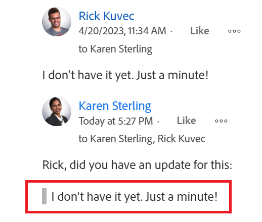

# 更新工作

<!--take "Beta" references out when we remove the beta-->

此页面上突出显示的信息是指目前尚不普遍可用的功能。 它仅在“预览”环境中可用。

>[!NOTE]
>
>我们当前正在重新设计在Adobe Workfront中的注释体验。
>有关新更新体验的更多信息，请参阅 [新的注释体验](../updating-work-items-and-viewing-updates/unified-commenting-experience.md).
>
>您可以访问以下对象的新设计：
> * 在启用注释测试版时出现问题。 
   >
   >     此功能仅适用于问题的“更新”部分，不适用于以下区域：
   >
   >     * 主页
   >     * 列表中的“摘要”面板
   >     * 工时单中的“摘要”面板
>
> * 目标
   >   新的评论体验是目标的默认体验。 您必须拥有其他许可证才能访问Workfront Goals。 有关更多信息，请参阅 [使用Workfront目标的要求](../../workfront-goals/goal-management/access-needed-for-wf-goals.md).

   >
   >    有关对目标进行评论的信息，请参阅 [在Adobe Workfront目标中管理目标注释](../../workfront-goals/goal-management/manage-goal-comments.md).

您可以在更新部分中向Adobe Workfront中的大多数对象添加注释。 有关哪些对象显示“更新”(Updates)部分的详细信息，请参阅 [更新部分概述](../updating-work-items-and-viewing-updates/updates-tab-overview.md).

您可以在对对象进行注释时，对Workfront对象（项目、任务或问题）添加更新，以告知该对象的进度。 为对象分配或订阅了该对象的用户可以查看您的更新。 您还可以标记用户以引起用户对更新的注意。 标记用户会收到有关您更新的应用程序内通知和电子邮件。

本页中的信息介绍了如何对Workfront对象进行注释，以及如何更新项目、任务和问题。 有关对目标进行评论的信息，请参阅 [在Adobe Workfront目标中管理目标注释](../../workfront-goals/goal-management/manage-goal-comments.md). 您必须拥有其他许可证才能访问Workfront Goals。

您可以从Workfront的以下区域添加对项目、任务和问题的更新：

* 从Workfront对象的Updates部分中
* 从“主页”区域（针对任务和问题）
* 从对象列表的“摘要”面板（针对任务和问题）
* 从时间表（任务和问题）

## 访问要求

<!--
drafted for P&P release:
<table style="table-layout:auto"> 
 <col> 
 </col> 
 <col> 
 </col> 
 <tbody> 
  <tr> 
   <td role="rowheader"><strong>Adobe Workfront plan*</strong></td> 
   <td> 
Any
 </td> 
  </tr> 
  <tr> 
   <td role="rowheader"><strong>Adobe Workfront license*</strong></td> 
   <td> 
Current license: Contributor or higher for issues and documents: Light or higher for all other objects
 
   Or
   
Legacy  license: Request or higher for issues and documents; Review or higher for all other objects

   </td> 
  </tr> 
  <tr> 
   <td role="rowheader"><strong>Access level configurations*</strong></td> 
   <td> 
View or Edit access for the object the update is on
 
<b>NOTE</b>
   
   If you still don't have access, ask your Workfront administrator if they set additional restrictions in your access level. For information on how a Workfront administrator can modify your access level, see <a href="../../administration-and-setup/add-users/configure-and-grant-access/create-modify-access-levels.md" class="MCXref xref">Create or modify custom access levels</a>.
 </td> 
  </tr> 
  <tr> 
   <td role="rowheader"><strong>Object permissions</strong></td> 
   <td> 
View access to the object
 
For information on requesting additional access, see <a href="../../workfront-basics/grant-and-request-access-to-objects/request-access.md" class="MCXref xref">Request access to objects </a>.
 </td> 
  </tr> 
 </tbody> 
</table>
-->
您必须具有以下访问权限才能执行本文中的步骤：

<table style="table-layout:auto"> 
 <col> 
 </col> 
 <col> 
 </col> 
 <tbody> 
  <tr> 
   <td role="rowheader"><strong>Adobe Workfront计划*</strong></td> 
   <td> 
任意
 </td> 
  </tr> 
  <tr> 
   <td role="rowheader"><strong>Adobe Workfront许可证*</strong></td> 
   <td> 
（二）对问题和文件提出要求或更高要求；对所有其他对象进行审阅或更高版本
 </td> 
  </tr> 
  <tr> 
   <td role="rowheader"><strong>访问级别配置*</strong></td> 
   <td> 
查看或编辑更新所在对象的访问权限
 
<b>注释</b>

如果您仍然没有访问权限，请咨询Workfront管理员，他们是否在您的访问级别设置了其他限制。 有关Workfront管理员如何修改访问级别的信息，请参阅 <a href="../../administration-and-setup/add-users/configure-and-grant-access/create-modify-access-levels.md" class="MCXref xref">创建或修改自定义访问级别</a>.
 </td>
</tr> 
  <tr> 
   <td role="rowheader"><strong>对象权限</strong></td> 
   <td> 
查看对对象的访问权限
 
有关请求其他访问权限的信息，请参阅 <a href="../../workfront-basics/grant-and-request-access-to-objects/request-access.md" class="MCXref xref">请求对对象的访问 </a>.
 </td> 
  </tr> 
 </tbody> 
</table>

&#42;要了解您拥有的计划、许可证类型或访问权限，请联系您的Workfront管理员。

## 向工作项添加更新

<!--drafted for the commenting experience - change the NOTE at the top of the following section with every new release to other objects -->

对工作项添加更新的方式会有所不同，具体取决于“更新”部分的哪个版本以及您选择的对象。

### 在当前更新部分中为工作项添加更新

>[!NOTE]
>
>以下功能适用于除目标之外的所有对象。 您必须拥有其他许可证才能访问Workfront Goals。 有关对目标进行评论的信息，请参阅 [在Adobe Workfront目标中管理目标注释](../../workfront-goals/goal-management/manage-goal-comments.md)

1. 转到要为其提供更新的工作项（例如项目、任务或问题）。
1. 单击 **更新** 中。
1. 单击 **开始新更新，** 然后键入更新。
1. （可选）使用富文本，或向更新中添加表情符号、链接或图像，以增强您的内容。 有关更多信息，请参阅本文中的“在Workfront更新中使用富文本”部分
1. （可选）更新有关工作项的以下任何信息：

   <table style="table-layout:auto"> 
    <col> 
    <col> 
    <tbody> 
     <tr> 
      <td role="rowheader"><strong>通知</strong></td> 
      <td>确定必须收到更新通知的用户。 为对象分配或订阅的用户在进行更新时会自动接收通知。 
有关如何在更新中包含其他用户的信息，请参阅 <a href="../../workfront-basics/updating-work-items-and-viewing-updates/tag-others-on-updates.md" class="MCXref xref">更新时标记其他人</a>.
</td> 
     </tr> 
     <tr> 
      <td role="rowheader"><strong>提交日期</strong></td> 
      <td>在日期选取器中，选择完成工作项的提交日期。 有关提交日期的信息，请参阅 <a href="../../manage-work/projects/updating-work-in-a-project/overview-of-commit-dates.md" class="MCXref xref">提交日期概述</a>.</td> 
     </tr> 
     <tr> 
      <td role="rowheader"><strong>完成情况</strong></td> 
      <td>为任务或问题选择新条件。 有关选择条件的信息，请参阅 <a href="../../manage-work/projects/updating-work-in-a-project/update-condition-for-tasks-and-issues.md" class="MCXref xref">任务和问题的更新条件</a>.</td> 
     </tr> 
     <tr> 
      <td role="rowheader"><strong>状态</strong></td> 
      <td>单击当前状态旁边的箭头，然后从下拉菜单中选择所需的状态。 有关设置状态的信息，请参阅 <a href="../../manage-work/projects/updating-work-in-a-project/update-task-status.md" class="MCXref xref">更新任务状态</a>.
更新工作项的状态不会自动更改项目的状态。 根据项目的设置方式，您必须单独对项目状态进行更新。 有关各种项目更新类型的更多信息，请参阅 <a href="../../manage-work/projects/manage-projects/select-project-update-type.md" class="MCXref xref">选择项目更新类型 </a>.

<b>注释</b>

   当工作项目处于“待批准”状态时，您无法更改其状态。
</td>
   </tr> 
     <tr> 
      <td role="rowheader"><strong>完成栏</strong></td> 
      <td>（仅适用于任务）通过将进度条滑动到所需百分比来指示已完成的工作百分比。 您还可以双击完成栏并输入完成百分比。</td> 
     </tr> 
     <tr> 
      <td role="rowheader"><strong>我的公司私有</strong></td> 
      <td> 
禁用此选项，可阻止公司外的用户有权查看此更新。
 
      
<b>注释</b>

      
仅当用户与公司关联时，才会显示此选项。

      </td> 
     </tr> 
    </tbody> 
   </table>

1. 单击 **更新** 将更新添加到Workfront对象。

   >[!NOTE]
   >
   >单击后，将显示一个小弹出窗口7秒 **更新**，允许您在发布更新之前撤消更新并返回到编辑窗格。 如果您关闭撤消弹出窗口，等待其消失或导航离开页面，则将发布更新。
   >
   >如果Workfront管理员在您的访问级别中选择了“绝不允许用户删除评论”设置，则无法撤消评论。 有关更多信息，请参阅 [创建和修改自定义访问级别](../../administration-and-setup/add-users/configure-and-grant-access/create-modify-access-levels.md).

1. 要回复更新，请参阅 [更新回复](../../workfront-basics/updating-work-items-and-viewing-updates/reply-to-updates.md).

### 使用注释测试版体验向工作项添加更新

1. 找到要更新的对象，然后单击其名称以打开该对象的页面。
1. 单击  **更新** 中。
1. 启用 **评论测试版** 在“更新”区域的右上角切换，然后单击 **同意** 测试版协议。 这会将“更新”区域切换为注释测试版体验。
的 **评论** 选项卡。
1. 开始在 **新建注释** 框中。

   

   >[!TIP]
   >
   >在完成键入和提交评论之前，导航到“更新”部分，会将页面上的评论保留为草稿模式，即使在注销并重新登录之后也是如此。 草拟注释仅对输入这些注释的用户可见。

1. （可选）在 **标记人员或团队** 区域，开始键入用户或要包含在此评论中的团队的名称或电子邮件，然后在列表中显示时选择该名称或电子邮件。
1. （可选）要向更新添加富文本格式，请在 **富文本** 工具栏来增强文本：

   * 粗体
   * 斜体
   * 下划线
   * 链接
   * 项目符号列表
   * 编号列表
   * 添加附件 <!--(mark this parenthesis as draft: ************ this might be renamed to "Add image")-->

   有关更多信息，请参阅本文中的“在Workfront更新中使用富文本”部分。 <!--remove this list, above, when we get to parity for Rich Text-->

   >[!TIP]
   >
   >如果其他用户将评论提交到您正在更新的同一项目，则会有一条带有“New”（新建）指示符的红线，用于通知您较新的评论。
   >
   >只有在对项目提交评论后，才会显示指示器，而在仍在撰写评论时，才会显示指示器。
   >
   >仅当输入了新更新的用户以及当前正在输入更新的用户都使用了新的注释体验时，才会显示“新建”指示器。
   >

1. 单击 **提交** 将更新添加到Workfront对象。
1. （可选）要编辑评论，请单击 **更多** 菜单  在“称赞”图标的右侧，单击 **编辑**.
1. 编辑评论中的信息，或删除任何已标记的用户。 <!--check to make sure you can still remove the users in preview or production. At one point, they were removing this functionality-->
提交评论后，您可以在15内对其进行编辑。 “已编辑”指示器会添加到更新评论时显示的日期戳的左侧。

   

   >[!TIP]
   >
   >   只有在您提交原始更新时，才会生成一封电子邮件，通知用户您的更新。 编辑更新后，不会生成任何电子邮件。
1. （可选）单击 **回复** 要回复现有评论，请执行上述步骤4-7。 <!--(**************insure this stays accurate***********)-->. 有关回复更新的信息，请参阅 [更新回复](../../workfront-basics/updating-work-items-and-viewing-updates/reply-to-updates.md).
1. （可选）单击 **赞** 图标. 该图标会随称赞次数而更新。
1. （视情况而定和可选）如果您在评论中包含其他人员，请单击更新中包含的成员数，以显示您输入的评论与之共享的实体列表。

   
1. （可选）单击 **系统活动** 选项卡查看系统记录的更新。 更新对象或其任何子项后，Workfront会生成有关该更新的注释，并将其显示在系统活动选项卡中。

   有关详细信息，请参阅 [更新部分概述](../updating-work-items-and-viewing-updates/updates-tab-overview.md)

   >[!TIP]
   >
   >您无法向系统更新添加注释。

## 在Workfront更新中使用富文本

<!--remove this top note when we get to parity with the current version, OR change the note to mention that some options are ONLY available in the Beta version and not the current one.-->

>[!NOTE]
>
>富文本工具栏中的某些选项可能不适用于评论测试版体验。

您可以使用富文本或向其添加各种项目（如表情符号、链接或图像）来增强更新。

1. 转到更新区域，然后开始键入评论。
1. （可选）要向更新添加富文本格式，请在 **富文本** 工具栏。

   | **属性** | **工具栏按钮** | **Mac快捷键** | **PC快捷键** |
   |---|---|---|---|
   | 粗体 |  | ⌘+b | Ctrl+B |
   | 斜体 |  | ⌘+i | Ctrl+I |
   | 下划线 |  | ⌘+u | Ctrl+U |
   | 超链接 |  | ⌘+K | Ctrl+K |
   | 项目符号列表 |  | ⌘+Shift+8 | Ctrl+Shift+8 |
   | 编号列表 |  | ⌘+Shift+7 | Ctrl+Shift+7 |
   | 块引用 |  | ⌘+Shift+9 | Ctrl+Shift+9 |

   要停止格式化文本，请取消选择 **富文本** 工具栏。

   >[!NOTE]
   >
   >* 格式设置还会显示在用户收到的包含您更新的任何电子邮件通知中。
   >* 在“更新”选项卡中查看更新时，应用于电子邮件中更新的富文本格式不会显示在更新中。
   >* 如果贵组织将Workfront与Internet Explorer结合使用，则粘贴到更新中的任何带格式的文本都将丢失其富文本格式，并显示为纯文本。 您可以使用富文本工具栏上的属性重新设置文本格式。
   >* 对于在“时间表”区域进行的更新，或在报表中查看的“备注”和“最后条件”对象，富文本格式不可用。

1. （可选）如果要包含来自先前更新或来自其他来源的文本，并将其与您自己的更新区分开，则可将其标记为“块引用”。 单击 **块报价** 图标  然后键入要引用的文本。 带引号的文本显示为垂直灰线。 单击 **块报价** 图标，以恢复正常格式。

   

1. （可选）将表情符号添加到更新中。

   >[!NOTE]
   >
   >* Workfront不会将标点符号（如：）替换为表情符号。
   >* 对于在“时间表”区域进行的更新，或在报表中查看的“备注”和“最后条件”对象，不提供表情符号。
   >* Workfront中的表情符号功能利用Unicode字符，因此，仅在支持Unicode代码点的浏览器和操作系统上显示。 与您的平台、浏览器或操作系统版本不同的用户可能无法访问相同的表情符号。
   >* 不支持的表情符号由黑框或白框表示。
   >* Windows 7仅支持黑白表情符号。
   >* 在“更新”区域查看更新时，应用于通过电子邮件进行的更新的表情符号不会显示在更新中。

1. （可选）要添加指向其他信息源的URL链接，请执行以下操作：

   1. 在要插入链接的更新中单击。
   1. 在 **富文本** 工具栏，单击 **超链接** 图标。 

   1. 在 **创建链接** 框，位于 **URL**，键入或粘贴要链接的源的URL。

   1. 在 **要显示的文本**，请键入或粘贴链接文本。
   1. 单击&#x200B;**保存**。

1. （可选）要将图像附加到更新，请单击 **图像** 图标  浏览到您计算机上的图像。\
   或\
   将图像拖入更新区域。

   >[!NOTE]
   >
   >* 您的Workfront管理员必须先启用添加图像功能，然后才能看到图像图标。
   >* 最大图像文件大小为7 MB。 支持的图像文件类型有.jpg、.gif和.png。
   >* 图像只能从对象的“更新”(Updates)选项卡访问，而无法在“文档”(Documents)选项卡中使用。
   >* 您可以发送包含图像的更新，而不发送任何文本。

1. 单击 **更新**  或 **提交**，位于评论测试版体验中。

## 复制更新信息

<!--drafted for beta release toggle - remove when copying an update will be available:

>[!NOTE]
>
>Copying an update is not possible when using the Beta commenting experience.
-->

您可以通过多种方式复制更新。 复制链接后，您可以与他人共享该链接，以将他们定向到更新。

* [复制更新](#copy-the-update)
* [复制线程链接](#copy-the-thread-link)
* [复制更新链接](#copy-the-update-link)

### 复制更新 {#copy-the-update}

此选项将文本从特定更新复制到剪贴板。

1. 转到要复制的更新或回复。
1. 单击 **更多** 菜单，然后单击 **复制正文文本**.

   

### 复制线程链接 {#copy-the-thread-link}

此选项会将整个线程链接复制到剪贴板，以便您可以与其他用户共享该线程。

1. 转到要复制的更新线程。
1. 单击 **更多** 菜单，然后单击 **复制线程链接** 或 **复制链接** 使用测试版体验时.

   

### 复制更新链接 {#copy-the-update-link}

此选项将特定更新链接复制到剪贴板。 当您共享更新链接时，跟踪该链接的用户会看到更新周围的边框。

1. 转到要复制的更新或回复。
1. 单击 **更多** 菜单，然后单击 **复制更新链接** 或 **复制链接** 使用测试版体验时.

   

## 删除更新或回复

根据Workfront管理员授予您的访问权限，您可能能够删除您在对象的Updates选项卡中添加的更新。 有关更多信息，请参阅 [创建或修改自定义访问级别](../../administration-and-setup/add-users/configure-and-grant-access/create-modify-access-levels.md#creating-a-new-access-from-scratch) 在文章中 [创建或修改自定义访问级别](../../administration-and-setup/add-users/configure-and-grant-access/create-modify-access-levels.md).

任何Workfront用户(包括Workfront管理员)都无法删除其他用户进行的更新。 但是，如果用户的访问级别允许他们删除自己的更新，则Workfront管理员可以以该用户身份登录并删除他们所做的更新。 有关更多信息，请参阅 [创建或修改自定义访问级别](../../administration-and-setup/add-users/configure-and-grant-access/create-modify-access-levels.md#creating-a-new-access-from-scratch) 和 [以其他用户身份登录](../../administration-and-setup/add-users/create-and-manage-users/log-in-as-another-user.md).

1. 转到要删除的更新或回复。
1. 单击 **更多** 要删除的更新或回复旁边的菜单，然后单击 **删除**.

   

1. 在显示的消息中，单击 **确认** 或 **删除**，位于评论测试版体验中。

>[!NOTE]
>
>删除附加图像的更新会同时删除注释和图像。

## 添加时间表更新

1. 转到要更新的时间表。
1. 单击时间表以将其打开。
1. 在工时表底部，单击 **包含评论**.
1. 在“时间表”(Timeske)底部显示的框中，键入更新。

   

1. （视情况而定）要保存更新而不提交时间表以供审批，请单击 **保存以备以后使用**.

   或

   要保存更新并提交时间表以供审批，请单击 **提交以供审批**.

   或

   如果未通过审批者设置工时单，请单击 **保存并关闭时间表** 以保存更新。

## 启用或禁用系统更新

<!--remove the preview tag with 23.2 production, but keep the note till we remove Beta and it becomed the only exprience: -->

>[!NOTE]
>
>在使用测试版注释体验时，无法禁用系统更新。 
>此部分中的信息仅涉及当前更新部分中提供的功能。 
>有关测试版中系统更新的更多信息，请参阅 [更新部分概述](../updating-work-items-and-viewing-updates/updates-tab-overview.md). 

Workfront对象的“更新”部分显示两种类型的信息：

* **用户更新：** 用户更新是您和系统中的其他用户输入的注释。

   

* **系统更新：** 系统更新删除资产、添加或删除版本、附加或删除批准请求以及对对象上的文档所做的任何编辑或更改的记录。

   

根据您的Workfront许可证，系统更新可能默认启用。 Workfront管理员可以确定系统更新中跟踪的内容，如 [系统跟踪的更新](../../administration-and-setup/set-up-workfront/system-tracked-update-feeds/system-tracked-update-feeds.md). 您还可以过滤掉系统更新或活动，以便仅查看所有对象的用户更新。

有关用户和系统更新之间差异的详细信息，请参阅 [系统跟踪的更新](../../administration-and-setup/set-up-workfront/system-tracked-update-feeds/system-tracked-update-feeds.md).

要启用或禁用系统更新，请执行以下操作：

1. 单击 **更新** 选项卡。
1. 单击 **显示系统更新** 向左（禁用）或向右（启用）滑动开关。

   

   此选项在整个Workfront中的所有对象中都是永久性的，并且会保持在您选择的位置，即使您从Workfront中注销也是如此。

