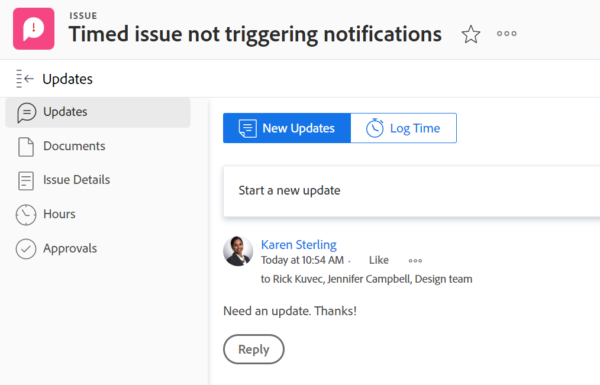

# 更新部分概述

<!--take "Beta" references out when we remove the beta-->

<!--The highlighted information on this page refers to functionality not yet generally available. It is available only in the Preview environment. -->

>[!NOTE]
>
>我们当前正在重新设计在Adobe Workfront中的注释体验。
>
>有关新评论体验的更多信息，请参阅 [新的注释体验](../../product-announcements/betas/new-commenting-experience-beta/unified-commenting-experience.md).
>
>您可以访问以下对象的新体验：
> * 在启用注释测试版时出现问题。
   >
   >     此功能仅适用于问题的“更新”部分，不适用于以下区域：
   >
   >     * 主页
   >     * 列表中的“摘要”面板
   >     * 工时单中的“摘要”面板
>
> * 目标

   >
   >   新的评论体验是目标的默认体验。 您必须拥有其他许可证才能访问Workfront Goals。 有关更多信息，请参阅 [使用Workfront目标的要求](../../workfront-goals/goal-management/access-needed-for-wf-goals.md).
   >
   >    有关对目标进行评论的信息，请参阅 [在Adobe Workfront目标中管理目标注释](../../workfront-goals/goal-management/manage-goal-comments.md).

对象的“更新”部分显示用户对跟踪对象更改的对象或系统更新所做的注释。

## 更新部分概述

“更新”部分中的信息的组织方式不同，具体取决于您从哪个环境访问该信息。

### 当前更新部分概述

对象的“更新”部分显示了过去90天内最近进行的200次更新。

当前的更新部分显示以下信息：

* 用户的评论以及对这些评论的回复。
* 系统更新，这些信息性消息是Workfront创建的，用于记录对象上的某些事件。 例如，您可以通过系统更新捕获状态、名称或自定义字段中的更改。 您的Workfront或组管理员可以为您的项目启用系统更新。 有关更多信息，请参阅 [配置系统更新](../../administration-and-setup/set-up-workfront/system-tracked-update-feeds/configure-system-updates.md).

将显示以下对象的“更新”部分：

<table style="table-layout:auto"> 
 <col> 
 <col> 
 <tbody> 
  <tr> 
   <td> 
    <ul> 
     <li>文档</li> 
     <li>目标</li> 
     <li>问题</li> 
     <li>迭代</li> 
     <li>项目</li> 
     <li>项目群</li> 
     <li>项目组合</li> 
    </ul> </td> 
   <td> 
    <ul> 
     <li>故事</li> 
     <li>任务</li> 
     <li>模板</li> 
     <li>模板任务</li> 
     <li>时间表</li> 
     <li>用户</li> 
    </ul> </td> 
  </tr> 
 </tbody> 
</table>

### 测试版评论体验中的“更新”部分概述

“更新”部分在新注释体验的以下选项卡中显示信息：

* **评论**:显示用户的评论以及对这些评论的回复。 有关更新新注释体验中对象的信息，请参阅 [更新工作](../updating-work-items-and-viewing-updates/update-work.md).
* **系统活动**:显示系统更新，这些信息性消息是Workfront为记录对象上的某些事件而创建的。 例如，您可以通过系统更新捕获状态、名称或自定义字段中的更改。 您的Workfront或组管理员可以为您的项目启用系统更新。 有关更多信息，请参阅 [配置系统更新](../../administration-and-setup/set-up-workfront/system-tracked-update-feeds/configure-system-updates.md).

目前，您可以使用测试版对以下对象添加评论体验来评论和回复更新：

<table style="table-layout:auto"> 
 <col> 
 <col> 
 <tbody> 
  <tr> 
   <td> 
    <ul> 
     <li>
目标

     
这是目标的默认体验

     </li> 
     </ul> </td> 
   <td> 
    <ul> 
     <li>问题</li> 
     </ul> </td> 
  </tr> 
 </tbody> 
</table>

## 也显示在较高级别对象上的更新

如下表所示，对某些对象的更新所做的回复也会显示在排名较高的对象的“更新”部分。

例如，在向任务添加更新时，该更新将显示在任务的“更新”部分和包含该任务的项目的“更新”部分。

<table style="table-layout:auto"> 
 <col> 
 <col> 
 <thead> 
  <tr> 
   <th><strong>添加原始更新的对象</strong> </th> 
   <th> 
<strong>还显示原始更新的排名较高的对象</strong> 
 </th> 
  </tr> 
 </thead> 
 <tbody> 
  <tr> 
   <td>问题</td> 
   <td>项目</td> 
  </tr> 
  <tr> 
   <td>任务</td> 
   <td>项目</td> 
  </tr> 
  <tr> 
   <td>项目</td> 
   <td>项目，Portfolio</td> 
  </tr> 
  <tr data-mc-conditions=""> 
   <td>文档 </td> 
   <td>附加文档的对象，项目 </td> 
  </tr> 
  <tr> 
   <td>项目群</td> 
   <td>项目组合</td> 
  </tr> 
  <tr> 
   <td>用户</td> 
   <td>团队</td> 
  </tr> 
  <tr> 
   <td>时间表</td> 
   <td>用户、团队</td> 
  </tr> 
  <tr> 
   <td>模板任务</td> 
   <td>模板</td> 
  </tr> 
  <tr> 
   <td>叙述</td> 
   <td>迭代，团队</td> 
  </tr> 
  <tr> 
   <td>迭代</td> 
   <td>团队</td> 
  </tr>

<tr> 
   <td>目标</td> 
   <td>结果，活动</td> 
  </tr> 
 </tbody> 
</table>

>[!NOTE]
>
>添加到系统更新的回复不会汇总到父对象。 只有对子对象的直接回复和添加到现有更新的回复才会汇总到父对象。
>
>有关Adobe Workfront中对象层次结构的信息，请参阅 [了解Adobe Workfront中的对象](../../workfront-basics/navigate-workfront/workfront-navigation/understand-objects.md).
>
> 无法在新的评论测试版体验中回复系统更新。 有关更多信息，请参阅 [新的注释体验](../../product-announcements/betas/new-commenting-experience-beta/unified-commenting-experience.md).

## “更新”部分的限制

团队的“更新”部分以及代表其他用户输入更新时存在一些限制。

### 用户和团队的限制

无法对团队进行更新。 团队的“更新”部分由在以下对象上输入的更新填充：

* 用户
* 时间表
* 故事
* 迭代

在用户和团队的“更新”部分中，您可以查看过去90天内输入的更新。

如果您想要查看对用户或团队所做的所有更新（超出90天限制），则可以构建报表以进行注释。 报表不应具有时间过滤器来显示为用户或团队进行的所有更新。 有关更多信息，请参阅 [创建自定义报表](../../reports-and-dashboards/reports/creating-and-managing-reports/create-custom-report.md).

### 代表其他用户输入评论时的限制

Adobe Workfront管理员和组管理员可以以其他用户身份登录，并在Workfront中执行一些操作，如输入注释。 (有关信息，请参阅 [以其他用户身份登录](../../administration-and-setup/add-users/create-and-manage-users/log-in-as-another-user.md).) 代表其他用户发表的任何评论都会在评论中指出。

群组管理员可以代表他人进行评论，但无法删除该评论。 只有Adobe Workfront管理员才能删除他们代表其他用户发表的评论。

## 使用日记帐分录报表查看工作项的系统更新

“日记帐分录”报表显示系统从项目、任务和问题的“更新”区域进行的更新。

报表允许您查看：

* 发生了多少次状态更改
* 删除任务或问题时
* 重要自定义字段中的值在项目过程中有何变化
* 在项目过程中，哪些重要日期发生了更改
* 如果在项目过程中优先级发生了更改
* 如果项目的所有者发生更改

有关更多信息，请参阅 [报告更新区域](../../reports-and-dashboards/reports/creating-and-managing-reports/create-journal-entry-report.md).
