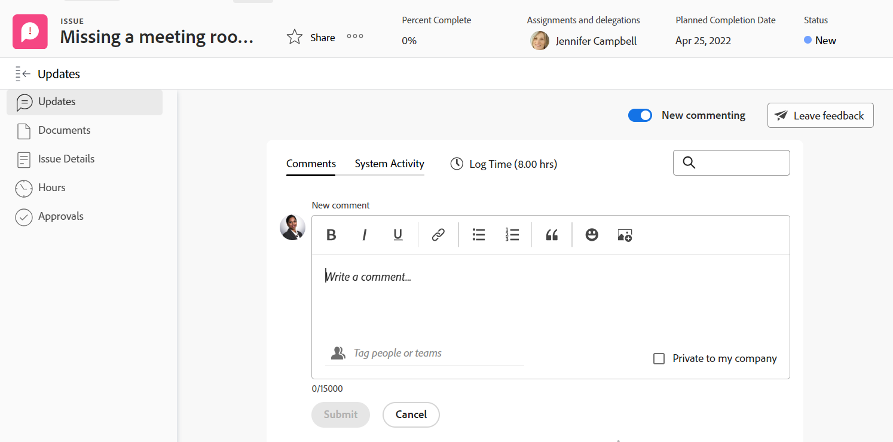

# 更新部分概述

<!-- Audited: 1/2024 -->

<!--take "legacy" and "new commenting" references out when we remove the legacy - April 2024???-->

<!--The highlighted information on this page refers to functionality not yet generally available. It is available only in the Preview environment for all customers. 

For information about the current release schedule, see [First Quarter 2024 release overview](/help/quicksilver/product-announcements/product-releases/24-q1-release-activity/24-q1-release-overview.md). -->

>[!IMPORTANT]
>
>我们当前正在重新设计Adobe Workfront中的评论体验。
>
>根据您访问评论体验的对象，您可能会看到更新部分的以下功能：
>* 新体验
>* 旧版体验
>* 新体验和旧体验
>
>本文包含有关更新部分的新版本和旧版本的信息。
>
>有关新的评论体验及其可用性的更多信息，请参阅 [新的评论体验](../../product-announcements/betas/new-commenting-experience-beta/unified-commenting-experience.md).
>
>新评论体验仅适用于Workfront对象的“更新”部分，当您从以下区域访问对象时，该体验不可用：
>
> * 主页
> * 列表中的摘要面板
> * 时间表中的“摘要”面板
> * 工作负载均衡器中的“摘要”面板

## “更新”部分的概述

对象的“更新”部分显示系统更新，以及用户在过去90天内进行的最近200次更新。

根据您访问评论体验的对象，您可能会在更新部分找到以下体验：

* 以下对象的新注释体验和旧注释体验：

   * 项目
   * 任务（包括故事）
   * 问题
   * 文档

     >[!TIP]
     >
     >使用新注释选项可显示新的注释体验（启用时）或旧版的注释体验（禁用时）。 默认使用新的评论体验。 有关更多信息，请参阅 [新的评论体验](../../product-announcements/betas/new-commenting-experience-beta/unified-commenting-experience.md).

* 只有下面列出的对象的新注释体验。 没有选项可为这些对象启用旧版注释体验：

   * 目标

     >[!NOTE]
     >
     >您必须具有Adobe Workfront目标的其他许可证才能访问Workfront的此区域。 有关更多信息，请参阅 [使用Workfront Goals的要求](../../workfront-goals/goal-management/access-needed-for-wf-goals.md).

   * 展示板上的信息卡
   * 团队
   * 模板
   * 模板任务
   * 时间表
   * 项目群
   * 项目组合
   * 用户

* 仅限以下对象的旧版注释体验：

   * 迭代

     没有选项可为迭代启用新的评论体验。

### 新评论体验中“更新”部分的概述

>[!NOTE]
>
>新的评论体验不适用于迭代。

* 更新部分显示新评论体验中以下选项卡中的信息：

   * **评论**：显示用户发表的评论以及对这些评论的回复。 使用“注释”选项卡可添加新注释或回复现有注释。 有关更新新注释体验中的对象的信息，请参见 [更新工作](../updating-work-items-and-viewing-updates/update-work.md).
   * **系统活动**：显示系统更新，这些是信息性消息，由Workfront创建，用于记录对象上的某些事件。 例如，状态、名称或自定义字段的更改通过系统更新来捕获。 您的Workfront或组管理员可以为您的对象启用系统更新。 有关更多信息，请参阅 [配置系统更新](../../administration-and-setup/set-up-workfront/system-tracked-update-feeds/configure-system-updates.md).

* 以下对象没有“系统活动”选项卡：

   * 团队
   * 模板
   * 模板任务
   * 临时信息卡

### 旧版更新部分的概述

<!--when we remove legacy, make this section an "Iterations-only" section-->

旧版更新部分将显示以下信息：

* **用户更新**：用户发表的评论以及对这些评论的回复。
* **系统更新**：Workfront创建用于记录对象上特定事件的信息性消息。 例如，您可以使用系统更新捕获状态、名称或自定义字段中的更改。 您的Workfront或组管理员可以为您的对象启用系统更新。 有关更多信息，请参阅 [配置系统更新](../../administration-and-setup/set-up-workfront/system-tracked-update-feeds/configure-system-updates.md).

以下对象不记录系统更新：

* 团队
* 模板
* 模板任务
* 迭代

## 也出现在较高排名对象上的更新

某些对象的注释、回复或系统更新也会显示在较高级别对象的“更新”部分中。

例如，将更新添加到任务时，该更新会显示在任务的“更新”部分以及包含该任务的项目的“更新”部分中。

下表显示其注释也显示在较高排名的对象上的对象：

<table style="table-layout:auto"> 
 <col> 
 <col> 
 <thead> 
  <tr> 
   <th><strong>添加了原始更新的对象</strong> </th> 
   <th> 
<strong>也会显示原始更新的更高排名对象</strong> 
 </th> 
  </tr> 
 </thead> 
 <tbody> 
  <tr> 
   <td>问题</td> 
   <td>项目</td> 
  </tr> 
  <tr> 
   <td>任务</td> 
   <td>项目</td> 
  </tr> 
  <tr> 
   <td>项目</td> 
   <td>项目，Portfolio</td> 
  </tr> 
  <tr data-mc-conditions=""> 
   <td>文档 </td> 
   <td>附加文档的对象，项目 </td> 
  </tr> 
  <tr> 
   <td>项目群</td> 
   <td>项目组合</td> 
  </tr> 
  <tr> 
   <td>用户</td> 
   <td>团队</td> 
  </tr> 
  <tr> 
   <td>时间表</td> 
   <td>
用户、团队

   
<b>注释</b>

   
时间表备注显示在做出备注的用户的“更新”部分及其主页团队的“更新”部分。

   </td> 
  </tr> 
  <tr> 
   <td>模板任务</td> 
   <td>模板</td> 
  </tr> 
  <tr> 
   <td>叙述</td> 
   <td>迭代，团队</td> 
  </tr> 
  <tr> 
   <td>迭代</td> 
   <td>团队</td> 
  </tr>

<tr> 
   <td>结果</td> 
   <td>目标</td> 
  </tr> 
  <tr> 
   <td>活动</td> 
   <td>目标</td> 
  </tr> 
 </tbody> 
</table>

>[!NOTE]
>
>添加到系统更新的回复不会汇总到父对象。 只有对子对象的直接回复和添加到现有更新的回复会汇总到父对象。
>
>有关Adobe Workfront中对象层次结构的信息，请参阅 [了解Adobe Workfront中的对象](../../workfront-basics/navigate-workfront/workfront-navigation/understand-objects.md).
>
> 无法在新评论体验中回复系统更新。 有关更多信息，请参阅 [新的评论体验](../../product-announcements/betas/new-commenting-experience-beta/unified-commenting-experience.md).

## “更新”部分的限制

团队的“更新”部分以及代表其他用户输入更新时，存在一些限制。

### 用户和团队的限制

查看用户和团队的更新时，请考虑以下事项：

* 您无法在团队的“更新”部分中添加新注释。

* 您可以向在团队中查看的更新添加回复。 回复显示在团队的“更新”部分以及它所属对象的更新部分中。

* 团队的“更新”部分由在以下对象上输入的更新填充：

   * 用户
   * 时间表*
   * 故事
   * 迭代*

  *这些选项不适用于新的评论体验。

* 在用户和团队的更新部分中，您可以查看在过去90天内输入的更新。

  如果想要在90天限制之外查看对用户或团队进行的所有更新，您可以构建注释报表。 报告不应具有显示针对用户或团队所做所有更新的时间过滤器。 有关更多信息，请参阅 [创建自定义报表](../../reports-and-dashboards/reports/creating-and-managing-reports/create-custom-report.md).

### 代表其他用户输入评论时的限制

Adobe Workfront管理员和组管理员可以其他用户身份登录，并在Workfront中执行操作，例如输入注释。

有关信息，请参阅 [以其他用户身份登录](../../administration-and-setup/add-users/create-and-manage-users/log-in-as-another-user.md).

以其他用户身份登录并添加注释时，请考虑以下事项：

* 代表其他用户所做的任何评论都将在评论中标明。

* 组管理员可以代表他人进行评论，但无法删除该评论。 只有Adobe Workfront管理员可以删除他们代表其他用户所做的评论。

* 仅当Workfront或组管理员以其他用户身份注销并以他们自己身份重新登录时，才能编辑他们代表其他用户添加的评论。 他们不能代表其他用户删除评论。

## 使用日记帐分录报表查看工作项的系统更新

日志条目报表从项目、任务和问题的更新区域显示系统更新。

该报告允许您查看：

* 发生了多少次状态更改
* 删除任务或问题时
* 重要自定义字段中的值在项目过程中如何变化
* 项目过程中更改了哪些重要日期
* 如果在项目过程中优先级发生了更改
* 如果项目所有者已更改

有关更多信息，请参阅 [报告更新区域](../../reports-and-dashboards/reports/creating-and-managing-reports/create-journal-entry-report.md).
