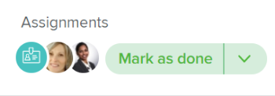

# 处理此项工作并完成按钮概述

当您被分配到任务或问题时，您可以使用上下文按钮，该按钮会根据您参与工作项目的程度更改名称和功能。

使用上下文按钮接受或完成工作项目，您可以让Adobe Workfront更新项目上的多个字段，而无需自己手动更新。

处理此项和完成按钮对具有以下功能的用户可见：

* 标准许可证（新）或计划或工作许可证（当前）
* 任务或问题的编辑访问权限有限或更高

## 处理它和“完成”按钮名称

根据您从哪个Workfront区域访问您的任务或问题，处理它或完成按钮可以更改名称，如以下方案所述：

* 当任务或问题首次分配给您并且状态为新建时，按钮显示为处理它。

  

  >[!TIP]
  >
  >您可以将“处理此项工作”按钮替换为“开始”按钮。 有关将“处理此项工作”按钮替换为“开始”按钮的信息，请参阅[将“处理此项工作”按钮替换为“开始”按钮](../../people-teams-and-groups/create-and-manage-teams/work-on-it-button-to-start-button.md) 。

* 单击“处理此项接受”后，按钮将变为“标记为完成”。 有关您可以在何处访问“处理它”按钮的信息，请参阅本文中的[找到处理它并完成按钮](#locate-the-work-on-it-and-done-button)部分。

  

<!--If you are not the only one assigned to the task or issue and you are accessing your work item from the My Work widget in the Home area, the button changes to Done with my part.

  -->

## 找到处理此项工作并标记为完成按钮 {#locate-the-work-on-it-and-done-button}

您可以在Workfront的以下区域中找到“处理此项工作”和“标记为完成”按钮：

* 我的工作小组件中的“主页”区域

  有关在“主页”区域中将项目标记为“完成”的信息，请参阅[在“主页”区域中将项目标记为“完成”](../../workfront-basics/using-home/using-the-home-area/mark-item-done-in-home.md)。

* 在任务或问题的标题中

  有关对象标头的信息，请参阅[新建对象标头](../../workfront-basics/the-new-workfront-experience/new-object-headers.md)。

* 在任务或问题摘要面板中

  有关使用摘要面板的信息，请参阅[摘要概述](../../workfront-basics/the-new-workfront-experience/summary-overview.md)。

## 单击处理它并标记为完成按钮时自动更新的字段概述

使用“处理此项工作”和“标记为完成”按钮的好处是，您可以允许Workfront自动更新分配给您的工作项的信息。

* [处理此项工作按钮](#work-on-it-button)
* [开始按钮](#start-button)
* [“完成”按钮](#the-done-button)

### 处理此项工作按钮 {#work-on-it-button}

单击处理它时，以下项目也会更新：

* 工作分配状态更新从“已请求”到“正在工作”

  >[!TIP]
  >
  >“工作分配状态”字段仅在报告和列表中可见。 有关“工作分配状态”字段的信息，请参阅[Adobe Workfront术语词汇表](../../workfront-basics/navigate-workfront/workfront-navigation/workfront-terminology-glossary.md)。

* 提交日期

  有关提交日期的信息，请参阅[提交日期概述](../../manage-work/projects/updating-work-in-a-project/overview-of-commit-dates.md)。

### “开始”按钮 {#start-button}

如果您有权编辑团队，则可以将处理它按钮替换为团队的“开始”按钮。 当以该团队作为其主团队的用户单击关于他们被分配到的项目的“开始”按钮时，其工作项目上的其他字段自动更新。 有关将“处理它”按钮替换为“开始”按钮的信息，请参阅[将“处理它”按钮替换为“开始”按钮](../../people-teams-and-groups/create-and-manage-teams/work-on-it-button-to-start-button.md)。

除了在单击处理它按钮时更新的字段外，在单击开始按钮时，以下字段会自动更新任务或问题：

* 状态
* 实际开始日期

  有关实际开始日期的信息，请参阅[项目实际开始日期概览](../../manage-work/projects/planning-a-project/project-actual-start-date.md)。

* 实际完成日期（如果“开始”按钮与等于“完成”或“已关闭”的状态关联）。

  有关实际完成日期的信息，请参阅[项目实际完成日期概览](../../manage-work/projects/planning-a-project/project-actual-completion-date.md)。

>[!NOTE]
>
>单击“撤消”按钮将工作项返回到原始状态并删除实际开始日期。
>
>“撤消”按钮在以下区域不可用：
>
>* 团队请求
>* 任务标题
>

### “完成”按钮 {#the-done-button}

>[!NOTE]
>
>在Workfront的所有区域中，“完成”按钮显示为“标记为完成”。

如果您有权编辑团队，则可以配置团队的“完成”按钮，以在将项目标记为已完成时更新任务或问题状态。 当将该团队作为其主团队的用户单击其项目上的“标记为完成”按钮时，以下字段将自动更新任务或问题：

* 状态
* 工作分配状态更新从“正在处理”到“已完成”
* 实际完成日期

有关为团队配置“完成”按钮的信息，请参阅以下文章：

* [配置任务的“完成”按钮](../../people-teams-and-groups/create-and-manage-teams/configure-the-done-button-for-tasks.md)
* [配置问题的完成按钮](../../people-teams-and-groups/create-and-manage-teams/configure-the-done-button-for-issues.md)
