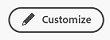

# Adobe Workfront中的新主页入门

新主页是一项用于管理工作的强大新功能。 可以自定义此灵活空间，以突出显示您最重要的工作并简化任务、问题、请求和批准管理。

## 自定义新主页

新主页设计为高度可自定义，允许您选择用于跟踪您最重要的工作的小组件，根据工作到期时间筛选工作范围，甚至可以添加颜色闪烁。

### 构件

小组件是New Home的基础。 通过将小组件添加到主页，您可以选择显示的信息类型，以便最好地满足您的工作需求。 某些构件仅适用于特定许可证类型，因为它们跟踪的对象仅适用于这些许可证。 以下是目前可供选择的十个小部件，以及它们所显示的信息摘要：

* **我的工作**\
    此构件非常适合开始管理各种工作，它可以在一个位置显示所有已分配的任务、问题和请求。

* **我的项目**\
    在一个表格中显示分配给您的项目，该表格可按排序以仅显示您拥有的项目或您所在的所有项目；标准筛选、查看和分组选项；以及用于直接创建新项目的按钮。

* **我的任务**\
    在表格中显示分配给您的任务，表格中包含可自定义的筛选器、视图和分组，以及一个用于直接创建新任务的按钮。

* **我的问题**\
    在表格中显示分配给您的问题，表格中包含可自定义的筛选器、视图和分组，以及一个用于直接创建新问题的按钮。

* **我的请求**\
    显示分配给您的所有请求、一个仅允许您显示打开请求的过滤器以及一个打开请求的摘要窗格的按钮。

* **团队请求**\
    显示您按团队排序的团队的所有待处理请求，以及直接将请求分配给用户或自己处理请求的按钮。

* **正在等待我的审批**\
    显示您的所有未决分配或委托的审批、用于委托审批的按钮以及直接在小部件中做出审批决策的按钮。

* **所有审批**\
    在一个带有可自定义列的表格中显示组织的所有批准，以及一个允许您搜索特定批准的搜索栏。

* **提及**\
    显示最近评论线程，这些线程在Workfront中包含@提及您的内容，以及一个允许您在小部件中撰写回复的回复按钮。

* **待办事项**\
    这个独特的构件允许您向个人清单添加文本项目，以供您自由编辑。

有关添加、移动、调整或删除小部件的信息，请参阅 [在新主页中添加、编辑或删除构件](/help/quicksilver/workfront-basics/using-home/new-home/add-edit-remove-widgets-in-new-home.md)

### 后台自定义

通过选择页面顶部的彩色横幅，可以向主页添加一点个人光晕。

**更改主页背景的颜色：**

1. 通过单击Adobe Workfront图标，导航到您的主页  ，或者单击主菜单图标  然后单击 **主页**.

1. 单击屏幕右上角的自定义按钮。

   

1. 在 **背景** 部分 **自定义** 窗格，单击要为“主页”背景选择的颜色。 您还可以单击 **无** 以删除背景。

### 按时间范围筛选

您可以快速筛选主页上的所有信息，以在三个特定时间范围内显示对象信息：天、周或月。 此外，主页顶部还会显示您到期的任务数以及在范围内完成的任务数的摘要。

**要更改主页的时间范围，请执行以下操作：**

1. 通过单击Adobe Workfront图标，导航到您的主页  ，或者单击主菜单图标  然后单击 **主页**.

1. 单击主页左上角的时间范围过滤器。 默认情况下，过滤器设置为 **我的周**.

   

1. 单击 **日**， **周**，或 **月** 对主页进行过滤，使其仅显示在该时间范围内到期的对象信息。

## 还原到当前主页体验

对于更喜欢现有“主页”体验的用户，可以切换“新主页”。

**要返回到当前主页体验，请执行以下操作：**

1. 通过单击Adobe Workfront图标，导航到您的主页  ，或者单击主菜单图标  然后单击 **主页**.

1. 单击 **返回当前主页** 按钮进行修改。

   

1. 在显示的确认窗口中，您可以选择参加一个简短的调查来了解您在New Home中的体验，或者单击 **返回当前主页** 以最终确定您的决策并恢复到当前主页体验。
