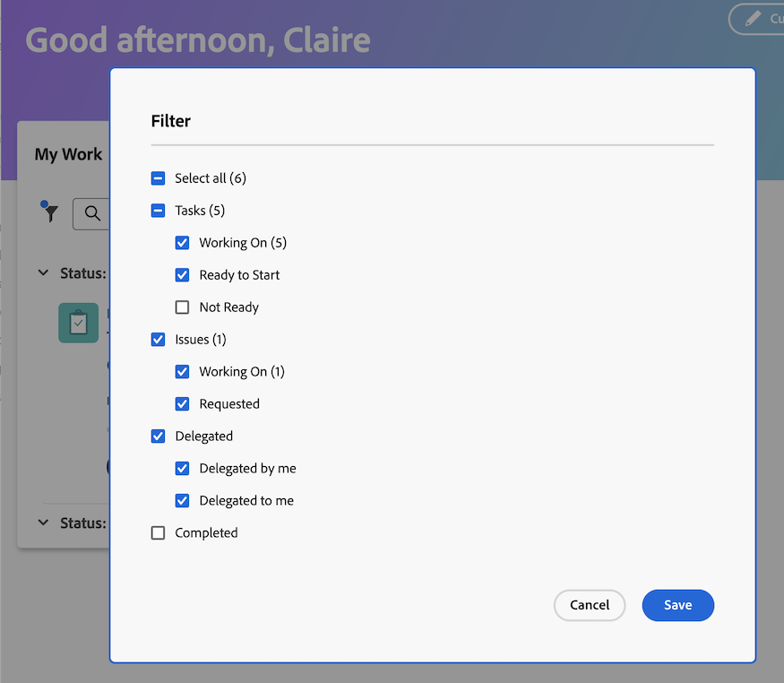
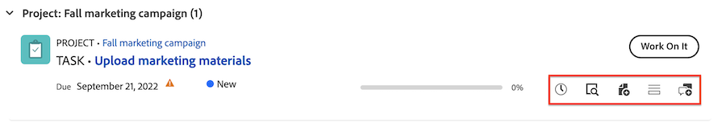

# 从旧主页移至新主页

旧版主页将在2017年10月的第4季度版本中从Workfront删除。 本文提供有关新主页中可用的功能的信息，以及对于Workfront管理员将用户迁移到“新主页”体验的建议。

有关旧版主页弃用的更多信息，请参阅[旧版主页弃用指南]。

## 了解从旧版主页到新主页有何变化

### 工作列表

#### 使用“我的工作”小组件组织工作

“我的工作”小组件以小组件形式创建，以便尽可能详细地镜像旧版主页工作列表。 用户可以使用类似的过滤器和分组在我的工作小部件中分组和过滤其工作列表：

| **筛选器** | **分组** |
|------------|-----------|
|  — 正在处理  — 准备开始  — 未就绪  — 已请求  — 已委派  — 已完成 |  — 项目  — 状态  — 到期日期  — 无 |

**旧主页分组在新主页中不可用**

* 计划完成日期 — 在新主页中重命名为“到期日期”
* 已计划开始
* 承诺日期
* 我的优先级

| **旧主页** | **新主页** |
|------------|-----------|
|  |  |

#### 委派工作

用户仍然可以在以下小组件中从新主页委派工作：

* 我的工作
* 我的任务
* 我的问题
* 我的审批

用户可在以下小组件中找到委派给他们的工作：

* 我的工作小部件使用“委派给我”筛选器
* 使用委托的审批过滤器的我的审批

| **旧主页** | **新主页** |
|------------|-----------|
|  |  |

#### 使用日历视图

日程表视图在新主页中不再可用；但是，日程表替代在优先级的路线图上。

#### 创建个人任务

用户不能再像在旧版主页中一样创建个人任务，而是可以创建待办事项。

#### 查看我已提交的审批

用户可以使用我已提交的审批过滤器，在我的审批小部件中查看他们在新主页提交的审批。

#### 将项目添加到我的优先级

用户不能再访问“新主页”中的“我的优先级”功能。 我们将引入新的“我的焦点”列，其中的“优先级”将取代此列。

如果需要，用户可以使用展示板构件跟踪高优先级项目。

### 更新工作项

在旧版主页中，用户可以使用正确的面板更新其工作。 在新主页中，用户现在使用摘要面板更新工作。 这是项目、任务、问题和文档中提供的相同“摘要”面板。

#### 使用摘要面板

在摘要中，用户可以

* 更新完成百分比
* 添加更新
* 导航到文档区域以上传文档
* 查看工作项详细信息和更新自定义字段
Workfront管理员可以自定义哪些字段显示在布局模板的摘要中。 有关详细信息，请参阅[使用布局模板自定义主页和摘要](/help/quicksilver/administration-and-setup/customize-workfront/use-layout-templates/customize-home-summary-layout-template.md)。
* 更改工作项状态
* 查看子任务
* 记录时间
* 查看附加的审批流程
* 上传文件 — 此功能是新增功能

| **旧主页** | **新主页** |
|------------|-----------|
|  |  |

#### 打开摘要面板

用户可以通过将鼠标悬停在工作项上，然后单击&#x200B;**摘要**&#x200B;图标来打开“摘要”面板。

有关如何使用摘要面板的其他信息，请参阅[摘要概述](/help/quicksilver/workfront-basics/the-new-workfront-experience/summary-overview.md)。

#### 使用快速操作

除了摘要面板之外，用户还可以使用快速操作来

* 记录时间
* 添加更新
* 更新自定义表单
* 上传文件

要找到快速操作菜单，请将鼠标悬停在工作项上。 快速操作列表显示在&#x200B;**处理它**&#x200B;或&#x200B;**完成**&#x200B;按钮附近。

### 查看审批和团队请求

用户仍然可以使用以下小组件在“新主页”中管理批准和团队请求：

* 我的审批
* 所有审批
* 团队请求

有关向新主页添加构件的信息，请参阅新主页中的[添加、编辑或删除构件]。

## 了解可用的构件

小组件是“新主页”的基础。 通过将小组件添加到主页，用户可以选择显示的信息类型，以便最好地满足其工作需求。 某些构件仅适用于特定许可证类型，因为它们跟踪的对象仅适用于这些许可证。

Workfront管理员可以使用布局模板自定义“新建主页”中可用的小组件。 有关详细信息，请参阅[使用布局模板自定义新主页](/help/quicksilver/administration-and-setup/customize-workfront/use-layout-templates/customize-new-home-layout-template.md)。

+++ 展开以查看可用小部件的详细列表
以下是目前可供选择的11个小组件，以及它们显示的信息摘要：

* **我的工作**\
   在一个位置显示所有分配的任务、问题和请求。 您可以单击“处理此项工作”按钮开始处理项目，或单击“完成”按钮将其标记为完成。 您还可以从“我的工作”小组件更新有关任务和问题的信息（状态、条件、完成百分比）、记录时间并添加更新。

* **展示板**\
    显示您已创建或受邀使用的任何讨论区。 您还可以基于以下模板创建新展示板：基本展示板、Kanban展示板、回顾展示板、动态展示板。

* **我的项目**\
    在列表中显示您拥有的&#x200B;_项目_&#x200B;或您参与的&#x200B;_项目_。 您可以使用现有的筛选器、视图或分组来自定义列表，也可以直接从小组件创建项目。

* **我的任务**\
    在列表中显示分配给您的任务。 您可以使用现有的筛选器、视图或分组来自定义列表，也可以直接从小组件创建任务。 您还可以在外出时委派任务。

* **我的问题**\
    在列表中显示分配给您的问题。 您可以使用现有的过滤器、视图或分组来自定义列表，也可以直接从小组件创建问题。 此构件仅包含其关联项目设置为当前的问题，不包括已完成的项目。 您还可以在外出时委派问题。

* **我的请求**\
    显示您已提交的所有请求，一个过滤器用于仅显示打开的请求，以及一个用于打开请求的摘要面板的按钮。

* **团队请求**\
    显示您所在团队的所有待处理请求（按团队排序），以及用于直接将请求分配给用户或自己处理请求的按钮。

* **我的审批**\
    显示所有待分配或委派的审批、一个委派审批的按钮以及可直接在小组件内做出审批决策的按钮。

* **所有审批**\
        显示2个图表，其中包含有关平均审批时间和决策的信息，以及未决和超期审批的列表视图。 此功能属于分阶段发布，当前仅适用于特定客户。

* **提及**\
    显示来自Workfront的最近评论线程，类似于“我的更新”页面。 您可以使用回复按钮在小组件中撰写回复。 只要任务或问题在过去30天内已更新，此构件还显示有关您分配到的任务或问题、您分配给另一个用户、您拥有、您是其主要联系人或您创建的任务或问题的评论。

* **待办事项**\
    这个独特的构件允许您向个人清单添加项目，以便您自由编辑。 会将待办事项作为个人项目中的任务进行跟踪，并在完成后保留长达两周。

  >[!NOTE]
  >
  >您必须具有创建任务的权限，才能在待办事项构件中创建待办事项，并且只有由当前用户输入的个人任务才会显示在待办事项构件中。

+++

### 查看可用于每种许可证类型的构件

默认情况下，主页会根据您的许可证类型填充几个特定的构件。 下表概述了每种许可证类型的用户首次导航到“新主页”时看到的构件。

<table border="1" class="inlineTable">
    <tr>
        <td><b>新许可证类型</b></td>
        <td><b>默认构件</b></td>
    </tr>
    <tr>
        <td>标准</td>
        <td>我的项目、我的工作、提及、待办事项</td>
    </tr>
    <tr>
        <td>轻量</td>
        <td>我的工作，我的批准</td>
    </tr>
    <tr>
        <td>投稿人</td>
        <td>我的请求、提及、我的批准、讨论区</td>
    </tr>
    <tr>
        <td>外部的</td>
        <td>我的审批</td>
    </tr>
</table>

<table border="1" class="inlineTable">
    <tr>
        <td><b>当前许可证类型</b></td>
        <td><b>默认构件</b></td>
    </tr>
    <tr>
        <td>规划</td>
        <td>我的项目、提及内容、待办事项</td>
    </tr>
    <tr>
        <td>工作</td>
        <td>我的工作、提及、待办事项</td>
    </tr>
    <tr>
        <td>评论</td>
        <td>我的工作，提及</td>
    </tr>
    <tr>
        <td>请求</td>
        <td>我的项目，我的审批</td>
    </tr>
    <tr>
        <td>贡献</td>
        <td>我的工作，提及</td>
    </tr>
    <tr>
        <td>外部的</td>
        <td>我的审批</td>
    </tr>
</table>

## 为弃用做准备

为了帮助您和您的组织最大限度地减少中断，以下提供了一些有助于简化过渡的建议。

### 开始过渡到新主页

我们的主要建议是尽快开始过渡到新主页。 从组织上讲，这意味着您的管理员通过版面模板（与旧版主页类似）自定义用户体验，以确保每个用户都有他们需要的内容。

我们建议管理员：

1. 使用布局模板构建默认的新主页布局（或者，也可以选择为需要唯一布局的每个用户、团队、组或工作角色创建一个布局）。 有关详细信息，请参阅[使用布局模板自定义新主页](/help/quicksilver/administration-and-setup/customize-workfront/use-layout-templates/customize-new-home-layout-template.md)。

1. 将您的新布局模板分配给少数测试用户，这些用户可以验证其小部件和常规设置是否符合其工作需求。

1. 将其余用户重新分配到新主页布局。

然后，尽快执行此操作将为您的用户留出时间来适应新体验并自定义其新主页，以便最好地满足其个人需求。 有关用户如何在自己的新主页上自定义小组件的信息，请参阅[在新主页中删除、添加和重新排列小组件]。

### 面向最终用户的资源

**帮助文章**

* [使用“我的工作”小组件管理您的工作]

**培训**

* [在主页教程中移除、添加和重新排列小组件](https://experienceleague.adobe.com/en/docs/workfront-learn/tutorials-workfront/home/remove-add-and-rearrange-widgets)
* Adobe Workfront中的[工作程序基础知识](https://adobe-ats.sabacloud.com/Saba/Web_spf/PRODTNT100/app/me/learningeventdetail/cours000000000098821?regId=regdw000000001250612)

>[!IMPORTANT]
>
>这是免费课程，但您必须登录并注册才能访问它。