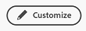

# 添加、编辑或删除主页中的小组件

<!-- Audited: 4/2025 -->

您可以从许多小组件中进行选择，以自定义主页上显示的内容。 这些构件可以调整大小并重新排列。

## 可用于特定许可证类型的构件

默认情况下，主页会根据您的许可证类型填充特定的构件。

+++ 展开以查看可用于每种许可证类型的构件

<table border="1" class="inlineTable">
    <tr>
        <td><b>新许可证类型</b></td>
        <td><b>默认构件</b></td>
    </tr>
    <tr>
        <td>标准</td>
        <td>我的项目、我的工作、提及、待办事项</td>
    </tr>
    <tr>
        <td>轻量</td>
        <td>我的工作、我的批准</td>
    </tr>
    <tr>
        <td>投稿人</td>
        <td>我的请求、提及、我的批准、讨论区</td>
    </tr>
    <tr>
        <td>外部的</td>
        <td>我的审批</td>
    </tr>
</table>

<table border="1" class="inlineTable">
    <tr>
        <td><b>当前许可证类型</b></td>
        <td><b>默认构件</b></td>
    </tr>
    <tr>
        <td>规划</td>
        <td>我的项目、提及内容、待办事项</td>
    </tr>
    <tr>
        <td>工作</td>
        <td>我的工作、提及、待办事项</td>
    </tr>
    <tr>
        <td>评论</td>
        <td>我的工作，提及</td>
    </tr>
    <tr>
        <td>请求</td>
        <td>我的项目、我的批准</td>
    </tr>
    <tr>
        <td>贡献</td>
        <td>我的工作，提及</td>
    </tr>
    <tr>
        <td>外部的</td>
        <td>我的审批</td>
    </tr>
</table>

+++

## 将构件添加到主页

小组件是Home的基础。 通过将小组件添加到主页，您可以选择显示的信息类型，以便最好地满足您的工作需求。 某些构件仅适用于特定许可证类型，因为它们跟踪的对象仅适用于这些许可证。 有关详细信息，请参阅上面的特定许可证类型[可用的](#widgets-available-for-specific-license-types)小组件。

添加构件：

1. 导航到您的主页，方法是：如果将“主页”设置为登录页，则单击屏幕顶部的Adobe Workfront图标；或者单击主菜单图标，然后单击&#x200B;**主页**。

1. 单击屏幕右上角的&#x200B;**自定义**。

   
1. 滚动到&#x200B;**小组件**&#x200B;部分，然后选择要添加的小组件。

   +++ 展开以查看可用小部件的详细列表

   * **我的工作**\
       在一个位置显示所有分配的任务、问题和请求。 您可以单击“处理此项工作”按钮开始处理项目，或单击“完成”按钮将其标记为完成。 您还可以从“我的工作”小组件更新有关任务和问题的信息（状态、条件、完成百分比）、记录时间并添加更新。

   * **展示板**\
       显示您已创建或受邀使用的任何讨论区。 您还可以基于以下模板创建新展示板：基本展示板、Kanban展示板、回顾展示板和动态展示板。

   * **我的项目**\
       在列表中显示您拥有的项目或您所在的项目。 您可以使用现有的筛选器、视图或分组来自定义列表，也可以直接从小组件创建项目。

   * **我的任务**\
       在列表中显示分配给您的任务。 您可以使用现有的筛选器、视图或分组来自定义列表，也可以直接从小组件创建任务。 您还可以在外出时委派任务。

   * **我的问题**\
       在列表中显示分配给您的问题。 您可以使用现有的过滤器、视图或分组来自定义列表，也可以直接从小组件创建问题。 此构件仅包含其关联项目设置为当前的问题，不包括已完成的项目。 您还可以在外出时委派问题。

   * **我的请求**\
       显示您已提交的所有请求，一个过滤器用于仅显示打开的请求，以及一个用于打开请求的摘要面板的按钮。

   * **团队请求**\
       显示您所在团队的所有待处理请求（按团队排序），以及用于直接将请求分配给用户或自己处理请求的按钮。

   * **我的审批**\
       显示所有待定的分配或委托的审批，一个用于委托审批的按钮，以及用于直接在小组件内做出审批决策的按钮。 审批顺序如下：
      * 超期截止日期
      * 近期截止日期
      * 无截止日期的项目

   * **文档审批指标**\
           显示2个图表，其中包含有关平均审批时间和决策的信息，以及未决和超期审批的列表视图。 您必须启用[统一审批](/help/quicksilver/review-and-approve-work/document-reviews-and-approvals/document-approvals-overview.md)才能使用此小组件。

   * **提及**\
       显示来自Workfront的最近评论线程，类似于“我的更新”页面。 您可以使用回复按钮在小组件中撰写回复。 只要任务或问题在过去30天内已更新，此构件还显示有关您分配到的任务或问题、您分配给另一个用户、您拥有、您是其主要联系人或您创建的任务或问题的评论。

   * **待办事项**\
       这个独特的构件允许您向个人清单添加项目，以便您自由编辑。 会将待办事项作为个人项目中的任务进行跟踪，并在完成后保留长达两周。

     >[!NOTE]
     >
     >您必须具有创建任务的权限，才能在待办事项构件中创建待办事项，并且只显示由当前用户输入的个人任务。

   +++

1. 单击&#x200B;**添加构件**。

## 在主页上移动构件或调整构件大小

1. 导航到您的主页，方法是：如果将“主页”设置为登录页，则单击屏幕顶部的Adobe Workfront图标；或者单击主菜单图标，然后单击&#x200B;**主页**。

1. 在主页上查找要移动的小部件或调整其大小。

1. 将光标悬停在小部件的上边缘上直到它变成手形为止，移动小部件，然后单击并拖动直到小部件位于所需的位置。 移动小组件时，其他小组件将在其中移动。

1. 通过单击并拖动小组件右下角的调整大小图标来调整小组件大小。

## 从主页中删除构件

1. 导航到您的主页，方法是：如果将“主页”设置为登录页，则单击屏幕顶部的Adobe Workfront图标；或者单击主菜单图标，然后单击&#x200B;**主页**。

1. 在主页上找到要删除的构件，然后单击构件右上角的&#x200B;**更多**&#x200B;图标。

1. 单击&#x200B;**删除**。

## 更改背景的颜色

1. 导航到您的主页，方法是：如果将“主页”设置为登录页，则单击屏幕顶部的Adobe Workfront图标；或者单击主菜单图标，然后单击&#x200B;**主页**。

1. 单击屏幕右上角的&#x200B;**自定义**。

   

1. 在&#x200B;**自定义**&#x200B;面板的&#x200B;**背景**&#x200B;部分中，单击要为主页背景选择的颜色。 您还可以单击&#x200B;**无**&#x200B;删除背景。
