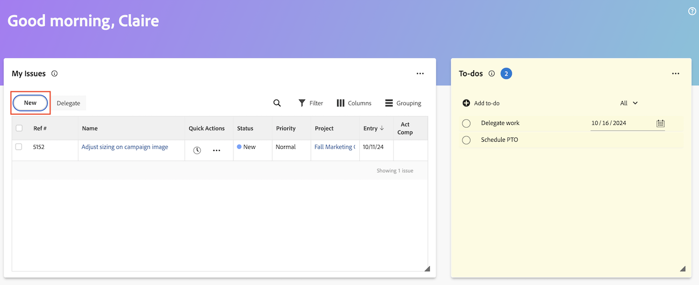

# 从主页区域创建工作项和项目

您可以从[!UICONTROL 主页]区域创建工作项和项目。

在家中，您可以

* 提交请求
* 将任务和问题添加到特定项目
* 从模板、空白项目创建项目或导入MS项目。

## 访问要求

+++ 展开以查看本文中各项功能的访问要求。

您必须具有以下权限才能执行本文中的步骤：

<table style="table-layout:auto"> 
 <col> 
 <col> 
 <tbody> 
  <tr> 
   <td role="rowheader"><strong>[!DNL Adobe Workfront plan*]</strong></td> 
   <td> 
任何
 </td> 
  </tr> 
  <tr> 
   <td role="rowheader"><strong>[!DNL Adobe Workfront] 许可证*</strong></td> 
   <td> 
[!UICONTROL Work]或更高版本
 </td> 
  </tr> 
  <tr> 
   <td role="rowheader"><strong>访问级别配置*</strong></td> 
   <td> 
[!UICONTROL Worker]
 
<b>注释</b>
 
   
如果您仍然没有访问权限，请询问您的[!DNL Workfront]管理员是否对您的访问级别设置了其他限制。 有关[!DNL Workfront]管理员如何修改访问级别的信息，请参阅<a href="../../../administration-and-setup/add-users/configure-and-grant-access/create-modify-access-levels.md" class="MCXref xref">创建或修改自定义访问级别</a>。
 </td> 
  </tr> 
  <tr> 
   <td role="rowheader"><strong>对象权限</strong></td> 
   <td> 
[!UICONTROL Edit]或更高版本对任务的访问权限
 
有关请求其他访问权限的信息，请参阅<a href="../../../workfront-basics/grant-and-request-access-to-objects/request-access.md" class="MCXref xref">请求访问对象</a>。
 </td> 
  </tr> 
 </tbody> 
</table>

&#42;要了解您拥有什么计划、许可证类型或访问权限，请与[!DNL Workfront]管理员联系。

+++

## 创建个人待办事项

您可以在[!UICONTROL 主页]区域的待办事项小部件中创建个人待办事项。 待办事项是您为自己创建的个人任务。

您和其他用户可以在个人任务报告中查看您的个人任务。 如果需要，他们可以将这些资源添加到项目中。

>[!TIP]
>
>您从用户配置文件页面发送给其他用户或发送给您自己的工作项，也会显示在用户“主页”区域的待办事项小部件中。 有关信息，请参阅[创建个人任务](/help/quicksilver/workfront-basics/updating-work-items-and-viewing-updates/create-personal-tasks.md)。

要创建待办事项，请执行以下操作：

1. 单击右上角的&#x200B;**[!UICONTROL 主菜单]** 或左上角的&#x200B;**主菜单** （如果可用），然后单击&#x200B;**[!UICONTROL 主页]**。
1. （视情况而定）单击&#x200B;**自定义**，然后单击&#x200B;**待办事项**&#x200B;以将待办事项小组件添加到主屏幕。
1. 转到&#x200B;**待办事项**&#x200B;小组件，然后单击&#x200B;**添加待办事项**。
1. 键入个人待办事项的名称，然后单击Enter。
1. （可选）单击&#x200B;**日期**&#x200B;图标以添加项目的截止日期。
   
1. （可选）创建个人任务报告或过滤器。 有关创建个人任务筛选器的信息，请参阅[筛选器：个人任务](/help/quicksilver/reports-and-dashboards/reports/custom-view-filter-grouping-samples/filter-personal-tasks.md)。
您可以在个人任务报告中查看您的待办事项以及其他用户的待办事项。

## 将任务添加到项目

您可以直接从主页区域将任务添加到现有项目：

1. 单击右上角的&#x200B;**[!UICONTROL 主菜单]** ，然后单击&#x200B;**[!UICONTROL 主页]**。
1. （视情况而定）将&#x200B;**我的任务**&#x200B;构件添加到您的主屏幕。 单击&#x200B;**自定义**，然后找到&#x200B;**我的任务**。
1. 转到&#x200B;**我的任务**&#x200B;小组件，然后单击&#x200B;**新建**。
   
1. 在&#x200B;**新建任务**&#x200B;对话框中，输入任务名称。
1. 开始键入项目名称，然后从列表中选择该名称。
1. （可选）在以下字段中输入信息：

   | 字段 | 说明 |
   |----------|----------|
   | **描述** | 输入说明。 |
   | **分配** | 分配用户。 |
   | **持续时间** | 输入持续时间。 |
   | **计划完成日期** | 选择计划的完成日期。 |
   | **更多选项** | 选择更多选项以配置任务的更多设置。 有关创建任务的详细信息，请参阅[编辑任务](/help/quicksilver/manage-work/tasks/manage-tasks/edit-tasks.md)。 |

1. 单击&#x200B;**创建任务**。

## 将问题添加到项目

您可以直接从主页区域将问题添加到现有项目：

1. 单击右上角的&#x200B;**[!UICONTROL 主菜单]** ，然后单击&#x200B;**[!UICONTROL 主页]**。
1. （视情况而定）将&#x200B;**我的问题**&#x200B;构件添加到您的主屏幕。 单击&#x200B;**自定义**，然后找到&#x200B;**我的问题**。
1. 转到&#x200B;**我的问题**&#x200B;小组件，然后单击&#x200B;**新建**。
   
1. 在&#x200B;**新问题对话框**&#x200B;框中，开始键入项目名称，然后从列表中选择该名称。
1. 输入问题名称。
1. （可选）在以下字段中输入信息：

   | 字段 | 说明 |
   |----------|----------|
   | **描述** | 输入说明。 |
   | **分配** | 分配用户。 |
   | **优先级** | 选择优先级。 |
   | **文档** | 上载文档。 |

1. 单击&#x200B;**保存新问题**。

## 创建请求

您可以直接从“主页”区域创建请求：

1. 单击右上角的&#x200B;**[!UICONTROL 主菜单]** ，然后单击&#x200B;**[!UICONTROL 主页]**。
1. （视情况而定）将&#x200B;**我的请求**&#x200B;构件添加到您的主屏幕。 单击&#x200B;**自定义**，查找&#x200B;**我的请求**。
1. 转到&#x200B;**我的请求**&#x200B;构件，然后单击&#x200B;**新建**。
   

1. 在&#x200B;**新建请求**&#x200B;对话框中，开始键入请求队列的名称。
1. 填写相关字段。
1. 单击&#x200B;**提交**。

有关提交请求的更多信息，请参阅[创建并提交请求](/help/quicksilver/manage-work/requests/create-requests/create-submit-requests.md)。

## 创建项目

您可以直接从“主页”区域创建项目：

1. 单击右上角的&#x200B;**[!UICONTROL 主菜单]** ，然后单击&#x200B;**[!UICONTROL 主页]**。
1. （视情况而定）将&#x200B;**我的项目**&#x200B;构件添加到您的主屏幕。 单击&#x200B;**自定义**，然后查找&#x200B;**我的项目**。
1. 转到&#x200B;**我的项目**&#x200B;小组件，然后单击&#x200B;**新建**。
   
1. 选择下列选项之一：

   | 字段 | 说明 |
   |----------|----------|
   | 从模板 | 转到[使用模板创建项目](/help/quicksilver/manage-work/projects/create-projects/create-project-from-template.md)，了解有关从模板创建项目的详细说明。 |
   | 空白项目 | 转到[从头开始创建项目](/help/quicksilver/manage-work/projects/create-projects/create-project.md#create-a-project-from-scratch)，了解有关创建空白项目的详细说明。 |
   | 导入 MS 项目 | 转到[从Microsoft项目导入项目](/help/quicksilver/manage-work/projects/create-projects/import-project-from-ms-project.md)，了解有关导入MS项目的详细说明。 |

<!--
## Create a board

You can create a board directly from the Home area:

1. Click the **[!UICONTROL Main Menu]**  in the upper-right corner, then click **[!UICONTROL Home]**.
1. (Conditional) Add the **Boards** widget to your home screen. Click **Customize**, and find **Boards**. -->

<!--
## Delete a to-do item

1. Click the **[!UICONTROL Main Menu]**  in the upper-right corner, then click **[!UICONTROL Home]**.
1. Go to the to-do widget.
1. Hover over the item, then click the **Delete** icon . 

## Edit a to-do item

1. Click the **[!UICONTROL Main Menu]**  in the upper-right corner, then click **[!UICONTROL Home]**.
1. Go to the to-do widget.
1. Edit the item name.
1. Click on the **Date** icon  to add or adjust a due date. -->
