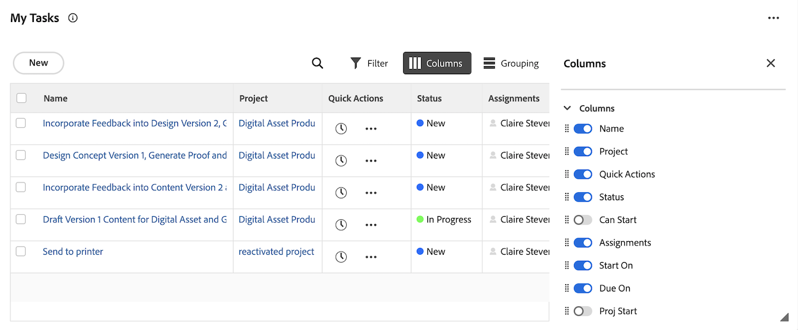

# 在[!UICONTROL 主页]区域的[!UICONTROL 工作列表]中显示项目

<!-- Audited: 1/2024 -->

每个构件都包含自己的工作列表。 工作列表显示分配给您的所有工作项。 您可以使用筛选器和分组控制[!UICONTROL 工作列表]中显示的项目。

>[!IMPORTANT]
>
>* 要在主页小组件中显示任务和问题，其父项目必须处于当前状态或等于当前状态。
>* 项目还必须处于当前状态或等于当前显示在主页中的状态。

## 访问要求

+++ 展开以查看本文中各项功能的访问要求。

您必须具有以下权限才能执行本文中的步骤：

<table style="table-layout:auto"> 
 <col> 
 </col> 
 <col> 
 </col> 
 <tbody> 
  <tr> 
   <td role="rowheader"><strong>[!DNL Adobe Workfront plan]</strong></td> 
   <td> 
任何
 </td> 
  </tr> 
  <tr> 
   <td role="rowheader"><strong>[!DNL Adobe Workfront] 许可证</strong></td> 
   <td> 
新增：
<ul><li>[！UICONTROL Contributor]仅供审批</li> <li>[！UICONTROL Standard]或更高版本（适用于所有其他对象）</li> 
或
 
  </ul>
当前：
<ul><li>[！UICONTROL Review]仅供审批</li> <li>适用于所有其他对象的[！UICONTROL工作]或更高版本</li> </td> 
  </tr> </ul>
  <tr> 
   <td role="rowheader"><strong>访问级别配置</strong></td> 
   <td> 
[！UICONTROL视图]或更高的项目、任务、问题和文档访问权限
 </td> 
  </tr> 
  <tr> 
   <td role="rowheader"><strong>对象权限</strong></td> 
   <td> 
您需要处理的任务和问题的Contribute权限或更高版本
  </td> 
  </tr> 
 </tbody> 
</table>

有关此表中信息的更多详细信息，请参阅Workfront文档中的[访问要求](/help/quicksilver/administration-and-setup/add-users/access-levels-and-object-permissions/access-level-requirements-in-documentation.md)。

+++

## 要在工作列表中显示的工作项的要求

有一些内置要求，工作项会针对这些要求显示在某些构件工作列表中。 工作项必须满足这些要求才能显示在以下小部件的工作列表中。

### 我的任务小组件

任务必须符合以下要求才能显示在“我的任务”小部件中：

* 任务状态不等于“完成”。
* 必须将登录用户分配给任务。
* 任务状态不等于“已完成”。
* 任务所属的项目必须处于与当前项目相同的状态。

### 我的问题小组件

问题必须符合以下要求才能显示在我的问题小部件中：

* 必须将登录用户分配给问题。
* 问题状态不等于“完成”。
* 没有未解析的对象附加到问题。
* 问题状态不等于“已完成”。
* 问题所属的项目必须处于等于当前状态。

### 我的团队小组件

团队请求必须符合以下要求才能显示在“我的团队”小部件中：

* 登录用户属于工作项分配到的团队。
* 工作项状态不等于“完成”。
* 该工作项没有附加未解决的审批流程。
* 该工作项不是周期性任务。
* 工作项所属的项目必须处于等于当前状态。

## 筛选您的工作

您可以筛选小组件[!UICONTROL 工作列表]中的项，以仅查看特定类型的项。 例如，您可以筛选我的工作[!UICONTROL 工作列表]以仅显示问题或请求。

>[!NOTE]
>
>过滤器选项存储在浏览器中。 如果您始终在同一台计算机上使用同一浏览器（并且不清除网站数据），则不要更改所选筛选条件。 如果切换浏览器或计算机，则筛选器将还原为默认选项，该选项已取消选择所有筛选器。

要筛选您的工作，请执行以下操作：

1. 单击右上角的&#x200B;**[!UICONTROL 主菜单]** ，然后单击&#x200B;**[!UICONTROL 主页]**。
1. （视情况而定）单击&#x200B;**自定义**&#x200B;以添加以下任何小组件：

   | 小组件 | 描述 |
   |--------------|---------------------------------------------------------------------------------------------------|
   | 展示板 | 显示您已创建或受邀使用的任何讨论区 |
   | 我的工作 | 显示分配给您的任务和问题 |
   | 我的项目 | 显示您拥有的项目或您参与的项目 |
   | 我的任务 | 显示分配给您的任务 |
   | 我的问题 | 显示分配给您的问题 |
   | 我的请求 | 显示您已提交的所有请求 |
   | 我的审批 | 显示所有待处理、已分配、已委派和已提交的审批 |

1. 单击小组件工作列表右上角的&#x200B;**筛选器**&#x200B;图标。
1. 选择一个&#x200B;**建议的**筛选器或您已创建的筛选器。
有关建议筛选器的详细信息，请参阅[主页小组件筛选器概述](/help/quicksilver/workfront-basics/using-home/using-the-home-area/widget-filter-overview-home.md)。
1. （可选）打开&#x200B;**栈栈筛选器**&#x200B;以选择多个筛选器选项。

   

## 将您的工作分组

您可以将小组件[!UICONTROL 工作列表]分组，以使工作项保持井井有条。

要对您的工作列表进行分组，请执行以下操作：

1. 单击右上角的&#x200B;**[!UICONTROL 主菜单]** ，然后单击&#x200B;**[!UICONTROL 主页]**。
1. （视情况而定）单击&#x200B;**自定义**&#x200B;以添加以下任何小组件：

   | 小组件 | 描述 |
   |--------------|---------------------------------------------------------------------------------------------------|
   | 展示板 | 显示您已创建或受邀使用的任何讨论区 |
   | 我的工作 | 显示分配给您的任务和问题 |
   | 我的项目 | 显示您拥有的项目或您参与的项目 |
   | 我的任务 | 显示分配给您的任务 |
   | 我的问题 | 显示分配给您的问题 |
   | 我的请求 | 显示您已提交的所有请求 |
   | 我的审批 | 显示所有待处理、已分配、已委派和已提交的审批 |

1. 单击小组件工作列表右上角的&#x200B;**组**&#x200B;图标。
1. 选择一个&#x200B;**建议的**分组或您创建的分组。
   

## 自定义工作列表列

您可以选择在构件工作列表中显示的列：

1. 单击右上角的&#x200B;**[!UICONTROL 主菜单]** ，然后单击&#x200B;**[!UICONTROL 主页]**。
1. （视情况而定）单击&#x200B;**自定义**&#x200B;以添加以下任何小组件：

   | 小组件 | 描述 |
   |--------------|---------------------------------------------------------------------------------------------------|
   | 展示板 | 显示您已创建或受邀使用的任何讨论区 |
   | 我的工作 | 显示分配给您的任务和问题 |
   | 我的项目 | 显示您拥有的项目或您参与的项目 |
   | 我的任务 | 显示分配给您的任务 |
   | 我的问题 | 显示分配给您的问题 |
   | 我的请求 | 显示您已提交的所有请求 |
   | 我的审批 | 显示所有待处理、已分配、已委派和已提交的审批 |

1. 单击小组件工作列表右上角的&#x200B;**列**&#x200B;图标。
1. 根据您的偏好设置打开或关闭列。
1. （可选）单击&#x200B;**拖动**&#x200B;图标以重新排序列。
   

## 查看延迟项目

[!DNL Adobe Workfront]使用以下日期来确定工作请求是否延迟：

* **任务**：[!UICONTROL 计划完成日期]
* **问题**：[!UICONTROL 计划完成日期]
* **文档**：[!UICONTROL 提交日期]
* **时间表**：[!UICONTROL 提交日期]
* **审批**：[!UICONTROL 提交日期]
* **校对审批**： [!UICONTROL 校对截止日期]

