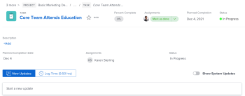

# 开始使用 [!UICONTROL 主页]

有两种方法可以在 [!UICONTROL 主页] 区域，或者 [!UICONTROL 工作列表] 或日历。

## 工作列表

的 [!UICONTROL 工作列表] 允许您在一个位置查看分配的所有工作：

![[!UICONTROL 工作列表] 面板](assets/worklist-and-right-panel-home.png)

A.使用左侧面板可筛选、排序和选择分配给您的工作。

B.在左侧面板中选择工作项后，使用右侧面板与自定义字段进行交互、进行更新和记录时间。

有关使用 [!UICONTROL 家庭工作列表]，请参阅以下文章：

* [显示 [!UICONTROL 工作列表] 在 [!UICONTROL 主页] 面积](../../../workfront-basics/using-home/using-the-home-area/display-items-in-home-work-list.md)
* [从 [!UICONTROL 主页] 面积](../../../workfront-basics/using-home/using-the-home-area/create-work-items-in-home.md)

## 日历

“日历”允许您通过在工作项到期时显示并阻止完成工作的时间来显示工作：

A.使用 [!UICONTROL 日历] 查看以创建您需要完成的工作的可视化地图。 只需在 [!UICONTROL 工作列表] 在日历上，以阻止工作时间。

B.使用日历的同步选项与 [!DNL Outlook] 日历。 在一个位置管理会议和工作。

C.使用 [!UICONTROL 详细信息] 按钮以打开一个新的右侧面板，您可以在其中查看有关工作项的更多信息。

D.使用到期栏跟踪分配给您的工作到期时间。

有关如何使用“主日历”的详细信息，请参阅 [使用 [!UICONTROL 主日历] 视图](../../../workfront-basics/using-home/using-the-home-area/use-home-calendar-view.md).

## 查找您的工作

的 [!UICONTROL 主页] 区域是您的一站式商店，用于查找分配给您的任务、问题和批准。 内置于 [!UICONTROL 主页] 区域可通力协作，支持您按自己的方式工作。 您可以使用 [!UICONTROL 排序依据] 选项将项目分组在一起，然后使用过滤器来集中处理需要完成的工作。

>[!NOTE]
>
>过滤器和排序选项存储在浏览器中。 如果您在同一台计算机上始终使用相同的浏览器（并且不清除网站数据），则过滤器和排序不会更改，但是，如果您切换浏览器或计算机，则过滤器和排序将会不同。

### 将类似的工作项与“[!UICONTROL 分组依据]“选项”

的 [!UICONTROL 排序依据] 选项，可对工作列表中的项目进行类似分组。 您可以按以下方式排序：

* [!UICONTROL 计划完成]
* [!UICONTROL 计划开始]
* [!UICONTROL 提交日期]
* [!UICONTROL 项目]
* [!UICONTROL 我的优先级]

有关如何使用分组的更多信息，请参阅 [显示 [!UICONTROL 工作列表] 在 [!UICONTROL 主页] 面积](../../../workfront-basics/using-home/using-the-home-area/display-items-in-home-work-list.md).

### 使用过滤器缩小焦点范围

的 [!UICONTROL 工作列表] 过滤器允许您将焦点缩小到特定工作项目。

以下是如何筛选在主页中查看的项目的示例：

* 按项目类型和状态进行筛选。

   例如，如果要显示所有任务，则可以选择 [!UICONTROL 任务] 过滤器。 如果您希望更具体，并仅显示已准备好开始工作的任务，请选择 [!UICONTROL 准备开始] 过滤器 [!UICONTROL 任务] 过滤器。

* 仅按项目类型过滤。

   例如，您可以选择 [!UICONTROL 问题] 查看所有州的所有问题([!UICONTROL 处理] 或 [!UICONTROL 请求])或 [!UICONTROL 批准] 要查看所有工作项、访问请求、时间表、文档和校样批准。

* 仅按状态过滤。

   例如，您可以选择 [!UICONTROL 已完成] 筛选以显示已完成的任务和问题。 这包括个人任务，但不包括批准。

有关如何使用过滤器的更多信息，请参阅 [显示 [!UICONTROL 工作列表] 在 [!UICONTROL 主页] 面积](../../../workfront-basics/using-home/using-the-home-area/display-items-in-home-work-list.md).

### 访问分配给您团队的工作

的 [!UICONTROL 主页] 区域具有专用于团队请求的永久分组，该分组具有指向团队请求页面的直接链接。 使用此分组可查看和访问您所在的任何团队的请求。

>[!NOTE]
>
>的 [!UICONTROL 过滤器] 和 [!UICONTROL 排序依据] 选项不影响 [!UICONTROL 团队请求] 分组。 只要您已经为团队分配了工作，就会显示此分组。

有关访问团队请求的更多信息，请参阅文章 [[!UICONTROL 管理] 中的工作和团队请求 [!UICONTROL 主页] 面积](../../../workfront-basics/using-home/using-the-home-area/manage-work-and-team-requests-home.md).

### 监控您提交的工作

跟踪您直接从提交以供审批的工作 [!UICONTROL 工作列表]. 您可以提醒审批者有关需要审批的工作。 如有需要，您还可以撤回批准。

>[!NOTE]
>
>的 [!UICONTROL 过滤器] 和 [!UICONTROL 排序依据] 选项不影响 [!UICONTROL 我已提交的批准] 分组。 只要您的工作正在等待批准，此分组便可见。

## 优先处理对您重要的事项

的 [!UICONTROL 工作列表] 允许您在 [!UICONTROL 我的优先级排序依据] 选项。 您最多可以在 [!UICONTROL 我的优先级] 列表。 使用 [!UICONTROL 更多] 菜单来将工作项添加到优先级列表。

>[!NOTE]
>
>添加到的任何工作项 [!UICONTROL 我的优先级] 仅对您可见，没有人能为您排定工作的优先级。

有关如何使用的更多信息 [!UICONTROL 我的优先级]，请参阅 [在 [!UICONTROL 主页] 面积](../../../workfront-basics/using-home/using-the-home-area/prioritize-work-in-home.md).

## 完成它

在中使用右侧面板 [!UICONTROL 主页] 更新并完成您的工作。

### 在为您自定义的空间中工作

您的 [!DNL Adobe Workfront] 管理员最多可添加16个自定义字段，以便更轻松地查找和更新您需要的信息。 大多数字段都是可编辑的，因此您不必导航到工作项。

要更新此区域中的任何字段，只需单击该字段。

>[!NOTE]
>
>无法更新 [!UICONTROL 提交日期] 在此区域。

### 使用重要信息更新同事

与 [!UICONTROL 主页] 的上界。 您向同事提出问题、通知他们最近的更新或回复直接评论。 此外，您还可以通过以下方式更新其他人员关于您正在取得的进展：

* 更新 [!UICONTROL 提交日期]

   <!--
  <note type="note">
  This is the only place you can update the Commit Date in Home.
   
  </note>
  -->

* 报告您的感受
* 更新百分比结束栏

有关在 [!UICONTROL 主页] 区域，请参阅 [更新工作](../../../workfront-basics/updating-work-items-and-viewing-updates/update-work.md).

### 记录您的时间

跟踪您处理各个工作项目的小时数。 您可以选择常规的小时类型，例如 [!UICONTROL 任务时间]，也可以选择由 [!DNL Workfront] 管理员。

有关如何在 [!UICONTROL 主页] 区域，请参阅部分 [主页](../../../timesheets/create-and-manage-timesheets/log-time.md#home) 在文章中 [日志时间](../../../timesheets/create-and-manage-timesheets/log-time.md).

