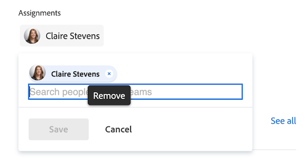
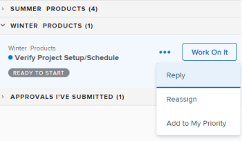

# 在[!UICONTROL 主页]区域管理工作项和团队请求

当工作任务和问题分配给您时，它们会列在我的工作小组件、我的任务小部件和我的问题小部件中。  您可以查看、处理或移除工作项和请求。

## 访问权限要求

+++ 展开可查看本文所述功能的访问权限要求。 

<table style="table-layout:auto"> 
 <col> 
 </col> 
 <col> 
 </col> 
 <tbody> 
  <tr> 
   <td role="rowheader"><strong>[!DNL Adobe Workfront package]</strong></td> 
   <td> 
“任一”
 </td> 
  </tr> 
  <tr> 
   <td role="rowheader"><strong>[!DNL Adobe Workfront] 许可证</strong></td> 
   <td>
   
标准

    
工作版或更高版本
 </td> 
  </tr> 
  <tr> 
   <td role="rowheader"><strong>访问级别配置</strong></td> 
   <td> 
[！UICONTROL Edit]对任务和问题的访问权限
 </td> 
  </tr> 
  <tr> 
   <td role="rowheader"><strong>对象权限</strong></td> 
   <td> 
Contribute权限或更高权限可为您需要处理的任务和问题提供内容
</td> 
  </tr> 
 </tbody> 
</table>

有关信息，请参阅Workfront文档中的[访问要求](/help/quicksilver/administration-and-setup/add-users/access-levels-and-object-permissions/access-level-requirements-in-documentation.md)。

+++

## 在“我的工作”小部件中查看工作项

分配给您的工作项显示在[!UICONTROL 主页]的“我的工作”小部件中。 您可以使用小组件[!UICONTROL 工作列表]顶部的筛选器配置哪些工作项显示在“我的工作”小部件中。

您可以选择显示准备好处理的项目或您当前处理的项目的筛选器。

本文介绍如何使用[!UICONTROL 主页]区域中的筛选器查看您当前正在处理或可能考虑开始处理的项目。 有关如何在[!UICONTROL 主页]区域中使用筛选器的信息，请参阅[!UICONTROL 主页]区域](/help/quicksilver/workfront-basics/using-home/using-the-home-area/display-items-in-home-work-list.md)的[!UICONTROL 工作列表]中的[显示项。

要查看我的工作小部件中的工作项，请执行以下操作：

1. 单击右上角的&#x200B;**[!UICONTROL 主菜单]** ，然后单击&#x200B;**[!UICONTROL 主页]**。
1. （视情况而定）单击&#x200B;**自定义**&#x200B;以添加&#x200B;**我的工作**&#x200B;小组件。

1. 单击小组件工作列表左上角的&#x200B;**筛选器**&#x200B;图标。

1. 单击以下任一选项或两个选项执行任务：

   **[!UICONTROL 准备开始]：**&#x200B;仅显示准备开始的任务和问题。 以下两个语句都必须为true：

   * 这些任务及其父任务没有阻止它们进行处理的前置任务或任务限制。
   * 任务或问题的[!UICONTROL 计划开始日期]已过去或将在未来最多两周。

   **[!UICONTROL 未就绪]**：仅显示尚未准备开始的任务和问题。 以下任一语句必须为true：

   * 这些任务及其父任务可能具有阻止它们进行处理的前置任务或任务限制。
   * 任务或问题的计划开始日期[!UICONTROL 为超过两周的未来]。

1. 单击[!UICONTROL 任务]或[!UICONTROL 问题]下的&#x200B;**[!UICONTROL 处理]**&#x200B;以显示您当前处理的任务和问题。
1. 单击“[!UICONTROL 问题]”下的“**[!UICONTROL 已请求]**”可显示已向您请求（您已被分派给他们）但尚未接受处理的问题。

## 访问团队请求小组件中的团队请求

您可以直接从[!UICONTROL 主页]区域的团队请求小组件访问分配给您团队的请求。 [!UICONTROL 团队请求]构件最多可以为团队显示2,000个请求。

有关团队请求的更多信息，请参阅[团队请求概述](../../../people-teams-and-groups/work-with-team-requests/team-requests-overview.md)。

要访问团队请求，请执行以下操作：

1. 单击右上角的&#x200B;**[!UICONTROL 主菜单]** ，然后单击&#x200B;**[!UICONTROL 主页]**。
1. （视情况而定）单击&#x200B;**自定义**&#x200B;以添加&#x200B;**团队请求**&#x200B;小组件。

   该构件在团队分组下显示团队请求。 **[!UICONTROL 团队请求]**&#x200B;构件显示并显示分配给您所在任何团队的所有请求。 有关处理团队请求的更多信息，请参阅[管理工作和团队请求](../../../people-teams-and-groups/work-with-team-requests/manage-work-and-team-requests.md)。

   

## 在我的工作小部件中处理工作项

当您单击[!UICONTROL 处理它]按钮时，您将向提交工作项的用户以及可能分配到您即将开始工作的工作项的任何其他用户指示。

处理工作项：

1. 单击右上角的&#x200B;**[!UICONTROL 主菜单]** ，然后单击&#x200B;**[!UICONTROL 主页]**。
1. （视情况而定）单击&#x200B;**自定义**&#x200B;以添加&#x200B;**我的工作**&#x200B;小组件。

1. 在小部件的&#x200B;**[!UICONTROL 工作列表]**&#x200B;区域中，选择要处理的请求，然后单击&#x200B;**[!UICONTROL 处理该请求]**。
1. 将鼠标悬停在工作项上，然后单击&#x200B;**摘要**&#x200B;图标以查看有关该工作项的信息。

   

## 删除工作项

如果您决定不处理该工作项，则可以将它从列表中删除。

要删除工作项，请执行以下操作：

1. 单击右上角的&#x200B;**[!UICONTROL 主菜单]** ，然后单击&#x200B;**[!UICONTROL 主页]**。
1. （视情况而定）单击&#x200B;**自定义**&#x200B;以添加&#x200B;**我的工作**&#x200B;小组件。

1. 在小部件工作列表中，将鼠标悬停在工作项上，然后单击&#x200B;**摘要**图标以查看有关该工作项的信息。
   
1. 在&#x200B;**工作**分区中，删除您的姓名。
   

<!--
## Reassign a request

1. Click the **[!UICONTROL Main Menu]**  in the upper-right corner, then click **[!UICONTROL Home]**.
1. In the **[!UICONTROL Work List]** area, select the request you want to reassign.

1. Click on the **[!UICONTROL Assignments]** widget and remove yourself from the request, then type the name of the user you want to reassign the request to.

   >[!TIP]
   >
   >If the work request is still in the Ready to Start or Not Ready state, you can use the **[!UICONTROL Reassign]** button in the **[!UICONTROL More]** menu in the [!UICONTROL Work List].\
   >

1. If a task's status is changed to [!UICONTROL New] or [!UICONTROL In Progress] after it was completed, you must unassign the user, save the task, then reassign the user in order for the task to reappear in their Home Work List.

## Reply to a request

You can reply to a request to further clarify the request or to propose a new date.

1. Click the **[!UICONTROL Main Menu]**  in the upper-right corner, then click **[!UICONTROL Home]**.
1. In the **[!UICONTROL Work List]** area, select the request you want to reply to.
1. Locate the individual who assigned the request to you.

   You can find this information on the [!UICONTROL Updates] tab of the task. Make sure the option to **[!UICONTROL Show System Updates]** is enabled.

1. Click **[!UICONTROL Start new update]** and begin typing your reply.
1. Enter the name of the recipient in the **[!UICONTROL Notify]** box, then click **[!UICONTROL Update]**.

   >[!TIP]
   >
   >If the work request is still in the Ready to Start or [!UICONTROL Not Ready] state, you can use the **[!UICONTROL Reply]** button in the **[!UICONTROL More]** menu in the [!UICONTROL Work List].\
   >![[!UICONTROL Reply button]](assets/reassign-in-left-panel-350x204.png)   

   -->
