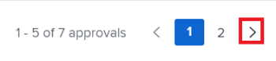

# 使用[!UICONTROL 我的更新]区域

<!--The highlighted information on this page refers to functionality not yet generally available. It is available only in the Preview environment for all customers. After the monthly releases to Production, the same features are also available in the Production environment for customers who enabled fast releases.    

For information about fast releases, see [Enable or disable fast releases for your organization](/help/quicksilver/administration-and-setup/set-up-workfront/configure-system-defaults/enable-fast-release-process.md). -->

您可以使用[!UICONTROL 我的更新]区域快速查看等待您决策的审批或您已经包含的对话。

作为具有[!UICONTROL Review]许可证的用户，默认情况下，您可以在[!UICONTROL 主菜单]中找到[!UICONTROL 我的更新]区域，[!UICONTROL 我的更新]区域是您的默认登录页面。

有关[!DNL Adobe Workfront]许可证的信息，请参阅[[!DNL Adobe Workfront] 许可证概述](../../../administration-and-setup/add-users/access-levels-and-object-permissions/wf-licenses.md)。

如果您的许可证类型与“审阅”不同，[!DNL Workfront]或组管理员必须将[!UICONTROL 我的更新]区域添加到您的布局模板中，才能在主菜单中显示该区域。 有关信息，请参阅[使用布局模板自定义[!UICONTROL 主菜单]](../../../administration-and-setup/customize-workfront/use-layout-templates/customize-main-menu.md)。

## 访问要求

+++ 展开以查看本文中各项功能的访问要求。

您必须具有以下权限才能执行本文中的步骤：

<table style="table-layout:auto"> 
 <col> 
 <col> 
 <tbody> 
  <tr> 
   <td role="rowheader"><strong>[!DNL Adobe Workfront plan]</strong></td> 
   <td> 
任何
 </td> 
  </tr> 
  <tr> 
   <td role="rowheader"><strong>[!DNL Adobe Workfront] 许可证*</strong></td> 
   <td> 
新文档：参与者或更高版本

   或   
   
当前： [！UICONTROL Request]或更高版本
 </td> 
  </tr> 
  <tr> 
   <td role="rowheader"><strong>访问级别配置</strong></td> 
   <td> 
查看对您在对话中被标记或需要解决审批的任何对象（项目、任务、问题、文档）的访问权限或更高
 </td> 
  </tr> 
  <tr> 
   <td role="rowheader"><strong>对象权限</strong></td> 
   <td> 
[！UICONTROL查看]对项目、任务、问题和文档的权限或更高，在这些项目、任务、问题和文档中，您被标记在对话中或需要解决审批问题
 </td> 
  </tr> 
 </tbody> 
</table>

*要了解您拥有什么计划、许可证类型或访问权限，请与[!DNL Workfront]管理员联系。 有关详细信息，请参阅Workfront文档中的[访问要求](/help/quicksilver/administration-and-setup/add-users/access-levels-and-object-permissions/access-level-requirements-in-documentation.md)。

+++

## 先决条件

在开始之前，您必须具备以下条件：

* 如果您拥有除[!UICONTROL Review]之外的[!DNL Workfront]许可证，则您的[!DNL Workfront]或组管理员必须使用布局模板将[!UICONTROL 我的更新]区域添加到[!UICONTROL 主菜单]并将您分配给该模板。

* 默认情况下，审阅许可证用户可在其[!UICONTROL 主菜单]中查看[!UICONTROL 我的更新]区域。

## 访问[!UICONTROL 我的更新]区域

{{step1-to-my-updates}}

[!UICONTROL 我的更新]区域打开。

分配给您的审批和访问请求列在页面前半部分的&#x200B;**我的更新**&#x200B;下。

1. （可选）滚动到&#x200B;[!UICONTROL **我的更新**]&#x200B;区域的底部，然后单击向右箭头以显示其他页面上显示的更多批准。

   >[!TIP]
   >
   >默认情况下，将显示前五个审批或访问请求。 其余的审批将显示在其他页面上。 您在[!UICONTROL 我的更新]区域最多可以显示2000个批准。

   我的更新

1. （可选）展开&#x200B;**[!UICONTROL 我的更新]**&#x200B;部分的右上角的&#x200B;**[!UICONTROL 筛选器]**&#x200B;下拉菜单，然后从以下内容中选择：

   <table style="table-layout:auto"> 
    <col> 
    </col> 
    <col> 
    </col> 
    <tbody> 
     <tr> 
      <td role="rowheader"><strong>[！UICONTROL All]</strong></td> 
      <td>提交给您或由其他用户委托给您的审批。 有关委托审批的信息，请参阅<a href="../../../review-and-approve-work/manage-approvals/delegate-approval-requests.md" class="MCXref xref">委托审批请求</a>。 </td> 
     </tr> 
     <tr> 
      <td role="rowheader"><strong>[！UICONTROL委托审批]</strong></td> 
      <td>其他用户委托给您的审批。 </td> 
     </tr> 
     <tr> 
      <td role="rowheader"><strong>[！UICONTROL我的审批]</strong></td> 
      <td> 
审批已提交给您。 
 
有关批准项的更多信息，请参阅<a href="../../../review-and-approve-work/manage-approvals/approving-work.md" class="MCXref xref">批准工作</a>。
 </td> 
     </tr> 
    </tbody> 
   </table>

1. 要在批准之前批准或拒绝项目或建议对文档的更改，请执行以下操作：

   1. （可选）单击批准决定（**[!UICONTROL 批准]**，**[!UICONTROL 更改]**，**[!UICONTROL 拒绝]**）旁边的&#x200B;**下拉列表**&#x200B;图标并添加评论，然后单击&#x200B;**[!UICONTROL 添加]**。

      或

      如果您不想输入评论，请单击&#x200B;**[!UICONTROL 跳过]**。

      

      >[!NOTE]
      >
      >仅对文档审批显示[!UICONTROL 更改]选项。

      根据您选择的下拉图标，将批准、拒绝项目，或者，在文档审批的情况下，将批准带有进行其他更改的请求的项目。

      >[!TIP]
      >
      >如果不想向决策添加评论，可以单击&#x200B;**[!UICONTROL 批准]**、**[!UICONTROL 拒绝]**&#x200B;或&#x200B;**[!UICONTROL 更改]**&#x200B;按钮，并立即授予批准决策。
      >
      >
      >
      >
      >有关批准工作的详细信息，请参阅[批准工作](../../../review-and-approve-work/manage-approvals/approving-work.md)。

1. 单击&#x200B;**[!UICONTROL 授予访问权限]**&#x200B;以授予提交给您的访问请求

   或

   展开&#x200B;**[!UICONTROL 更改访问权限]**&#x200B;下拉菜单以在授予访问权限之前修改请求的访问权限。

   

1. （可选）单击&#x200B;**[!UICONTROL 忽略]**&#x200B;以从审批列表中清除访问请求而不授予它。
1. 如果您在一段时间内无法做出审批决策，请单击&#x200B;**[!UICONTROL 委托我的审批]**&#x200B;以委托您提交的审批。 有关委托审批的详细信息，请参阅[委托审批请求](../../../review-and-approve-work/manage-approvals/delegate-approval-requests.md)。
1. 滚动到您审批下的&#x200B;**[!UICONTROL 提及]**&#x200B;区域。 在这里，您可以查看对话中包含的所有项目。

   >[!TIP]
   >
   >默认情况下，将显示前50个提及。

1. （可选）单击&#x200B;**[!UICONTROL 显示更多更新]**&#x200B;以查看更多提及。
1. （可选）单击&#x200B;**[!UICONTROL 回复]**&#x200B;以回复评论，然后执行以下任一操作：
   * 开始键入回复
   * 使用富文本工具栏设置文本格式，向消息中添加链接、列表、表情符号、引号或图像
   * 添加用户或团队以通知他们您的回复。

     有关回复更新的详细信息，请参阅[更新工作](/help/quicksilver/workfront-basics/updating-work-items-and-viewing-updates/update-work.md)。

     添加完回复后，单击&#x200B;**[!UICONTROL 提交]**。

     

1. （可选）单击&#x200B;**[!UICONTROL 固定当前页面]**&#x200B;以将[!UICONTROL 我的更新]区域固定到顶部导航。
