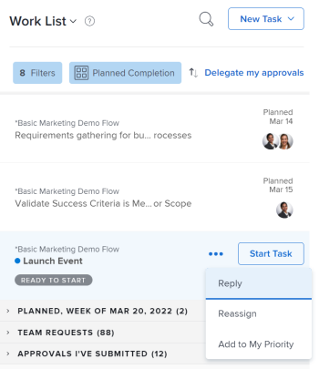

# 在 [!UICONTROL 主页] 面积

您可以对 [!UICONTROL 工作列表] in [!UICONTROL 主页]. 添加到的项目 [!UICONTROL 我的优先级] 是你的优先事项。 他们不是其他人的优先事项，也没人能为你排定优先事项。 您最多可以在 [!UICONTROL 我的优先级] [!UICONTROL 排序依据] 选项。

## 访问要求

您必须具有以下访问权限才能执行本文中的步骤：

<table style="table-layout:auto"> 
 <col> 
 </col> 
 <col> 
 </col> 
 <tbody> 
  <tr> 
   <td role="rowheader"><strong>[!DNL Adobe Workfront plan*]</strong></td> 
   <td> 
任意
 </td> 
  </tr> 
  <tr> 
   <td role="rowheader"><strong>[!DNL Adobe Workfront] 许可证*</strong></td> 
   <td> 
[!UICONTROL Work]或更高版本
 </td> 
  </tr> 
  <tr> 
   <td role="rowheader"><strong>访问级别配置*</strong></td> 
   <td> 
[!UICONTROL Edit]对任务和问题的访问权限
 
注意：如果您仍无权访问，请咨询您的 [!DNL Workfront] 管理员。 有关如何 [!DNL Workfront] 管理员可以修改您的访问级别，请参阅 <a href="../../../administration-and-setup/add-users/configure-and-grant-access/create-modify-access-levels.md" class="MCXref xref">创建或修改自定义访问级别</a>.
 </td> 
  </tr> 
  <tr> 
   <td role="rowheader"><strong>对象权限</strong></td> 
   <td> 
对您要优先处理的任务和问题贡献权限或更高权限
 
有关请求其他访问权限的信息，请参阅 <a href="../../../workfront-basics/grant-and-request-access-to-objects/request-access.md" class="MCXref xref">请求对对象的访问 </a>.
 </td> 
  </tr> 
 </tbody> 
</table>

要了解您拥有的计划、许可类型或访问权限，请联系您的 [!DNL Workfront] 管理员。

## 将项目添加到 [!UICONTROL 我的优先级]

您可以在 [!UICONTROL 工作列表] to [!UICONTROL 我的优先级]. 新项目将添加到列表底部。

1. 单击 **[!UICONTROL 主菜单]**  ，然后单击 **[!UICONTROL 主页]**.
1. 在左侧面板中，确保 **[!UICONTROL 分组依据]** 下拉菜单按以下选项之一排序：

   * [!UICONTROL 计划完成]
   * [!UICONTROL 计划开始]
   * [!UICONTROL 提交日期]
   * [!UICONTROL 项目]

1. 将鼠标悬停在工作项上，然后单击 **[!UICONTROL 更多]** 图标 .

1. 选择 **[!UICONTROL 添加到我的优先级]**.

   

## 使用 [!UICONTROL 我的优先级] 分组

在选择 [!UICONTROL 我的优先级] 在“分组”下拉菜单中，将最重要的项目置于列表顶部。 您设置的优先级仅对您可见。 其他人不能为你排定优先顺序。

您必须将工作项添加到 [!UICONTROL 我的优先级] 才能开始排定优先级。

有关更多信息，请参阅 [将项目添加到 [!UICONTROL 我的优先级]](#add-items-to-my-priority) 在本文中。

1. 单击 **[!UICONTROL 主菜单]**  ，然后单击 **[!UICONTROL 主页]**.
1. 在左侧面板中，单击 **[!UICONTROL 分组依据]** 下拉菜单，然后选择 **[!UICONTROL 我的优先级]**.

1. 选择一个工作项并将其拖放到正确的位置，以在列表中对其进行优先级排序。

   

## 从 [!UICONTROL 我的优先级]

您可以从 [!UICONTROL 我的优先级] 完成工作项或使用 [!UICONTROL 更多] 图标。 如果您未从工作项中分配，则也会从 [!UICONTROL 我的优先级].

1. 单击 **[!UICONTROL 主菜单]**  ，然后单击 **[!UICONTROL 主页]**.
1. 在左侧面板中，单击 **[!UICONTROL 更多]** 图标，然后选择 **[!UICONTROL 从我的优先级中删除]**.

   ![[!UICONTROL [!UICONTROL 从“我的优先级”中移除]]](assets/getting-started-remove-from-priority-nwe-350x395.png)
