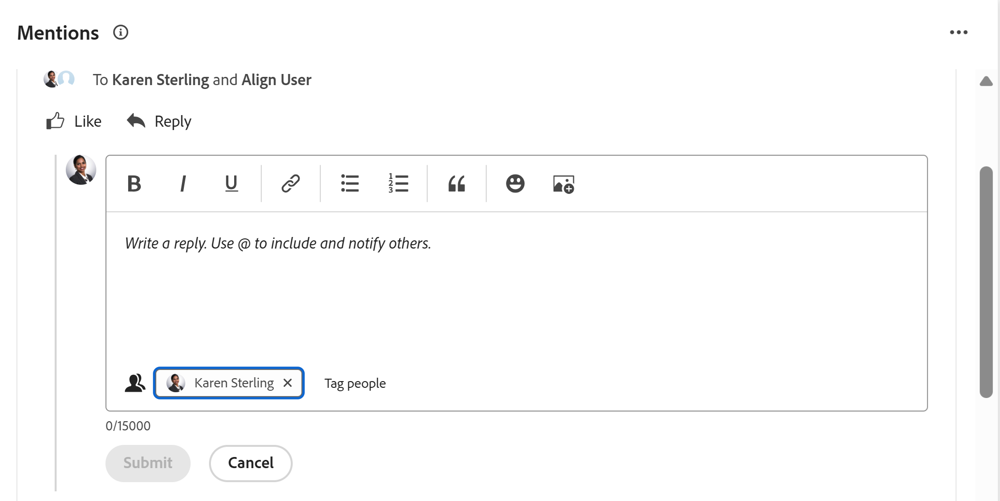

# 在[!UICONTROL 主页]区域更新或编辑工作项

<!--Audited: 04/2024-->

<!--The highlighted information on this page refers to functionality not yet generally available. It is available only in the Preview environment for all customers. After the monthly releases to Production, the same features are also available in the Production environment for customers who enabled fast releases.    

For information about fast releases, see [Enable or disable fast releases for your organization](/help/quicksilver/administration-and-setup/set-up-workfront/configure-system-defaults/enable-fast-release-process.md). -->

您可以在[!DNL Adobe Workfront]的[!UICONTROL 主页]区域查看工作项并将更新添加到该区域。 如果您有权限编辑工作项，您还可以编辑与工作项相关的其他数据。

## 访问要求

+++ 展开以查看本文中各项功能的访问要求。

您必须具有以下权限才能执行本文中的步骤：

<table style="table-layout:auto"> 
 <col> 
 </col> 
 <col> 
 </col> 
 <tbody> 
  <tr> 
   <td role="rowheader"><strong>[!DNL Adobe Workfront plan]</strong></td> 
   <td> 
任何
 </td> 
  </tr> 
  <tr> 
   <td role="rowheader"><strong>[!DNL Adobe Workfront] 许可证*</strong></td> 
   <td> 
新增：标准

   或

当前： [！UICONTROL Work]或更高版本
 </td> 
  </tr> 
  <tr> 
   <td role="rowheader"><strong>访问级别配置</strong></td> 
   <td> 
[！UICONTROL Edit]对任务和问题的访问权限
 </td> 
  </tr> 
  <tr> 
   <td role="rowheader"><strong>对象权限</strong></td> 
   <td> 
Contribute权限或更高权限可为您需要处理的任务和问题提供内容
 </td> 
  </tr> 
 </tbody> 
</table>

*要了解您拥有什么计划、许可证类型或访问权限，请与[!DNL Workfront]管理员联系。 有关详细信息，请参阅Workfront文档中的[访问要求](/help/quicksilver/administration-and-setup/add-users/access-levels-and-object-permissions/access-level-requirements-in-documentation.md)。

+++

<!--not sure if this  from the old UI: we don't have a Work List anymore - should this section come off? 

## View updates on a work item

You can view updates on any work item in the [!UICONTROL Work List]:

1. Click the **[!UICONTROL Main Menu]**  in the upper-right corner, or the **Main Menu**  in the upper-left corner, if available, then click **[!UICONTROL Home]**.
1. In the **[!UICONTROL Work List]** area, select the item where you want to view updates.\
   Updates are displayed in the right panel.

-->

## 可在主页区域中添加注释或编辑项目的构件概述

您可以在“主页”区域的以下小部件中添加注释：

| 小组件 | 描述 |
|--------------|---------------------------------------------------------------------------------------------------|
| 展示板 | 显示您已创建或受邀使用的任何讨论区 |
| 我的工作 | 显示分配给您的任务和问题 |
| 我的项目 | 显示您拥有的项目或您参与的项目 |
| 我的任务 | 显示分配给您的任务 |
| 我的问题 | 显示分配给您的问题 |
| 我的请求 | 显示您已提交的所有请求 |
| 我的审批 | 显示所有待处理、已分配、已委派和已提交的审批 |
| 提及 | 显示在类似于“我的更新”页面的 Workfront 上的近期评论主题和一个“回复”按钮，通过该按钮可在构件中撰写回复。 |

您可以在“主页”区域中编辑以下小部件中的工作项：

| 小组件 | 描述 |
|--------------|---------------------------------------------------------------------------------------------------|
| 展示板 | 显示您已创建或受邀使用的任何讨论区 |
| 我的工作 | 显示分配给您的任务和问题 |
| 我的项目 | 显示您拥有的项目或您参与的项目 |
| 我的任务 | 显示分配给您的任务 |
| 我的问题 | 显示分配给您的问题 |
| 我的请求 | 显示您已提交的所有请求 |
| 我的审批 | 显示所有待处理、已分配、已委派和已提交的审批 |

## 在我的工作小部件中的工作项添加评论

您可以在[!UICONTROL 我的工作]构件中提供任意工作项的更新：

1. 单击右上角的&#x200B;**[!UICONTROL 主菜单]** 或左上角的&#x200B;**主菜单** （如果可用），然后单击&#x200B;**[!UICONTROL 主页]**。
1. （视情况而定）单击&#x200B;**自定义**&#x200B;以添加&#x200B;[!UICONTROL **我的工作**]&#x200B;小组件。

1. 在&#x200B;[!UICONTROL **我的工作**]&#x200B;构件中查找要更新的工作项。
1. 将鼠标悬停在名称上，然后单击&#x200B;**添加新更新**&#x200B;图标。

   

1. 开始键入您的评论。
1. （可选）在&#x200B;**为人员或团队添加标签**&#x200B;框中，开始键入要包含在此评论中的用户或团队的名称或电子邮件，然后当该评论显示在列表中时将其选定。
1. （可选）使用富文本工具栏中的选项设置文本格式，在评论中添加表情符号、链接或图像以增强内容。
1. 单击&#x200B;**提交**&#x200B;以将评论添加到工作项。

   >[!IMPORTANT]
   >
   >您只能在提交评论后15分钟内对其进行编辑。 要编辑评论，请单击评论右上角的&#x200B;**更多**&#x200B;菜单，然后单击&#x200B;**编辑**。

   有关添加更新的详细信息，请参阅[更新工作](/help/quicksilver/workfront-basics/updating-work-items-and-viewing-updates/update-work.md)。

## 在提及小组件的项中添加评论

1. 将&#x200B;**提及**&#x200B;构件添加到您的主页区域。

1. 找到包含在更新中的项目以及要回复的项目。

1. 单击&#x200B;**回复**。

   

1. 开始键入您的评论。
1. （可选）在&#x200B;**标记人员**&#x200B;框中，开始键入要包含在此评论中的用户或团队的名称，然后在此评论显示在列表中时将其选定。
1. （可选）使用富文本工具栏中的选项设置文本格式，在评论中添加表情符号、链接或图像以增强内容。
1. 单击&#x200B;**提交**&#x200B;以将评论添加到工作项。

   >[!IMPORTANT]
   >
   >您只能在提交评论后15分钟内对其进行编辑。 要编辑评论，请单击评论右上角的&#x200B;**更多**&#x200B;菜单，然后单击&#x200B;**编辑**。

   有关添加更新的详细信息，请参阅[更新工作](/help/quicksilver/workfront-basics/updating-work-items-and-viewing-updates/update-work.md)。

## 编辑工作项

您可以编辑任何您有权编辑的工作项上的任何字段。

1. 单击右上角的&#x200B;**[!UICONTROL 主菜单]** 或左上角的&#x200B;**主菜单** （如果可用），然后单击&#x200B;**[!UICONTROL 主页]**。
1. （视情况而定）单击&#x200B;**自定义**&#x200B;以添加&#x200B;**我的工作**&#x200B;小组件。

1. 将鼠标悬停在工作项上，然后单击&#x200B;**摘要**图标。
   

1. 在“摘要”面板中，将鼠标悬停在要编辑的字段上。
如果您有权编辑该字段，则当您将鼠标悬停在该字段上时，该字段会高亮显示。
1. 单击要编辑的字段，然后进行所需的更新。
1. 单击离开字段以保存更改。
