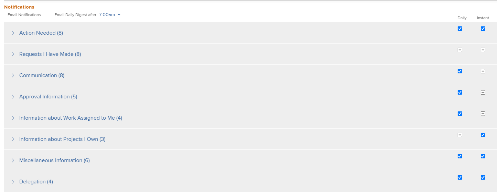

# 修改您自己的电子邮件通知

<!-- Audited: 1/2024 -->

您的Adobe [!DNL Workfront]管理员配置在Workfront中发生事件时用户将收到哪些电子邮件通知（如[[!UICONTROL 为系统中的每个人配置事件]通知](../../administration-and-setup/manage-workfront/emails/configure-event-notifications-for-everyone-in-the-system.md)中所述）。

您的组管理员还可以配置为您和[!UICONTROL 主组]中的用户激活哪些通知。 如果您的[!UICONTROL 主组]是子组，您将收到为组上方的顶级组激活的通知。

您可以通过配置接收哪些通知来进一步自定义此设置。 您还可以选择要在事件发生时接收通知，还是要在一封每日摘要电子邮件中接收通知。

有关电子邮件通知的详细信息，请参阅[[!DNL Adobe Workfront] 通知](../../workfront-basics/using-notifications/wf-notifications.md)。

>[!NOTE]
>
>* 如果您激活了通知类型，然后发现您没有收到该类型的通知，则可能是因为该类型不适用于您的职责。
>* [!DNL Workfront]管理员或组管理员无法为[!DNL Workfront Goals]配置通知。 有关[!DNL Workfront]管理员可以配置哪些通知的更多信息，请参阅[为系统中的每个人配置事件通知](../../administration-and-setup/manage-workfront/emails/configure-event-notifications-for-everyone-in-the-system.md)。 有关为[!DNL Workfront Goals]配置单个通知的信息，请继续阅读本文。
>

## 访问要求

+++ 展开以查看本文中各项功能的访问要求。

您必须具有以下权限才能执行本文中的步骤：

<table style="table-layout:auto"> 
 <col> 
 </col> 
 <col> 
 </col> 
 <tbody> 
  <tr> 
   <td role="rowheader"><strong>[!DNL Adobe Workfront plan]</strong></td> 
   <td> 
任何
 </td> 
  </tr> 
  <tr> 
   <td role="rowheader"><strong>[!DNL Adobe Workfront] 许可证</strong></td> 
   <td>  
新增：
 
   <ul><li>参与者或更高</li></ul>
   
当前：

   <ul><li>请求或更高版本</li></ul>
   </td> 
  </tr> 
 </tbody> 
</table>

有关此表中信息的更多详细信息，请参阅Workfront文档中的[访问要求](/help/quicksilver/administration-and-setup/add-users/access-levels-and-object-permissions/access-level-requirements-in-documentation.md)。

+++

## 查看和修改电子邮件通知设置

{{step1-click-profile-pic}}

1. 单击您姓名旁边的&#x200B;**[!UICONTROL 更多]**&#x200B;图标，然后单击&#x200B;**[!UICONTROL 编辑]**。

1. 在显示的&#x200B;**[!UICONTROL 编辑人员]**&#x200B;框中，转到&#x200B;**[!UICONTROL 通知]**&#x200B;部分。

1. 单击某个类别可查看与该类别相关的通知设置。

   

1. 选中或取消选中右侧的复选框，以指定您希望每天接收还是不接收通知，即时接收通知，或两者都接收。

   您还可以使用类别对应的复选框来激活或停用该类别中的所有通知。

   >[!NOTE]
   >
   >如果您是项目的团队成员，则将继续收到该项目的电子邮件通知，直到您从团队中删除为止，即使您不再具有对该项目的访问权限。 有关从团队中删除用户的说明，请参阅[从项目中删除用户](../../manage-work/projects/manage-projects/remove-users-from-projects.md)。

   对于&#x200B;**[!UICONTROL 通信]**&#x200B;类别，您只能选择即时传递的单个通知。 要在每日摘要中发送通知，您必须选择所有通知。

   如果激活了给定类别的所有电子邮件通知，则类别标题中的框显示为选中状态。 如果给定类别中的所有电子邮件通知都已停用，则该框处于未选中状态。 如果激活了某些通知，而取消激活了其他通知，则类别复选框将以直线显示。\
   修改通知设置时，将显示该通知设置的标签&#x200B;**[!UICONTROL Edited]**，以告知您该通知设置已被修改。

1. 如果您选择了任何要作为每日摘要发送的通知，请在&#x200B;**[!UICONTROL 电子邮件每日摘要]**&#x200B;之后的&#x200B;**[!UICONTROL 通知]**&#x200B;分区的顶部选择一天中您希望接收该通知的时间。

   

   每日摘要包括在所选时间之前24小时满足通知标准的事件。 对于每种类型的通知，您都会收到一封每日摘要电子邮件。\
   每日摘要可能会在您选择的时间之后到达，具体取决于系统中排队等待发送的电子邮件数量。 列出的时间是您在浏览器设置中指定的本地时间。

1. （有条件和可选）在预览环境中修改电子邮件通知设置时，启用&#x200B;**[!UICONTROL 从此测试环境接收电子邮件]**&#x200B;设置以接收电子邮件。 不会从预览环境自动生成电子邮件。

   

1. 单击&#x200B;**[!UICONTROL 保存更改]**。
