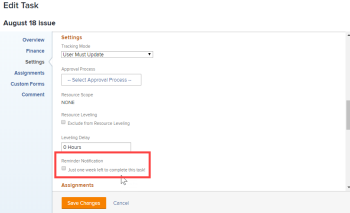

# 将提醒通知附加到对象

您可以将提醒通知与多种不同的对象类型关联：项目、任务、问题、时间表、模板、模板任务和周期性时间表配置文件。

在将提醒通知附加到对象之前，[!DNL Adobe Workfront]管理员必须先创建通知，如[设置提醒通知](../../administration-and-setup/manage-workfront/emails/set-up-reminder-notifications.md)中所述。

无论要将提醒通知附加到的对象类型如何，附加提醒通知的步骤都是相同的。

## 访问要求

+++ 展开以查看本文中各项功能的访问要求。

<table style="table-layout:auto"> 
 <col> 
 </col> 
 <col> 
 </col> 
 <tbody> 
  <tr> 
   <td role="rowheader">[!DNL Adobe Workfront package]</td> 
   <td> 
任何
 </td> 
  </tr> 
  <tr> 
   <td role="rowheader">[!DNL Adobe Workfront] 许可证</td> 
   <td> 
   
标准

   
工作或更高
 </td> 
  </tr> 
  <tr> 
   <td role="rowheader">对象权限</td> 
   <td> 
管理对对象的访问
  </td> 
  </tr> 
 </tbody> 
</table>

有关信息，请参阅Workfront文档中的[访问要求](/help/quicksilver/administration-and-setup/add-users/access-levels-and-object-permissions/access-level-requirements-in-documentation.md)。

+++

## 将提醒通知附加到对象

1. 转到要附加提醒通知的对象。
1. 单击“编辑”图标。
1. 在出现的&#x200B;**[!UICONTROL 编辑]**&#x200B;框的左侧面板中，单击&#x200B;**[!UICONTROL 设置]**。

1. 在&#x200B;**[!UICONTROL 提醒通知]**&#x200B;下，选择要附加到对象的通知。

   在此示例中，正在编辑的对象是一个任务：

   

   如果[!DNL Workfront]管理员创建了多个提醒通知，则可以将多个通知附加到单个对象。

1. 单击&#x200B;**[!UICONTROL 保存更改]**。

   如果您需要测试提醒通知投放的帮助，请咨询[!DNL Workfront]管理员。
