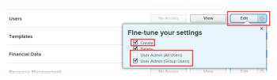

# 启用从预览Sandbox环境的电子邮件投放

[!UICONTROL Adobe Workfront]将禁用来自“预览”和“自定义刷新沙盒”环境的所有电子邮件通信。 有关预览沙盒环境的信息，请参阅[Adobe Workfront预览沙盒环境](../../administration-and-setup/set-up-workfront/workfront-testing-environments/wf-preview-sandbox-environment.md)。 有关自定义刷新沙盒环境的信息，请参阅[Adobe Workfront自定义刷新沙盒环境](../../administration-and-setup/set-up-workfront/workfront-testing-environments/wf-custom-refresh-sandbox-environment.md)。

如果您希望从预览Sandbox环境接收以下电子邮件通知，则必须在登录预览时在用户设置中启用此功能：

* 事件通知触发的电子邮件通知
* 提醒通知
* 自动延迟或提前提醒通知
* 电子邮件邀请

您可以为自己或您有权编辑的任何用户执行此操作。 有关编辑用户所需访问权限的详细信息，请参阅[授予用户访问权限](../../administration-and-setup/add-users/configure-and-grant-access/grant-access-other-users.md)。

>[!NOTE]
>
>对于“预览Sandbox”环境，始终禁用移动应用程序上的报表交付和推送通知。 当您访问“预览Sandbox”环境时，您和[!DNL Workfront]管理员都不能为移动设备应用程序启用报告交付或推送通知。
>
>有关报告传递的信息，请参阅[报告传递概述](../../reports-and-dashboards/reports/creating-and-managing-reports/set-up-report-deliveries.md)。

## 访问要求

您必须具有以下权限才能执行本文中的步骤：

<table style="table-layout:auto"> 
 <col> 
 </col> 
 <col> 
 </col> 
 <tbody> 
  <tr> 
   <td role="rowheader"><strong>[!DNL Adobe Workfront plan*]</strong></td> 
   <td> 
任何
 </td> 
  </tr> 
  <tr> 
   <td role="rowheader"><strong>[!DNL Adobe Workfront] 许可证*</strong></td> 
   <td> 
[！UICONTROL Request]或更高版本以更改您自己的设置
 
[！UICONTROL计划]编辑其他用户的设置
 </td> 
  </tr> 
  <tr> 
   <td role="rowheader"><strong>访问级别配置*</strong></td> 
   <td> 
您必须具备以下任一项：
 
    <ul> 
     <li> 
[！UICONTROL系统管理员]访问级别。
 
 有关此访问级别的信息，请参阅<a href="../../administration-and-setup/add-users/configure-and-grant-access/grant-a-user-full-administrative-access.md" class="MCXref xref">授予用户完全管理访问权限</a>。 
 </li> 
     <li> 
在访问级别中，必须为[！UICONTROL用户]设置选择[！UICONTROL编辑] 。 对于[！UICONTROL用户]设置，在[！UICONTROL微调设置] 下，必须启用[！UICONTROL创建]选项以及两个[！UICONTROL用户管理]选项中的至少一个。 
 
如果您使用[！UICONTROL用户管理员（组用户）]选项，您必须是用户所属组的组管理员。
 
  
 
有关访问级别中[！UICONTROL用户]设置的信息，请参阅<a href="../../administration-and-setup/add-users/configure-and-grant-access/grant-access-other-users.md" class="MCXref xref">授予用户访问权限</a>。
 </li> 
    </ul> 
注意：如果您仍然没有访问权限，请询问您的[!DNL Workfront]管理员是否对您的访问级别设置了其他限制。 有关[!DNL Workfront]管理员如何修改访问级别的信息，请参阅<a href="../../administration-and-setup/add-users/configure-and-grant-access/create-modify-access-levels.md" class="MCXref xref">创建或修改自定义访问级别</a>。
 </td> 
  </tr> 
 </tbody> 
</table>

&#42;要了解您拥有什么计划、许可证类型或访问权限，请与[!DNL Workfront]管理员联系。

## 从预览Sandbox环境启用电子邮件投放

1. 登录到预览Sandbox环境。
1. 单击[!DNL Adobe Workfront]右上角的配置文件图片。 然后，单击&#x200B;**[!UICONTROL 更多]**&#x200B;菜单并选择&#x200B;**[!UICONTROL 编辑]**。

   或

   在[!DNL Workfront]中搜索用户并单击其名称。 然后，单击&#x200B;**[!UICONTROL 更多]**&#x200B;菜单并选择&#x200B;**[!UICONTROL 编辑]**。

   或

   对于多个用户：单击Workfront右上角的&#x200B;**[!UICONTROL 主菜单]**&#x200B;图标，然后单击&#x200B;**[!UICONTROL 用户]** 。  然后，选择多个用户并单击&#x200B;**[!UICONTROL 编辑]**。

1. 单击&#x200B;**[!UICONTROL 首选项]**。
1. 选择&#x200B;**[!UICONTROL 从此测试环境接收电子邮件]**。

   >[!NOTE]
   >
   >如果您在生产环境中，则此选项不可用。

1. 单击&#x200B;**[!UICONTROL 保存更改]**。
