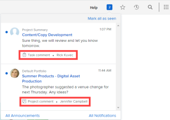

# 应用程序内通知概述

本文列出了您可以收到的应用程序内通知。 应用程序内通知可让您随时了解以下两种类型的信息：公告通知和工作项通知。 它们可从Web应用程序和移动应用程序中获取。

有关如何查看和管理这些通知的说明，请参阅[查看和管理应用程序内通知](../../workfront-basics/using-notifications/view-and-manage-in-app-notifications.md)。

* [[!UICONTROL 公告]通知](#announcement-notifications)
* [[!UICONTROL 工作项]通知](#work-item-notifications)

## [!UICONTROL 公告]通知

公告有两种方式：

* [!DNL Workfront]向您组织的[!DNL Workfront]管理员的[!UICONTROL 公告]页面发送消息
* [!DNL Workfront]管理员从[!UICONTROL 公告]页面向用户发送消息

在这两种情况下，当管理员或用户单击[!DNL Workfront]右上角的编号图标打开其通知列表时，消息的主题行会显示一个扩音器图标和单词“[!UICONTROL 公告]”。

![[!UICONTROL 公告]通知](assets/notification-list-announcement-350x271.png)

有关[!UICONTROL 公告]页面的信息，请参阅[查看和管理应用程序内通知](../../workfront-basics/using-notifications/view-and-manage-in-app-notifications.md)。

## [!UICONTROL 工作项]通知

当您单击[!DNL Workfront]右上角的编号图标打开您的通知列表时，工作项消息的主题行会显示图标和简要描述以标识其内容。 图标和描述类型如下所示。

>[!NOTE]
>
>工作活动的应用程序内通知未绑定到[!DNL Workfront]中的电子邮件通知。 有关详细信息，请参阅[[!DNL Adobe Workfront] 通知](../../workfront-basics/using-notifications/wf-notifications.md)。

* [[!UICONTROL 审批]](#approvals)
* [[!UICONTROL 请求]](#requests)
* [[!UICONTROL 分配]](#assignments)
* [[!UICONTROL 个评论]](#comments)
* [[!UICONTROL 更新]](#updates)
* [[!UICONTROL 日期更改]](#date-changes)
* [[!UICONTROL 共享]](#share)
* [[!UICONTROL 其他]](#other)

### [!UICONTROL 审批]

*  [!UICONTROL 项目需要您的审批] - [发件人姓名]
*  [!UICONTROL 任务需要您的审批] - [发件人姓名]
*  [!UICONTROL 问题需要您的审批] - [发件人姓名]
*  [!UICONTROL 文档需要您的审批] - [发件人姓名]
*  [!UICONTROL 校对需要您的审批] - [发件人姓名]
*  [!UICONTROL 时间表需要您的审批] - [发件人姓名]

  <!--
  <li data-mc-conditions="QuicksilverOrClassic.Draft mode,QuicksilverOrClassic.Quicksilver">  You need to approve a portfolio</li>
  -->

* [对象名称] [!UICONTROL 需要您的访问审批] - [发件人名称]

  对象可以是项目、任务、问题、文档、报告、仪表板、项目组合、项目或日历。

*  [!UICONTROL 已批准的工时表] - [审批者姓名]
*  [!UICONTROL 时间表被拒绝] - [审批者姓名]
*  [!UICONTROL 时间表已重新打开] - [打开者的名称]
*  [!UICONTROL 时间表评论] - [评论者姓名]
*  [!UICONTROL 文档审批已完成] - [发件人姓名]
*  [!UICONTROL 已批准文档] - [发件人姓名]
*  [!UICONTROL 已批准更改的文档] - [发件人姓名]
*  [!UICONTROL 文档被拒绝] - [发件人姓名]
*  [!UICONTROL 文档审批请求已取消] - [发件人姓名]

### [!UICONTROL 请求]

*  [用户图标] [!UICONTROL 要求您上传文档] - [请求者姓名]
*  [!UICONTROL 已履行文档上载请求] - [履行者姓名]
*  [!UICONTROL 请求评论] — 发件人姓名
*  [!UICONTROL 文档上传请求已取消] - [发件人姓名]
* [对象名称] [!UICONTROL 访问请求] - [发件人名称]

  对象可以是项目、任务、问题、文档、报告、仪表板、项目组合、项目或日历。

### [!UICONTROL 分配]

*  [!UICONTROL 分配给您的任务] - [分配者姓名]
*  [!UICONTROL 问题已分配给您] - [分配者姓名]
*  [!UICONTROL 问题已分配给] [团队名称] - [分配者姓名]
*  [!UICONTROL 任务已分配给] [团队名称] - [分配者姓名]

   * 仅当项目状态设置为[!UICONTROL 当前]（或自定义状态等于[!UICONTROL 当前）]时，才会发送工作分配通知。
   * 不打算向请求者和审阅者分配工作。 因此，如果分配给他们的任务和问题，则不会通知他们。
   * 如果您将工作分派给自己或您所属的团队，您将不会收到通知。

### [!UICONTROL 个评论]

*  [对象名称] [!UICONTROL 评论] - [评论者姓名]

  对象可以是项目、任务、问题、文档、报告、仪表板、项目组合、项目或日历。

* [对象名称] [!UICONTROL 更新] - [更新者的名称]

  对象可以是项目、任务、问题、文档、报告、仪表板、项目组合、项目或日历。

* [对象名称] [!UICONTROL 更新] - [更新者的名称]

  对象可以是项目、任务、问题、文档、报告、仪表板、项目组合、项目或日历。

*  [!UICONTROL 喜欢您的评论] - [喜欢者的姓名]
*  [!UICONTROL 时间表评论] - [评论者姓名]
* [!UICONTROL 评论] - [评论者姓名]
*  [!UICONTROL 评论] — 评论者名称
*  [!UICONTROL 工时表评论] — 评论者名称

### [!UICONTROL 更新]

*  [!UICONTROL 在评论中为您添加了标签] - [标记器名称]
*  [!UICONTROL 在评论中标记了您的团队] - [标记器名称]
*  [!UICONTROL 在评论中标记了您的团队] - [标记器名称]

### [!UICONTROL 日期更改]

*  [!UICONTROL 问题到期日期已更改] - [更改者的名称]
*  [!UICONTROL 任务到期日期已更改] - [更改者的名称]
*  [!UICONTROL 问题提交日期已更改] - [更改者的名称]
*  [!UICONTROL 任务提交日期已更改] - [更改者的名称]

### [!UICONTROL 共享]

*  [!UICONTROL 与您共享的文档] - [共享者的姓名]
*  [!UICONTROL 与]共享的文档[团队名称] - [共享者的名称]
*  [!UICONTROL 与您共享的校对] - [共享者的姓名]

### [!UICONTROL 其他]

*  [!UICONTROL 发生错误需要您注意]
*  [!UICONTROL 公告] - [Workfront管理员姓名]
