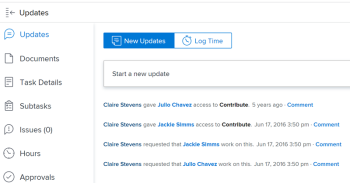

# 查看和管理应用程序内通知

应用程序内通知可让您随时了解以下两种类型的信息：公告通知和工作项通知。 它们可从Web应用程序和移动应用程序中获取。

有关可接收的工作项和公告通知的列表，请参阅[应用程序内通知概述](../../workfront-basics/using-notifications/in-app-notifications-overview.md)。

>[!NOTE]
>
>* 工作活动的应用程序内通知未绑定到[!DNL Workfront]中的电子邮件通知。 有关详细信息，请参阅[[!DNL Adobe Workfront] 通知](../../workfront-basics/using-notifications/wf-notifications.md)
>* 无法自定义应用程序内通知。
>

## 访问要求

+++ 展开以查看本文中各项功能的访问要求。 

<table style="table-layout:auto"> 
 <col> 
 </col> 
 <col> 
 </col> 
 <tbody> 
  <tr> 
   <td role="rowheader"><strong>[!DNL Adobe Workfront] 包</strong></td> 
   <td> 
任何
 </td> 
  </tr> 
  <tr> 
   <td role="rowheader"><strong>[!DNL Adobe Workfront] 许可证</strong></td> 
   <td> 
   
参与者或更高版本

   
请求或更高版本
 </td> 
  </tr> 
 </tbody> 
</table>

有关信息，请参阅Workfront文档中的[访问要求](/help/quicksilver/administration-and-setup/add-users/access-levels-and-object-permissions/access-level-requirements-in-documentation.md)。

+++

## 查看通知

[!DNL Workfront]右上角的编号图标显示您尚未确认的通知数。

>[!NOTE]
>
>您可以从Web应用程序和移动应用程序中查看所有应用程序内通知。 在移动应用程序中，只有其中的一些通知会作为推送通知发送。 有关移动应用中的通知的更多信息，请参阅iOS的[[!DNL Adobe Workfront] &#x200B;](../../workfront-basics/mobile-apps/using-the-workfront-mobile-app/workfront-for-ios.md)或Android的[[!DNL Adobe Workfront] &#x200B;](../../workfront-basics/mobile-apps/using-the-workfront-mobile-app/workfront-for-android.md)。

1. 单击通知图标[!DNL Workfront]打开您的通知列表。

   最近的未读通知显示在编号图标的下方，最近的未读通知显示在顶部。

   

   数字图标会显示一个最多包含80个通知的可滚动列表。 若要查看更多内容，您可以单击列表底部的&#x200B;**[!UICONTROL 所有通知]**&#x200B;以查看最多500个通知。 通知会在30天后自动删除。

   在每个通知的底部，[!UICONTROL 通知类型]和相应的标识图标显示。 这些功能可帮助您识别所提及的[!DNL Workfront]项目发生的情况，并在您有措施项时提醒您：

   * 公告通知由[!UICONTROL 公告]图标指示。 

   * 所有其他通知都由图标表示，这些图标建议它们关联的工作项目类型。

     
蓝点右侧的图标显示以下内容之一：

   * 键入信息的人员的个人资料照片，通常是有关您正在处理的[!DNL Workfront]对象的更新。
   * [!DNL Workfront]徽标（如果通知是系统公告）。

1. （可选）如果要查看收到通知的日期，请将鼠标悬停在通知右上角的日期或时间指示器上。

   上

1. 单击要查看的通知：

   * 如果单击的通知与工作项有关，则会打开关联的[!DNL Workfront]对象，在&#x200B;**[!UICONTROL 更新]**&#x200B;选项卡上显示完整消息。 您可以&#x200B;**[!UICONTROL 启动新的更新区域]**&#x200B;或&#x200B;**[!UICONTROL 键入回复]**。

     

   * 如果单击的通知是公告，则会显示&#x200B;**[!UICONTROL 公告]**&#x200B;页面，其中列出了您的所有公告。 您点击的公告会在左侧选定，并在右侧显示消息。

     

1. （可选）下载通知消息中包含的任何附件，或将所有附件下载为ZIP文件。

   

## 确认通知

查看通知后，您可以确认这些通知，以便将其从[!UICONTROL 通知]列表中清除，或者让这些通知稍后做出响应。

在[!UICONTROL 通知]页面上，您可以查看当前和已清除的通知。 您还可以将已清除的通知移回[!UICONTROL 通知]列表。

* [确认通知](#acknowledge-notifications)
* [查看已确认的通知](#view-acknowledged-notifications)

### 确认通知

单击编号图标以打开通知列表不会自动确认您已读取所有通知。

要确认通知并从“通知”列表中清除通知，请执行以下操作：

1. 单击通知图标[!DNL Workfront]打开您的通知列表。
1. 执行下列操作之一：

   * 单击通知左上角的蓝色圆点。
   * 如果通知用于工作项目（而不是公告），请单击通知以转到该项目。
   * 如果通知用于公告，请单击该通知以打开&#x200B;**[!UICONTROL 公告]**&#x200B;页面。
   * 单击通知列表右下角的&#x200B;**[!UICONTROL 所有通知]**&#x200B;以显示&#x200B;**[!UICONTROL 通知]**&#x200B;页面，然后单击Workfront右上角的&#x200B;**[!UICONTROL 全部标记为已查看]**。

### 查看已确认的通知

要查看您已确认的通知，请执行以下操作：

1. 单击通知图标[!DNL Workfront]打开您的通知列表。
1. 单击通知列表右下角的&#x200B;**[!UICONTROL 所有通知]**。
1. 在显示的&#x200B;**[!UICONTROL 通知]**&#x200B;页面上，向下滚动以查看过去的通知。
1. （可选）要将已确认的通知返回到您的通知列表，请单击通知旁边的蓝色圆圈。

## 删除公告通知

您无法删除工作项通知。 [!DNL Workfront]在30天后删除所有通知（无论它们已读取或未读取）。

但是，您可以删除公告通知。 您还可以访问删除后30天内已删除的公告。 [!DNL Workfront]不会自动删除公告。

* [删除公告](#delete-an-announcement)
* [访问并恢复您最近删除的公告](#access-and-restore-an-announcement-you-deleted-recently)

### 删除公告

1. 单击通知图标[!DNL Workfront]打开您的通知列表。
1. 单击&#x200B;**[!UICONTROL 公告]**&#x200B;或&#x200B;**[!UICONTROL 查看所有公告]**。

1. 在显示的&#x200B;**[!DNL Announcements]**&#x200B;页面上，单击左侧列表中要删除的公告，然后单击页面右上角的&#x200B;**[!UICONTROL 删除]**。

### 访问并恢复您最近删除的公告

您可以访问过去30天内删除的通知。

1. 单击通知图标[!DNL Workfront]打开您的通知列表。
1. 单击&#x200B;**[!UICONTROL 公告]**&#x200B;或&#x200B;**[!UICONTROL 查看所有公告]**。

1. 在显示的&#x200B;**[!UICONTROL 公告]**&#x200B;页面中，单击&#x200B;**[!UICONTROL 已删除]**。

1. 单击要查看的消息。
1. （可选）如果要恢复公告，请单击公告正文右上方的&#x200B;**[!UICONTROL 移至收件箱]**。
