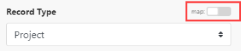

# [!DNL Adobe Firefly]模块

在[!DNL Adobe Workfront Fusion]方案中，您可以自动使用[!DNL Adobe Firefly]的工作流，并将其连接到多个第三方应用程序和服务。

如果需要有关创建方案的说明，请参阅[创建方案](../../workfront-fusion/scenarios/create-a-scenario.md)。

有关模块的信息，请参阅 [!DNL Adobe Workfront Fusion]](../../workfront-fusion/modules/modules.md)中的[模块。

## 访问要求

您必须具有以下权限才能使用本文中的功能：

<table style="table-layout:auto">
 <col> 
 <col> 
 <tbody> 
  <tr> 
   <td role="rowheader">[!DNL Adobe Workfront] 计划</td> 
   <td> 
任何
 </td> 
  </tr> 
  <tr data-mc-conditions=""> 
   <td role="rowheader">[!DNL Adobe Workfront] 许可证</td> 
   <td> 
新文档： [！UICONTROL Standard]

或

当前： [！UICONTROL Work]或更高版本
 </td> 
  </tr> 
  <tr> 
   <td role="rowheader">[!DNL Adobe Workfront Fusion] 许可证**</td> 
   <td>
   
当前：无[!DNL Workfront Fusion]许可证要求。

   
或

   
旧版：任意 

   </td> 
  </tr> 
  <tr> 
   <td role="rowheader">产品</td> 
   <td>
   
新增：
 <ul><li>[！UICONTROL Select]或[！UICONTROL Prime] [!DNL Workfront]计划：您的组织必须购买[!DNL Adobe Workfront Fusion]。</li><li>已包括[！UICONTROL Ultimate] [!DNL Workfront]计划： [!DNL Workfront Fusion]。</li></ul>
   
或

   
当前：您的组织必须购买[!DNL Adobe Workfront Fusion]。

   </td> 
  </tr>
 </tbody> 
</table>

有关此表中信息的更多详细信息，请参阅Workfront文档中的[访问要求](/help/quicksilver/administration-and-setup/add-users/access-levels-and-object-permissions/access-level-requirements-in-documentation.md)。

有关[!DNL Adobe Workfront Fusion]许可证的信息，请参阅[[!DNL Adobe Workfront Fusion] 许可证](../../workfront-fusion/get-started/license-automation-vs-integration.md)。

## 先决条件

在使用[!DNL Adobe Firefly]连接器之前，必须确保满足以下先决条件：

* 您必须拥有有效的[!DNL Adobe Firefly]帐户。

## Adobe Campaign API信息

Adobe Campaign连接器使用以下对象：

<table style="table-layout:auto"> 
 <col> 
 <col> 
 <tbody> 
  <tr> 
   <td role="rowheader">API标记</td> 
   <td>v1.4.24</td> 
  </tr>
 </tbody> 
 </table>

## 创建与[!DNL Adobe Firefly]的连接

要为您的[!DNL Adobe Firefly]模块创建连接：

1. 单击“连接”框旁边的&#x200B;**[!UICONTROL 添加]**。

1. 填写以下字段：

   <table style="table-layout:auto"> 
      <col class="TableStyle-TableStyle-List-options-in-steps-Column-Column1">
      </col>
      <col class="TableStyle-TableStyle-List-options-in-steps-Column-Column2">
      </col>
      <tbody>
        <tr>
        <td role="rowheader">[！UICONTROL连接名称]</td>
        <td>
          
输入此连接的名称。

        </td>
        </tr>
        <tr>
        <td role="rowheader">[！UICONTROL环境]</td>
        <td>选择您要连接到生产环境还是非生产环境。</td>
        </tr>
        <tr>
        <td role="rowheader">[！UICONTROL类型]</td>
        <td>选择您是要连接到服务帐户还是个人帐户。</td>
        </tr>
        <tr>
        <td role="rowheader">[！UICONTROL客户端ID]</td>
        <td>输入您的[！UICONTROLAdobe] [！UICONTROL客户端ID]。 这可以在[!DNL Adobe Developer Console]的[！UICONTROL Credentials]详细信息部分找到。</td>
        </tr>
        <tr>
        <td role="rowheader">[！UICONTROL客户端密钥]</td>
        <td>输入您的[!DNL Adobe] [！UICONTROL客户端密钥]。 这可以在[!DNL Adobe Developer Console]的[！UICONTROL Credentials]详细信息部分找到。</td>
        </tr>
      </tbody>
    </table>

1. 单击&#x200B;**[!UICONTROL 继续]**&#x200B;保存连接并返回模块。

## [!DNL Adobe Firefly]模块及其字段

配置[!DNL Adobe Firefly]模块时，[!DNL Workfront Fusion]显示下面列出的字段。 除此以外，可能还会显示其他[!DNL Adobe Firefly]字段，具体取决于应用程序或服务中的访问级别等因素。 模块中的粗体标题表示必填字段。

如果看到字段或函数上方的映射按钮，则可以使用该按钮设置该字段的变量和函数。 有关详细信息，请参阅[在 [!DNL Adobe Workfront Fusion]](../../workfront-fusion/mapping/map-information-between-modules.md)中将信息从一个模块映射到另一个模块。

### 进行自定义API调用

此操作模块对FireflyAPI进行自定义调用。

有关特定的可用API，请参阅Adobe Developer文档中的[Adobe FireflyAPI](https://developer.adobe.com/firefly-services/docs/firefly-api/)。

<table style="table-layout:auto"> 
  <col/>
  <col/>
  <tbody>
    <tr>
      <td role="rowheader">[！UICONTROL Connection]</td>
      <td>有关创建与[!DNL Adobe Firefly]的连接的说明，请参阅本文中的<a href="#create-a-connection-to-adobe-firefly" class="MCXref xref" >创建与[!DNL Adobe Firefly]</a>的连接。</td>
    </tr>
    <tr>
      <td role="rowheader">[！UICONTROL URL]</td>
      <td>
        
输入相对于<code>https://firefly-api-enterprise-stage.adobe.io/</code>的路径。

      </td>
    </tr>
    <tr>
      <td role="rowheader">
        
[！UICONTROL方法]

      </td>
   <td> 
选择配置API调用所需的HTTP请求方法。 有关详细信息，请参阅[!DNL Adobe Workfront Fusion]</a>中的<a href="../../workfront-fusion/modules/http-request-methods.md" class="MCXref xref" data-mc-variable-override="">HTTP请求方法。
 </td> 
    </tr>
    <tr>
      <td role="rowheader">[！UICONTROL Headers]</td>
      <td>
        
以标准JSON对象的形式添加请求的标头。

        
例如， <code>{"Content-type":"application/json"}</code>

        
[!DNL Workfront Fusion] 自动添加授权标头。

      </td>
    </tr>
    <tr>
      <td role="rowheader">[！UICONTROL Body]</td>
   <td> 
以标准JSON对象的形式添加API调用的正文内容。
 
注意：  
在JSON中使用条件语句（如<code>if</code>）时，请将引号放在条件语句之外。
 
     
Example: </b>"> 
      
  
 
     
 
 </td>     </tr>
  </tbody>
</table>

### 展开图像

此操作模块可展开图像，可以选择从提供的提示中使用内容。

<table style="table-layout:auto"> 
 <col> 
 <col> 
 <tbody> 
  <tr> 
   <td role="rowheader">[！UICONTROL Connection]</td> 
   <td>有关创建与[!DNL Adobe Campaign]的连接的说明，请参阅本文中的<a href="#create-a-connection-to-adobe-firefly" class="MCXref xref" >创建与[!DNL Adobe Firefly]</a>的连接。</td> 
  </tr> 
  <tr> 
   <td role="rowheader">[！UICONTROL Prompt]</td> 
   <td>输入或映射要用于展开图像的内容的提示。 如果未提供任何提示，则图像将展开，并且内容与原始图像匹配。</td> 
  </tr> 
  <tr> 
   <td role="rowheader">[！UICONTROL变量数]</td> 
   <td>输入一个介于1-4之间的数字。 模块将生成此数量的扩展图像变体。</td> 
  </tr> 
  <tr> 
   <td role="rowheader">[！UICONTROL扩展图像格式]</td> 
   <td>选择将保存扩展图像的文件格式。</td> 
  </tr> 
  <tr> 
   <td role="rowheader">[！UICONTROL Source file]</td> 
   <td>  
从上一个模块中选择一个源文件，或映射源文件的图像文件名和图像文件（数据）。
 </td> 
</td> 
  </tr> 
  <tr> 
   <td role="rowheader">[！UICONTROL大小]</td> 
   <td>选择希望扩展图像的大小。</td> 
  </tr> 
  <tr> 
   <td role="rowheader">[！UICONTROL Seed]</td> 
   <td>输入或映射整数。 您可以在另一个扩展图像模块中使用此相同的种子，以生成具有不同样式的相似图像。 </td> 
  </tr> 
 </tbody> 
</table>

## 填充图像

此操作模块会填充图像的蒙版区域，可以选择使用您提供的提示中的内容。

<table style="table-layout:auto"> 
 <col> 
 <col> 
 <tbody> 
  <tr> 
   <td role="rowheader">[！UICONTROL Connection]</td> 
   <td>有关创建与[!DNL Adobe Campaign]的连接的说明，请参阅本文中的<a href="#create-a-connection-to-adobe-firefly" class="MCXref xref" >创建与[!DNL Adobe Firefly]</a>的连接。</td> 
  </tr> 
  <tr> 
   <td role="rowheader">[！UICONTROL Prompt]</td> 
   <td>输入或映射要用于填充图像的内容的提示。 如果未提供任何提示，则图像将填充与原始图像匹配的内容。</td> 
  </tr> 
  <tr> 
   <td role="rowheader">[！UICONTROL变量数]</td> 
   <td>输入一个介于1-4之间的数字。 模块将生成此数量的已填充图像变体。</td> 
  </tr> 
  <tr> 
   <td role="rowheader">[！UICONTROL填充图像格式]</td> 
   <td>选择将保存已填充图像的文件格式。</td> 
  </tr> 
  <tr> 
   <td role="rowheader">[！UICONTROL图像]</td> 
   <td>  
 单击<b>添加图像</b>。 从上一个模块中选择一个源文件，或映射源文件的图像文件名和图像数据。
 </td> 
</td> 
  </tr> 
  <tr> 
   <td role="rowheader">[！UICONTROL蒙版]</td> 
   <td>  
 单击<b>添加蒙版</b>。 从上一个模块中选择一个源文件，或映射源文件的“蒙版”文件名和“蒙版”数据。 蒙版文件表示将使用生成的内容填充的自定义蒙版。
 </td> 
</td> 
  </tr> 
  <tr> 
   <td role="rowheader">[！UICONTROL大小]</td> 
   <td>选择希望填充图像的大小。</td> 
  </tr> 
  <tr> 
   <td role="rowheader">[！UICONTROL种子]</td> 
   <td>对于模块将生成的每个图像，单击<b>添加项<b>并输入或映射整数。 您可以在另一个扩展图像模块中使用此相同的种子，以生成具有不同样式的相似图像。 添加的种子数必须等于变体数字段。</td> 
  </tr> 
 </tbody> 
</table>

## 生成图像

该操作模块会根据您提供的提示生成和图像。 您还可以提供一个可选的参考图像，生成的图像将与参考图像的样式匹配。

<table style="table-layout:auto"> 
 <col> 
 <col> 
 <tbody> 
  <tr> 
   <td role="rowheader">[！UICONTROL Connection]</td> 
   <td>有关创建与[!DNL Adobe Campaign]的连接的说明，请参阅本文中的<a href="#create-a-connection-to-adobe-firefly" class="MCXref xref" >创建与[!DNL Adobe Firefly]</a>的连接。</td> 
  </tr> 
  <tr> 
   <td role="rowheader">[！UICONTROL Prompt]</td> 
   <td>为要创建的图像输入或映射提示。 在提示中显示更多详细信息，将允许您更好地控制映像中显示的内容。</td> 
  </tr> 
  <tr> 
   <td role="rowheader">[！UICONTROL变量数]</td> 
   <td>输入一个介于1-4之间的数字。 模块将生成此数量的图像变体。</td> 
  </tr> 
  <tr> 
   <td role="rowheader">[！UICONTROL生成的图像格式]</td> 
   <td>选择将保存扩展图像的文件格式。 如果选择default，则在未提供参考图像的情况下，文件格式将JPEG。 如果提供了参考图像，则生成的图像的文件格式将与参考图像相同。</td> 
  </tr> 
  <tr> 
   <td role="rowheader">[！UICONTROL Source file]</td> 
   <td>  
从上一个模块中选择一个源文件，或映射源文件的“参考图像文件名”和“参考图像文件（数据）”。 将创建生成的图像以匹配参考图像的样式。
 </td> 
</td> 
  </tr> 
  <tr> 
   <td role="rowheader">[！UICONTROL预设]</td> 
   <td>如果要使用预设样式，请单击“添加项目”，然后输入或映射要使用的样式。
有关预设样式的列表，请参阅Adobe开发人员文档中的<a href="https://developer.adobe.com/firefly-services/docs/firefly-api/guides/concepts/style-presets/" >图像模型样式</a>。</td> 
  </tr> 
  <tr> 
   <td role="rowheader">[！UICONTROL负提示]</td> 
   <td>在生成的内容中输入或映射要避免使用的单词。 </td> 
  </tr> 
  <tr> 
   <td role="rowheader">[！UICONTROL内容类]</td> 
   <td>选择您希望生成的图像更类似于照片，还是更类似于创建的图片。 <ul><li><b>照片</b>
输入“光圈”、“快门速度”（以秒为单位）和“视场”（以毫米为单位）的值。</td> 
  </tr> 
  <tr> 
   <td role="rowheader">[！UICONTROL Seed]</td> 
   <td>输入或映射整数。 您可以在另一个扩展图像模块中使用此相同的种子，以生成具有不同样式的相似图像。 </td> 
  </tr> 
  <tr> 
   <td role="rowheader">[！UICONTROL大小]</td> 
   <td>选择希望生成的图像的大小。</td> 
  </tr> 
  <tr> 
   <td role="rowheader">[！UICONTROL强度]</td> 
   <td>输入或映射一个整数，该整数表示生成的图像与预设样式或参考图像的样式匹配的强度。 </td> 
  </tr> 
  <tr> 
   <td role="rowheader">[！UICONTROL视觉强度]</td> 
   <td>输入或映射一个整数，该整数表示照片现有视觉特征的整体强度。 </td> 
  </tr> 
  <tr> 
   <td role="rowheader">[！UICONTROL区域设置]</td> 
   <td>如果提供了区域设置，则模块会生成与指定区域设置更相关的内容。 
必须以ISO 639-1语言代码和ISO 3166-1区域提供区域设置。

 示例： <code>en-US</code>
</td> 
  </tr> 
 </tbody> 
</table>
